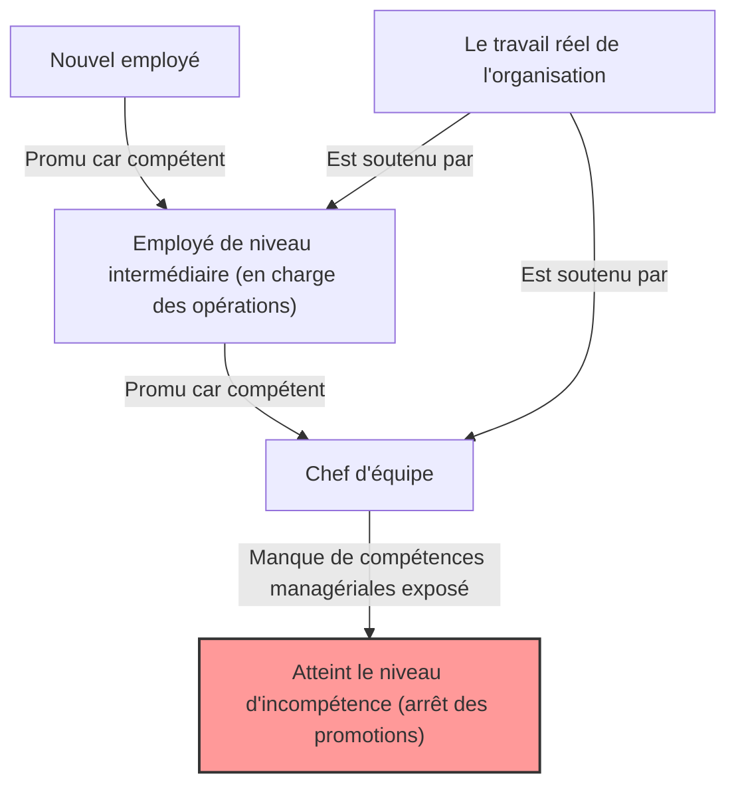
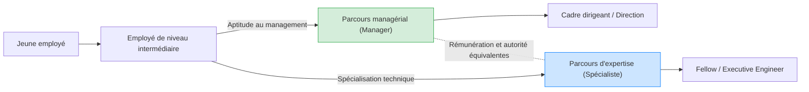

## 1. Introduction : Pourquoi les organisations regorgent-elles de "patrons incompétents" ?

Si vous avez déjà travaillé dans une entreprise, vous vous êtes probablement déjà posé les questions suivantes : "Pourquoi une personne si incapable dans son travail occupe-t-elle un poste de direction ?" ou "Pourquoi ce collègue autrefois si brillant est-il devenu un bon à rien dès qu'il est devenu manager ?"

En réalité, ce n'est pas un phénomène propre à votre entreprise. C'est un phénomène universel que l'on observe dans toutes les organisations, entreprises, administrations, et même écoles ou associations à but non lucratif du monde entier. Ce phénomène a été brillamment théorisé et systématisé sous le nom de "**Principe de Peter (The Peter Principle)**".

Dans cet article, nous explorerons en profondeur ce principe formulé par le Dr Laurence J. Peter, en examinant tout, de ses mécanismes fondamentaux aux mesures que les individus et les organisations peuvent prendre, sous tous les angles possibles. C'est une lecture incontournable pour quiconque évolue dans cette "société hiérarchique" qu'est l'organisation.

## 2. Qu'est-ce que le Principe de Peter ? (Concept de base)

Le Principe de Peter est un principe de sociologie hiérarchique formulé en 1969 dans le livre coécrit par Laurence J. Peter et Raymond Hull, "Le Principe de Peter". Son affirmation centrale est la suivante :

> **"Dans une hiérarchie, tout employé a tendance à s'élever à son niveau d'incompétence."**

Cette seule phrase peut être un peu difficile à comprendre, alors donnons un exemple concret.

Il y avait un commercial (Monsieur A). Il avait d'excellents résultats de vente et bénéficiait de la confiance absolue de ses clients. L'entreprise, reconnaissant sa "compétence en tant que commercial", le promeut au poste de directeur des ventes.

Cependant, les compétences requises pour un directeur des ventes ne sont pas "la capacité à vendre des produits soi-même", mais "des compétences en management pour former des subordonnés et atteindre les objectifs avec l'ensemble de l'équipe". Bien que Monsieur A ait été un excellent manager opérationnel (playing manager), il n'était pas doué pour enseigner aux autres ou gérer la motivation de l'équipe.

En conséquence, Monsieur A ne parvient pas à obtenir des résultats en tant que directeur des ventes et se voit qualifié d'"incompétent". Et, étant incompétent, il ne peut plus être promu (par exemple au poste de directeur de département) et restera bloqué à ce poste de "manager incompétent".

Ceci est un exemple typique du Principe de Peter. En d'autres termes, les personnes sont promues parce qu'elles sont "compétentes dans leur poste actuel", mais si elles ne possèdent pas les compétences requises pour le nouveau poste, elles y deviennent "incompétentes" et leur promotion s'arrête.

## 3. La "tragédie de l'organisation" causée par le Principe de Peter

La conséquence la plus effrayante suggérée par le Principe de Peter se résume dans la phrase suivante :

> **"Avec le temps, chaque poste tend à être occupé par un employé qui est incapable d'en assumer les responsabilités."**

Que se passerait-il si chaque membre d'une organisation était promu jusqu'à son niveau d'incompétence et y stagnait ? Tous les postes, des cadres supérieurs aux cadres intermédiaires, seraient occupés par des personnes "inadaptées à leur travail actuel".

### Pourquoi l'organisation continue-t-elle de fonctionner ?
Alors, pourquoi les organisations réelles ne s'effondrent-elles pas complètement et continuent-elles de tourner ? Selon le Principe de Peter, ce n'est rien d'autre que parce que **"le travail est accompli par les employés qui n'ont pas encore atteint leur niveau d'incompétence (c'est-à-dire ceux qui sont en cours de promotion)"**. Autrement dit, ce sont les "jeunes talents compétents" et les "opérationnels compétents" situés aux niveaux inférieurs et intermédiaires de l'organisation qui compensent l'incompétence des dirigeants et soutiennent les performances globales de l'organisation.

## 4. Pourquoi le Principe de Peter est-il inévitable ? (Analyse approfondie des mécanismes)

Pourquoi les entreprises continuent-elles de promouvoir délibérément des personnes compétentes jusqu'à les rendre incompétentes ? Il y a à cela un défaut structurel inhérent à la société hiérarchique.

### 4.1. Confusion entre "performances passées" et "aptitudes futures"
Le système d'évaluation de nombreuses entreprises se fonde sur "les résultats obtenus dans le poste actuel". Cependant, la nature des compétences requises change fondamentalement à mesure que l'on s'élève dans la hiérarchie.
- **Opérationnel (Joueur)** : Compétences spécialisées, capacité d'exécution, autogestion
- **Cadre intermédiaire (Manager)** : Compétences en communication, capacité de coordination, développement des talents
- **Cadre supérieur (Leader)** : Pensée stratégique, construction d'une vision, capacité de décision

La compétence en tant que joueur ne garantit pas la compétence en tant que manager. Cependant, dans la réalité des évaluations du personnel, il est difficile de concevoir une méthode d'évaluation autre que "promouvoir le meilleur commercial au poste de manager", ce qui conduit inévitablement à des erreurs de casting.

### 4.2. Les limites du système de rémunération (L'illusion de promotion = succès)
Dans de nombreuses organisations modernes, le principal moyen "d'augmenter son salaire" ou "d'obtenir un statut" se limite à la "promotion à un poste de direction".
Même pour un excellent ingénieur ou commercial souhaitant se perfectionner dans son domaine de spécialité, le système l'oblige à devenir manager pour obtenir un salaire supérieur à un certain niveau. Cela entraîne une "poussée vers le niveau d'incompétence", au mépris des aptitudes et des souhaits de la personne.

### 4.3. La difficulté de la rétrogradation et le "glissement latéral"
Rétrograder une personne qui a été promue est extrêmement difficile dans la culture organisationnelle japonaise (ainsi que dans de nombreuses entreprises occidentales). Cela risque de blesser la fierté de la personne et de réduire considérablement sa motivation.
Par conséquent, un manager qui se révèle "incompétent" n'est souvent pas rétrogradé, mais plutôt muté à un poste sans responsabilités réelles au même niveau hiérarchique (ce qu'on appelle la "voie de garage" ou le "directeur de missions spéciales" sans pouvoir). C'est ce que Peter a appelé le "**mouvement latéral (Arabesque)**".

## 5. Mesures innovantes contre le Principe de Peter

Il est extrêmement difficile de contourner complètement le Principe de Peter tant qu'il existera des sociétés hiérarchiques. Cependant, il existe des stratégies pour minimiser les dégâts et concilier le bonheur individuel avec la productivité organisationnelle.

### 5.1. Mesure individuelle : Recommandation de l'"incompétence créatrice"
La meilleure stratégie de défense individuelle proposée par Peter lui-même est l'"**incompétence créatrice (Creative Incompetence)**".
Il s'agit d'une technique avancée consistant à feindre volontairement un "petit défaut non fatal, mais suffisant pour faire hésiter à vous promouvoir", une fois que vous avez atteint un poste où vous vous dites : "C'est ma vocation" ou "Je ne veux pas être promu davantage (je ne veux pas dépasser les limites de mes compétences)".

Par exemple, vous faites parfaitement votre travail, mais "votre bureau est toujours en désordre", "vous êtes réticent à participer aux événements de l'entreprise" ou "vous êtes un peu négligent dans votre tenue vestimentaire". Grâce à cela, la direction jugera que "vous faites bien votre travail, mais il y a quelques réserves pour vous nommer manager", et vous laissera dans votre poste actuel (où vous brillez le plus).

### 5.2. Mesure organisationnelle : Séparation de la promotion et de la rémunération (Système de double échelle)
La mesure la plus efficace que l'organisation puisse prendre est de **séparer complètement le "parcours managérial" et le "parcours d'expertise (spécialiste)" et d'offrir des rémunérations et des évaluations équivalentes**. (C'est ce qu'on appelle le système de double échelle ou dual ladder).
Ainsi, un excellent programmeur n'a plus besoin de devenir chef de projet par obligation financière et peut continuer à exercer ses compétences.

### 5.3. Institutionnalisation des promotions à l'essai et de la "retraite honorable"
La tragédie survient lorsque l'on considère la promotion comme "irréversible". Par exemple, on peut instaurer une "période d'essai pour les managers" de 3 à 6 mois. À la fin de cette période, l'employé et l'entreprise discutent et choisissent de "retourner au poste précédent" ou de "continuer en tant que manager".
Cela garantit une "retraite honorable" dans le système en cas de "je l'ai fait, mais je n'y étais pas adapté", évitant ainsi la stagnation au niveau d'incompétence.

## 6. Conclusion : Où devez-vous exercer vos "compétences" ?

À première vue, le Principe de Peter peut sembler très cynique et désespérant. Cependant, si on le prend à l'envers, c'est aussi une leçon qui nous enseigne l'"**importance de comprendre précisément les limites de ses capacités et ses aptitudes, et de trouver l'endroit où l'on peut briller le plus**".

Plutôt que de suivre l'unique voie tracée par la société ou l'entreprise, où "promotion = succès", il faut avoir le courage d'identifier le niveau où ses propres "compétences" peuvent s'exprimer au maximum et d'y rester (parfois même d'avoir l'intelligence de jouer l'incompétence créatrice). C'est peut-être la meilleure stratégie pour survivre sans stress et avec épanouissement dans la société hiérarchique complexe d'aujourd'hui.

(*Cet article a été rédigé dans le but d'aider à comprendre en profondeur le "Principe de Peter" et de l'appliquer à la construction de l'organisation de demain. Ce "patron incompétent" sur votre lieu de travail était peut-être lui-même, autrefois, un employé brillant et compétent. En y pensant ainsi, peut-être pourrez-vous le regarder avec un peu plus de bienveillance... peut-être.*)
