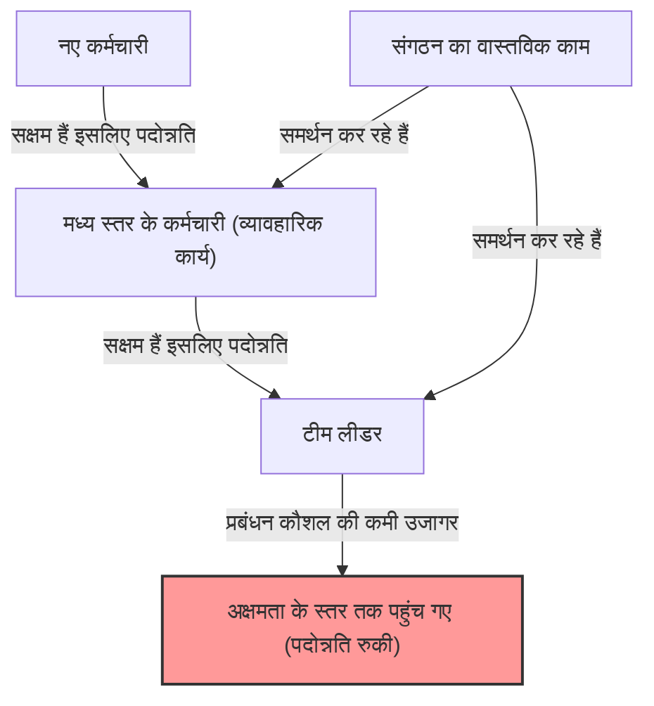
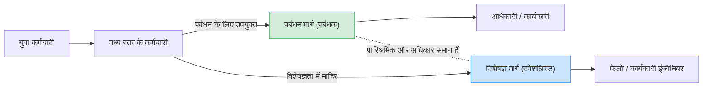

## 1. परिचय: संगठनों में "अक्षम बॉस" क्यों भरे पड़े हैं?

जब आप किसी कंपनी में काम करते हैं, तो क्या आपने कभी ऐसा सवाल सोचा है: "कोई व्यक्ति जो काम में इतना अक्षम है, वह प्रबंधन के पद पर क्यों है?" "मेरा वह सीनियर जो बहुत उत्कृष्ट था, प्रबंधक बनते ही बेकार क्यों हो गया?"

वास्तव में, यह केवल आपकी कंपनी में होने वाली कोई अनोखी घटना नहीं है। यह एक सार्वभौमिक घटना है जो दुनिया भर के हर संगठन, कंपनी, सरकारी एजेंसी और यहां तक कि स्कूलों और गैर-लाभकारी संगठनों में भी देखी जाती है। इस घटना को शानदार ढंग से शब्दों में बयां और व्यवस्थित करने का काम **"पीटर का सिद्धांत (The Peter Principle)"** करता है।

इस लेख में, हम डॉ. लॉरेंस जे. पीटर (Laurence J. Peter) द्वारा प्रस्तावित इस सिद्धांत के बारे में गहराई से जानेंगे, इसके मूल तंत्र से लेकर व्यक्तियों और संगठनों के लिए इसके समाधानों तक, हर संभव दृष्टिकोण से। संगठन नामक "पदानुक्रमित समाज" में जीवित रहने वाले किसी भी व्यक्ति के लिए यह लेख पढ़ना आवश्यक है।

## 2. पीटर का सिद्धांत क्या है? (मूल अवधारणा)

पीटर का सिद्धांत पदानुक्रमित समाजशास्त्र के संबंध में एक सिद्धांत है जिसे 1969 में लॉरेंस जे. पीटर और रेमंड हल द्वारा सह-लिखित पुस्तक "द पीटर प्रिंसिपल" में प्रस्तावित किया गया था। इसका मुख्य दावा इस प्रकार है:

> **"पदानुक्रमित समाज में, प्रत्येक कर्मचारी अपनी अक्षमता के स्तर तक पदोन्नत होता है।"**

केवल इन शब्दों से यह थोड़ा भ्रमित करने वाला हो सकता है, इसलिए आइए इसे एक ठोस उदाहरण के साथ समझाएं।

एक सेल्समैन (श्री ए) था। उन्होंने बिक्री में बहुत उत्कृष्ट परिणाम हासिल किए और ग्राहकों का अपार विश्वास प्राप्त किया। कंपनी ने "बिक्री में उनकी क्षमता" का मूल्यांकन किया और उन्हें सेल्स मैनेजर के पद पर पदोन्नत कर दिया।

हालांकि, एक सेल्स मैनेजर के लिए आवश्यक क्षमता "स्वयं उत्पादों को बेचने की क्षमता" नहीं है, बल्कि "अधीनस्थों को विकसित करने और टीम के साथ लक्ष्य हासिल करने की प्रबंधन क्षमता" है। श्री ए एक प्लेइंग मैनेजर (playing manager) के रूप में उत्कृष्ट थे, लेकिन वह दूसरों को सिखाने और टीम की प्रेरणा का प्रबंधन करने में कमजोर थे।

परिणामस्वरूप, श्री ए एक सेल्स मैनेजर के रूप में परिणाम देने में विफल रहे और उन्हें "अक्षम" का ठप्पा लगा दिया गया। और चूँकि वह अक्षम थे, इसलिए वह आगे (जैसे विभाग प्रमुख) पदोन्नत नहीं हो सके, और उस "अक्षम प्रबंधक" के पद पर बने रहे।

यह पीटर के सिद्धांत का एक विशिष्ट उदाहरण है। दूसरे शब्दों में, लोगों को इस कारण से पदोन्नत किया जाता है कि "वे अपने वर्तमान पद पर सक्षम हैं", लेकिन यदि उनके पास पदोन्नत पद के लिए आवश्यक क्षमता नहीं है, तो वे वहां "अक्षम" हो जाते हैं और उनकी पदोन्नति रुक जाती है।

## 3. पीटर के सिद्धांत द्वारा लाई गई "संगठनात्मक त्रासदी"

पीटर के सिद्धांत द्वारा सुझाया गया सबसे भयानक परिणाम निम्नलिखित वाक्य में संक्षेपित किया गया है:

> **"समय के साथ, हर पद ऐसे अक्षम कर्मचारी द्वारा भर दिया जाता है जो अपनी जिम्मेदारियों को निभाने में असमर्थ होता है।"**

क्या होगा यदि संगठन में हर कोई अपनी अक्षमता के स्तर तक पदोन्नत हो जाए और वहीं रुक जाए? संगठन के शीर्ष से लेकर मध्य प्रबंधन तक, हर पद उन लोगों से भर जाएगा जो "अपने वर्तमान काम के लिए अनुपयुक्त" हैं।

### संगठन आखिर क्यों काम कर रहा है?
तो फिर, वास्तविक संगठन पूरी तरह से ढहे बिना क्यों काम कर रहे हैं? पीटर के सिद्धांत के अनुसार, ऐसा इसलिए है क्योंकि **"जो लोग अभी तक अपनी अक्षमता के स्तर तक नहीं पहुंचे हैं (यानी जो अभी भी पदोन्नति की प्रक्रिया में हैं) वे वास्तविक काम कर रहे हैं"**। दूसरे शब्दों में, संगठन के निचले और मध्य स्तर के "सक्षम युवा" और "सक्षम व्यावहारिक कर्मचारी" उच्च स्तर की अक्षमता को कवर कर रहे हैं और समग्र रूप से संगठन के परिणामों का समर्थन कर रहे हैं।

## 4. पीटर का सिद्धांत अपरिहार्य क्यों है? (तंत्र की गहराई से पड़ताल)

कंपनियां बार-बार ऐसे कर्मियों के निर्णय क्यों लेती हैं जो जानबूझकर सक्षम लोगों को अक्षम बना देते हैं? पदानुक्रमित समाज (हाइरार्की) में संरचनात्मक कमियां हैं।

### 4.1. "पिछली उपलब्धियों" और "भविष्य की उपयुक्तता" में भ्रम
कई कंपनियों में मूल्यांकन प्रणाली "वर्तमान पद पर उपलब्धियों" पर आधारित होती है। हालाँकि, जैसे-जैसे पदानुक्रम बढ़ता है, आवश्यक कौशल की प्रकृति मौलिक रूप से बदल जाती है।
- **व्यावहारिक कर्मचारी (खिलाड़ी)**: विशेषज्ञ कौशल, निष्पादन क्षमता, स्व-प्रबंधन क्षमता
- **मध्य स्तर के प्रबंधक (प्रबंधक)**: संचार कौशल, समन्वय कौशल, मानव संसाधन विकास क्षमता
- **वरिष्ठ प्रबंधक (लीडर)**: रणनीतिक सोच, विजन निर्माण, निर्णय लेने की क्षमता

एक खिलाड़ी के रूप में सक्षमता एक प्रबंधक के रूप में सक्षमता की गारंटी नहीं देती है। हालाँकि, वास्तविक कार्मिक मूल्यांकन में, "शीर्ष बिक्री करने वाले व्यक्ति को प्रबंधक बनाने" के अलावा कोई अन्य मूल्यांकन विधि बनाना मुश्किल है, इसलिए स्वाभाविक रूप से बेमेल (mismatch) होता है।

### 4.2. पारिश्रमिक प्रणाली की सीमाएँ (पदोन्नति = सफलता का अभिशाप)
आज के कई संगठनों में, "वेतन बढ़ाने" और "रुतबा (status) हासिल करने" का मुख्य साधन "प्रबंधन पद पर पदोन्नति" तक सीमित है।
भले ही आप एक उत्कृष्ट इंजीनियर या सेल्समैन हों जो एक विशेषज्ञ के रूप में आगे बढ़ना चाहते हों, सिस्टम ऐसा है कि एक निश्चित स्तर से अधिक वेतन पाने के लिए आपको एक प्रबंधक बनना ही होगा। इससे व्यक्ति की उपयुक्तता और इच्छाओं को नजरअंदाज करते हुए "अक्षमता के स्तर की ओर धकेलने" की स्थिति पैदा होती है।

### 4.3. पदावनति (demotion) की कठिनाई और "पार्श्व स्थानान्तरण" (lateral move)
जापानी संगठनात्मक संस्कृति में (और कई पश्चिमी कंपनियों में भी) एक बार पदोन्नत होने वाले व्यक्ति को पदावनत (demote) करना बहुत मुश्किल होता है। ऐसा इसलिए है क्योंकि व्यक्ति के सम्मान (pride) को ठेस पहुंचने और प्रेरणा के काफी कम होने का जोखिम होता है।
इसलिए, जो प्रबंधक "अक्षम" पाए जाते हैं, उन्हें पदावनत नहीं किया जाता है, बल्कि अक्सर उन्हें उसी स्तर पर ऐसे पदों पर स्थानांतरित कर दिया जाता है जहाँ कोई वास्तविक शक्ति नहीं होती (जैसे नाममात्र के पद या बिना किसी वास्तविक अधिकार के विशेष निदेशक)। इसे पीटर ने **"क्षैतिज स्थानांतरण (Arabesque)"** कहा है।

## 5. पीटर के सिद्धांत के खिलाफ क्रांतिकारी समाधान

जब तक पदानुक्रमित समाज मौजूद है, तब तक पीटर के सिद्धांत को पूरी तरह से तोड़ना अत्यंत कठिन है। हालाँकि, नुकसान को कम करने और व्यक्तिगत खुशी और संगठनात्मक उत्पादकता दोनों को संतुलित करने के लिए रणनीतियाँ मौजूद हैं।

### 5.1. व्यक्तिगत समाधान: "रचनात्मक अक्षमता (Creative Incompetence)" की सिफारिश
पीटर ने स्वयं जिस सबसे बड़ी रक्षात्मक रणनीति का प्रस्ताव दिया था, जिससे व्यक्ति अपनी रक्षा कर सकता है, वह है **"रचनात्मक अक्षमता (Creative Incompetence)"**।
यह एक उच्च स्तरीय तकनीक है जहाँ, जब आप एक ऐसे पद पर पहुँचते हैं जहाँ आपको लगता है कि "यह मेरा सपनों का काम है" या "मैं इससे आगे पदोन्नत नहीं होना चाहता (मैं अपनी क्षमताओं की सीमा को पार减 नहीं करना चाहता)", तो आप जानबूझकर "एक छोटी सी कमी दिखाते हैं जो घातक नहीं है, लेकिन पदोन्नति में हिचकिचाहट पैदा करती है"।

उदाहरण के लिए, आप अपना काम पूरी तरह से करते हैं, लेकिन "आपकी डेस्क हमेशा गंदी रहती है", "आप कंपनी के कार्यक्रमों में भाग लेने के लिए अनिच्छुक हैं", या "आप थोड़े ढीले कपड़े पहनते हैं"। इसके परिणामस्वरूप, उच्च प्रबंधन तय करेगा कि "वह काम कर सकता है, लेकिन मैं उसे प्रबंधक बनाने के बारे में थोड़ा चिंतित हूँ", और आपको आपके वर्तमान पद पर (जहाँ आप सबसे अधिक चमक सकते हैं) बनाए रखेगा।

### 5.2. संगठनात्मक समाधान: पदोन्नति और पारिश्रमिक का पृथक्करण (दोहरी सीढ़ी प्रणाली)
संगठन जिस सबसे प्रभावी उपाय को अपना सकता है वह है **"प्रबंधन मार्ग (Manager Route)" और "विशेषज्ञ मार्ग (Specialist Route)" को पूरी तरह से अलग करना और समान पारिश्रमिक तथा मूल्यांकन प्रदान करना**। (इसे दोहरी-सीढ़ी प्रणाली या Dual Ladder System कहा जाता है)।
यह सुनिश्चित करता है कि उत्कृष्ट प्रोग्रामर को वेतन के लिए मजबूर होकर प्रोजेक्ट मैनेजर बनने की आवश्यकता नहीं है, और वे अपनी क्षमता का प्रदर्शन करना जारी रख सकते हैं।

### 5.3. परीक्षण पदोन्नति (Trial Promotion) और "सम्मानजनक वापसी (Honorable Retreat)" को संस्थागत बनाना
त्रासदी इसलिए होती है क्योंकि पदोन्नति को "अपरिवर्तनीय (irreversible)" माना जाता है। उदाहरण के लिए, 3 महीने से आधे साल तक की "मैनेजर परीक्षण अवधि" निर्धारित करें, और उस अवधि के अंत में, व्यक्ति और कंपनी चर्चा कर सकते हैं और चुन सकते हैं कि "मूल पद पर वापस लौटना है" या "मैनेजर के रूप में जारी रखना है"।
यह सुनिश्चित करता है कि "मैंने कोशिश की लेकिन उपयुक्त नहीं था" के मामले में सिस्टम के हिस्से के रूप में "सम्मानजनक वापसी" की गारंटी है, और अक्षमता के स्तर पर ठहराव को रोकता है।

## 6. निष्कर्ष: आपको अपनी "क्षमता" का प्रदर्शन कहाँ करना चाहिए?

पहली नज़र में पीटर का सिद्धांत बहुत निराशाजनक और निंदक (cynical) लग सकता है। हालाँकि, यदि आप इसे उल्टा देखते हैं, तो यह एक ऐसा पाठ भी है जो हमें **"अपनी क्षमताओं और उपयुक्तता की सीमाओं को सटीक रूप से समझने और वह स्थान खोजने का महत्व सिखाता है जहाँ आप सबसे अधिक चमक सकते हैं"**।

समाज या कंपनी द्वारा तैयार किए गए "पदोन्नति = सफलता" के एक ही रास्ते पर चलने के बजाय, आपको उस स्तर की पहचान करने का साहस होना चाहिए जहां आपकी "क्षमता" को अधिकतम किया जा सके, और वहां बने रहने का साहस होना चाहिए (और कभी-कभी रचनात्मक अक्षमता का नाटक करने की समझदारी होनी चाहिए)। ऐसा कहा जा सकता है कि आज के जटिल पदानुक्रमित समाज में तनाव मुक्त और संतोषजनक जीवन जीने के लिए यह सबसे अच्छी रणनीति है।

（※ यह लेख "पीटर के सिद्धांत" को गहराई से समझने और कल के संगठनों के निर्माण में आपकी मदद करने के उद्देश्य से लिखा गया था। आपके कार्यस्थल के "अक्षम बॉस" भी कभी चमकते हुए सक्षम खिलाड़ी रहे होंगे। जब आप इस तरह से सोचते हैं, तो हो सकता है कि आप उन्हें थोड़ी अधिक दयालु नज़रों से देख सकें... शायद।)
