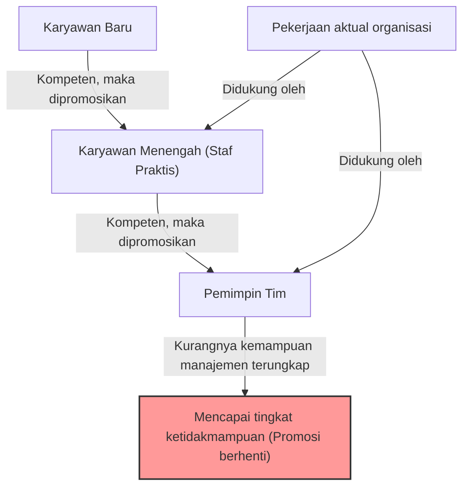
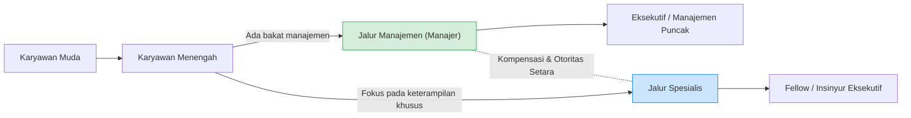

## 1. Pendahuluan: Mengapa Organisasi Dipenuhi oleh "Atasan yang Tidak Kompeten"?

Pernahkah Anda bekerja di sebuah perusahaan dan memiliki pertanyaan seperti ini setidaknya sekali? "Mengapa orang yang tidak bisa bekerja itu menduduki posisi manajemen?" "Mengapa senior yang seharusnya luar biasa itu tiba-tiba menjadi tidak berguna begitu menjadi manajer?"

Sebenarnya, ini bukanlah fenomena unik yang hanya ada di perusahaan Anda. Ini adalah fenomena universal yang dapat dilihat di semua organisasi, perusahaan, lembaga pemerintah, bahkan sekolah dan organisasi nirlaba di seluruh dunia. Fenomena ini diartikulasikan dan disistematisasi dengan sangat baik dalam "**Prinsip Peter (The Peter Principle)**".

Artikel ini akan membahas secara mendalam prinsip yang dikemukakan oleh Dr. Laurence J. Peter, mulai dari mekanisme dasarnya hingga tindakan pencegahan bagi individu maupun organisasi, dari semua sudut pandang yang mungkin. Ini adalah bacaan wajib bagi siapa saja yang ingin bertahan dalam "masyarakat hierarkis" yang disebut organisasi.

## 2. Apa itu Prinsip Peter? (Konsep Dasar)

Prinsip Peter adalah prinsip tentang sosiologi hierarki yang dikemukakan pada tahun 1969 dalam buku "The Peter Principle" yang ditulis bersama oleh Laurence J. Peter dan Raymond Hull. Argumen intinya adalah sebagai berikut:

> **"Dalam sebuah hierarki, setiap anggota cenderung dipromosikan hingga mencapai tingkat ketidakmampuannya."**

Mungkin sulit dimengerti hanya dengan kata-kata ini, jadi mari kita jelaskan dengan contoh konkret.

Ada seorang tenaga penjual (Pak A). Dia memiliki rekam jejak penjualan yang sangat baik dan mendapat kepercayaan penuh dari pelanggan. Perusahaan mengevaluasi "kompetensi sebagai tenaga penjual" Pak A dan mempromosikannya menjadi manajer penjualan.

Namun, kemampuan yang dibutuhkan dari seorang manajer penjualan bukanlah "kemampuan menjual produk sendiri", melainkan "kemampuan manajemen untuk mengembangkan bawahan dan mencapai tujuan bersama sebagai tim". Pak A adalah seorang manajer lapangan (playing manager) yang hebat, tetapi dia tidak pandai mengajar orang lain atau mengelola motivasi tim.

Akibatnya, Pak A gagal memberikan hasil sebagai manajer penjualan dan dicap sebagai orang yang "tidak kompeten". Dan karena dia tidak kompeten, dia tidak bisa dipromosikan lebih tinggi lagi (seperti menjadi direktur) dan akan terus tertahan di posisi "manajer yang tidak kompeten" tersebut.

Ini adalah contoh klasik dari Prinsip Peter. Dengan kata lain, orang dipromosikan karena mereka "kompeten di posisi mereka saat ini", tetapi jika mereka tidak memiliki keterampilan yang dibutuhkan untuk posisi setelah promosi, mereka menjadi "tidak kompeten" di sana, dan promosi mereka berhenti.

## 3. "Tragedi Organisasi" yang Ditimbulkan oleh Prinsip Peter

Konsekuensi paling mengerikan yang diisyaratkan oleh Prinsip Peter terangkum dalam satu kalimat berikut:

> **"Pada akhirnya, setiap posisi cenderung diisi oleh karyawan yang tidak kompeten untuk melaksanakan tugasnya."**

Apa yang akan terjadi jika semua orang di dalam organisasi dipromosikan hingga mencapai tingkat ketidakmampuannya, dan kemudian tertahan di sana? Mulai dari manajemen puncak hingga manajemen menengah, setiap posisi akan diisi oleh orang-orang yang "tidak cocok dengan pekerjaan mereka saat ini".

### Mengapa Organisasi Masih Bisa Berjalan?
Lalu, mengapa organisasi di dunia nyata tidak sepenuhnya runtuh dan masih bisa berjalan? Menurut Prinsip Peter, itu tidak lain karena **"pekerjaan yang sebenarnya dilakukan oleh mereka yang belum mencapai tingkat ketidakmampuannya (yakni mereka yang masih dalam proses promosi)"**. Dengan kata lain, "anak muda yang kompeten" dan "karyawan praktis yang kompeten" di tingkat bawah dan menengah organisasilah yang menutupi ketidakmampuan manajemen atas dan mendukung kinerja organisasi secara keseluruhan.

## 4. Mengapa Prinsip Peter Tidak Bisa Dihindari? (Mendalami Mekanismenya)

Mengapa perusahaan terus mengulang keputusan personalia yang sengaja membuat orang yang kompeten menjadi tidak kompeten? Hal ini disebabkan oleh cacat struktural yang melekat dalam masyarakat hierarkis.

### 4.1. Mencampuradukkan "Pencapaian Masa Lalu" dan "Bakat Masa Depan"
Sistem evaluasi di banyak perusahaan didasarkan pada "pencapaian di posisi saat ini". Namun, seiring dengan naiknya jabatan, sifat keterampilan yang dibutuhkan berubah secara mendasar.
- **Staf Praktis (Pemain)**: Keterampilan khusus, kemampuan eksekusi, manajemen diri
- **Manajemen Menengah (Manajer)**: Kemampuan komunikasi, koordinasi, kemampuan mengembangkan orang
- **Manajemen Atas (Pemimpin)**: Pemikiran strategis, membangun visi, kemampuan mengambil keputusan

Kompetensi sebagai seorang pemain tidak menjamin kompetensi sebagai seorang manajer. Namun, dalam evaluasi personalia yang sebenarnya, sulit untuk membangun metode evaluasi selain "menjadikan top sales sebagai manajer", sehingga ketidakcocokan (mismatch) tidak dapat dihindari.

### 4.2. Keterbatasan Sistem Kompensasi (Kutukan Promosi = Kesuksesan)
Di banyak organisasi modern, sarana utama untuk "menaikkan gaji" atau "mendapatkan status" terbatas pada "promosi ke posisi manajemen".
Bahkan bagi insinyur atau tenaga penjual luar biasa yang ingin mengasah keterampilan spesialisnya, sistemnya mengharuskan mereka menjadi manajer untuk mendapatkan gaji di atas tingkat tertentu. Hal ini menyebabkan seseorang "didorong ke tingkat ketidakmampuan" dengan mengabaikan bakat dan keinginan pribadi mereka.

### 4.3. Kesulitan Demosi dan "Bergeser Menyamping"
Menurunkan jabatan (demosi) seseorang yang pernah dipromosikan sangatlah sulit dalam budaya organisasi Jepang (dan juga banyak perusahaan di Barat). Hal ini karena berisiko melukai harga diri individu dan menurunkan motivasi secara signifikan.
Oleh karena itu, manajer yang terbukti "tidak kompeten" sering kali tidak diturunkan jabatannya, melainkan "digeser" ke posisi yang tidak penting pada tingkat hierarki yang sama (biasa disebut "suku jendela" (madogiwazoku) atau "direktur proyek khusus" yang tidak memiliki kekuasaan nyata). Peter menyebut ini sebagai "**Pergeseran Horizontal (Arabesque)**".

## 5. Solusi Inovatif untuk Prinsip Peter

Menghancurkan Prinsip Peter sepenuhnya sangatlah sulit selama masyarakat hierarkis masih ada. Namun, ada strategi untuk meminimalkan kerusakan dan menyeimbangkan kebahagiaan individu serta produktivitas organisasi.

### 5.1. Solusi Individu: Rekomendasi "Ketidakmampuan Kreatif"
Pertahanan terbesar bagi seorang individu yang dikemukakan oleh Peter sendiri adalah "**Ketidakmampuan Kreatif (Creative Incompetence)**".
Ini adalah teknik tingkat tinggi di mana, ketika Anda mencapai posisi yang Anda anggap sebagai "panggilan sejati" atau ketika Anda "tidak ingin dipromosikan lebih jauh (tidak ingin melampaui batas kemampuan Anda)", Anda dengan sengaja menampilkan "kekurangan kecil yang tidak fatal, tetapi cukup untuk membuat orang ragu mempromosikan Anda".

Misalnya, meskipun Anda melakukan pekerjaan dengan sempurna, Anda mungkin memastikan bahwa "meja Anda selalu berantakan", "Anda enggan berpartisipasi dalam acara perusahaan", atau "cara berpakaian Anda sedikit berantakan". Dengan melakukan ini, manajemen atas akan menilai, "Dia bisa bekerja, tetapi agak mengkhawatirkan jika dijadikan manajer," dan akan mempertahankan Anda di posisi saat ini (di mana Anda paling bersinar).

### 5.2. Solusi Organisasi: Memisahkan Promosi dan Kompensasi (Sistem Tangga Ganda)
Langkah paling efektif yang dapat diambil oleh organisasi adalah **benar-benar memisahkan "jalur manajemen" dan "jalur spesialis" serta memberikan kompensasi dan evaluasi yang setara**. (Ini disebut Sistem Tangga Ganda / Dual Ladder).
Dengan ini, seorang programmer yang hebat tidak perlu memaksakan diri menjadi manajer proyek hanya demi gaji, dan dapat terus menunjukkan kompetensinya.

### 5.3. Promosi Uji Coba dan Pelembagaan "Mundur Terhormat"
Tragedi terjadi karena kita melihat promosi sebagai sesuatu yang "tidak dapat diubah". Misalnya, menerapkan sistem di mana periode "uji coba manajer" selama 3 hingga 6 bulan ditetapkan, dan pada akhir periode itu, karyawan dan perusahaan dapat berdiskusi untuk memilih apakah akan "kembali ke posisi semula" atau "melanjutkan sebagai manajer".
Hal ini memastikan sistem yang memungkinkan "mundur terhormat" ketika "sudah mencoba tetapi ternyata tidak cocok," dan dapat mencegah terjadinya stagnasi pada tingkat ketidakmampuan.

## 6. Kesimpulan: Di Mana Anda Harus Menunjukkan "Kompetensi" Anda?

Sekilas, Prinsip Peter tampak sebagai prinsip yang sangat sinis dan menyedihkan. Namun, jika dilihat dari sisi lain, ini adalah pelajaran yang mengajarkan **"pentingnya memahami batas dan bakat Anda sendiri secara akurat, serta menemukan tempat di mana Anda bisa bersinar paling terang"**.

Daripada menaiki jalur tunggal "promosi = kesuksesan" yang disiapkan oleh masyarakat atau perusahaan, milikilah keberanian untuk mengidentifikasi tingkat di mana "kompetensi" Anda sendiri dapat dimaksimalkan, dan tetaplah di sana (kadang-kadang dibutuhkan kecerdasan untuk memainkan peran ketidakmampuan kreatif). Itu bisa dikatakan sebagai strategi terbaik untuk bertahan hidup secara utuh tanpa stres dalam masyarakat hierarkis yang kompleks di era modern ini.

(*Artikel ini ditulis dengan tujuan untuk memahami "Prinsip Peter" secara mendalam dan menggunakannya untuk membantu membangun organisasi masa depan. "Atasan yang tidak kompeten" di tempat kerja Anda juga mungkin dulunya adalah pemain kompeten yang bersinar. Jika dipikir seperti itu, Anda mungkin bisa memandang mereka dengan sedikit lebih lembut... mungkin.*)
