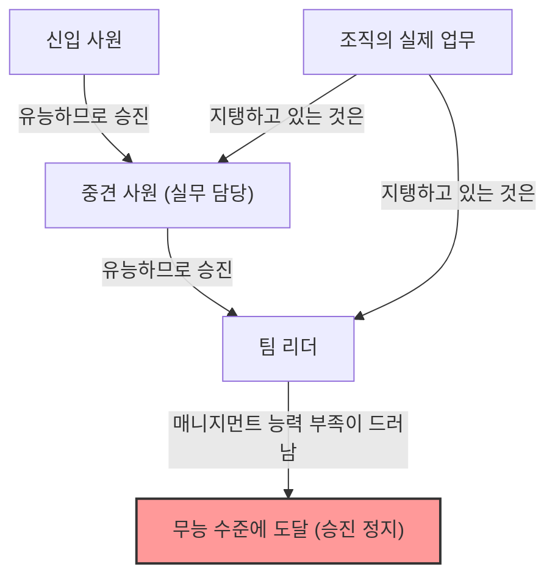
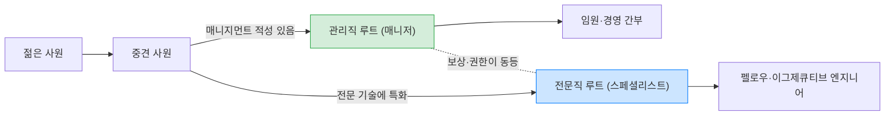

## 1. 서론: 왜 조직에는 "무능한 상사"가 넘쳐나는가?

회사에서 일하다 보면, 한 번쯤 다음과 같은 의문을 가져본 적이 없을까요. "왜 저렇게 일을 못하는 사람이 관리직에 앉아 있는 걸까?", "왜 그렇게 우수했던 선배가 매니저가 되자마자 엉망이 되어버린 걸까?"

사실, 이것은 당신의 회사에만 있는 특이한 현상이 아닙니다. 전 세계의 모든 조직, 기업, 관공서, 나아가 학교나 비영리 단체에서도 찾아볼 수 있는 보편적인 현상입니다. 이 현상을 훌륭하게 언어화하고 체계화한 것이 바로 "**피터의 법칙(The Peter Principle)**"입니다.

본 기사에서는 로렌스 J. 피터(Laurence J. Peter) 박사가 제창한 이 법칙에 대해, 그 근본적인 메커니즘부터 개인 및 조직으로서의 대책까지 생각할 수 있는 모든 관점에서 철저하게 파고들어 보겠습니다. 조직이라는 "계층 사회"에서 살아남아야 하는 모든 사람에게 필독할 만한 내용입니다.

## 2. 피터의 법칙이란 무엇인가? (기본 개념)

피터의 법칙은 1969년 로렌스 J. 피터와 레이먼드 헐이 공동 저술한 『피터의 법칙』에서 제창된, 계층 사회학에 관한 법칙입니다. 그 핵심 주장은 다음과 같습니다.

> **"계층 사회에서 모든 구성원은 자신의 무능함이 드러나는 단계까지 승진한다"**

이 말만으로는 조금 이해하기 어려울 수 있으니, 구체적인 예를 들어 설명해 보겠습니다.

어떤 영업 사원(A씨)이 있었습니다. 그는 매우 우수한 영업 실적을 거두었고, 고객들로부터도 절대적인 신뢰를 얻고 있었습니다. 회사는 A씨의 "영업으로서의 유능함"을 평가하여, 그를 영업 매니저로 승진시킵니다.

그러나 영업 매니저에게 요구되는 능력은 "스스로 상품을 파는 능력"이 아니라, "부하 직원을 육성하고 팀 전체가 목표를 달성하도록 하는 매니지먼트 능력"입니다. A씨는 플레잉 매니저로는 뛰어났지만, 남을 가르치거나 팀의 동기를 관리하는 일에는 서툴렀습니다.

결과적으로 A씨는 영업 매니저로서 성과를 내지 못하고 "무능"하다는 낙인이 찍히고 맙니다. 그리고 무능한 이상, 그 위(부장 등)로는 승진하지 못하고 그 "무능한 매니저"라는 자리에 계속 머물게 됩니다.

이것이 피터의 법칙의 전형적인 예입니다. 즉, 사람은 "현재의 직위에서 유능하다"는 이유로 승진하지만, 승진한 자리에서 요구되는 능력을 갖추고 있지 않으면 거기서 "무능"해지고 승진이 멈추는 것입니다.

## 3. 피터의 법칙이 가져오는 "조직의 비극"

피터의 법칙이 시사하는 가장 무서운 결과는 다음의 한 문장으로 요약됩니다.

> **"머지않아 모든 직책은 직무를 다하지 못하는 무능한 인간으로 채워진다"**

만약 조직 내의 모든 사람이 자신의 무능 수준에 도달할 때까지 승진하고 거기서 정체된다면 어떻게 될까요? 조직의 상층부부터 중간 관리직에 이르기까지, 모든 직책이 "현재의 업무에 적성이 없는 사람"들로 가득 차게 됩니다.

### 조직은 왜 돌아가는가?
그렇다면 왜 현실의 조직은 완전히 붕괴되지 않고 굴러가는 것일까요? 피터의 법칙에 따르면, 그것은 **"아직 무능 수준에 도달하지 않은(=현재 승진 중인) 사람들이 실제 업무를 수행하고 있기 때문"**에 다름 아닙니다. 즉, 조직의 하층부나 중견에 있는 "유능한 젊은 피"나 "유능한 실무 담당자"들이 상층부의 무능함을 커버하며 조직 전체의 성과를 떠받치고 있다는 구도입니다.

## 4. 왜 피터의 법칙은 피할 수 없는가? (메커니즘 심층 분석)

왜 기업은 굳이 유능한 사람을 무능하게 만들어버리는 인사를 반복하는 것일까요? 거기에는 계층 사회(하이어라키)가 안고 있는 구조적인 결함이 존재합니다.

### 4.1. "과거의 성과"와 "미래의 적성"의 혼동
많은 기업의 평가 제도는 "현재 직책에서의 성과"를 기준으로 합니다. 그러나 계층이 올라갈수록 요구되는 스킬의 성질은 근본적으로 변화합니다.
- **실무 담당자(플레이어)**: 전문 스킬, 실행력, 자기 관리 능력
- **중간 관리직(매니저)**: 커뮤니케이션 능력, 조정력, 인재 육성 능력
- **상급 관리직(리더)**: 전략적 사고, 비전 구축, 의사 결정 능력

플레이어로서의 유능함이 매니저로서의 유능함을 보장하는 것은 아닙니다. 하지만 현실의 인사 평가에서는 "영업 실적 1위인 사람을 매니저로 만든다" 이외의 평가 방법을 구축하기 어렵기 때문에, 필연적으로 미스매치가 발생합니다.

### 4.2. 보상 체계의 한계 (승진=성공이라는 주술)
현대의 많은 조직에서는 "급여를 올리기", "지위를 얻기" 위한 주요 수단이 "관리직으로의 승진"에 한정되어 있습니다.
스페셜리스트로서의 길을 걷고자 하는 우수한 엔지니어나 영업 사원이라 할지라도, 일정 이상의 급여를 받기 위해서는 매니저가 될 수밖에 없는 시스템으로 되어 있습니다. 이로 인해 본인의 적성이나 희망을 무시한 "무능 수준으로의 밀어 올리기"가 발생합니다.

### 4.3. 강등의 어려움과 "수평 이동"
한 번 승진한 사람을 강등시키는 것은 일본의 조직 문화에서(그리고 구미의 많은 기업에서도) 매우 어렵습니다. 본인의 자존심을 상하게 하고, 동기를 크게 떨어뜨릴 위험이 있기 때문입니다.
따라서 "무능"하다는 것이 판명된 관리직은 강등되는 대신, 같은 계층의 한직(이른바 "창가족"이나 실권이 없는 "특명 담당 부장" 등)으로 수평 이동되는 경우가 많아집니다. 이를 피터는 "**수평 이동(아라베스크)**"이라고 불렀습니다.

## 5. 피터의 법칙에 대한 획기적인 대책

피터의 법칙을 완전히 타파하는 것은 계층 사회가 존재하는 한 극히 어렵습니다. 그러나 피해를 최소화하고, 개인의 행복과 조직의 생산성을 양립시키기 위한 전략은 존재합니다.

### 5.1. 개인으로서의 대책: "창조적 무능"의 권장
피터 자신이 제창한, 개인이 스스로를 지키기 위한 최대의 방어책이 "**창조적 무능(Creative Incompetence)**"입니다.
이것은 자신이 "여기가 천직이다", "더 이상 승진하고 싶지 않다(내 능력의 한계를 넘고 싶지 않다)"고 생각하는 위치에 도달했을 때, 일부러 "치명적이지는 않지만 승진을 주저하게 만들 정도의 작은 결점"을 연기하는 고등 기술입니다.

예를 들어, 실무는 완벽하게 해내지만 "책상 위가 항상 어질러져 있다", "사내 행사에 소극적이다", "옷차림이 약간 루즈하다"와 같은 식입니다. 이를 통해 상층부는 "일은 잘하지만, 관리직으로 만들기엔 조금 불안하군"이라고 판단하여, 당신을 현재의(당신이 가장 빛날 수 있는) 위치에 머물게 해 줍니다.

### 5.2. 조직으로서의 대책: 승진과 보상의 분리 (듀얼 래더 제도)
조직 측에서 할 수 있는 가장 효과적인 대책은 **"관리직 루트"와 "전문직(스페셜리스트) 루트"를 완전히 분리하고, 동등한 보상과 평가를 마련하는 것**입니다. (듀얼 래더제라고 불립니다).
이를 통해 우수한 프로그래머가 급여 때문에 무리하게 프로젝트 매니저가 될 필요가 없어지며, 자신의 유능함을 계속 발휘할 수 있습니다.

### 5.3. 트라이얼 승진과 "명예로운 철수"의 제도화
승진을 "비가역적인 것"으로 여기기 때문에 비극이 일어납니다. 예를 들어, 3개월~반년 정도의 "매니저 체험 기간"을 두고, 그 기간이 끝난 시점에서 본인과 회사가 상의하여 "원래 자리로 돌아갈지" 아니면 "그대로 매니저를 계속할지"를 선택할 수 있는 제도를 도입합니다.
이를 통해 "해봤지만 적성에 맞지 않았다"는 경우의 "명예로운 철수"가 시스템적으로 보장되어, 무능 수준에서의 정체를 막을 수 있습니다.

## 6. 결론: 자신의 "유능함"을 어디서 발휘해야 하는가

피터의 법칙은 언뜻 보면 매우 냉소적이고 절망적인 법칙으로 생각됩니다. 그러나 이를 역으로 생각하면 **"자신의 능력의 한계와 적성을 정확히 파악하고, 자신이 가장 빛날 수 있는 장소를 찾는 것의 중요성"**을 가르쳐 주는 교훈이기도 합니다.

사회나 회사가 마련한 "승진=성공"이라는 단일한 레일에 오르는 것이 아니라, 자신만의 "유능함"이 최대한으로 발휘될 수 있는 수준을 파악하고 그곳에 머물 수 있는 용기(때로는 창조적 무능을 연기하는 현명함)를 가지는 것. 그것이야말로 현대의 복잡한 계층 사회를 스트레스 없이, 그리고 충실하게 살아남기 위한 최고의 전략이라고 할 수 있을 것입니다.

(※ 이 기사는 "피터의 법칙"을 깊이 이해하고, 내일의 조직 만들기에 활용하는 데 도움이 되기를 바라며 작성되었습니다. 여러분 직장의 "무능한 상사"도 예전에는 눈부시게 유능한 플레이어였을지도 모릅니다. 그렇게 생각하면 조금은 너그러운 눈으로 바라볼 수 있을지…도 모르겠네요.)
