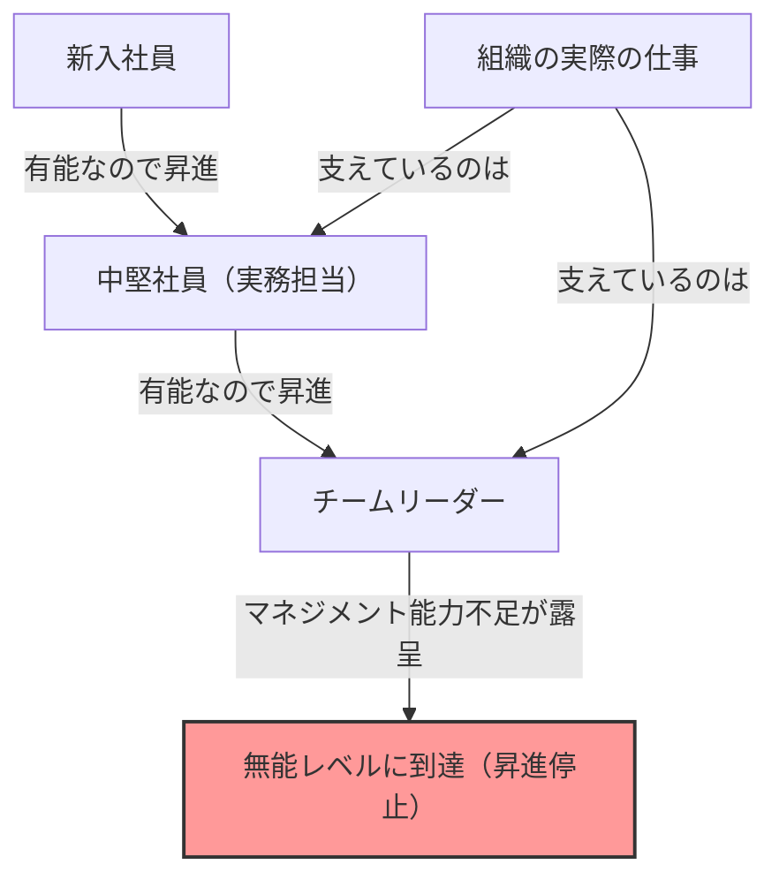
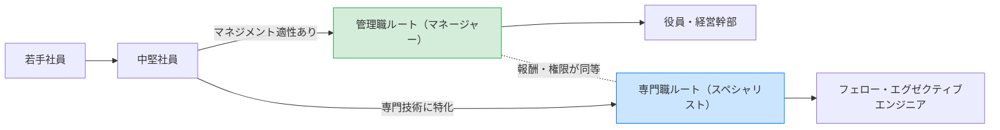

## 1. はじめに：なぜ組織には「無能な上司」が溢れているのか？

会社で働いていると、一度は次のような疑問を持ったことはないでしょうか。「なぜ、あんなに仕事ができない人が管理職に就いているのだろうか？」「なぜ、優秀だったはずのあの先輩が、マネージャーになった途端にポンコツになってしまったのか？」

実は、これはあなたの会社だけの特異な現象ではありません。世界中のあらゆる組織、企業、官公庁、さらには学校や非営利団体においてさえも見られる普遍的な現象なのです。この現象を見事に言語化し、体系化したのが「**ピーターの法則（The Peter Principle）**」です。

本記事では、ローレンス・J・ピーター（Laurence J. Peter）博士によって提唱されたこの法則について、その根本的なメカニズムから、個人および組織としての対策まで、考え得る限りの視点から徹底的に深掘りしていきます。組織という「階層社会」で生き抜くすべての人にとって、必読の内容となっています。

## 2. ピーターの法則とは何か？（基本概念）

ピーターの法則は、1969年にローレンス・J・ピーターとレイモンド・ハルによる共著『ピーターの法則』の中で提唱された、階層社会学に関する法則です。その核心となる主張は以下の通りです。

> **「階層社会において、すべての構成員は自らの無能レベルに達するまで昇進する」**

この言葉だけでは少し分かりにくいかもしれませんので、具体例を出して説明しましょう。

ある営業マン（Aさん）がいました。彼は非常に優秀な営業成績を収め、顧客からも絶大な信頼を得ていました。会社はAさんの「営業としての有能さ」を評価し、彼を営業マネージャーに昇進させます。

しかし、営業マネージャーに求められる能力は、「自分で商品を売る能力」ではなく、「部下を育成し、チーム全体で目標を達成するマネジメント能力」です。Aさんはプレイングマネージャーとしては優れていましたが、他人に教えたり、チームのモチベーションを管理したりすることは苦手でした。

結果として、Aさんは営業マネージャーとしては成果を出せず、「無能」の烙印を押されてしまいます。そして、無能である以上、それ以上（部長など）には昇進できず、その「無能なマネージャー」というポジションに留まり続けることになります。

これがピーターの法則の典型的な例です。つまり、人は「現在の地位で有能である」ことを理由に昇進しますが、昇進した先のポストで必要とされる能力が備わっていなければ、そこで「無能」となり、昇進がストップするのです。

## 3. ピーターの法則がもたらす「組織の悲劇」

ピーターの法則が示唆する最も恐ろしい帰結は、次の一文に集約されます。

> **「やがて、あらゆるポストは職責を果たせない無能な人間によって占められる」**

もし組織内のすべての人間が、自らの無能レベルに達するまで昇進し、そこで停滞するとしたらどうなるでしょうか。組織の上層部から中間管理職に至るまで、あらゆるポストが「現在の仕事に適性のない人」で埋め尽くされることになります。

### 組織はなぜ回っているのか？
では、なぜ現実の組織は完全に崩壊せずに回っているのでしょうか。ピーターの法則によれば、それは**「まだ無能レベルに達していない（＝現在昇進の途上にある）人々が、実際の仕事を行っているから」**に他なりません。つまり、組織の下層部や中堅にいる「有能な若手」や「有能な実務担当者」たちが、上層部の無能さをカバーし、組織全体の成果を支えているという構図です。

## 4. なぜピーターの法則は避けられないのか？（メカニズムの深掘り）

なぜ企業は、わざわざ有能な人を無能にしてしまうような人事を繰り返すのでしょうか。そこには、階層社会（ヒエラルキー）が抱える構造的な欠陥が存在します。

### 4.1. 「過去の成果」と「未来の適性」の混同
多くの企業における評価制度は、「現在のポストでの成果」を基準にしています。しかし、階層が上がるにつれて求められるスキルの性質は根本的に変化します。
- **実務担当者（プレイヤー）**: 専門スキル、実行力、自己管理能力
- **中間管理職（マネージャー）**: コミュニケーション能力、調整力、人材育成能力
- **上級管理職（リーダー）**: 戦略的思考、ビジョン構築、意思決定能力

プレイヤーとしての有能さが、マネージャーとしての有能さを保証するわけではありません。しかし、現実の人事評価では「営業成績トップの人間をマネージャーにする」以外の評価方法を構築することが難しいため、必然的にミスマッチが生じます。

### 4.2. 報酬体系の限界（昇進＝成功という呪縛）
現代の多くの組織では、「給料を上げる」「ステータスを得る」ための主な手段が「管理職への昇進」に限定されています。
スペシャリストとしての道を極めたい優秀なエンジニアや営業マンであっても、ある一定以上の給与を得るためにはマネージャーにならざるを得ないシステムになっています。これにより、本人の適性や希望を無視した「無能レベルへの押し上げ」が発生します。

### 4.3. 降格の困難さと「横滑り」
一度昇進した人間を降格させることは、日本の組織文化において（そして欧米の多くの企業でも）非常に困難です。本人のプライドを傷つけ、モチベーションを大きく下げるリスクがあるためです。
そのため、「無能」であることが判明した管理職は、降格されるのではなく、同じ階層の閑職（いわゆる「窓際族」や、実権のない「特命担当部長」など）へ横滑りさせられることが多くなります。これをピーターは「**水平移動（アラベスク）**」と呼びました。

## 5. ピーターの法則に対する画期的な対策

ピーターの法則を完全に打破することは、階層社会が存在する限り極めて困難です。しかし、被害を最小限に食い止め、個人の幸福と組織の生産性を両立させるための戦略は存在します。

### 5.1. 個人としての対策：「創造的無能」のすすめ
ピーター自身が提唱した、個人が身を守るための最大の防御策が「**創造的無能（Creative Incompetence）**」です。
これは、自分が「ここが天職だ」「これ以上昇進したくない（自分の能力の限界を超えたくない）」と思うポジションに到達した際、わざと「致命的ではないが、昇進を躊躇させる程度の小さな欠点」を演じるという高等技術です。

例えば、実務は完璧にこなすものの、「デスクの上が常に散らかっている」「社内行事への参加に消極的である」「服装が少しルーズである」といった具合です。これにより、上層部は「仕事はできるが、管理職にするには少し不安があるな」と判断し、あなたを現在の（あなたが最も輝ける）ポジションに留め置いてくれます。

### 5.2. 組織としての対策：昇進と報酬の分離（デュアルラダー制度）
組織側ができる最も有効な対策は、**「管理職ルート」と「専門職（スペシャリスト）ルート」を完全に分離し、同等の報酬・評価を用意すること**です。（デュアル・ラダー制と呼ばれます）。
これにより、優秀なプログラマーが給与のために無理にプロジェクトマネージャーになる必要がなくなり、自らの有能さを発揮し続けることができます。

### 5.3. トライアル昇進と「名誉ある撤退」の制度化
昇進を「不可逆なもの」と捉えるから悲劇が起きます。例えば、3ヶ月〜半年程度の「マネージャーお試し期間」を設け、その期間が終わった段階で、本人と会社が話し合って「元のポジションに戻る」か「そのままマネージャーを続ける」かを選択できる制度を導入します。
これにより、「やってみたけれど適性がなかった」という場合の「名誉ある撤退」がシステムとして保証され、無能レベルでの停滞を防ぐことができます。

## 6. まとめ：自らの「有能さ」をどこで発揮するべきか

ピーターの法則は、一見すると非常にシニカルで絶望的な法則に思えます。しかし、これを逆手にとれば**「自分の能力の限界と適性を正確に把握し、自分が最も輝ける場所を見つけることの重要性」**を教えてくれる教訓でもあります。

社会や会社が用意した「昇進＝成功」という単一のレールに乗るのではなく、自分自身の「有能さ」が最大限に発揮できるレベルを見極め、そこに留まる勇気（時には創造的無能を演じる賢さ）を持つこと。それこそが、現代の複雑な階層社会をストレスなく、そして充実して生き抜くための最高の戦略と言えるでしょう。

（※この記事は「ピーターの法則」を深く理解し、明日の組織作りに活かすための一助となることを目指して執筆されました。皆さんの職場の「無能な上司」も、かつては輝くような有能なプレイヤーだったのかもしれません。そう考えると、少しだけ優しい目で見ることができる…かもしれませんね。）
