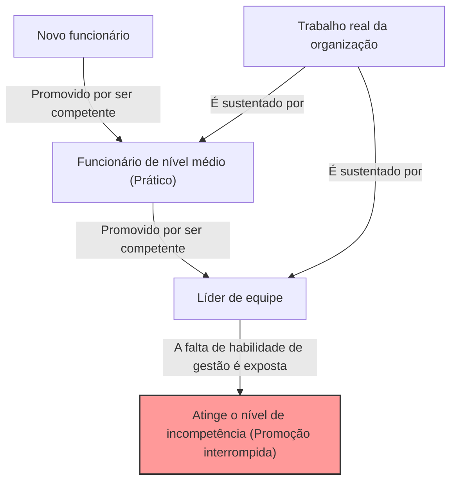
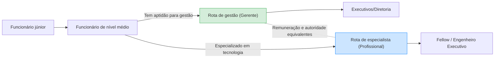

## 1. Introdução: Por que as organizações estão cheias de "chefes incompetentes"?

Trabalhando em uma empresa, você já deve ter se feito a seguinte pergunta pelo menos uma vez: "Por que alguém que não sabe trabalhar bem está em um cargo gerencial?" ou "Por que aquele colega que era tão competente se tornou inútil assim que virou gerente?"

Na verdade, esse não é um fenômeno exclusivo da sua empresa. É um fenômeno universal visto em todas as organizações, empresas, repartições públicas e até mesmo em escolas e organizações sem fins lucrativos em todo o mundo. Quem verbalizou e sistematizou de forma brilhante esse fenômeno foi o "**Princípio de Peter (The Peter Principle)**".

Neste artigo, aprofundaremos o máximo possível sob várias perspectivas, desde o mecanismo fundamental até as contramedidas para indivíduos e organizações, sobre esse princípio proposto pelo Dr. Laurence J. Peter. É uma leitura obrigatória para todos que tentam sobreviver em uma "sociedade hierárquica" como é uma organização.

## 2. O que é o Princípio de Peter? (Conceito Básico)

O Princípio de Peter é um princípio da sociologia hierárquica proposto em 1969 por Laurence J. Peter e Raymond Hull no livro coautorado "O Princípio de Peter". Sua afirmação central é a seguinte:

> **"Em uma hierarquia, todo funcionário tende a ser promovido até o seu nível de incompetência"**

Pode ser um pouco difícil de entender apenas com essas palavras, então vamos dar um exemplo concreto.

Havia um vendedor (Sr. A). Ele tinha um desempenho de vendas excepcional e ganhava imensa confiança dos clientes. A empresa avaliou a "competência como vendedor" do Sr. A e o promoveu a gerente de vendas.

No entanto, a capacidade exigida de um gerente de vendas não é a "capacidade de vender produtos sozinho", mas a "capacidade de gestão para desenvolver subordinados e atingir os objetivos como uma equipe inteira". O Sr. A era excelente como um gerente que também joga (playing manager), mas não era bom em ensinar outras pessoas ou gerenciar a motivação da equipe.

Como resultado, o Sr. A não conseguiu produzir resultados como gerente de vendas e recebeu o rótulo de "incompetente". E, como ele é incompetente, não pode mais ser promovido (para diretor, etc.) e continuará preso na posição de "gerente incompetente".

Este é um exemplo clássico do Princípio de Peter. Em outras palavras, as pessoas são promovidas porque "são competentes na posição atual", mas se não tiverem as habilidades exigidas para o cargo para o qual foram promovidas, elas se tornam "incompetentes" lá, e a promoção para.

## 3. A "Tragédia Organizacional" trazida pelo Princípio de Peter

A consequência mais assustadora sugerida pelo Princípio de Peter resume-se na seguinte frase:

> **"Com o tempo, todos os cargos tendem a ser ocupados por funcionários que são incompetentes para desempenhar suas funções"**

O que aconteceria se todos em uma organização fossem promovidos até o seu nível de incompetência e ficassem estagnados lá? Todos os cargos, da alta administração até a gerência intermediária, estariam preenchidos por "pessoas não adequadas para o cargo atual".

### Por que as organizações continuam funcionando?
Então, por que as organizações reais continuam funcionando sem colapsar completamente? De acordo com o Princípio de Peter, não é por outro motivo senão: **"O trabalho é realizado pelos funcionários que ainda não atingiram o seu nível de incompetência (ou seja, aqueles que ainda estão sendo promovidos)"**. Em outras palavras, são os "jovens talentosos" ou os "profissionais práticos competentes" nos níveis inferiores e intermediários da organização que encobrem a incompetência dos níveis superiores e sustentam os resultados de toda a organização.

## 4. Por que o Princípio de Peter é inevitável? (Aprofundando no mecanismo)

Por que as empresas repetem práticas de recursos humanos que transformam pessoas competentes em incompetentes? Existe uma falha estrutural inerente nas sociedades hierárquicas (hierarquias).

### 4.1. Confusão entre "Resultados Passados" e "Aptidões Futuras"
O sistema de avaliação em muitas empresas é baseado em "resultados no cargo atual". No entanto, a natureza das habilidades exigidas muda fundamentalmente à medida que se sobe na hierarquia.
- **Funcionário prático (Player)**: Habilidade técnica, capacidade de execução, autogestão
- **Gerência intermediária (Manager)**: Habilidade de comunicação, capacidade de coordenação, desenvolvimento de pessoas
- **Alta gerência (Líder)**: Pensamento estratégico, construção de visão, capacidade de tomada de decisão

Ser um executor competente não garante que a pessoa será um gerente competente. No entanto, em avaliações de desempenho reais, é difícil construir um método de avaliação que não seja "tornar o melhor vendedor um gerente", e por isso o descompasso ocorre inevitavelmente.

### 4.2. O limite do sistema de recompensas (A maldição de Promoção = Sucesso)
Em muitas organizações modernas, o principal meio de "aumentar o salário" ou "obter status" limita-se a "ser promovido a um cargo gerencial".
Mesmo para um engenheiro brilhante ou um ótimo vendedor que queira dominar o caminho como especialista, o sistema exige que eles se tornem gerentes para obter um salário acima de um certo nível. Isso faz com que as pessoas sejam "empurradas para o nível de incompetência", ignorando suas aptidões e desejos.

### 4.3. A dificuldade do rebaixamento e o "Deslizamento Lateral"
Rebaixar alguém que já foi promovido é extremamente difícil na cultura corporativa japonesa (e também em muitas empresas ocidentais). Isso ocorre porque existe o risco de ferir o orgulho da pessoa e diminuir muito a sua motivação.
Portanto, os gerentes que se revelam "incompetentes" geralmente não são rebaixados, mas sim transferidos lateralmente para posições sem importância no mesmo nível (os chamados "tribo da janela" ou "diretores de missões especiais" sem poder real). Peter chamou isso de "**Deslizamento lateral (Arabesco)**".

## 5. Contramedidas inovadoras contra o Princípio de Peter

Superar completamente o Princípio de Peter é extremamente difícil enquanto existirem sociedades hierárquicas. No entanto, existem estratégias para minimizar os danos e equilibrar a felicidade individual com a produtividade organizacional.

### 5.1. Contramedida pessoal: A recomendação da "Incompetência Criativa"
A maior defesa sugerida pelo próprio Peter para os indivíduos se protegerem é a "**Incompetência Criativa (Creative Incompetence)**".
Esta é uma técnica avançada na qual, quando você atinge uma posição onde pensa "esta é a minha vocação" ou "não quero ser mais promovido (não quero ultrapassar os limites da minha capacidade)", você deliberadamente encena "pequenos defeitos que não são fatais, mas que fazem hesitar em promover".

Por exemplo, embora você execute suas tarefas práticas perfeitamente, "sua mesa está sempre bagunçada", "você é relutante em participar de eventos da empresa" ou "você se veste de maneira um pouco desleixada". Isso fará com que a alta administração conclua que "ele é bom no trabalho, mas há alguma preocupação em torná-lo gerente", e manterá você na posição atual (onde você mais brilha).

### 5.2. Contramedida organizacional: Separação de promoção e remuneração (Sistema de Dupla Carreira)
A medida mais eficaz que as organizações podem tomar é **separar completamente a "rota de gestão" e a "rota de especialista" (profissional técnico) e fornecer remuneração e avaliação equivalentes** (conhecido como sistema Dual Ladder).
Com isso, excelentes programadores não precisam mais se forçar a se tornarem gerentes de projetos apenas por salário, podendo continuar a demonstrar sua competência.

### 5.3. Institucionalização de promoções experimentais e "Retirada Honrosa"
A tragédia ocorre porque a promoção é vista como "irreversível". Por exemplo, estabelecer um "período de experiência gerencial" de cerca de 3 a 6 meses e, no final desse período, ter uma discussão entre o indivíduo e a empresa para escolher se deseja "retornar à posição original" ou "continuar como gerente".
Dessa forma, uma "retirada honrosa" é sistemicamente garantida para casos de "tentei, mas não tinha aptidão", evitando a estagnação no nível de incompetência.

## 6. Conclusão: Onde você deve exercer sua "competência"?

O Princípio de Peter pode parecer, à primeira vista, uma lei extremamente cínica e desesperadora. No entanto, se virarmos isso a favor, é também uma lição que nos ensina **"a importância de compreender com precisão os limites e aptidões da sua própria capacidade e encontrar o lugar onde você pode brilhar mais"**.

Em vez de embarcar no único caminho de "promoção = sucesso" preparado pela sociedade e pelas empresas, é essencial identificar o nível onde sua própria "competência" pode ser maximizada e ter a coragem de permanecer lá (às vezes a sabedoria de encenar uma incompetência criativa). Essa pode ser considerada a melhor estratégia para sobreviver de forma satisfatória e sem estresse na complexa sociedade hierárquica moderna.

(*Este artigo foi escrito com o objetivo de ajudar a entender profundamente o "Princípio de Peter" e aplicá-lo na construção da organização de amanhã. Aquele "chefe incompetente" no seu local de trabalho também pode ter sido um profissional brilhante e competente no passado. Pensando assim, talvez você possa olhar para ele com olhos um pouco mais gentis... talvez.*)
