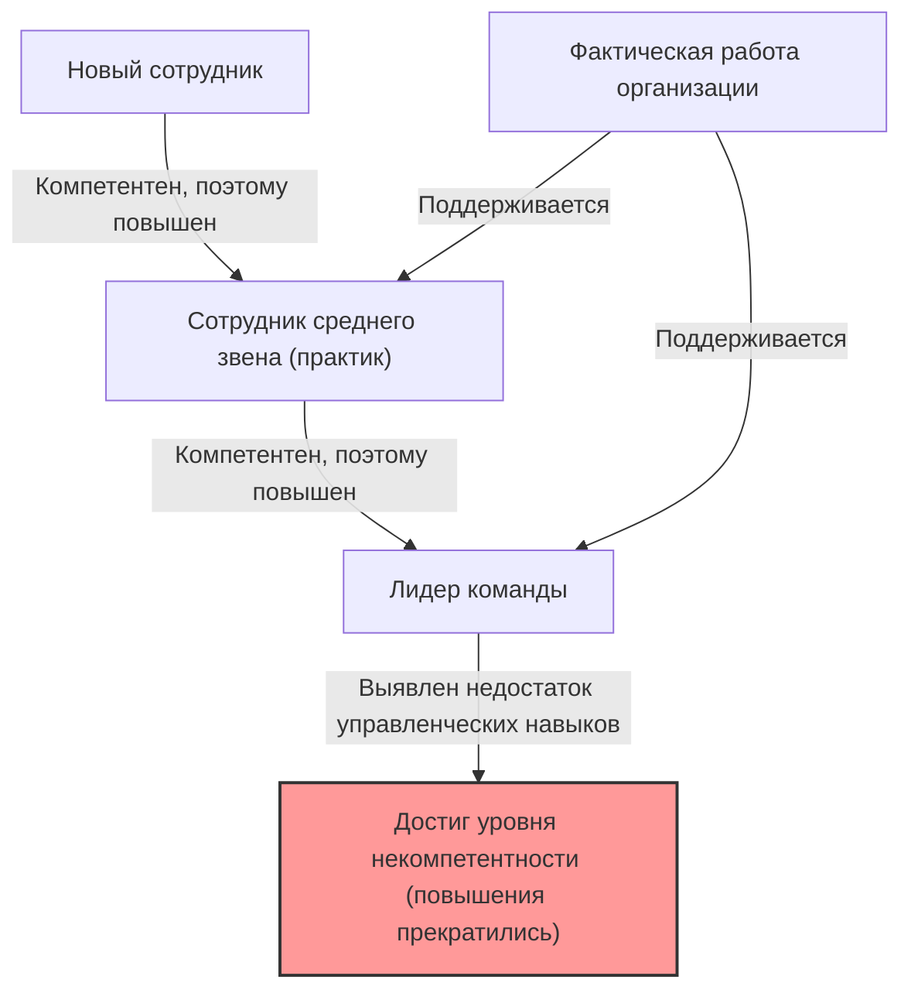
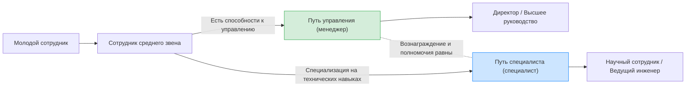

## 1. Введение: почему в организациях так много «некомпетентных начальников»?

Работая в компании, вы, возможно, хотя бы раз задавались подобными вопросами: «Почему человек, который так плохо справляется с работой, занимает руководящую должность?», «Почему тот старший коллега, который был таким способным, стал совершенно бесполезным, как только стал менеджером?»

На самом деле, это не уникальное явление только для вашей компании. Это универсальный феномен, который можно наблюдать во всех организациях, корпорациях, правительственных учреждениях, и даже в школах и некоммерческих организациях по всему миру. Тем, кто блестяще сформулировал и систематизировал этот феномен, является «**Принцип Питера (The Peter Principle)**».

В этой статье мы подробно рассмотрим этот принцип, предложенный доктором Лоуренсом Дж. Питером (Laurence J. Peter), начиная с его фундаментальных механизмов и заканчивая мерами противодействия на личном и организационном уровнях, со всех возможных точек зрения. Это обязательное чтение для всех, кто хочет выжить в «иерархическом обществе», которым является организация.

## 2. Что такое принцип Питера? (Базовые концепции)

Принцип Питера — это закон иерархической социологии, предложенный в 1969 году в соавторстве Лоуренсом Дж. Питером и Реймондом Халлом в книге «Принцип Питера». Его основное утверждение заключается в следующем:

> **«В иерархическом обществе каждый сотрудник стремится подняться до своего уровня некомпетентности»**

Возможно, по одним только этим словам будет немного сложно понять, поэтому давайте объясним на конкретном примере.

Жил-был менеджер по продажам (г-н А). Он добивался отличных результатов в продажах и пользовался огромным доверием клиентов. Компания оценила «компетентность г-на А как продавца» и повысила его до должности менеджера по продажам.

Однако навыки, требуемые от менеджера по продажам, — это не «способность самому продавать продукты», а «управленческие способности для развития подчиненных и достижения целей всей командой». Г-н А был отличным играющим менеджером, но ему было трудно обучать других или управлять мотивацией команды.

В результате г-н А не смог добиться результатов в качестве менеджера по продажам, и на него повесили ярлык «некомпетентного». А поскольку он некомпетентен, он не может получить дальнейшее повышение (например, до начальника отдела) и продолжит оставаться на позиции «некомпетентного менеджером».

Это типичный пример принципа Питера. Другими словами, людей повышают, потому что они «компетентны на своей нынешней должности», но если у них нет навыков, необходимых для новой должности, они становятся там «некомпетентными», и их повышение прекращается.

## 3. «Трагедия организации», вызванная принципом Питера

Самый пугающий вывод, вытекающий из принципа Питера, можно свести к следующему предложению:

> **«Со временем каждая должность будет занята работником, который недостаточно компетентен для выполнения своих обязанностей»**

Что произошло бы, если бы каждый человек в организации продвигался по службе до тех пор, пока не достиг бы своего уровня некомпетентности, и застревал бы на этом? От высшего руководства до менеджеров среднего звена каждая должность в организации была бы заполнена «людьми, непригодными для своей нынешней работы».

### Почему же тогда организации продолжают работать?
Так почему же реальные организации продолжают функционировать и не разрушаются полностью? Согласно принципу Питера, это происходит только потому, что **«фактическую работу выполняют те, кто еще не достиг своего уровня некомпетентности (то есть те, кто в настоящее время находится на пути к повышению)»**. Другими словами, структура такова, что «компетентные молодые сотрудники» и «компетентные практики» на нижних и средних уровнях организации покрывают некомпетентность высшего руководства и поддерживают общую производительность организации.

## 4. Почему принцип Питера неизбежен? (Углубление в механизмы)

Почему компании продолжают принимать кадровые решения, которые намеренно превращают компетентных людей в некомпетентных? В этом кроется структурный недостаток, присущий иерархическим обществам (иерархиям).

### 4.1. Смешение «прошлых достижений» и «будущей пригодности»
Система оценки во многих компаниях основана на «достижениях на текущей должности». Однако характер требуемых навыков фундаментально меняется по мере продвижения вверх по иерархии.
- **Практик (игрок)**: Специализированные навыки, способность к выполнению, навыки самоорганизации
- **Менеджер среднего звена (менеджер)**: Коммуникативные навыки, навыки координации, навыки развития персонала
- **Высшее руководство (лидер)**: Стратегическое мышление, построение видения, навыки принятия решений

Компетентность как игрока не гарантирует компетентности как менеджера. Однако в реальной оценке персонала трудно создать метод оценки, отличный от «назначения лучшего продавца менеджером», поэтому неизбежно возникает несоответствие.

### 4.2. Ограничения системы вознаграждения (проклятие «повышение = успех»)
Во многих современных организациях основные средства для «повышения зарплаты» или «получения статуса» ограничены «повышением до руководящей должности».
Даже отличные инженеры или продавцы, которые хотят совершенствоваться на пути специалистов, вынуждены становиться менеджерами, чтобы получать зарплату выше определенного уровня. Это приводит к «выталкиванию на уровень некомпетентности», игнорируя пригодность и желания самого человека.

### 4.3. Сложность понижения в должности и «скольжение вбок»
Понизить в должности человека, который однажды получил повышение, очень сложно в корпоративной культуре Японии (а также во многих западных компаниях). Это связано с риском задеть гордость человека и сильно снизить его мотивацию.
Поэтому менеджеры, оказавшиеся «некомпетентными», часто не понижаются в должности, а сдвигаются вбок на номинальные должности того же уровня (так называемые «люди у окна» или «специальные директора» без реальной власти). Питер назвал это «**горизонтальным перемещением (арабеском)**».

## 5. Революционные меры противодействия принципу Питера

Полностью преодолеть принцип Питера крайне сложно, пока существует иерархическое общество. Однако существуют стратегии, позволяющие свести ущерб к минимуму и сбалансировать личное счастье с производительностью организации.

### 5.1. Меры на личном уровне: рекомендация «творческой некомпетентности»
Главной защитной мерой для людей, предложенной самим Питером, является «**Творческая некомпетентность (Creative Incompetence)**».
Это продвинутая техника, при которой, достигнув должности, которую вы считаете своим «призванием», или когда вы «не хотите дальнейшего повышения (не хотите выходить за пределы своих возможностей)», вы намеренно разыгрываете «небольшой недостаток, который не является фатальным, но заставляет начальство сомневаться в вашем повышении».

Например, хотя вы идеально справляетесь с практической работой, «на вашем столе всегда беспорядок», вы «неохотно участвуете в корпоративных мероприятиях» или «одеваетесь немного небрежно». Благодаря этому высшее руководство решит: «Он хорошо справляется с работой, но назначать его на руководящую должность немного рискованно», и оставит вас на вашей нынешней должности (где вы можете проявить себя лучше всего).

### 5.2. Меры на уровне организации: разделение повышения и вознаграждения (система двойной лестницы)
Наиболее эффективной мерой, которую может предпринять организация, является **полное разделение «пути управления» и «пути специалиста» при предоставлении равного вознаграждения и оценки** (это называется системой двойной лестницы).
Благодаря этому отличным программистам больше не нужно будет заставлять себя становиться менеджерами проектов ради зарплаты, и они смогут продолжать демонстрировать свою компетентность.

### 5.3. Институционализация пробных повышений и «почетного отступления»
Трагедия происходит из-за того, что повышение рассматривается как «необратимое». Например, можно ввести систему, при которой устанавливается «испытательный срок менеджера» от 3 месяцев до полугода, и по окончании этого периода сотрудник и компания могут обсудить и выбрать, «вернуться на прежнюю должность» или «продолжить работу менеджером».
Благодаря этому гарантируется системное «почетное отступление» в тех случаях, когда «человек попробовал, но оказался непригодным», что позволяет предотвратить застой на уровне некомпетентности.

## 6. Заключение: где следует проявлять свою «компетентность»?

Принцип Питера на первый взгляд может показаться очень циничным и безнадежным законом. Однако если посмотреть на это с другой стороны, то это урок, который учит нас **«важности точного понимания пределов своих возможностей и пригодности, а также нахождения места, где мы можем проявить себя лучше всего»**.

Вместо того чтобы следовать по единственному пути «повышение = успех», подготовленному обществом или компанией, необходимо иметь смелость (а иногда и мудрость сыграть в творческую некомпетентность), чтобы определить уровень, на котором ваша собственная «компетентность» может быть продемонстрирована в полной мере, и оставаться там. Можно сказать, что это лучшая стратегия для выживания в современном сложном иерархическом обществе без стресса и с чувством удовлетворения.

(* Эта статья была написана с целью помочь вам глубже понять «принцип Питера» и использовать его для построения организации завтрашнего дня. «Некомпетентный начальник» на вашем рабочем месте тоже, возможно, когда-то был блестящим и компетентным игроком. Если подумать об этом с такой точки зрения, возможно, вы сможете смотреть на него немного мягче... наверное.)
