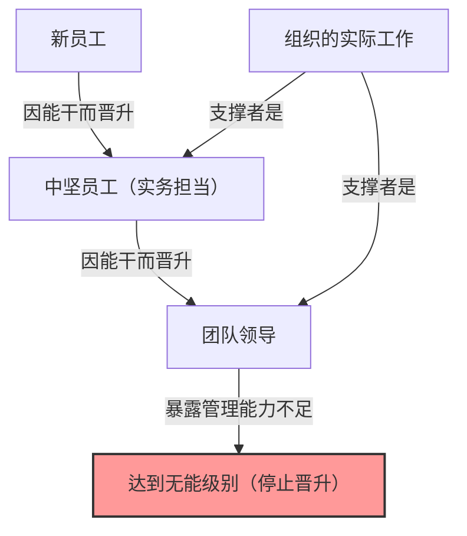
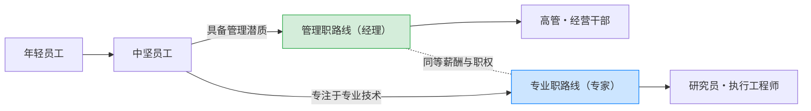

## 1. 引言：为什么组织中充满了“无能的上司”？

在公司工作时，你是否曾有过这样的疑问：“为什么那种工作能力不行的人还能担任管理职位？”、“为什么曾经非常优秀的某位前辈，一当上经理就变成了废柴？”

实际上，这并不是你们公司独有的现象。这是在世界各地所有组织、企业、政府机关，甚至学校和非营利组织中都能看到的普遍现象。将这一现象精彩地语言化、系统化呈现的，就是“**彼得原理（The Peter Principle）**”。

本文将从劳伦斯·J·彼得（Laurence J. Peter）博士提出该原理的基本机制开始，到个人及组织的应对策略，从各种可能的视角进行彻底深入的探讨。对于所有在组织这种“等级社会”中求生的人来说，这是必读的内容。

## 2. 什么是彼得原理？（基本概念）

彼得原理是劳伦斯·J·彼得与雷蒙德·赫尔在1969年合著的《彼得原理》中提出的一项关于阶层社会学的原理。其核心主张如下：

> **“在等级社会中，每个员工趋向于上升到他所不能胜任的地位”**

仅凭这句话可能有些难以理解，让我们举个具体的例子来解释。

有一位销售员（A先生）。他取得了非常优异的销售业绩，也获得了客户极大的信任。公司看重了A先生“作为销售的能力”，将他提拔为销售经理。

然而，销售经理所需要的能力并不是“自己推销商品的能力”，而是“培养下属、带领整个团队实现目标的管理能力”。A先生作为一线业务经理（Playing Manager）或许很出色，但他不擅长指导他人，也不擅长管理团队的积极性。

结果，A先生作为销售经理无法取得成果，被贴上了“无能”的标签。而既然已经无能，就无法再进一步晋升（如部长等），于是他就一直停留在那个“无能的经理”的职位上。

这就是彼得原理的典型例子。也就是说，人们因为“在当前职位上能干”而被提拔，但如果不具备晋升后职位所需的能力，就会在那里变得“无能”，晋升也就此停止。

## 3. 彼得原理带来的“组织悲剧”

彼得原理所暗示的最可怕的结果，浓缩在以下这句话中。

> **“最终，每一个职位都会由对工作不胜任的员工所占据”**

如果组织内的所有人都晋升到他们不能胜任的级别并停滞在那里，会发生什么呢？从组织的高层到中层管理人员，所有的职位都会被“不适合当前工作的人”填满。

### 组织为什么还能运转？
那么，现实中的组织为什么没有完全崩溃，还能继续运转呢？根据彼得原理，这无非是因为**“那些尚未达到无能级别（即目前还在晋升途中）的人，正在做着实际的工作”**。也就是说，位于组织底层和中坚力量的“有能的年轻员工”和“有能的实务担当者”弥补了高层的无能，支撑着整个组织的成果。

## 4. 为什么彼得原理无法避免？（机制深挖）

为什么企业要一再重复这种故意把有能之人变成无能之人的任事安排呢？因为在等级社会（层级制度）中存在着结构性的缺陷。

### 4.1. 混淆“过去的成果”与“未来的适配度”
许多企业的评估制度是以“当前职位上的成果”为标准的。然而，随着层级的提升，所需技能的性质会发生根本性的变化。
- **实务担当者（执行者）**：专业技能、执行力、自我管理能力
- **中层管理人员（经理）**：沟通能力、协调力、人才培养能力
- **高层管理人员（领导）**：战略思考、愿景构建、决策能力

作为执行者的能干，并不能保证作为经理的能干。但是，在现实的人事评估中，很难建立起除了“将销售业绩第一的人提拔为经理”之外的评价体系，因此必然会产生错配。

### 4.2. 薪酬体系的局限（晋升=成功的魔咒）
在现代的许多组织中，“涨薪”和“获得地位”的主要手段被限制为“晋升为管理人员”。
即使是想要在专业领域深造的优秀工程师或销售员，为了获得一定以上的薪水，也不得不成为经理。这就导致了无视本人适配度和意愿的“被推向无能级别”的现象。

### 4.3. 降职的困难与“平调”
一旦晋升，将人降职在日本的组织文化中（以及欧美的许多企业中）是非常困难的。因为这有伤害本人自尊心、大幅降低其积极性的风险。
因此，被发现“无能”的管理人员通常不会被降职，而是被平调到同一层级的闲职（所谓的“窗边族”，或是没有实权的“特命担当部长”等）。彼得将其称为“**水平移动（Arabesque）**”。

## 5. 应对彼得原理的突破性对策

只要等级社会存在，就极难完全打破彼得原理。但是，为了将损失降到最低，并兼顾个人的幸福与组织的生产力，战略还是存在的。

### 5.1. 个人对策：推荐“创造性无能”
彼得本人提倡的、个人为了保护自己而采取的最大防御策略就是“**创造性无能（Creative Incompetence）**”。
这是一种高级技巧，当你达到了一个你认为“这是我的天职”、“不想再晋升了（不想超越自己能力的极限）”的职位时，故意表现出“虽不致命，但足以让人对提拔你产生犹豫的小缺点”。

例如，虽然完美地完成了实际工作，但“办公桌上总是乱七八糟”、“对参加公司内部活动态度消极”、“穿着稍微有些邋遢”等等。这样一来，高层就会认为“工作确实能干，但要提拔为管理人员还有些不放心”，从而将你留在现在的（也是你最能大放异彩的）职位上。

### 5.2. 组织对策：晋升与薪酬分离（双阶梯制度）
组织方能采取的最有效对策是，**将“管理职路线”与“专业职（专家）路线”完全分离，并提供同等的薪酬和评价**。（这被称为双阶梯制度）。
这样一来，优秀的程序员就不必为了薪水勉强去当项目经理，而是可以继续发挥自己的才能。

### 5.3. 试用晋升与“光荣撤退”的制度化
将晋升视为“不可逆”的，才会引发悲剧。例如，可以设立3个月至半年左右的“经理试用期”，在此期间结束后，由本人和公司商议决定是“回到原来的职位”还是“继续担任经理”。
这样一来，在“尝试了但发现不适合”的情况下，系统就能保证有一种“光荣撤退”的方式，从而避免停滞在无能的级别。

## 6. 总结：应该在哪里发挥自己的“能干”？

乍一看，彼得原理似乎是一个非常愤世嫉俗且令人绝望的法则。但是，如果反过来思考，它也是在教导我们**“准确把握自己能力的极限和适配度，找到自己最能大放异彩的位置是多么重要”**。

与其沿着社会和公司设定的“晋升=成功”的单一轨道前行，不如看清自己“能力”能够最大限度发挥的级别，并拥有停留在在那里的勇气（有时是装出创造性无能的智慧）。这可以说是你在现代复杂的等级社会中无压力且充实生存的最佳策略。

（※撰写本文的目的是为了帮助大家深入理解“彼得原理”，并将其应用于未来的组织建设。各位职场中的“无能上司”，也许曾经也是闪闪发光的能干员工。这样一想，也许就能用稍微温柔一点的眼光去看待他们了吧……）
