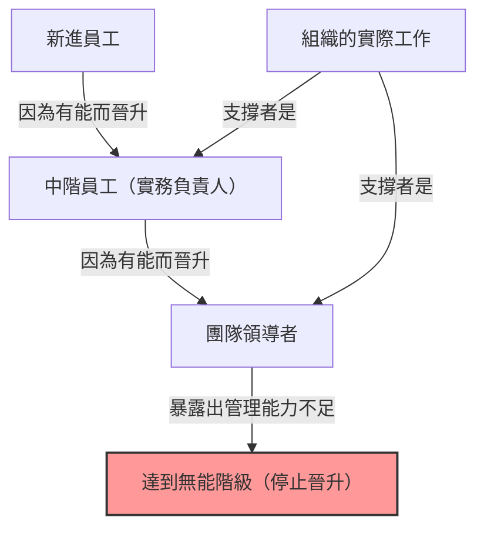
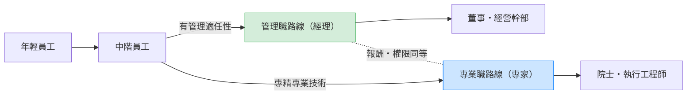

## 1. 前言：為何組織中充滿了「無能的主管」？

在公司工作時，你是否曾有過這樣的疑問：「為什麼那個工作能力那麼差的人能擔任管理職？」「為什麼原本很優秀的前輩，一當上經理就變得無能了？」

事實上，這並不是只有你的公司才有的特殊現象。這是在世界各地所有組織、企業、政府機關，甚至學校和非營利組織中都能看到的普遍現象。將這種現象完美地語言化並系統化的，就是「**彼得原理（The Peter Principle）**」。

本文將針對勞倫斯·彼得（Laurence J. Peter）博士所提出的這項原理，從其根本機制到個人及組織的對策，盡可能從各個角度進行徹底的深入探討。對於在組織這個「階層社會」中求生存的所有人來說，這是必讀的內容。

## 2. 什麼是彼得原理？（基本概念）

彼得原理是勞倫斯·彼得和雷蒙德·赫爾（Raymond Hull）在1969年合著的《彼得原理》中提出的一個關於階層社會學的原理。其核心主張如下：

> **「在階層社會中，每個員工都會晉升到他們不勝任的階級。」**

光看這句話可能有點難以理解，讓我們舉個具體的例子來說明。

有一位業務員（A先生）。他取得了非常優秀的銷售成績，並獲得了客戶的極大信任。公司肯定了A先生「身為業務員的能力」，並將他拔擢為業務經理。

然而，業務經理所需的能力不是「自己銷售商品的能力」，而是「培育下屬、帶領整個團隊達成目標的管理能力」。A先生雖然是一位出色的業務兼管理職（Playing Manager），但他並不擅長教導他人或管理團隊的積極性。

結果，A先生無法在業務經理的職位上拿出成果，被貼上了「無能」的標籤。既然無能，就無法再繼續升職（例如升為部長），只能一直停留在這個「無能的經理」的職位上。

這就是彼得原理的典型例子。也就是說，人們會因為「在目前的職位上表現勝任」而獲得晉升，但如果不具備晉升後職位所需的能力，在那裡就會變得「不勝任（無能）」，並停止晉升。

## 3. 彼得原理帶來的「組織悲劇」

彼得原理所暗示的最可怕後果，可以總結為以下這句話：

> **「最終，每一個職位都會由無法勝任其職責的無能員工所佔據。」**

如果組織內部的所有人都晉升到他們不勝任的階級，並停滯在那裡，會發生什麼事呢？從組織的高層到中階管理職，每一個職位都會被「不適合目前工作的人」所填滿。

### 組織為何還能運轉？
那麼，為什麼現實中的組織沒有完全崩潰，還能繼續運轉呢？根據彼得原理，那無非是因為**「工作是由那些尚未達到不勝任階級（即目前正在晉升途中）的員工所完成的」**。也就是說，組織底層和中層的「有能年輕人」或「有能的實務負責人」，彌補了高層的無能，支撐著整個組織的成果。

## 4. 為何彼得原理無法避免？（機制深究）

為什麼企業要反覆進行這種刻意讓有能之人變無能的人事安排呢？這是因為階層社會（Hierarchy）本身存在著結構性的缺陷。

### 4.1. 混淆「過去的成果」與「未來的適任性」
許多企業的評估制度是以「在目前職位上的成果」為標準。然而，隨著階層的提升，所需技能的性質會發生根本性的變化。
- **實務負責人（執行者）**: 專業技能、執行力、自我管理能力
- **中階管理職（經理）**: 溝通能力、協調力、人才培育能力
- **高階管理職（領導者）**: 戰略思考、願景建構、決策能力

身為執行者的有能，並不能保證身為經理的有能。然而，在現實的人事評估中，很難建立除了「讓銷售業績第一的人當經理」之外的評估方法，因此必然會產生錯位。

### 4.2. 報酬體系的侷限（升職＝成功的魔咒）
在現代的許多組織中，「提高薪水」和「獲得地位」的主要手段僅限於「晉升為管理職」。
即使是想追求專業極致的優秀工程師或業務員，為了獲得一定程度以上的薪資，也不得不成為經理。這就導致了無視本人適任性與意願的「被推向無能階級」現象。

### 4.3. 降職的困難與「平行調動」
在日本的組織文化中（歐美的許多企業也是如此），要將已經升職的人降職是非常困難的。因為這有傷害本人自尊心、大幅降低工作動力的風險。
因此，被發現「無能」的管理職，往往不會被降職，而是被平行調動到同一階層的閒職（即所謂的「窗邊族」或沒有實權的「特命負責部長」等）。彼得將此稱為「**平行調動（Arabesque）**」。

## 5. 針對彼得原理的突破性對策

只要階層社會存在，要完全打破彼得原理是極其困難的。但是，有策略可以將損害降到最低，並兼顧個人的幸福與組織的生產力。

### 5.1. 個人的對策：建議採用「創造性無能」
彼得本人所提出，個人保護自己的最大防禦策略就是「**創造性無能（Creative Incompetence）**」。
這是一種高級技巧，當你達到一個你認為「這是天職」、「不想再晉升了（不想超越自己能力極限）」的職位時，故意表現出「不致命，但足以讓人猶豫是否要讓你晉升的小缺點」。

例如，雖然實務工作做得完美無缺，但「辦公桌上總是亂七八糟」、「對於參加公司內部活動很消極」、「穿著有點隨便」等。這樣一來，高層就會判斷「雖然工作能力強，但要讓他當管理職還是有點不放心」，從而將你留在目前的（最能讓你發光發熱的）職位上。

### 5.2. 組織的對策：分離晉升與報酬（雙軌制）
組織方面能採取的的最有效對策是，**將「管理職路線」與「專業職（專家）路線」完全分離，並提供同等的報酬與評估**。（這被稱為雙軌制 / Dual Ladder System）。
這樣一來，優秀的程式設計師就不必為了薪水而勉強自己成為專案經理，可以繼續發揮他們的能力。

### 5.3. 試用晉升與「光榮撤退」的制度化
把晉升當作「不可逆轉的事物」才會引發悲劇。例如，可以設立3個月到半年左右的「經理試用期」，在這個期間結束時，由本人與公司協商，選擇「回到原本的職位」或「繼續擔任經理」。
這樣一來，即使發生「嘗試過後發現不適合」的情況，也有系統保證可以「光榮撤退」，從而防止停滯在無能階級。

## 6. 總結：應該在哪裡發揮自己的「能力」

彼得原理乍看之下是一個非常憤世嫉俗且令人絕望的法則。但如果反過來想，這也是一個教訓，告訴我們**「正確了解自己能力的極限與適任性，並找到最能讓自己發光發熱的地方的重要性」**。

與其搭上社會和公司所準備的「升職＝成功」的單一軌道，不如看清能將自己的「能力」發揮到最大的階級，並擁有留在那裡的勇氣（有時是扮演創造性無能的智慧）。這可以說是在現代複雜的階層社會中，沒有壓力且充實生存下去的最高策略。

（※撰寫本文的目的，是為了幫助大家深入了解「彼得原理」，並將其應用於未來的組織建設中。各位職場上的「無能主管」，過去或許也曾是閃耀著光芒的能幹執行者。這樣想的話，也許就能用稍微溫和一點的眼光來看待他們了……吧。）
