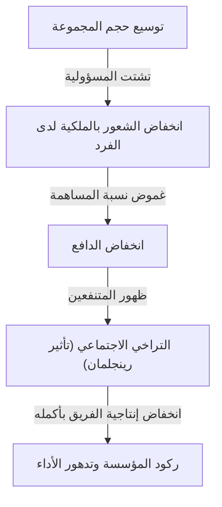
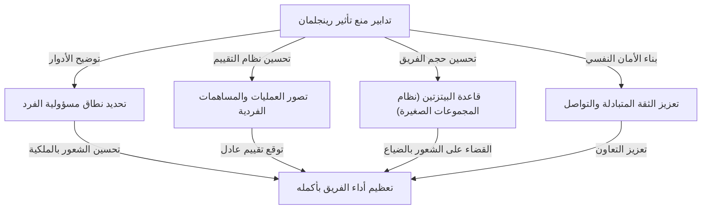

# ما هو تأثير رينجلمان (التراخي الاجتماعي)؟ الهوية الحقيقية للفخ الخفي الذي يقوض المؤسسات

في مكان العمل أو في الحياة اليومية، هل شعرت يوماً أنه "كلما زاد عدد الأشخاص، لسبب ما يبدو أن أداء كل فرد ينخفض"؟ الشخص الذي يكون ممتازاً ويتصرف بسرعة كبيرة عندما يعمل بمفرده، بمجرد أن يتم دمجه في فريق من 5 أو 10 أشخاص، يصبح معتمداً على الآخرين ولا يحقق نتائج بارزة. هذا لا يعني أبداً أن قدرات ذلك الشخص انخفضت بشكل حاد، أو أن شخصيته أصبحت كسولة فجأة.

لهذه الظاهرة اسم واضح في مجالات علم النفس والسلوك التنظيمي. وهو **"تأثير رينجلمان (Ringelmann Effect)"**، والمعروف أيضاً باسم **"التراخي الاجتماعي (Social Loafing)"**.

في هذا المقال، سنشرح بتفصيل كبير وبشكل عملي بدءاً من الخلفية التاريخية والآلية النفسية لسبب حدوث تأثير رينجلمان، إلى كيفية ظهوره في مؤسسات الأعمال الحديثة، وما هي التدابير المحددة التي ينبغي اتخاذها لتجنب هذا الفخ وتعظيم إنتاجية الفريق بالمعنى الحقيقي. من خلال هذا الدليل الشامل الذي يمتد لآلاف الكلمات، نأمل أن تجد تلميحات لكسر "عدم الكفاءة غير المرئي" الذي تواجهه مؤسستك أو فريقك.

---

## 1. الخلفية التاريخية: تجربة شد الحبل لماكسيميليان رينجلمان

يعود اكتشاف تأثير رينجلمان إلى أكثر من 100 عام، وتحديداً في عام 1913. لاحظ المهندس الزراعي الفرنسي ماكسيميليان رينجلمان (Maximilien Ringelmann) ظاهرة مثيرة للاهتمام للغاية أثناء بحثه في كفاءة عمل العمال في الزراعة. لقد أجرى تجربة باستخدام "شد الحبل" لقياس كيف يتغير مقدار عمل الفرد عندما يعمل الناس في مجموعات.

### نظرة عامة على التجربة والنتائج المذهلة
قواعد التجربة بسيطة للغاية. تم جعل المشاركين يسحبون حبلاً، وتم قياس قوة السحب الخاصة بهم بواسطة أداة قياس. أولاً، حدد متوسط قوة السحب عند سحب شخص واحد بنسبة "100٪ (حوالي 63 كجم)". من الناحية المنطقية، إذا سحب شخصان، يجب أن يتم إنتاج 200٪، وإذا سحب 3 أشخاص، 300٪، وإذا سحب 8 أشخاص، 800٪ من القوة.

ومع ذلك، خيبت النتائج التوقعات بشكل كبير.
- **شخص واحد**: 100٪ (يُظهر القوة الأصلية)
- **شخصان**: حوالي 93٪ (تنخفض القوة لكل شخص قليلاً)
- **3 أشخاص**: حوالي 85٪
- **4 أشخاص**: حوالي 77٪
- **8 أشخاص**: حوالي 49٪ (لكل شخص، يبذل نصف القوة الأصلية فقط)

الحقيقة التي أظهرتها هذه النتيجة كانت واضحة بشكل قاسٍ. وهي **"كلما زاد عدد الأشخاص في المجموعة، انخفضت القوة التي يبذلها كل فرد بشكل عكسي"**. عندما يسحب 8 أشخاص الحبل، لم يكن لديهم أي نية خبيثة لـ "التراخي". ومع ذلك، عملت نفسية "حتى لو لم أبذل قصارى جهدي، سيقوم شخص آخر بذلك" بشكل غير واعٍ، ونتيجة لذلك انخفض أداء الفرد إلى النصف.

تم إعادة اختبار هذا الاكتشاف الرائد لاحقاً من قبل العديد من علماء النفس وعلماء السلوك التنظيمي، وثبت أن "التراخي" المماثل يحدث في جميع الأنشطة الجماعية البشرية، ليس فقط في العمل البدني، ولكن أيضاً في العمل الفكري مثل العصف الذهني، والتحدث في الاجتماعات، وحتى مساعدة الآخرين في حالات الطوارئ (تأثير المتفرج).

---

## 2. الآلية النفسية التي تسبب تأثير رينجلمان

إذن، لماذا يتراخى الناس دون وعي عندما يكونون في مجموعة؟ وتتشابك غريزة الدفاع البشري والتحيزات المعرفية الاجتماعية بشكل معقد في خلفية ذلك. يمكن تقسيم العوامل الرئيسية التي تسبب تأثير رينجلمان إلى الأربعة التالية.

### ① تشتت المسؤولية (Diffusion of Responsibility)
العامل الأكبر هو "تشتت المسؤولية". عندما تكون مسؤولاً عن مهمة بمفردك، فإن نجاحها أو فشلها يعتمد عليك بنسبة 100٪. إذا نجحت فسيكون ذلك فضلك، وإذا فشلت فستكون مسؤوليتك. ومع ذلك، عند مشاركة مهمة مع عدة أشخاص، ينشأ شعور بالراحة النفسية مفاده أنه "حتى لو لم أفعل ذلك، سيقوم شخص آخر بفعله" و "حتى لو فشلنا، ستكون مسؤوليتي جزءاً بسيطاً فقط". هذا يقلل من الشعور بالملكية.

### ② غموض التقييم (Lack of Identifiability)
في العمل الجماعي، عندما لا يمكن قياس مساهمة الفرد بوضوح، يميل الناس إلى إهمال الجهد. في الحالات التي لا يمكن فيها رؤية "من يسحب وبأي قوة" بشكل فردي، كما في تجربة شد الحبل السابقة، تعمل نفسية (الشعور بالعجز أو عدم الجدوى) القائلة: "إذا لم يتم تقييمي حتى لو بذلت قصارى جهدي، فإن القيام بذلك بشكل عشوائي هو نفس الشيء".

### ③ ضغط الأقران و "الركوب المجاني (المستغلين)"
في فريق يضم عدداً من الأعضاء المتميزين، يظهر أعضاء يتعلمون أنه "إذا تركنا الأمر لهم، فسيستمر العمل". تُعرف هذه الظاهرة باسم "الركوب المجاني (المستغلين)". وما يثير الرعب أكثر هو أن الأعضاء الذين يعملون بجد يبدأون أيضاً في التراخي، حيث يشعرون أنه "من الغباء أن أبذل قصارى جهدي بمفردي بينما هو يتكاسل". يُطلق على هذا اسم **تأثير المغفل (Sucker Effect: تأثير الظهور بمظهر الغبي)**.

### ④ غموض الغرض والأهداف
عندما يكون الاتجاه الذي يتجه إليه الفريق أو القيمة التي سيجلبها العمل إلى المؤسسة بأكملها (أهمية المهمة) غامضاً، فإن دافع الفرد ينخفض بشكل كبير. يتم تعظيم التراخي عندما يُطلب من مجموعة كبيرة مشاركة "عمل لا يعرفون سبب قيامهم به".

---

## 3. تهديد تأثير رينجلمان في الأعمال الحديثة

يحدث تأثير رينجلمان يومياً في مشهد الأعمال الحديث، ويقوض إنتاجية المؤسسات بهدوء ولكن بثبات. دعونا نرى بالتحديد في أي المواقف يكمن هذا الفخ.

### الاجتماعات المتضخمة و "المشاركون الصامتون"
الاجتماعات التي تضم 10 أشخاص أو أكثر والتي تم إعدادها بفكرة "دعنا ندعو جميع الأطراف المعنية فقط في حالة"، هي مرتع لتأثير رينجلمان. كلما زاد عدد المشاركين، كلما اعتقدوا أنه "حتى لو لم أتحدث، سيقدم شخص ما رأياً"، ويصبح معظم المشاركين متفرجين. ونتيجة لذلك، فإن بعض المديرين والموظفين ذوي الأصوات العالية هم فقط من يتحدثون، ويضيع الغرض الأصلي للاجتماع المتمثل في جمع آراء متنوعة.

### غياب المسؤولين عن المشروع
في المشاريع الكبيرة، قد يتم رفع شعار "دع الجميع يتقدمون بقيادة". ومع ذلك، فهذه علامة خطيرة. إذا لم يتم تخصيص الأدوار والمسؤوليات للأفراد بشكل واضح، فستقع في حالة "مسؤولية الجميع هي مسؤولية لا أحد". يتكرر حدوث مشاكل مثل تبادل المهام وإلقاء اللوم، أو اكتشاف أنه "لم يقم أحد بذلك" قبل الموعد النهائي مباشرة.

### إساءة استخدام البريد الإلكتروني بنسخة كربونية (CC)
"رسائل البريد الإلكتروني بنسخة كربونية (CC)" الموجهة لعشرات الأشخاص بغرض مشاركة المعلومات. هذا أيضاً يحفز التراخي الاجتماعي. يفترض الناس أنه "بما أن هذا العدد الكبير من الأشخاص يراقبون، فسيقوم شخص ما بالرد أو التعامل معه"، ونتيجة لذلك، ينتهي الأمر بتجاهل الجميع له.

---

## 4. تدابير دفاعية محددة لكسر تأثير رينجلمان

قد يكون القضاء التام على تأثير رينجلمان من المؤسسة مستحيلاً بسبب البنية النفسية البشرية. ومع ذلك، من خلال الإدارة المناسبة وتصميم الفريق، من الممكن تماماً تقليل تأثيره إلى الحد الأدنى وإبراز أداء الفرد. هنا، سوف نشرح التدابير المحددة.

### ① تحسين حجم الفريق (اعتماد قاعدة البيتزتين)
تُعد "قاعدة البيتزتين (Two-Pizza Rule)" التي اقترحها مؤسس أمازون، جيف بيزوس، من أشهر الأساليب لمنع تأثير رينجلمان. هذه قاعدة تجريبية تنص على أنه "يجب أن يكون حجم الفريق حوالي عدد الأشخاص الذين يمكن إطعامهم ببيتزتين (حوالي 5 إلى 8 أشخاص)". إذا كان الفريق أكبر من هذا الحجم، فإن تقسيمه إلى فرق فرعية يمكن أن يمنع شعور الفرد بـ "الضياع" ويعزز أهمية وجود كل شخص.

### ② توضيح الأدوار والمسؤوليات الفردية (KPI)
قبل بدء المشروع، يجب تحديد وتوثيق من سيحقق ماذا، ومتى، وبأي مستوى بوضوح. من المهم غرس شعور بالملكية مفاده "أنت مسؤول عن كذا وكذا"، بدلاً من "دعنا جميعاً نبذل قصارى جهدنا". من الفعال استخدام مصفوفة RACI (مصفوفة تحدد من هو المسؤول، والمساءل، والمستشار، والمُبلغ).

### ③ تصور العملية ودرجة المساهمة
نحن بحاجة إلى آلية لتصور ليس فقط النتائج، ولكن أيضاً العملية المؤدية إليها وجهود الفرد. من خلال تقديم أدوات إدارة المهام (مثل Jira و Trello و Asana) ومشاركة من أكمل أي مهمة مع الفريق بأكمله، فإننا نبني بيئة تلبي الضغط الصحي و "الحاجة إلى التقدير" بأننا "مراقبون" و "مقَيَّمون".

### ④ التحفيز الداخلي ومشاركة الأهداف
قم بتوصيل الرؤية والغرض بشكل متكرر حتى يتمكن الأعضاء من إيجاد معنى لمهامهم. الأعضاء الذين يفهمون "لماذا هذه الوظيفة ضرورية" و "كيف يساعد هذا العملاء والمجتمع" سيتصرفون بشكل مستقل دون التراخي، حتى في مجموعة.

### ⑤ ضمان الأمان النفسي
اخلق بيئة يمكن فيها للأعضاء الذين يقولون، "أنا لا أتراخى، ولكني عالق لأنني لا أعرف كيف أفعل ذلك"، أن يطلبوا المساعدة على الفور. في الفرق التي تتمتع بدرجة عالية من الأمان النفسي (Psychological Safety) حيث يتم التسامح مع الفشل ويدعم الأعضاء بعضهم البعض بشكل متبادل، فمن غير المرجح أن يحدث تأثير المغفل (ظاهرة التراخي عندما ترى شخصاً آخر يتراخى).

---

## 5. الخلاصة: بناء مؤسسة تعظم قوة الفرد

إن تأثير رينجلمان (التراخي الاجتماعي) لا يأتي من كسل الإنسان، بل هو رد فعل نفسي طبيعي تسببه بيئة المجموعة. لذلك، لا يسعنا إلا أن نقول إن محاولة حله بنظريات روحية مثل "كن أكثر تحفيزاً" و "امتلك شعوراً بالملكية" هو إهمال إداري.

تبني المؤسسات والقادة البارزون حقاً نظاماً يوفر **"بيئة يرغب فيها الجميع في بذل قصارى جهدهم، أو يضطرون فيها لبذل قصارى جهدهم"**، على افتراض أن البشر مخلوقات تميل إلى التراخي. الحفاظ على عدد صغير من أعضاء الفريق، وتوضيح الأدوار، وتقييم المساهمات بشكل عادل. إن التنفيذ الشامل لهذه الأساسيات هو السبيل الوحيد لإنقاذ المؤسسة من الفخ الخفي لتأثير رينجلمان وتحقيق أداء ساحق.

في فريقك أيضاً، لماذا لا تبدأ من اليوم بأفكار صغيرة مثل "تقليص عدد الأشخاص في الاجتماع" أو "تحديد شخص واحد كمسؤول عن مهمة"؟ يجب أن تكون هذه الخطوة الصغيرة هي الحافز لتغيير إنتاجية المؤسسة بأكملها بشكل كبير.
