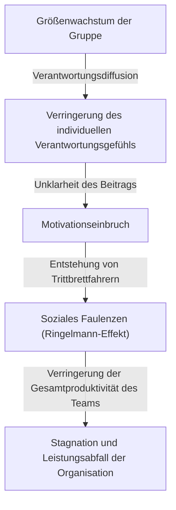
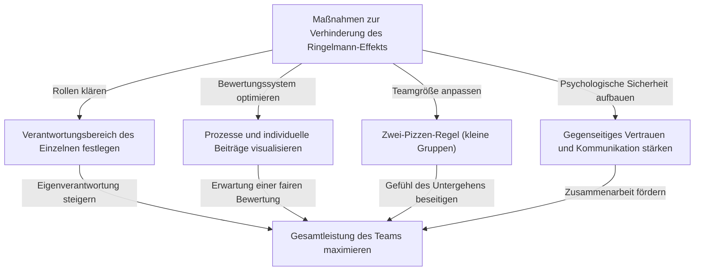

# Was ist der Ringelmann-Effekt (soziales Faulenzen)? Die wahre Natur der unsichtbaren Falle, die Organisationen zermürbt

Haben Sie im Geschäftsalltag oder im täglichen Leben jemals das Gefühl gehabt: "Je mehr Leute es werden, desto mehr scheint die Leistung jedes Einzelnen aus irgendeinem Grund zu sinken"? Eine Person, die sehr kompetent ist und schnell handelt, wenn sie alleine arbeitet, verlässt sich plötzlich auf andere und erzielt keine nennenswerten Ergebnisse mehr, sobald sie in ein Team von 5 oder 10 Personen integriert wird. Das bedeutet keineswegs, dass die Fähigkeiten dieser Person plötzlich gesunken sind oder dass ihr Charakter plötzlich faul geworden ist.

Für dieses Phänomen gibt es in den Bereichen Psychologie und Organisationsverhalten einen eindeutigen Namen. Es ist der **"Ringelmann-Effekt"**, auch bekannt als **"soziales Faulenzen (Social Loafing)"**.

In diesem Artikel werden wir äußerst detailliert und praxisnah erklären, warum dieser Ringelmann-Effekt auftritt, von den historischen Hintergründen und psychologischen Mechanismen bis hin dazu, wie er in modernen Unternehmensorganisationen in Erscheinung tritt. Außerdem zeigen wir, welche konkreten Maßnahmen ergriffen werden sollten, um diese Falle zu vermeiden und die Teamproduktivität im wahrsten Sinne des Wortes zu maximieren. Finden Sie in diesem umfassenden, tausende von Wörtern langen Leitfaden Hinweise, wie Sie die "unsichtbare Ineffizienz", unter der Ihre Organisation oder Ihr Team leidet, durchbrechen können.

---

## 1. Historischer Hintergrund: Maximilien Ringelmanns Tauziehen-Experiment

Die Entdeckung des Ringelmann-Effekts geht auf das Jahr 1913 zurück, vor über 100 Jahren. Der französische Agrarwissenschaftler Maximilien Ringelmann bemerkte im Zuge seiner Forschungen zur Arbeitseffizienz von Landarbeitern ein sehr interessantes Phänomen. Er führte ein Experiment mit "Tauziehen" durch, um zu messen, wie sich das Arbeitspensum des Einzelnen verändert, wenn Menschen in einer Gruppe arbeiten.

### Überblick über das Experiment und überraschende Ergebnisse
Die Regeln des Experiments waren extrem einfach. Die Probanden sollten an einem Seil ziehen, und ihre Zugkraft wurde mit einem Messgerät gemessen. Zunächst wurde die durchschnittliche Zugkraft beim Ziehen durch eine Person als "100% (ca. 63 kg)" definiert. Logisch betrachtet sollte die Kraft bei zwei Personen 200%, bei drei Personen 300% und bei acht Personen 800% betragen.

Die Ergebnisse enttäuschten diese Erwartungen jedoch massiv.
- **Bei 1 Person**: 100% (zeigt die volle Kraft)
- **Bei 2 Personen**: ca. 93% (Kraft pro Person sinkt leicht)
- **Bei 3 Personen**: ca. 85%
- **Bei 4 Personen**: ca. 77%
- **Bei 8 Personen**: ca. 49% (pro Person wird nur die Hälfte der eigentlichen Kraft aufgewendet)

Die Tatsache, die durch diese Ergebnisse aufgezeigt wird, war grausam eindeutig. Es bedeutet: **"Je größer die Anzahl der Personen in der Gruppe, desto mehr sinkt die von jedem Einzelnen ausgeübte Kraft umgekehrt proportional."** Wenn acht Leute an einem Seil zogen, taten sie das keineswegs mit der böswilligen Absicht zu "faulenzen". Jedoch wirkte unbewusst die Psychologie "Selbst wenn ich nicht mein Bestes gebe, wird es schon jemand anderes tun", was letztendlich dazu führte, dass sich die individuelle Leistung halbierte.

Diese bahnbrechende Entdeckung wurde später von vielen Psychologen und Verhaltensforschern reproduziert und es wurde bewiesen, dass ein ähnliches "Faulenzen" nicht nur bei körperlicher Arbeit, sondern bei allen menschlichen Gruppenaktivitäten auftritt, wie z. B. bei intellektuellen Arbeiten wie Brainstorming, Wortmeldungen in Meetings und sogar bei der Hilfe für Menschen in Notfällen (Bystander-Effekt).

---

## 2. Der psychologische Mechanismus hinter dem Ringelmann-Effekt

Warum also faulenzen Menschen unbewusst, wenn sie in einer Gruppe sind? Im Hintergrund sind menschliche Verteidigungsinstinkte und soziale kognitive Verzerrungen komplex miteinander verflochten. Die Hauptfaktoren, die den Ringelmann-Effekt auslösen, lassen sich grob in die folgenden vier Kategorien einteilen.

### ① Verantwortungsdiffusion (Diffusion of Responsibility)
Der größte Faktor ist die "Verantwortungsdiffusion". Wenn Sie allein für eine Aufgabe verantwortlich sind, hängt der Erfolg oder Misserfolg zu 100 % von Ihnen ab. Wenn Sie erfolgreich sind, ist es Ihr Verdienst, und wenn Sie versagen, ist es Ihre Schuld. Wenn Sie die Aufgabe jedoch mit mehreren Personen teilen, entsteht ein psychologisches Gefühl der Sicherheit: "Selbst wenn ich es nicht tue, wird es jemand anderes tun" und "Selbst wenn wir scheitern, trage ich nur einen Bruchteil der Verantwortung". Dies verringert das Gefühl der Eigenverantwortung.

### ② Unklarheit der Bewertung (Lack of Identifiability)
Bei Gruppenarbeiten neigen Menschen dazu, ihre Anstrengungen zu vernachlässigen, wenn ihr individueller Beitrag nicht klar gemessen werden kann. In Situationen, in denen es nicht individuell ersichtlich ist, "wer wie stark zieht", wie in dem vorangegangenen Tauziehen-Experiment, wirkt die Psychologie (Gefühl der Machtlosigkeit und Sinnlosigkeit): "Wenn mein voller Einsatz nicht geschätzt wird, macht es keinen Unterschied, wenn ich es nur halbherzig tue."

### ③ Gruppenzwang und "Trittbrettfahrer (Free Rider)"
In Teams mit einigen wenigen hervorragenden Mitgliedern gibt es Mitglieder, die lernen: "Wenn wir es ihnen überlassen, wird die Arbeit schon erledigt." Dies ist ein Phänomen, das als "Trittbrettfahrer" (Free Rider) bekannt ist. Noch erschreckender ist es, dass auch hart arbeitende Mitglieder anfangen zu faulenzen, weil sie das Gefühl haben: "Es ist lächerlich für mich, mein Bestes zu geben, wenn dieser Typ faulenzt." Dies wird als **Sucker-Effekt (Der Dumme sein-Effekt)** bezeichnet.

### ④ Unklarheit von Zweck und Zielen
Wenn die Richtung, in die sich das Team bewegt, oder der Wert, den die Arbeit für die gesamte Organisation bringt (die Sinnhaftigkeit der Aufgabe), unklar ist, sinkt die Motivation des Einzelnen erheblich. Das Faulenzen wird maximiert, wenn eine "Aufgabe, von der man nicht weiß, wozu sie dient", von einer großen Anzahl von Menschen geteilt wird.

---

## 3. Die Bedrohung durch den Ringelmann-Effekt im modernen Geschäftsleben

Der Ringelmann-Effekt tritt im heutigen Geschäftsalltag täglich auf und zehrt still, aber sicher an der Produktivität von Organisationen. Lassen Sie uns sehen, in welchen konkreten Situationen diese Falle lauert.

### Aufgeblähte Meetings und "schweigende Teilnehmer"
Ein Meeting mit mehr als 10 Personen, das aus dem Gedanken heraus angesetzt wurde: "Lassen Sie uns sicherheitshalber alle Beteiligten einladen", ist eine Brutstätte für den Ringelmann-Effekt. Je mehr Teilnehmer es gibt, desto mehr Leute denken: "Jemand wird schon seine Meinung äußern, auch wenn ich nichts sage", und die meisten Teilnehmer werden zu Zuschauern. Infolgedessen sprechen nur einige Manager und lautstarke Mitarbeiter, und der eigentliche Zweck des Meetings, nämlich vielfältige Meinungen zu sammeln, geht verloren.

### Fehlender Projektverantwortlicher
Bei Großprojekten wird manchmal das Motto ausgegeben: "Lassen Sie uns das alle mit Führungsstärke vorantreiben". Dies ist jedoch ein gefährliches Zeichen. Wenn Rollen und Verantwortlichkeiten nicht klar den Einzelnen zugewiesen werden, gerät man in eine Situation, in der "die Verantwortung aller niemandes Verantwortung ist". Es kommt häufig zu Problemen, bei denen Aufgaben hin und her geschoben werden und kurz vor Ablauf der Frist festgestellt wird, dass "niemand sie erledigt hat".

### Missbrauch von CC-E-Mails
Eine "CC-E-Mail" mit Dutzenden von Empfängern zum Zweck des Informationsaustauschs. Auch dies führt zu sozialem Faulenzen. Die Leute gehen davon aus: "Da so viele Leute zuschauen, wird schon jemand reagieren oder antworten", was dazu führt, dass letztendlich alle sie ignorieren.

---

## 4. Konkrete Abwehrmaßnahmen, um den Ringelmann-Effekt zu durchbrechen

Aufgrund der menschlichen psychologischen Struktur ist es vielleicht unmöglich, den Ringelmann-Effekt vollständig aus Organisationen zu eliminieren. Durch angemessenes Management und Teamdesign ist es jedoch durchaus möglich, seine Auswirkungen zu minimieren und die individuelle Leistung zu fördern. Hier erklären wir konkrete Maßnahmen.

### ① Anpassung der Teamgröße (Einführung der Zwei-Pizzen-Regel)
Die von Amazon-Gründer Jeff Bezos vorgeschlagene "Zwei-Pizzen-Regel (Two-Pizza Rule)" ist eine der berühmtesten Methoden zur Verhinderung des Ringelmann-Effekts. Es handelt sich um eine Faustregel, die besagt: "Die Anzahl der Teammitglieder sollte so groß sein, dass man genau satt wird, wenn man sich zwei Pizzen teilt (etwa 5 bis 8 Personen)". Wenn ein Team größer wird, kann die Aufteilung in Unterteams das Gefühl des Einzelnen verhindern, "unterzugehen", und das Gefühl für den eigenen Wert stärken.

### ② Klärung der individuellen Rollen und Verantwortlichkeiten (KPIs)
Bevor ein Projekt gestartet wird, sollte klar definiert und dokumentiert werden, wer was bis wann und auf welchem Niveau erreichen wird. Es ist wichtig, ein Gefühl der Eigenverantwortung zu schaffen, nicht durch "Wir werden alle unser Bestes geben", sondern durch "Sie sind verantwortlich für 〇〇". Die Verwendung eines RACI-Diagramms (eine Matrix aus Durchführungsverantwortung, Rechenschaftspflicht, Konsultation und Information) ist hierbei effektiv.

### ③ Visualisierung von Prozessen und Beiträgen
Es ist ein System erforderlich, das nicht nur die Ergebnisse, sondern auch die Prozesse, die dorthin führen, sowie die individuellen Bemühungen visualisiert. Durch die Einführung von Aufgabenmanagement-Tools (Jira, Trello, Asana usw.) und das Teilen im gesamten Team, wer welche Aufgaben erledigt hat, entsteht eine Umgebung, die durch gesunden Druck ("man wird gesehen", "man wird bewertet") das Bedürfnis nach Anerkennung befriedigt.

### ④ Intrinsische Motivation und gemeinsame Ziele
Vermitteln Sie wiederholt die Vision und den Zweck, damit die Mitglieder einen Sinn in ihren Aufgaben sehen können. Mitglieder, die verstehen, "warum diese Arbeit notwendig ist" und "wie dies Kunden oder der Gesellschaft hilft", werden auch in einer Gruppe nicht faulenzen und autonom handeln.

### ⑤ Gewährleistung psychologischer Sicherheit
Schaffen Sie eine Umgebung, in der ein Mitglied, das "nicht faulenzt, aber feststeckt, weil es nicht weiß, wie es weitergehen soll", sofort um Hilfe bitten kann. In einem Team mit hoher psychologischer Sicherheit (Psychological Safety), in dem Fehler toleriert werden und man sich gegenseitig unterstützt, tritt der Sucker-Effekt (das Phänomen, dass man selbst faulenzt, wenn man andere faulenzen sieht) weniger wahrscheinlich auf.

---

## 5. Fazit: Schaffung einer Organisation, die die Kraft des Einzelnen maximiert

Der Ringelmann-Effekt (soziales Faulenzen) resultiert nicht aus menschlicher Faulheit, sondern ist eine natürliche psychologische Reaktion, die durch die Gruppenumgebung ausgelöst wird. Daher muss gesagt werden, dass der Versuch, dieses Problem mit Appellen an den Geist wie "Zeig mehr Motivation" oder "Habe mehr Verantwortungsbewusstsein" zu lösen, ein Versagen des Managements darstellt.

Wirklich herausragende Organisationen und Führungskräfte gehen davon aus, dass Menschen Lebewesen sind, die manchmal faulenzen, und bauen systematisch eine **"Umgebung auf, in der jeder sein Bestes geben möchte oder muss"**. Halten Sie Teams klein, klären Sie Rollen und bewerten Sie Beiträge angemessen. Nur wenn diese Grundlagen strikt befolgt werden, können Organisationen aus der unsichtbaren Falle des Ringelmann-Effekts gerettet werden und eine überwältigende Leistung erbringen.

Warum beginnen Sie nicht noch heute in Ihrem Team mit kleinen Anpassungen wie "die Anzahl der Personen in Meetings reduzieren" oder "einen einzigen Verantwortlichen für eine Aufgabe benennen"? Dieser kleine Schritt wird sicherlich der Auslöser sein, um die Produktivität der gesamten Organisation dramatisch zu verändern.
