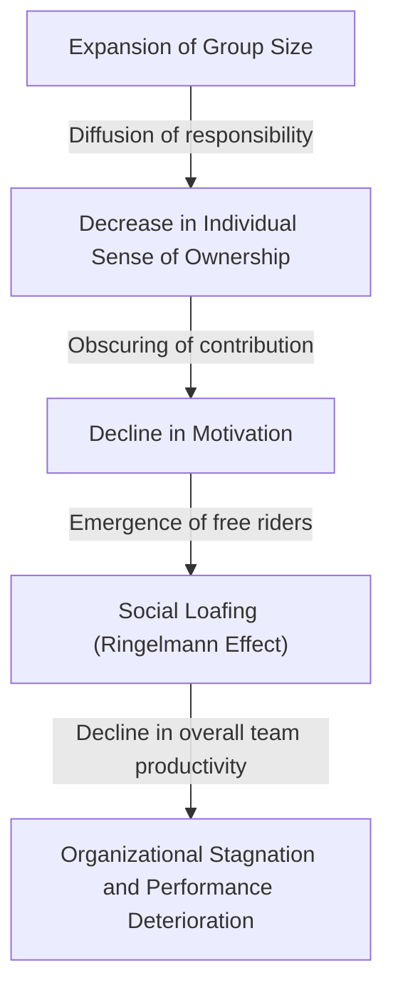
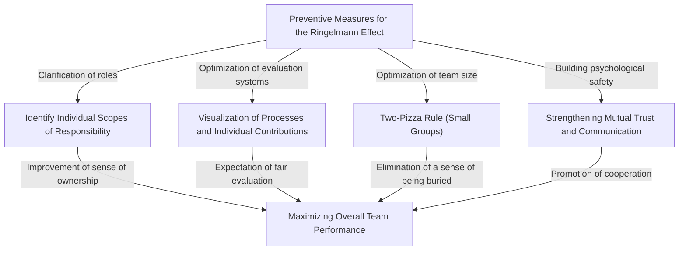

# What is the Ringelmann Effect (Social Loafing)? The Identity of the Invisible Trap Undermining Organizations

In the business field or in everyday life, have you ever felt that "the more people there are, the more individual performance seems to drop for some reason"? A person who is highly capable and acts swiftly when working alone suddenly becomes somewhat reliant on others and stops producing outstanding results the moment they are integrated into a team of 5 or 10. This is absolutely not because their abilities have precipitously declined or their personality has suddenly become lazy.

This phenomenon has a clear name in the fields of psychology and organizational behavior. It is the **"Ringelmann Effect"**, also known as **"Social Loafing"**.

In this article, we will provide an extremely detailed and practical explanation covering the historical background and psychological mechanisms of why the Ringelmann Effect occurs, how it manifests in modern business organizations, and what specific countermeasures should be taken to avoid this trap and truly maximize team productivity. Through this comprehensive guide spanning thousands of words, we hope you find hints to shatter the "invisible inefficiencies" that your organization and teams are facing.

---

## 1. Historical Background: Maximilien Ringelmann's Tug-of-War Experiment

The discovery of the Ringelmann Effect dates back more than 100 years to 1913. Maximilien Ringelmann, a French agricultural engineer, noticed a highly intriguing phenomenon while researching the work efficiency of laborers in agriculture. To measure how individual workloads change when people work in groups, he conducted an experiment using a "tug-of-war".

### Outline of the Experiment and Surprising Results
The rules of the experiment were extremely simple. Subjects were asked to pull a rope, and their pulling force was measured with a measuring device. First, the average pulling force when pulled by one person is defined as "100% (about 63kg)". Logically speaking, if two people pull, 200% of the force should be exerted; if three people pull, 300%; and if eight people pull, 800%.

However, the results greatly betrayed expectations.
- **1 person**: 100% (Exerting original force)
- **2 people**: Approx. 93% (Force per person slightly decreased)
- **3 people**: Approx. 85%
- **4 people**: Approx. 77%
- **8 people**: Approx. 49% (Per person, only half of their original force was exerted)

The fact indicated by these results was brutally clear. **"As the size of the group increases, the force exerted by each individual decreases inversely proportionally."** When eight people were pulling the rope together, they did not harbor any malicious intent to "slack off". However, unconsciously, the psychology of "even if I don't give it my all, someone else will do it" kicked in, resulting in individual performance being halved.

This groundbreaking discovery was later re-tested by many psychologists and organizational behaviorists, proving that similar "loafing" occurs in all human group activities, not just in physical labor, but also in intellectual tasks like brainstorming, speaking up in meetings, and even helping others in emergencies (the bystander effect).

---

## 2. Psychological Mechanisms Behind the Ringelmann Effect

So, why do people unconsciously slack off when they are in groups? In the background, human defense instincts and social cognitive biases are complexly intertwined. The main factors causing the Ringelmann Effect are broadly divided into the following four.

### ① Diffusion of Responsibility
The most significant factor is the "diffusion of responsibility". When handling a task alone, its success or failure rests 100% on you. If you succeed, you get the credit, and if you fail, you bear the blame. However, when a task is shared among multiple people, a psychological sense of security is born, thinking, "Even if I don't do it, someone else will," or "Even if we fail, my responsibility is only a fraction." This lowers the sense of ownership.

### ② Lack of Identifiability (Opacity of Evaluation)
In group work, when individual contributions cannot be clearly measured, people tend to neglect their efforts. In situations where it is not individually visible "who is pulling how hard," like in the tug-of-war experiment earlier, a psychology of "if giving my all isn't evaluated, I might as well slack off" (a sense of powerlessness or futility) comes into play.

### ③ Peer Pressure and the "Free Rider"
In a team with a few capable members, some members appear who learn that "if we leave it to them, the work will get done." This is a phenomenon called the "free rider." What is even more terrifying is that members who are working hard will also start to slack off, feeling that "it's foolish to give it my all when that guy is slacking off." This is called the **Sucker Effect**.

### ④ Ambiguity of Purpose and Goals
When the direction the team is heading or what value the work brings to the entire organization (task significance) is vague, individual motivation significantly drops. When a large number of people are assigned to share "a task whose purpose is unknown," loafing is maximized.

---

## 3. The Threat of the Ringelmann Effect in Modern Business

The Ringelmann Effect occurs daily in the modern business scene, quietly but surely chipping away at organizational productivity. Let's take a look at specifically what situations this trap lurks in.

### Bloated Meetings and "Silent Participants"
Meetings with more than 10 people scheduled with the idea of "let's invite all relevant parties just in case" are a hotbed for the Ringelmann Effect. The more participants there are, the more people think, "Even if I don't speak, someone else will voice an opinion," turning the majority of participants into bystanders. As a result, only a few managers or outspoken employees speak up, and the original purpose of the meeting, which is to gather diverse opinions, is lost.

### Absence of Project Leaders
In large-scale projects, the slogan "Let's all lead and push forward" is sometimes raised. However, this is a dangerous sign. When roles and responsibilities are not clearly assigned to individuals, it falls into a state where "everyone's responsibility is no one's responsibility." Pushing tasks onto each other and troubles where "no one was doing it" right before the deadline occur frequently.

### Abuse of CC Emails
"CC emails" with dozens of people in the address field for information sharing. This also induces social loafing. The situation arises where everyone ends up ignoring it, assuming that "since this many people are looking at it, someone will handle/reply to it."

---

## 4. Specific Defensive Measures to Break the Ringelmann Effect

It may be impossible due to human psychological structure to completely eliminate the Ringelmann Effect from an organization. However, with appropriate management and team design, it is entirely possible to minimize its impact and bring out individual performance. Here, we will explain specific countermeasures.

### ① Optimization of Team Size (Introduction of the Two-Pizza Rule)
The "Two-Pizza Rule" advocated by Amazon founder Jeff Bezos is one of the most famous methods to prevent the Ringelmann Effect. This is a rule of thumb stating that "a team should only be as large as can be fed comfortably with two pizzas (about 5 to 8 people)." If a team exceeds this size, dividing it into sub-teams can prevent individuals from feeling "buried" and increase the significance of each person's existence.

### ② Clarification of Individual Roles and Responsibilities (KPIs)
Before starting a project, clearly define and document who will achieve what, by when, and to what level. It is important to instill a sense of ownership, stating "You are the person responsible for XYZ," rather than "Let's all do our best." Utilizing a RACI chart (a matrix of Responsible, Accountable, Consulted, and Informed) is effective.

### ③ Visualization of Processes and Contributions
There needs to be a system to visualize not only the results but also the processes leading up to them and individual efforts. By introducing task management tools (Jira, Trello, Asana, etc.) and sharing who completed which tasks with the entire team, you can build an environment that satisfies the need for approval and provides a healthy pressure of "being seen" and "being evaluated."

### ④ Intrinsic Motivation and Shared Goals
Repeatedly communicate the vision and purpose so that members can find meaning in their tasks. Members who understand "why this work is necessary" and "how this helps customers and society" will move autonomously without slacking off, even when in a group.

### ⑤ Ensuring Psychological Safety
Create an environment where members who say "I'm not slacking off, but I'm stuck because I don't know how to do it" can immediately ask for help. In a team with high psychological safety where mistakes are tolerated and mutual support is provided, the Sucker Effect (the phenomenon of slacking off when seeing others do so) is less likely to occur.

---

## 5. Conclusion: Building an Organization That Maximizes Individual Power

The Ringelmann Effect (Social Loafing) does not come from human laziness, but is a natural psychological reaction caused by the environment of a group. Therefore, trying to solve it through spiritual theories like "be more motivated" or "have a sense of ownership" is nothing but management negligence.

Truly excellent organizations and leaders construct a system that provides **"an environment where everyone wants to give their all, or has no choice but to give their all,"** premised on the fact that humans are creatures prone to slacking off. Keep teams small, clarify roles, and evaluate contributions fairly. Thoroughly executing these basics is the only way to rescue the organization from the invisible trap of the Ringelmann Effect and produce overwhelming performance.

Why not start today in your team with small tweaks such as "limiting the number of people in meetings" or "assigning a specific person to a task"? That small step should be the catalyst that dramatically changes the productivity of the entire organization.
