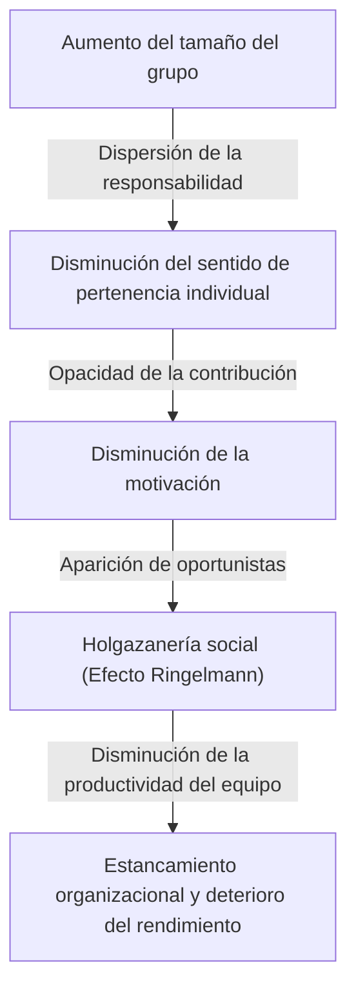
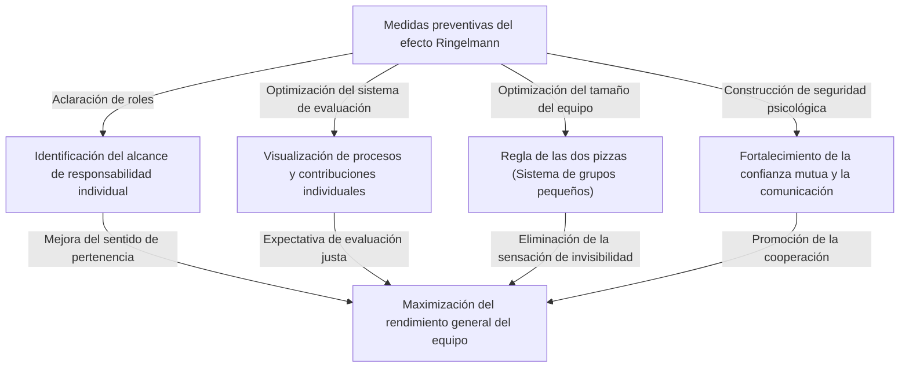

# ¿Qué es el efecto Ringelmann (holgazanería social)? La verdadera identidad de la trampa invisible que corroe a las organizaciones

¿Alguna vez has sentido en el entorno empresarial o en la vida diaria que "cuanto mayor es el número de personas, el rendimiento de cada individuo parece disminuir"? Una persona que es extremadamente capaz y actúa rápidamente cuando trabaja sola, de repente se vuelve dependiente de los demás y deja de producir resultados notables en cuanto se integra en un equipo de 5 o 10 personas. Esto no significa de ninguna manera que la capacidad de esa persona haya disminuido drásticamente, ni que su personalidad se haya vuelto perezosa de repente.

Este fenómeno tiene un nombre claro en los campos de la psicología y el comportamiento organizacional. Es el **"Efecto Ringelmann (Ringelmann Effect)"**, también conocido como **"Holgazanería social (Social Loafing)"**.

En este artículo, explicaremos de manera extremadamente detallada y práctica desde los antecedentes históricos y los mecanismos psicológicos de por qué ocurre este efecto Ringelmann, cómo se manifiesta en las organizaciones empresariales modernas, hasta qué medidas concretas se deben tomar para evitar esta trampa y maximizar verdaderamente la productividad del equipo. A través de esta guía exhaustiva de miles de palabras, esperamos que encuentres pistas para romper con la "ineficiencia invisible" que afecta a tu organización o equipo.

---

## 1. Antecedentes históricos: El experimento de tirar de la cuerda de Maximilien Ringelmann

El descubrimiento del efecto Ringelmann se remonta a más de 100 años atrás, a 1913. El agrónomo francés Maximilien Ringelmann (Maximilien Ringelmann), durante el proceso de investigación de la eficiencia laboral de los trabajadores agrícolas, notó un fenómeno muy interesante. Llevó a cabo un experimento utilizando el juego de "tirar de la cuerda" para medir cómo cambiaba la cantidad de trabajo de un individuo cuando las personas trabajaban en grupo.

### Resumen del experimento y resultados sorprendentes
Las reglas del experimento eran extremadamente simples. A los sujetos se les pedía que tiraran de una cuerda y su fuerza de tracción se medía con un instrumento. Primero, la fuerza de tracción promedio cuando una persona tiraba se definió como "100% (aproximadamente 63 kg)". Lógicamente hablando, si dos personas tiran, deberían ejercer el 200%, si tres tiran, el 300%, y si ocho tiran, el 800% de la fuerza.

Sin embargo, los resultados traicionaron enormemente las expectativas.
- **1 persona**: 100% (ejerce su fuerza original)
- **2 personas**: Aprox. 93% (la fuerza por persona disminuye ligeramente)
- **3 personas**: Aprox. 85%
- **4 personas**: Aprox. 77%
- **8 personas**: Aprox. 49% (por persona, solo ejercen la mitad de su fuerza original)

El hecho que muestran estos resultados fue cruelmente claro. **"A medida que aumenta el número de personas en un grupo, la fuerza ejercida por cada individuo disminuye inversamente"**. Cuando ocho personas estaban tirando de la cuerda, en ningún momento tenían la intención maliciosa de "esforzarse menos". Sin embargo, de manera inconsciente, actuaba la psicología de "incluso si no doy mi máximo, alguien más lo hará", y como resultado, el rendimiento individual se redujo a la mitad.

Este descubrimiento revolucionario fue posteriormente replicado por muchos psicólogos y estudiosos del comportamiento organizacional, y se demostró que ocurre una "holgazanería" similar no solo en el trabajo físico, sino también en tareas intelectuales como la lluvia de ideas (brainstorming), las intervenciones en reuniones, e incluso en la ayuda a personas en emergencias (efecto espectador), en toda actividad grupal humana.

---

## 2. Mecanismos psicológicos por los que se produce el efecto Ringelmann

Entonces, ¿por qué las personas inconscientemente se esfuerzan menos cuando están en grupo? Detrás de esto se entrelazan de manera compleja los instintos defensivos humanos y los sesgos cognitivos sociales. Los factores principales que provocan el efecto Ringelmann se pueden dividir en los siguientes cuatro.

### ① Dispersión de la responsabilidad (Diffusion of Responsibility)
El factor más importante es la "dispersión de la responsabilidad". Cuando se está a cargo de una tarea solo, el éxito o fracaso recae 100% sobre uno mismo. Si tiene éxito, es mérito propio, y si fracasa, es responsabilidad propia. Sin embargo, al compartir una tarea con varias personas, surge una sensación de seguridad psicológica de que "incluso si no lo hago, alguien más lo hará" o "incluso si fallo, mi responsabilidad es solo una fracción". Esto disminuye el sentido de pertenencia y compromiso.

### ② Opacidad de la evaluación (Lack of Identifiability)
En el trabajo en grupo, si la contribución individual no se puede medir claramente, las personas tienden a descuidar su esfuerzo. Como en el experimento de tirar de la cuerda mencionado anteriormente, en una situación donde no se puede ver individualmente "quién tira con qué fuerza", funciona la psicología de que "si no se me evalúa aunque dé mi máximo, da igual si lo hago a medias" (sentimiento de impotencia o futilidad).

### ③ Presión de grupo y "Oportunistas (Free Riders)"
En un equipo con varios miembros talentosos, aparecen miembros que aprenden que "si se lo dejamos a ellos, el trabajo saldrá adelante". A este fenómeno se le llama "oportunista (free rider)". Lo que es aún más aterrador es que los miembros que trabajan duro también sienten que "es estúpido darlo todo yo solo cuando ese tipo está holgazaneando", y comienzan a esforzarse menos. A esto se le llama el **Efecto del tonto (Sucker Effect)**.

### ④ Ambigüedad de propósitos y objetivos
Cuando la dirección a la que se dirige el equipo o el valor que ese trabajo aporta a toda la organización (significatividad de la tarea) es ambigua, la motivación individual disminuye significativamente. Cuando se asigna a un grupo grande a compartir una "tarea cuyo propósito se desconoce", la holgazanería se maximiza.

---

## 3. La amenaza del efecto Ringelmann en los negocios modernos

El efecto Ringelmann ocurre a diario en el escenario empresarial moderno, socavando silenciosa pero seguramente la productividad de las organizaciones. Veamos específicamente en qué situaciones se esconde esta trampa.

### Reuniones infladas y "Participantes silenciosos"
Las reuniones de 10 o más personas organizadas con la idea de "invitemos a todos los involucrados por si acaso" son un caldo de cultivo para el efecto Ringelmann. Cuantos más participantes hay, más se piensa "incluso si no hablo, alguien más dará una opinión", y la mayoría de los participantes se convierten en espectadores. Como resultado, solo algunos gerentes o empleados ruidosos hablan, y se pierde el propósito original de la reunión de recopilar opiniones diversas.

### Ausencia de responsable de proyecto
En proyectos a gran escala, a veces se levanta el lema de "promovamos esto todos con liderazgo". Sin embargo, esto es una señal de peligro. Cuando los roles y responsabilidades no se asignan claramente a los individuos, se cae en un estado donde "la responsabilidad de todos, no es responsabilidad de nadie". Surgen problemas frecuentes como pasarse las tareas unos a otros, o darse cuenta justo antes de la fecha límite de que "nadie lo había hecho".

### Abuso de correos con copia (CC)
Los correos electrónicos con "CC" donde se incluye a decenas de personas para compartir información. Esto también induce a la holgazanería social. Las personas asumen que "como tanta gente lo está viendo, alguien más responderá o se encargará", lo que resulta en una situación donde todos lo ignoran.

---

## 4. Medidas defensivas concretas para romper el efecto Ringelmann

Puede que sea imposible eliminar por completo el efecto Ringelmann de las organizaciones debido a la estructura psicológica humana. Sin embargo, con una gestión y un diseño de equipo adecuados, es totalmente posible minimizar su impacto y sacar el máximo rendimiento individual. Aquí explicamos medidas concretas.

### ① Optimización del tamaño del equipo (Implementación de la regla de las dos pizzas)
La "Regla de las dos pizzas (Two-Pizza Rule)", propuesta por el fundador de Amazon, Jeff Bezos, es uno de los métodos más famosos para prevenir el efecto Ringelmann. Es una regla empírica que dice que "el número de personas en un equipo debería ser tal que dos pizzas sean suficientes para que todos coman (aproximadamente de 5 a 8 personas)". Si el equipo excede este tamaño, dividirlo en subequipos puede prevenir la "sensación de invisibilidad" de los individuos y aumentar la importancia de la existencia de cada persona.

### ② Aclaración de roles y responsabilidades (KPI) individuales
Antes de iniciar un proyecto, define claramente y documenta quién, qué, para cuándo y a qué nivel debe lograrse. Es importante inculcar un sentido de compromiso y pertenencia diciendo "tú eres el responsable de esto" en lugar de "esforcémonos todos". Es eficaz utilizar cosas como la matriz RACI (una matriz de Responsable, Aprobador, Consultado e Informado).

### ③ Visualización de procesos y contribuciones
Se necesita un sistema para visualizar no solo los resultados, sino también el proceso para llegar a ellos y el esfuerzo individual. Al introducir herramientas de gestión de tareas (Jira, Trello, Asana, etc.) y compartir con todo el equipo quién completó qué tarea, se crea un entorno que satisface el deseo de reconocimiento y ejerce una presión saludable de "estar siendo observado" y "estar siendo evaluado".

### ④ Motivación intrínseca y objetivos compartidos
Comunica repetidamente la visión y el propósito para que los miembros puedan encontrar significado en sus tareas. Los miembros que entienden "por qué es necesario este trabajo" y "cómo es útil para los clientes o la sociedad" se moverán de manera autónoma sin escatimar esfuerzos incluso cuando formen parte de un grupo.

### ⑤ Garantía de seguridad psicológica
Crea un entorno donde los miembros que "no se están esforzando menos, pero están estancados porque no saben cómo hacerlo" puedan pedir ayuda de inmediato. En un equipo con alta seguridad psicológica (Psychological Safety) que tolera el fracaso y donde hay apoyo mutuo, es menos probable que ocurra el efecto del tonto (el fenómeno de esforzarse menos al ver que otros lo hacen).

---

## 5. Resumen: Construir una organización que maximice el poder individual

El efecto Ringelmann (holgazanería social) no proviene de la pereza humana, sino que es una reacción psicológica natural provocada por el entorno de un grupo. Por lo tanto, intentar resolverlo con teorías motivacionales como "esfuérzate más" o "ten más sentido de pertenencia" no puede evitar ser llamado negligencia de gestión.

Las organizaciones y líderes verdaderamente sobresalientes, asumiendo que los humanos son criaturas que tienden a esforzarse menos, construyen sistémicamente un **"entorno donde todos quieran darlo todo, o no tengan más remedio que darlo todo"**. Mantener equipos pequeños, aclarar roles y evaluar justamente las contribuciones. Ejecutar estrictamente estos principios básicos es la única forma de salvar a la organización de la trampa invisible del efecto Ringelmann y generar un rendimiento abrumador.

¿Por qué no empiezas en tu equipo hoy mismo con pequeños ajustes como "limitar el número de personas en las reuniones" o "asignar un único responsable a una tarea"? Ese pequeño paso debería ser el catalizador para cambiar drásticamente la productividad de toda la organización.
