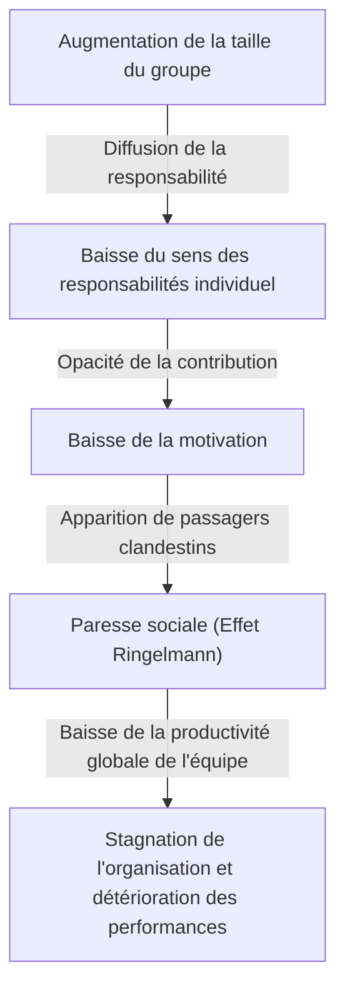
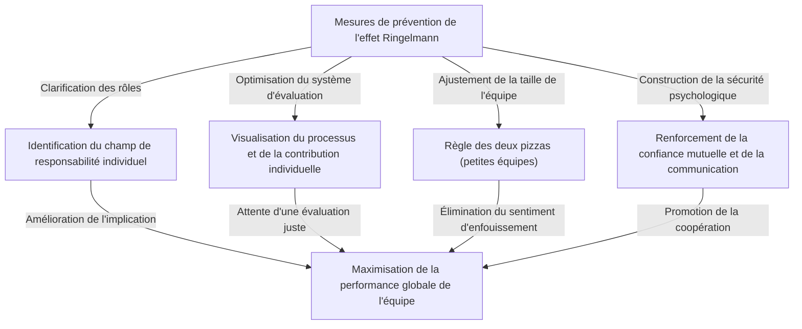

# Qu'est-ce que l'effet Ringelmann (paresse sociale) ? La véritable nature de ce piège invisible qui ronge les organisations

Dans le monde des affaires ou dans la vie quotidienne, n'avez-vous jamais eu l'impression que « plus le nombre de personnes augmente, plus la performance de chacun semble diminuer » ? Une personne très compétente et rapide lorsqu'elle travaille seule, devient soudainement dépendante des autres et cesse de produire des résultats remarquables dès qu'elle est intégrée dans une équipe de 5 ou 10 personnes. Ce n'est en aucun cas parce que ses capacités ont soudainement chuté, ni parce que sa personnalité est devenue soudainement paresseuse.

Ce phénomène porte un nom très clair dans les domaines de la psychologie et du comportement organisationnel. Il s'agit de l'**« effet Ringelmann (Ringelmann Effect) »**, également connu sous le nom de **« paresse sociale (Social Loafing) »**.

Dans cet article, nous expliquerons de manière extrêmement détaillée et pratique le contexte historique et les mécanismes psychologiques qui provoquent cet effet Ringelmann, comment il se manifeste dans les organisations commerciales modernes, et quelles mesures concrètes doivent être prises pour éviter ce piège et maximiser véritablement la productivité des équipes. À travers ce guide complet de plusieurs milliers de caractères, découvrez des pistes pour briser cette « inefficacité invisible » qui pèse sur votre organisation ou votre équipe.

---

## 1. Contexte historique : L'expérience de tir à la corde de Maximilien Ringelmann

La découverte de l'effet Ringelmann remonte à plus de 100 ans, en 1913. Maximilien Ringelmann, un agronome français, a remarqué un phénomène très intéressant lors de ses recherches sur l'efficacité du travail des ouvriers agricoles. Il a mené une expérience de « tir à la corde » pour mesurer comment la quantité de travail individuel change lorsque les gens travaillent en groupe.

### Aperçu de l'expérience et résultats surprenants
Les règles de l'expérience étaient extrêmement simples. Il s'agissait de demander aux sujets de tirer sur une corde et de mesurer leur force de traction avec un appareil de mesure. Tout d'abord, la force de traction moyenne d'une personne tirant seule est définie comme « 100 % (environ 63 kg) ». Logiquement parlant, si 2 personnes tirent, une force de 200 % devrait être exercée, 300 % pour 3 personnes, et 800 % pour 8 personnes.

Cependant, les résultats ont largement déçu les attentes.
- **Pour 1 personne** : 100 % (exerce sa force réelle)
- **Pour 2 personnes** : environ 93 % (la force par personne diminue légèrement)
- **Pour 3 personnes** : environ 85 %
- **Pour 4 personnes** : environ 77 %
- **Pour 8 personnes** : environ 49 % (chaque personne n'exerce que la moitié de sa force réelle)

Le fait révélé par ces résultats était d'une clarté cruelle : **« plus le nombre de personnes dans un groupe augmente, plus la force exercée par chaque individu diminue de manière inversement proportionnelle »**. Lorsqu'ils tiraient la corde à huit, ils n'avaient absolument pas l'intention malveillante de « relâcher leurs efforts ». Cependant, inconsciemment, la psychologie selon laquelle « même si je ne donne pas tout, quelqu'un d'autre le fera » a opéré, réduisant ainsi de moitié la performance individuelle.

Cette découverte révolutionnaire a ensuite été reproduite par de nombreux psychologues et spécialistes du comportement organisationnel, prouvant qu'un « relâchement » similaire se produit dans toutes les activités de groupe humaines, non seulement dans le travail physique, mais aussi dans le travail intellectuel comme le brainstorming, la prise de parole en réunion, et même l'aide aux autres en cas d'urgence (effet du spectateur).

---

## 2. Le mécanisme psychologique qui provoque l'effet Ringelmann

Alors, pourquoi les gens relâchent-ils inconsciemment leurs efforts lorsqu'ils sont en groupe ? En arrière-plan, l'instinct de défense humain et les biais cognitifs sociaux sont intimement liés. Les principaux facteurs à l'origine de l'effet Ringelmann sont divisés en quatre catégories suivantes.

### ① Diffusion de la responsabilité (Diffusion of Responsibility)
Le facteur le plus important est la « diffusion de la responsabilité ». Lorsque vous êtes seul en charge d'une tâche, son succès ou son échec dépend à 100 % de vous. Si vous réussissez, c'est grâce à vous, et si vous échouez, c'est votre responsabilité. Cependant, lorsque plusieurs personnes partagent une tâche, un sentiment de sécurité psychologique naît : « même si je ne le fais pas, quelqu'un d'autre s'en chargera » et « même en cas d'échec, ma responsabilité n'en sera qu'une fraction ». Cela diminue le sens des responsabilités (implication).

### ② Opacité de l'évaluation (Lack of Identifiability)
Dans le travail de groupe, lorsque la contribution d'un individu ne peut pas être mesurée clairement, les gens ont tendance à négliger leurs efforts. Comme dans l'expérience du tir à la corde, dans une situation où l'on ne peut pas voir individuellement « qui tire et avec quelle force », la psychologie (sentiment d'impuissance ou de futilité) opère : « si je ne suis pas évalué même en donnant tout ce que j'ai, le résultat sera le même si je le fais à moitié ».

### ③ Pression de conformité et « Passagers clandestins (Free riders) »
Dans une équipe comptant quelques membres très talentueux, certains apprendront que « si on leur confie le travail, ça ira ». C'est ce qu'on appelle le phénomène du « passager clandestin (free rider) ». Ce qui est encore plus effrayant, c'est que les membres qui travaillent dur commenceront aussi à relâcher leurs efforts, pensant : « c'est stupide que je sois le seul à me donner à fond alors que ce type se la coule douce ». C'est ce qu'on appelle l'**effet de la poire (Sucker Effect)**.

### ④ Flou des objectifs et des buts
Lorsque la direction que prend l'équipe ou la valeur que le travail apporte à l'organisation dans son ensemble (la signification de la tâche) est ambiguë, la motivation individuelle diminue considérablement. Le relâchement est maximisé lorsqu'une « tâche dont on ne comprend pas le but » est répartie entre un grand nombre de personnes.

---

## 3. La menace de l'effet Ringelmann dans le monde des affaires moderne

L'effet Ringelmann se produit quotidiennement dans le monde des affaires moderne et ronge silencieusement, mais sûrement, la productivité de l'organisation. Voyons concrètement dans quelles situations ce piège se cache.

### Les réunions hypertrophiées et les « participants silencieux »
Les réunions de plus de 10 personnes, organisées avec l'idée d'« inviter toutes les parties prenantes au cas où », sont un terreau fertile pour l'effet Ringelmann. Plus il y a de participants, plus ils penseront : « même si je ne dis rien, quelqu'un d'autre donnera son avis », et la majorité des participants deviendront de simples spectateurs. En conséquence, seuls quelques managers ou employés à la voix forte s'exprimeront, et l'objectif initial de la réunion, qui est de recueillir des opinions diverses, sera perdu.

### L'absence de responsable de projet
Dans les projets à grande échelle, le slogan « que tout le monde fasse preuve de leadership pour faire avancer les choses » est parfois brandi. Cependant, c'est un signe de danger. Si les rôles et les responsabilités ne sont pas clairement assignés à des individus, on tombe dans une situation où « la responsabilité de tout le monde n'est la responsabilité de personne ». Les transferts de tâches et les problèmes où « personne ne l'avait fait » juste avant la date limite deviendront fréquents.

### L'abus des emails en copie (CC)
Les « emails en CC » adressés à des dizaines de personnes pour partager des informations provoquent également la paresse sociale. En pensant que « puisqu'il y a autant de personnes qui le voient, quelqu'un s'en chargera ou répondra », il arrive finalement que tout le monde l'ignore.

---

## 4. Mesures de défense concrètes pour briser l'effet Ringelmann

Il est peut-être impossible d'éliminer complètement l'effet Ringelmann d'une organisation en raison de la structure psychologique humaine. Cependant, avec une gestion et une conception d'équipe appropriées, il est tout à fait possible de minimiser son impact et de tirer le meilleur parti des performances individuelles. Nous expliquerons ici des mesures concrètes.

### ① Ajustement de la taille de l'équipe (Introduction de la règle des deux pizzas)
La « règle des deux pizzas (Two-Pizza Rule) » prônée par Jeff Bezos, fondateur d'Amazon, est l'une des méthodes les plus célèbres pour prévenir l'effet Ringelmann. Il s'agit d'une règle empirique selon laquelle « le nombre de personnes dans une équipe devrait être celui qui permet de se rassasier en partageant deux pizzas (environ 5 à 8 personnes) ». Si l'équipe dépasse cette taille, la diviser en sous-équipes permet d'éviter le « sentiment d'enfouissement » des individus et de renforcer la raison d'être de chacun.

### ② Clarification des rôles et responsabilités individuels (KPI)
Avant de lancer un projet, définissez clairement et documentez qui accomplira quoi, d'ici quand, et à quel niveau. Il est important de favoriser le sens des responsabilités, non pas en disant « faisons tous de notre mieux », mais plutôt « vous êtes le responsable de... ». L'utilisation d'une matrice RACI (responsable de l'exécution, responsable de l'approbation, consulté, informé) est efficace.

### ③ Visualisation des processus et de la contribution
Il faut un système pour visualiser non seulement les résultats, mais aussi les processus qui y mènent et les efforts individuels. En introduisant des outils de gestion des tâches (Jira, Trello, Asana, etc.) et en partageant avec toute l'équipe qui a accompli quelle tâche, on crée un environnement qui satisfait le besoin de reconnaissance et instaure une pression saine d'« être vu » et d'« être évalué ».

### ④ Motivation intrinsèque et partage des objectifs
Communiquez de manière répétée la vision et les objectifs afin que les membres puissent trouver un sens à leurs tâches. Les membres qui comprennent « pourquoi ce travail est nécessaire » et « comment il sera utile aux clients et à la société » ne relâcheront pas leurs efforts même en groupe et agiront de manière autonome.

### ⑤ Garantie de la sécurité psychologique
Créez un environnement où un membre qui « ne relâche pas ses efforts, mais est bloqué parce qu'il ne sait pas comment faire » peut immédiatement demander de l'aide. Dans une équipe où la sécurité psychologique (Psychological Safety) est élevée, où l'échec est toléré et où le soutien mutuel est possible, l'effet de la poire (relâcher ses efforts en voyant les autres le faire) est moins susceptible de se produire.

---

## 5. Conclusion : Créer une organisation qui maximise la force de l'individu

L'effet Ringelmann (paresse sociale) ne vient pas de la paresse humaine, mais est une réaction psychologique naturelle provoquée par l'environnement du groupe. Par conséquent, essayer de résoudre le problème par des discours moralisateurs tels que « soyez plus motivés » ou « ayez le sens des responsabilités » n'est rien d'autre qu'une négligence du management.

Les organisations et les leaders véritablement excellents partent du principe que les humains sont des créatures qui ont tendance à relâcher leurs efforts, et construisent un système qui crée **« un environnement où tout le monde veut donner le meilleur de lui-même, ou est obligé de le faire »**. Maintenir des équipes de petite taille, clarifier les rôles et évaluer équitablement les contributions. C'est en appliquant rigoureusement ces principes fondamentaux que l'on peut sauver l'organisation du piège invisible de l'effet Ringelmann et ouvrir la seule voie vers des performances exceptionnelles.

Pourquoi ne pas commencer dès aujourd'hui dans votre propre équipe par de petites astuces comme « réduire le nombre de participants aux réunions » ou « assigner une tâche à une seule personne » ? Ce petit pas sera sûrement le déclencheur pour changer radicalement la productivité de toute l'organisation.
