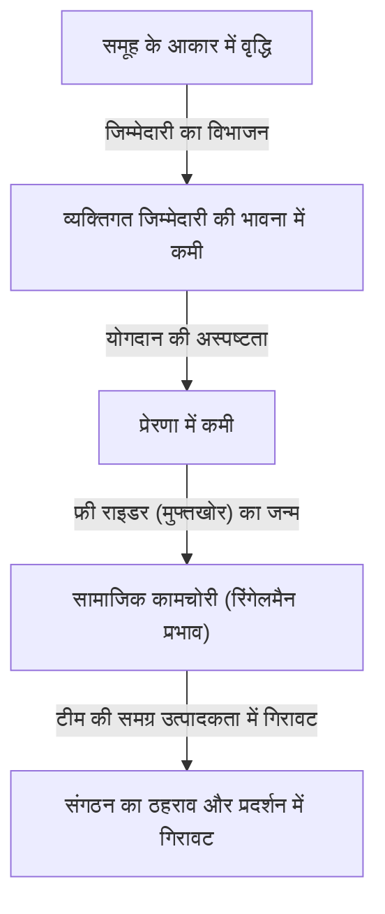
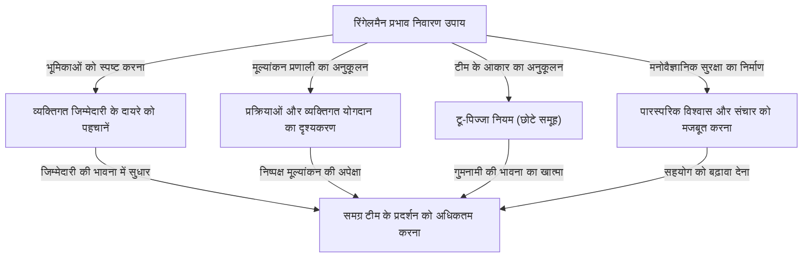

# रिंगेलमैन प्रभाव (सामाजिक कामचोरी) क्या है? संगठन को खोखला करने वाले अदृश्य जाल की असलियत

व्यापार या दैनिक जीवन में, क्या आपने कभी महसूस किया है कि "जितने अधिक लोग होते हैं, प्रत्येक व्यक्ति का प्रदर्शन उतना ही कम होता हुआ प्रतीत होता है"? एक व्यक्ति जो अकेले काम करते समय बहुत उत्कृष्ट और त्वरित रूप से कार्य करता है, जब 5 या 10 लोगों की टीम में शामिल होता है, तो अचानक दूसरों पर निर्भर हो जाता है और कोई उल्लेखनीय परिणाम नहीं देता है। यह बिल्कुल नहीं है कि उस व्यक्ति की क्षमता अचानक कम हो गई है या उसका स्वभाव अचानक आलसी हो गया है।

मनोविज्ञान और संगठनात्मक व्यवहार के क्षेत्र में इस घटना का एक स्पष्ट नाम है। इसे **"रिंगेलमैन प्रभाव (Ringelmann Effect)"**, या **"सामाजिक कामचोरी (Social Loafing)"** के रूप में जाना जाता है।

इस लेख में, हम अत्यंत विस्तार और व्यावहारिक रूप से व्याख्या करेंगे कि यह रिंगेलमैन प्रभाव क्यों उत्पन्न होता है, इसके ऐतिहासिक और मनोवैज्ञानिक तंत्र से लेकर आधुनिक व्यावसायिक संगठनों में यह किस रूप में प्रकट होता है, और इस जाल से बचने और टीम की उत्पादकता को सही मायने में अधिकतम करने के लिए कौन से ठोस उपाय किए जाने चाहिए। हजारों शब्दों की इस विस्तृत मार्गदर्शिका के माध्यम से, अपने संगठन या टीम की "अदृश्य अक्षमता" को तोड़ने के संकेत खोजें।

---

## 1. ऐतिहासिक पृष्ठभूमि: मैक्सिमिलियन रिंगेलमैन का रस्साकशी प्रयोग

रिंगेलमैन प्रभाव की खोज 100 से अधिक वर्ष पहले, 1913 में हुई थी। फ्रांसीसी कृषिविज्ञानी मैक्सिमिलियन रिंगेलमैन (Maximilien Ringelmann) ने कृषि में श्रमिकों की कार्यकुशलता पर शोध करते हुए एक बहुत ही दिलचस्प घटना देखी। उन्होंने एक प्रयोग किया जिसमें लोगों द्वारा समूह में कार्य करने पर व्यक्तिगत कार्यभार में होने वाले परिवर्तन को मापने के लिए "रस्साकशी" का उपयोग किया गया।

### प्रयोग का अवलोकन और आश्चर्यजनक परिणाम
प्रयोग के नियम बहुत सरल थे। विषयों को एक रस्सी खींचने के लिए कहा गया था और उनके खिंचाव बल को एक मापने वाले उपकरण से मापा गया था। सबसे पहले, एक अकेले व्यक्ति द्वारा खींचने पर औसत खिंचाव बल को "100% (लगभग 63 किग्रा)" के रूप में परिभाषित किया गया था। तार्किक रूप से सोचने पर, यदि 2 लोग खींचते हैं तो 200%, 3 लोग 300%, और 8 लोग 800% बल उत्पन्न होना चाहिए।

हालाँकि, परिणाम उम्मीदों से बहुत अलग थे।
- **1 व्यक्ति होने पर**: 100% (अपनी वास्तविक क्षमता का प्रदर्शन)
- **2 व्यक्ति होने पर**: लगभग 93% (प्रति व्यक्ति बल में मामूली कमी)
- **3 व्यक्ति होने पर**: लगभग 85%
- **4 व्यक्ति होने पर**: लगभग 77%
- **8 व्यक्ति होने पर**: लगभग 49% (प्रति व्यक्ति, अपनी वास्तविक क्षमता का केवल आधा उपयोग)

यह परिणाम स्पष्ट रूप से एक क्रूर वास्तविकता को दर्शाता है। **"समूह का आकार जितना बढ़ता है, प्रत्येक व्यक्ति द्वारा लगाया जाने वाला बल व्युत्क्रमानुपाती रूप से कम हो जाता है।"** जब 8 लोग रस्साकशी कर रहे होते हैं, तो वे निश्चित रूप से दुर्भावना के साथ "काम से जी चुराने" का इरादा नहीं रखते हैं। हालाँकि, अनजाने में, "अगर मैं अपना पूरा जोर नहीं लगाता, तो कोई और कर लेगा" की मानसिकता काम करती है, जिसके परिणामस्वरूप व्यक्तिगत प्रदर्शन आधा रह जाता है।

इस महत्वपूर्ण खोज को बाद में कई मनोवैज्ञानिकों और संगठनात्मक व्यवहार विशेषज्ञों द्वारा दोहराया गया, और यह साबित हुआ कि शारीरिक श्रम के अलावा, मानसिक कार्यों जैसे विचार-मंथन (ब्रेनस्टॉर्मिंग), बैठकों में बोलने, और आपात स्थिति में लोगों की मदद करने (दर्शक प्रभाव) सहित सभी मानवीय सामूहिक गतिविधियों में इसी तरह की "कामचोरी" होती है।

---

## 2. मनोवैज्ञानिक तंत्र जिससे रिंगेलमैन प्रभाव उत्पन्न होता है

तो लोग अनजाने में तब कामचोरी क्यों करते हैं जब वे एक समूह में होते हैं? इसके पीछे मानवीय रक्षा वृत्ति और सामाजिक संज्ञानात्मक पूर्वाग्रह जटिल रूप से जुड़े हुए हैं। रिंगेलमैन प्रभाव का कारण बनने वाले मुख्य कारकों को मोटे तौर पर निम्नलिखित 4 में विभाजित किया जा सकता है।

### ① जिम्मेदारी का विभाजन (Diffusion of Responsibility)
सबसे बड़ा कारक "जिम्मेदारी का विभाजन" है। यदि आप अकेले किसी कार्य के प्रभारी हैं, तो इसकी सफलता या विफलता 100% आप पर निर्भर करती है। यदि आप सफल होते हैं तो आपको श्रेय मिलता है, और यदि आप विफल होते हैं तो जिम्मेदारी आपकी होती है। हालाँकि, जब कई लोग कोई कार्य साझा करते हैं, तो मानसिक शांति की भावना पैदा होती है: "यदि मैं इसे नहीं करता, तो कोई और कर देगा" और "यदि मैं विफल होता हूँ, तो मेरी जिम्मेदारी केवल एक अंश होगी।" इससे जिम्मेदारी की भावना कम हो जाती है।

### ② मूल्यांकन की अस्पष्टता (Lack of Identifiability)
समूह कार्य में, यदि व्यक्तिगत योगदान को स्पष्ट रूप से मापा नहीं जा सकता है, तो लोग प्रयास में कोताही बरतने की प्रवृत्ति रखते हैं। रस्साकशी प्रयोग की तरह, ऐसी स्थिति में जहाँ व्यक्तिगत रूप से यह नहीं देखा जा सकता कि "कौन कितनी जोर से खींच रहा है", यह मानसिकता (बेबसी या निरर्थकता की भावना) काम करती है कि "यदि मैं अपना सर्वश्रेष्ठ देता हूँ और उसका मूल्यांकन नहीं किया जाता है, तो आधा-अधूरा काम करना भी एक ही बात है।"

### ③ साथियों का दबाव और "फ्री राइडर (मुफ्तखोर)"
कुछ उत्कृष्ट सदस्यों वाली टीम में, कुछ सदस्य यह सीख लेते हैं कि "यदि हम इसे उन पर छोड़ दें, तो काम पूरा हो जाएगा।" इसे "फ्री राइडर (मुफ्तखोरी)" की घटना कहा जाता है। और भी अधिक भयानक बात यह है कि जो सदस्य कड़ी मेहनत कर रहे हैं वे महसूस करने लगते हैं कि "वह कामचोरी कर रहा है, इसलिए केवल मेरे लिए अपना सर्वश्रेष्ठ देना मूर्खता है," और वे भी कामचोरी करने लगते हैं। इसे **सकर प्रभाव (Sucker Effect: बेवकूफ बनने का प्रभाव)** कहा जाता है।

### ④ उद्देश्य और लक्ष्यों की अस्पष्टता
यदि टीम की दिशा या कार्य संगठन को क्या मूल्य प्रदान करता है (कार्य की सार्थकता) अस्पष्ट है, तो व्यक्तिगत प्रेरणा काफी कम हो जाती है। जब बड़ी संख्या में लोगों को "ऐसा कार्य करने के लिए कहा जाता है जिसके उद्देश्य का पता नहीं है," तो कामचोरी चरम पर होती है।

---

## 3. आधुनिक व्यवसाय में रिंगेलमैन प्रभाव का खतरा

आधुनिक व्यावसायिक परिदृश्य में रिंगेलमैन प्रभाव प्रतिदिन होता है, और यह चुपचाप लेकिन निश्चित रूप से संगठनात्मक उत्पादकता को कम कर रहा है। आइए विशिष्ट उदाहरणों को देखें जहाँ यह जाल छिपा हुआ है।

### बड़ी बैठकें और "मौन प्रतिभागी"
10 या अधिक लोगों की बैठकें जो "सुरक्षा के लिए सभी संबंधित पक्षों को आमंत्रित करने" के विचार से स्थापित की जाती हैं, रिंगेलमैन प्रभाव के लिए एक प्रजनन मैदान हैं। जितने अधिक प्रतिभागी होंगे, उतने ही अधिक लोग दर्शक बन जाएंगे, यह सोचते हुए कि "यदि मैं नहीं बोलता, तो कोई और राय देगा।" परिणामस्वरूप, केवल कुछ प्रबंधक या मुखर कर्मचारी ही बोलते हैं, और विविध विचारों को इकट्ठा करने का बैठक का मूल उद्देश्य खो जाता है।

### परियोजना प्रबंधक की अनुपस्थिति
बड़ी परियोजनाओं में, कभी-कभी "सभी को नेतृत्व करना चाहिए और इसे आगे बढ़ाना चाहिए" का नारा लगाया जाता है। हालाँकि, यह एक खतरनाक संकेत है। यदि भूमिकाएँ और जिम्मेदारियाँ स्पष्ट रूप से व्यक्तियों को नहीं सौंपी जाती हैं, तो यह उस स्थिति में आ जाता है जहाँ "सभी की जिम्मेदारी किसी की जिम्मेदारी नहीं होती है।" एक-दूसरे पर काम थोपना और समय सीमा से ठीक पहले पता चलना कि "किसी ने इसे नहीं किया" जैसी समस्याएं अक्सर होती हैं।

### CC ईमेल का दुरुपयोग
"CC ईमेल" जो सूचना साझा करने के लिए दर्जनों लोगों को भेजे जाते हैं। यह सामाजिक कामचोरी को भी प्रेरित करता है। लोग यह मान लेते हैं कि "इतने सारे लोग इसे देख रहे हैं, इसलिए कोई और जवाब देगा या कार्य करेगा," जिसके परिणामस्वरूप अंततः हर कोई इसे अनदेखा कर देता है।

---

## 4. रिंगेलमैन प्रभाव को तोड़ने के लिए ठोस रक्षात्मक उपाय

मानव मनोविज्ञान की संरचना के कारण किसी संगठन से रिंगेलमैन प्रभाव को पूरी तरह से समाप्त करना असंभव हो सकता है। हालाँकि, उचित प्रबंधन और टीम डिज़ाइन के माध्यम से इसके प्रभाव को कम करना और व्यक्तिगत प्रदर्शन को बाहर लाना पूरी तरह से संभव है। यहां, हम विशिष्ट उपायों की व्याख्या करेंगे।

### ① टीम के आकार का अनुकूलन (टू-पिज्जा नियम लागू करना)
Amazon के संस्थापक जेफ बेजोस द्वारा प्रस्तावित "टू-पिज्जा नियम (Two-Pizza Rule)" रिंगेलमैन प्रभाव को रोकने के सबसे प्रसिद्ध तरीकों में से एक है। यह एक अनुभवजन्य नियम है कि "टीम का आकार ऐसा होना चाहिए कि 2 पिज्जा उन्हें खिलाने के लिए पर्याप्त हों (लगभग 5 से 8 लोग)।" यदि टीम इससे बड़ी हो जाती है, तो इसे उप-टीमों में विभाजित करने से व्यक्तियों में "गुमनामी" की भावना को रोका जा सकता है और प्रत्येक व्यक्ति के महत्व को बढ़ाया जा सकता है।

### ② व्यक्तिगत भूमिकाओं और जिम्मेदारियों (KPI) को स्पष्ट करना
परियोजना शुरू करने से पहले, स्पष्ट रूप से परिभाषित करें और दस्तावेज़ करें कि कौन, क्या, कब तक और किस स्तर पर हासिल करेगा। यह महत्वपूर्ण है कि लोगों को "हम सभी अपना सर्वश्रेष्ठ प्रदर्शन करेंगे" के बजाय "आप कार्य के प्रभारी हैं" के रूप में जिम्मेदारी की भावना दी जाए। RACI चार्ट (जो जिम्मेदार, जवाबदेह, परामर्शदाता और सूचित पक्षों को एक मैट्रिक्स में मैप करता है) का उपयोग करना प्रभावी है।

### ③ प्रक्रियाओं और योगदान को दृश्यमान बनाना
ऐसी प्रणाली की आवश्यकता है जो केवल परिणामों को ही नहीं, बल्कि वहां तक पहुंचने की प्रक्रिया और व्यक्तिगत प्रयासों को भी दृश्यमान बनाए। कार्य प्रबंधन उपकरण (जैसे Jira, Trello, Asana) पेश करके और पूरी टीम के साथ यह साझा करके कि किसने कौन सा कार्य पूरा किया, आप एक ऐसा वातावरण बनाते हैं जो "मुझे देखा जा रहा है" और "मुझे महत्व दिया जा रहा है" के स्वस्थ दबाव और मान्यता की आवश्यकता को पूरा करता है।

### ④ आंतरिक प्रेरणा और साझा लक्ष्य
दृष्टिकोण और उद्देश्य को बार-बार संप्रेषित करें ताकि सदस्य अपने कार्यों में अर्थ पा सकें। जो सदस्य समझते हैं कि "यह काम क्यों आवश्यक है" और "यह ग्राहकों या समाज के लिए कैसे उपयोगी है" वे स्वायत्त रूप से कार्य करेंगे और समूह में होने पर भी कामचोरी नहीं करेंगे।

### ⑤ मनोवैज्ञानिक सुरक्षा सुनिश्चित करना
एक ऐसा वातावरण बनाएं जहां सदस्य जो "कामचोरी नहीं कर रहे हैं लेकिन रुक गए हैं क्योंकि वे नहीं जानते कि कैसे आगे बढ़ना है" आसानी से मदद मांग सकें। अत्यधिक मनोवैज्ञानिक सुरक्षा (Psychological Safety) वाली टीम, जो विफलताओं को सहन करती है और एक-दूसरे का समर्थन करती है, में सकर प्रभाव (दूसरों को कामचोरी करते देखकर कामचोरी करने की प्रवृत्ति) होने की संभावना कम होती है।

---

## 5. निष्कर्ष: एक ऐसे संगठन का निर्माण जो व्यक्तिगत क्षमता को अधिकतम करता है

रिंगेलमैन प्रभाव (सामाजिक कामचोरी) मानवीय आलस्य से नहीं, बल्कि समूह के वातावरण के कारण होने वाली एक प्राकृतिक मनोवैज्ञानिक प्रतिक्रिया से उत्पन्न होता है। इसलिए, "अधिक प्रेरित हों" या "जिम्मेदारी की भावना रखें" जैसे आध्यात्मिक दृष्टिकोण के साथ इसे हल करने का प्रयास करना प्रबंधन का आलस्य कहा जा सकता है।

वास्तव में उत्कृष्ट संगठन और नेता यह मान लेते हैं कि मनुष्य ऐसे प्राणी हैं जो कामचोरी करते हैं, और फिर एक प्रणाली के रूप में **"एक ऐसा वातावरण बनाते हैं जहां हर कोई अपना सर्वश्रेष्ठ देना चाहता है, या अपना सर्वश्रेष्ठ देने के लिए मजबूर होता है।"** टीम को छोटा रखना, भूमिकाओं को स्पष्ट करना और योगदान का उचित मूल्यांकन करना। इन मूल बातों का कड़ाई से पालन करना ही संगठन को रिंगेलमैन प्रभाव के अदृश्य जाल से बचाने और जबरदस्त प्रदर्शन उत्पन्न करने का एकमात्र तरीका है।

अपनी टीम में आज ही छोटे बदलावों से शुरुआत क्यों न करें, जैसे "बैठकों में प्रतिभागियों की संख्या कम करना" या "किसी कार्य के लिए केवल एक व्यक्ति को प्रभारी नियुक्त करना"? वह छोटा कदम पूरे संगठन की उत्पादकता को नाटकीय रूप से बदलने का उत्प्रेरक होना चाहिए।
