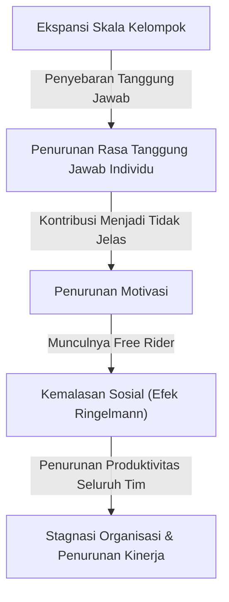
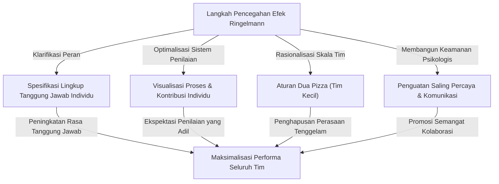

# Apa itu Efek Ringelmann (Kemalasan Sosial)? Identitas Jebakan Tak Kasat Mata yang Merusak Organisasi

Dalam dunia bisnis atau kehidupan sehari-hari, pernahkah Anda merasa bahwa "semakin banyak orang, entah mengapa performa masing-masing individu terasa menurun"? Seseorang yang sangat kompeten dan bertindak cepat saat bekerja sendiri, tiba-tiba menjadi bergantung pada orang lain dan tidak menghasilkan pencapaian yang menonjol begitu dimasukkan ke dalam tim yang terdiri dari 5 atau 10 orang. Hal ini sama sekali bukan karena kemampuan orang tersebut tiba-tiba menurun drastis, atau sifatnya tiba-tiba menjadi malas.

Fenomena ini memiliki nama yang jelas di bidang psikologi dan perilaku organisasi. Yaitu **"Efek Ringelmann (Ringelmann Effect)"**, atau dikenal juga dengan **"Kemalasan Sosial (Social Loafing)"**.

Dalam artikel ini, kami akan menjelaskan secara sangat rinci dan praktis mulai dari latar belakang sejarah dan mekanisme psikologis mengapa efek Ringelmann ini terjadi, bagaimana bentuk kemunculannya dalam organisasi bisnis modern, serta langkah-langkah konkret apa yang harus diambil untuk menghindari jebakan ini dan benar-benar memaksimalkan produktivitas tim. Melalui panduan lengkap ribuan kata ini, temukanlah petunjuk untuk menghancurkan "ketidakefisienan tak kasat mata" yang dihadapi oleh organisasi atau tim Anda.

---

## 1. Latar Belakang Sejarah: Eksperimen Tarik Tambang Maximilien Ringelmann

Penemuan efek Ringelmann berawal dari lebih dari 100 tahun yang lalu pada tahun 1913. Seorang ahli pertanian Prancis, Maximilien Ringelmann, menyadari fenomena yang sangat menarik saat meneliti efisiensi kerja pekerja di bidang pertanian. Ia melakukan eksperimen menggunakan "tarik tambang" untuk mengukur bagaimana beban kerja individu berubah ketika orang-orang bekerja dalam kelompok.

### Ringkasan Eksperimen dan Hasil yang Mengejutkan
Aturan eksperimennya sangat sederhana. Subjek diminta menarik tali, dan daya tariknya diukur dengan alat pengukur. Pertama, rata-rata daya tarik jika dilakukan sendiri didefinisikan sebagai "100% (sekitar 63kg)". Secara logis, jika ditarik oleh 2 orang seharusnya menghasilkan 200% kekuatan, 3 orang 300%, dan 8 orang 800%.

Namun, hasilnya sangat mengecewakan ekspektasi.
- **Kasus 1 orang**: 100% (mengeluarkan kekuatan penuh)
- **Kasus 2 orang**: Sekitar 93% (kekuatan per orang sedikit menurun)
- **Kasus 3 orang**: Sekitar 85%
- **Kasus 4 orang**: Sekitar 77%
- **Kasus 8 orang**: Sekitar 49% (per orang hanya mengeluarkan setengah dari kekuatan aslinya)

Fakta yang ditunjukkan oleh hasil ini sangatlah jelas. **"Semakin banyak jumlah orang dalam kelompok, kekuatan yang dikeluarkan setiap individu akan menurun berbanding terbalik"**. Saat 8 orang menarik tali, mereka tidak pernah memiliki niat buruk untuk "bermalas-malasan". Namun, secara tidak sadar muncul psikologi "meskipun aku tidak mengeluarkan seluruh kekuatanku, pasti akan ada orang lain yang melakukannya", yang pada akhirnya membuat performa individu berkurang separuhnya.

Penemuan inovatif ini kemudian diuji ulang oleh banyak psikolog dan ahli perilaku organisasi, membuktikan bahwa "kemalasan" serupa terjadi dalam segala aktivitas kelompok manusia, tidak hanya pekerjaan fisik, tetapi juga pekerjaan intelektual seperti brainstorming, berbicara di rapat, bahkan saat membantu orang lain dalam keadaan darurat (efek pengamat / bystander effect).

---

## 2. Mekanisme Psikologis Terjadinya Efek Ringelmann

Lalu, mengapa orang secara tidak sadar bermalas-malasan saat berada dalam kelompok? Di balik itu, terdapat keterikatan yang kompleks antara naluri pertahanan manusia dan bias kognitif sosial. Faktor utama penyebab efek Ringelmann dapat dibagi menjadi 4 bagian berikut.

### ① Penyebaran Tanggung Jawab (Diffusion of Responsibility)
Faktor terbesar adalah "penyebaran tanggung jawab". Jika seseorang menangani tugas sendirian, keberhasilannya 100% bergantung padanya. Jika berhasil, itu adalah prestasinya, dan jika gagal, itu adalah tanggung jawabnya. Namun, ketika tugas dibagi dengan banyak orang, muncul rasa aman psikologis seperti "jika aku tidak melakukannya, orang lain yang akan melakukannya" atau "jika gagal, tanggung jawabku hanya sebagian kecil". Hal ini menurunkan rasa tanggung jawab.

### ② Ketidakjelasan Penilaian (Lack of Identifiability)
Dalam kerja kelompok, ketika kontribusi individu tidak dapat diukur secara jelas, orang cenderung mengabaikan usahanya. Seperti pada eksperimen tarik tambang sebelumnya, dalam situasi di mana "seberapa kuat seseorang menarik" tidak terlihat secara individual, akan muncul psikologi "jika aku mengeluarkan seluruh tenaga tapi tidak dinilai, maka asal-asalan pun hasilnya sama" (rasa tidak berdaya atau usaha sia-sia).

### ③ Tekanan Teman Sebaya dan "Penunggang Gratis (Free Rider)"
Dalam tim yang memiliki beberapa anggota kompeten, akan muncul anggota yang berpikir "serahkan saja pada mereka, pekerjaan akan selesai". Inilah fenomena yang disebut "Free Rider (Penunggang Gratis)". Yang lebih mengerikan adalah, anggota yang bekerja keras pun akan merasa "bodoh sekali jika hanya aku yang bekerja keras sementara dia bermalas-malasan", dan mulai ikut bermalas-malasan. Ini disebut **Efek Sucker (Sucker Effect: Efek Merasa Bodoh)**.

### ④ Ketidakjelasan Tujuan atau Sasaran
Ketika arah yang dituju tim atau nilai apa yang diberikan pekerjaan tersebut kepada organisasi secara keseluruhan (kebermaknaan tugas) tidak jelas, motivasi individu akan menurun drastis. Saat diminta berbagi "tugas yang tidak diketahui tujuannya" dengan banyak orang, kemalasan akan mencapai puncaknya.

---

## 3. Ancaman Efek Ringelmann dalam Bisnis Modern

Efek Ringelmann terjadi setiap hari dalam dunia bisnis modern, secara diam-diam namun pasti mengikis produktivitas organisasi. Mari kita lihat secara spesifik dalam situasi seperti apa jebakan ini bersembunyi.

### Rapat yang Membengkak dan "Peserta yang Bungkam"
Rapat dengan lebih dari 10 orang yang diatur dengan pemikiran "undang saja semua pihak terkait untuk berjaga-jaga", adalah tempat berkembang biaknya efek Ringelmann. Semakin banyak peserta, mereka akan berpikir "meskipun aku tidak berbicara, seseorang akan memberikan pendapat", menjadikan sebagian besar peserta hanya sebagai pengamat. Akibatnya, yang berbicara hanyalah sebagian manajer atau karyawan yang vokal, dan tujuan asli rapat untuk mengumpulkan berbagai pendapat pun hilang.

### Ketiadaan Penanggung Jawab Proyek
Dalam proyek berskala besar, terkadang ada slogan "mari kita semua memimpin dan mendorong proyek ini bersama-sama". Namun, ini adalah tanda bahaya. Jika peran dan tanggung jawab tidak secara jelas ditugaskan kepada individu, maka akan jatuh ke dalam keadaan "tanggung jawab semua orang, bukanlah tanggung jawab siapa-siapa". Saling lempar tugas, dan masalah "tidak ada yang melakukannya" menjelang tenggat waktu akan sering terjadi.

### Penyalahgunaan Email CC
"Email CC" dengan puluhan orang sebagai penerima untuk berbagi informasi. Ini juga memicu kemalasan sosial. Orang akan berasumsi "dengan sebanyak ini orang yang melihat, pasti ada yang menanggapi/membalas", yang berujung pada situasi di mana semua orang mengabaikannya.

---

## 4. Langkah Defensif Konkret untuk Menghancurkan Efek Ringelmann

Menghilangkan efek Ringelmann sepenuhnya dari organisasi mungkin tidak mungkin karena struktur psikologis manusia. Namun, dengan manajemen dan desain tim yang tepat, sangat mungkin untuk meminimalkan dampaknya dan mengeluarkan performa individu. Di sini, kami akan menjelaskan langkah-langkah konkretnya.

### ① Rasionalisasi Skala Tim (Penerapan Aturan Dua Pizza)
"Aturan Dua Pizza (Two-Pizza Rule)" yang dikemukakan oleh pendiri Amazon, Jeff Bezos, adalah salah satu metode paling terkenal untuk mencegah efek Ringelmann. Ini adalah aturan praktis bahwa "jumlah anggota tim sebaiknya cukup untuk berbagi 2 loyang pizza hingga kenyang (sekitar 5-8 orang)". Jika tim menjadi lebih besar dari ini, membaginya menjadi sub-tim dapat mencegah "perasaan tenggelam" pada individu, dan meningkatkan eksistensi setiap orang.

### ② Klarifikasi Peran dan Tanggung Jawab (KPI) Individu
Sebelum memulai proyek, definisikan dengan jelas dan dokumentasikan siapa yang akan melakukan apa, hingga kapan, dan pada tingkat pencapaian apa. Penting untuk menumbuhkan rasa tanggung jawab, bukan "kita usahakan bersama", melainkan "Anda adalah penanggung jawab untuk hal ini". Menggunakan bagan RACI (matriks untuk Penanggung Jawab Pelaksana, Penanggung Jawab Akuntabilitas, Pihak yang Dikonsultasikan, Pihak yang Diberitahu) sangat efektif.

### ③ Visualisasi Proses dan Tingkat Kontribusi
Diperlukan sistem untuk memvisualisasikan tidak hanya hasil, tetapi juga proses yang mengarah ke sana dan upaya individu. Dengan mengadopsi alat manajemen tugas (Jira, Trello, Asana, dll.) dan membagikan siapa yang menyelesaikan tugas mana kepada seluruh tim, akan terbangun lingkungan yang memenuhi tekanan sehat "sedang diperhatikan", "sedang dinilai", serta kebutuhan akan pengakuan.

### ④ Motivasi Intrinsik dan Berbagi Tujuan
Sampaikan visi dan tujuan secara berulang-ulang agar anggota dapat menemukan makna dari tugas mereka. Anggota yang memahami "mengapa pekerjaan ini diperlukan" dan "bagaimana ini berguna bagi pelanggan dan masyarakat", tidak akan bermalas-malasan meskipun berada dalam kelompok, dan akan bergerak secara otonom.

### ⑤ Jaminan Keamanan Psikologis
Ciptakan lingkungan di mana anggota yang "bukan bermalas-malasan, tetapi berhenti karena tidak tahu caranya" dapat segera meminta bantuan. Dalam tim dengan Keamanan Psikologis (Psychological Safety) tinggi yang menoleransi kegagalan dan saling mendukung, efek Sucker (fenomena ikut bermalas-malasan setelah melihat orang lain bermalas-malasan) akan lebih sulit terjadi.

---

## 5. Kesimpulan: Membangun Organisasi yang Memaksimalkan Kekuatan Individu

Efek Ringelmann (kemalasan sosial) tidak berasal dari kemalasan manusia, melainkan reaksi psikologis alami yang dipicu oleh lingkungan kelompok. Oleh karena itu, mencoba menyelesaikannya dengan retorika semangat seperti "harus lebih bersemangat" atau "punya rasa tanggung jawab" bisa dikatakan sebagai kemalasan manajemen.

Organisasi dan pemimpin yang benar-benar unggul akan membangun sistem **"lingkungan di mana setiap orang ingin mengeluarkan seluruh tenaganya, atau harus mengeluarkan seluruh tenaganya"**, dengan premis bahwa manusia adalah makhluk yang bisa bermalas-malasan. Menjaga tim tetap kecil, memperjelas peran, dan menilai kontribusi secara adil. Hanya dengan menerapkan dasar-dasar ini dengan tekun, kita dapat menyelamatkan organisasi dari jebakan tak kasat mata efek Ringelmann, dan menciptakan performa yang luar biasa.

Di tim Anda pun, cobalah mulai dari hari ini dengan langkah kecil seperti "mengurangi jumlah peserta rapat" atau "menentukan satu orang sebagai penanggung jawab tugas". Langkah kecil tersebut pasti akan menjadi pemicu yang secara drastis mengubah produktivitas organisasi secara keseluruhan.
