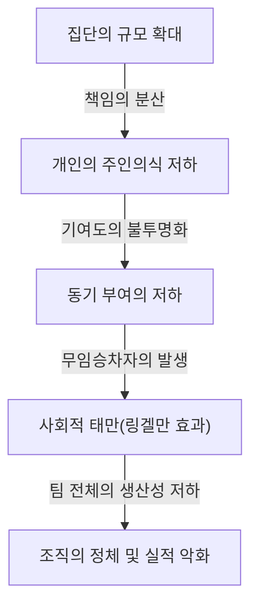
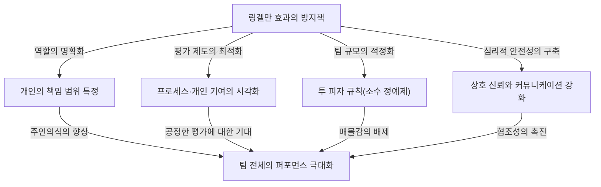

# 링겔만 효과(사회적 태만)란 무엇인가? 조직을 갉아먹는 보이지 않는 덫의 정체

비즈니스 현장이나 일상생활 속에서 "인원수가 늘어나면 늘어날수록, 왠지 모르게 한 사람 한 사람의 퍼포먼스가 떨어지는 것 같다"고 느낀 적은 없으신가요? 혼자서 일할 때는 매우 우수하고 신속하게 행동하는 인물이 5명, 10명의 팀에 편성되는 순간, 어딘가 남에게 맡기는 태도를 보이며 눈에 띄는 성과를 내지 않게 됩니다. 이것은 결코 그 사람의 능력이 급격히 저하된 것도, 성격이 갑자기 나태해진 것도 아닙니다.

이 현상에는 심리학 및 조직행동학 분야에서 명확한 이름이 붙어 있습니다. 바로 **"링겔만 효과(Ringelmann Effect)"**, 다른 말로 **"사회적 태만(Social Loafing)"**입니다.

본 기사에서는 이 링겔만 효과가 왜 발생하는지 역사적 배경과 심리적 메커니즘부터 현대 비즈니스 조직에서 어떤 형태로 나타나는지, 그리고 이 덫을 피하고 팀의 생산성을 진정한 의미에서 극대화하기 위해서는 어떤 구체적인 대책을 강구해야 하는지에 대해 매우 상세하고 실천적으로 해설합니다. 수천 자에 달하는 이 철저한 가이드를 통해 여러분의 조직이나 팀이 안고 있는 "보이지 않는 비효율"을 타파할 힌트를 찾아보세요.

---

## 1. 역사적 배경: 막시밀리앙 링겔만의 줄다리기 실험

링겔만 효과의 발견은 100여 년 전인 1913년으로 거슬러 올라갑니다. 프랑스의 농학자인 막시밀리앙 링겔만(Maximilien Ringelmann)은 농업에서 노동자의 작업 효율을 연구하는 과정에서 매우 흥미로운 현상을 깨달았습니다. 그는 사람이 집단으로 작업을 수행할 때 개인의 작업량이 어떻게 변화하는지를 측정하기 위해 '줄다리기'를 이용한 실험을 진행했습니다.

### 실험 개요와 놀라운 결과
실험 규칙은 매우 간단합니다. 피험자에게 밧줄을 당기게 하고, 그 견인력을 측정기로 계측하는 것이었습니다. 우선 1명이 당겼을 때의 평균 견인력을 '100%(약 63kg)'로 정의합니다. 논리적으로 생각하면 2명이 당기면 200%, 3명이 당기면 300%, 8명이 당기면 800%의 힘이 발휘되어야 합니다.

하지만 결과는 기대를 크게 저버리는 것이었습니다.
- **1명일 경우**: 100% (본래의 힘을 발휘)
- **2명일 경우**: 약 93% (1인당 힘이 약간 저하)
- **3명일 경우**: 약 85%
- **4명일 경우**: 약 77%
- **8명일 경우**: 약 49% (1인당 본래 힘의 절반밖에 내지 않음)

이 결과가 보여주는 사실은 잔혹할 정도로 명확했습니다. **"집단의 인원수가 늘어날수록 한 사람 한 사람이 발휘하는 힘은 반비례하여 저하된다"**는 것입니다. 8명이 함께 밧줄을 당기고 있을 때, 그들은 결코 '요령을 피우자'고 악의를 품었던 것은 아닙니다. 하지만 무의식중에 "내가 전력을 다하지 않아도 누군가가 해주겠지"라는 심리가 작용했고, 결과적으로 개인의 퍼포먼스가 반감되어 버린 것입니다.

이 획기적인 발견은 훗날 많은 심리학자와 조직행동학자들에 의해 추가 실험되었고, 육체노동뿐만 아니라 브레인스토밍과 같은 지적 작업, 회의에서의 발언, 나아가 위기 상황에서의 인명 구조(방관자 효과) 등 모든 인간의 집단 활동에서 이와 유사한 '태만'이 발생한다는 것이 증명되었습니다.

---

## 2. 링겔만 효과가 발생하는 심리적 메커니즘

그렇다면 왜 사람은 집단이 되면 무의식적으로 요령을 피우게 되는 것일까요? 그 배경에는 인간의 방어 본능과 사회적인 인지 편향이 복잡하게 얽혀 있습니다. 링겔만 효과를 일으키는 주요 요인은 다음 4가지로 크게 나뉩니다.

### ① 책임의 분산 (Diffusion of Responsibility)
가장 큰 요인이 '책임의 분산'입니다. 혼자서 업무를 담당할 경우 그 성패는 100% 자신에게 달려 있습니다. 성공하면 자신의 공이 되고, 실패하면 자신의 책임이 됩니다. 하지만 여러 명이 업무를 공유하면 "내가 하지 않아도 다른 누군가가 해주겠지", "실패해도 내 책임은 몇 분의 일로 끝난다"는 심리적 안도감이 생깁니다. 이것이 주인의식을 저하시킵니다.

### ② 평가의 불투명성 (Lack of Identifiability)
집단 작업에서 개인의 기여도를 명확하게 측정할 수 없는 경우, 사람은 노력을 게을리하는 경향이 있습니다. 앞선 줄다리기 실험처럼 "누가 얼마나 강하게 당기고 있는지"가 개별적으로 보이지 않는 상황에서는 "전력을 다해도 평가받지 못한다면 대충 해도 마찬가지다"라는 심리(무력감이나 헛수고라는 느낌)가 작용합니다.

### ③ 동조 압력과 '무임승차(프리라이더)'
우수한 멤버가 몇 명 있는 팀에서는 "그들에게 맡겨두면 일은 굴러간다"고 학습해 버리는 멤버가 나타납니다. 이것이 '프리라이더(무임승차)'라고 불리는 현상입니다. 더욱 무서운 것은 열심히 일하고 있는 멤버도 "저 녀석이 농땡이를 피우는데, 나만 전력을 다하는 것은 바보 같다"고 느끼며 태만을 시작한다는 것입니다. 이를 **봉 효과(Sucker Effect: 바보가 되는 효과)**라고 부릅니다.

### ④ 목적이나 목표의 불명확성
팀이 향하고 있는 방향이나 그 일이 조직 전체에 어떤 가치를 가져다주는지(업무의 유의미성)가 모호할 경우 개인의 동기 부여는 현저히 떨어집니다. "무엇을 위해 하는지 모를 작업"을 여러 명이 분담하게 되었을 때, 태만은 극대화됩니다.

---

## 3. 현대 비즈니스에서 링겔만 효과의 위협

링겔만 효과는 현대 비즈니스 현장에서 일상적으로 발생하고 있으며, 조직의 생산성을 조용히, 하지만 확실하게 갉아먹고 있습니다. 구체적으로 어떤 상황에서 이 덫이 도사리고 있는지 살펴보겠습니다.

### 비대해진 회의와 '침묵하는 참석자'
"만약을 위해 관계자를 모두 부르자"는 생각으로 설정된 10명 이상의 회의는 링겔만 효과의 온상입니다. 참석자가 많으면 많을수록 "내가 발언하지 않아도 누군가가 의견을 내겠지"라고 생각하여 대다수의 참석자가 방관자가 됩니다. 결과적으로 발언하는 것은 일부 관리자나 목소리 큰 직원뿐이게 되어, 다양한 의견을 모은다는 회의 본래의 목적을 잃게 됩니다.

### 프로젝트 책임자 부재
대규모 프로젝트에서 "모두가 리더십을 가지고 추진하자"는 슬로건이 내걸릴 때가 있습니다. 하지만 이것은 위험한 징후입니다. 역할과 책임이 개인에게 명확하게 할당되지 않은 경우 "모두의 책임은 누구의 책임도 아니다"라는 상태에 빠집니다. 업무를 서로 떠넘기거나 기한 직전이 되어서야 "아무도 하지 않았다"는 문제가 빈발하게 됩니다.

### CC 메일의 남용
정보 공유를 위해 수십 명이 수신인에 포함된 'CC 메일'. 이 또한 사회적 태만을 유발합니다. "이렇게 많은 사람이 보고 있으니 누군가가 대응·답장하겠지"라고 착각하여 결과적으로 모두가 무시해버리는 사태가 발생합니다.

---

## 4. 링겔만 효과를 타파하는 구체적인 방어책

조직에서 링겔만 효과를 완전히 배제하는 것은 인간의 심리 구조상 불가능할지도 모릅니다. 하지만 적절한 매니지먼트와 팀 디자인을 통해 그 영향을 최소화하고 개인의 퍼포먼스를 끌어내는 것은 충분히 가능합니다. 여기서는 구체적인 대책을 해설합니다.

### ① 팀 규모의 적정화 (투 피자 규칙 도입)
아마존의 창업자 제프 베이조스가 제창한 '투 피자 규칙(Two-Pizza Rule)'은 링겔만 효과를 막는 가장 유명한 방법 중 하나입니다. 이는 "팀의 인원수는 피자 두 판을 나누어 먹어 딱 배부를 정도의 인원(약 5~8명)으로 해야 한다"는 경험칙입니다. 팀이 이 이상의 규모가 될 경우에는 서브 팀으로 분할함으로써 개인의 '매몰감'을 방지하고 한 사람 한 사람의 존재 의의를 높일 수 있습니다.

### ② 개인의 역할과 책임(KPI) 명확화
프로젝트를 시작하기 전에 누가, 무엇을, 언제까지, 어느 수준으로 달성할 것인지를 명확하게 정의하고 문서화합니다. "다 같이 열심히 하자"가 아니라 "당신은 〇〇의 책임자이다"라는 주인의식을 갖게 하는 것이 중요합니다. RACI 차트(실행 책임자, 설명 책임자, 협업자, 보고 대상을 매트릭스화한 것) 등을 활용하면 효과적입니다.

### ③ 프로세스와 기여도의 시각화
결과뿐만 아니라 거기에 이르는 프로세스나 개인의 노력을 시각화하는 시스템이 필요합니다. 태스크 관리 툴(Jira, Trello, Asana 등)을 도입하여 누가 어떤 태스크를 완료했는지를 팀 전체가 공유함으로써, "지켜보고 있다", "평가받고 있다"는 건전한 압박감과 인정 욕구를 충족시키는 환경을 구축합니다.

### ④ 내재적 동기 부여와 목표 공유
멤버가 태스크에 대해 의의를 찾을 수 있도록 비전이나 목적을 반복해서 전달합니다. "왜 이 일이 필요한가", "이것이 고객이나 사회에 어떻게 도움이 되는가"를 이해하고 있는 멤버는 집단 속에 있어도 요령을 피우지 않고 자율적으로 움직이게 됩니다.

### ⑤ 심리적 안전성 담보
"요령을 피우고 있는 것은 아니지만, 방법을 몰라서 멈춰 있다"는 멤버가 즉시 도움을 청할 수 있는 환경을 만듭니다. 실패를 허용하고 서로 지원할 수 있는 심리적 안전성(Psychological Safety)이 높은 팀에서는 봉 효과(타인의 태만을 보고 자신도 요령을 피우는 현상)가 잘 발생하지 않습니다.

---

## 5. 요약: 개인의 역량을 극대화하는 조직 만들기

링겔만 효과(사회적 태만)는 인간의 나태함에서 오는 것이 아니라, 집단이라는 환경이 일으키는 자연스러운 심리적 반응입니다. 따라서 "좀 더 의욕을 내라", "주인의식을 가져라"와 같은 정신론으로 해결하려는 것은 매니지먼트의 태만이라고 할 수밖에 없습니다.

진정으로 훌륭한 조직이나 리더는 인간이 요령을 피우게 되는 생물임을 전제로 한 뒤, **"누구나 전력을 다하고 싶어지는, 혹은 전력을 다할 수밖에 없는 환경"**을 시스템으로 구축합니다. 팀을 소규모로 유지하고, 역할을 명확히 하며, 기여를 정당하게 평가한다. 이 기본을 철저히 하는 것만이 링겔만 효과라는 보이지 않는 덫에서 조직을 구해내고 압도적인 퍼포먼스를 창출하는 유일한 길인 것입니다.

여러분의 팀에서도 오늘부터 "회의 인원수를 줄인다", "태스크 담당자를 1명으로 특정한다"와 같은 작은 궁리부터 시작해 보는 것은 어떨까요? 그 작은 한 걸음이 조직 전체의 생산성을 극적으로 바꾸는 계기가 될 것입니다.
