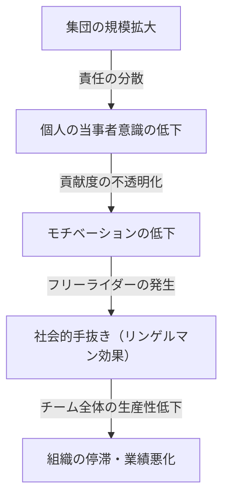
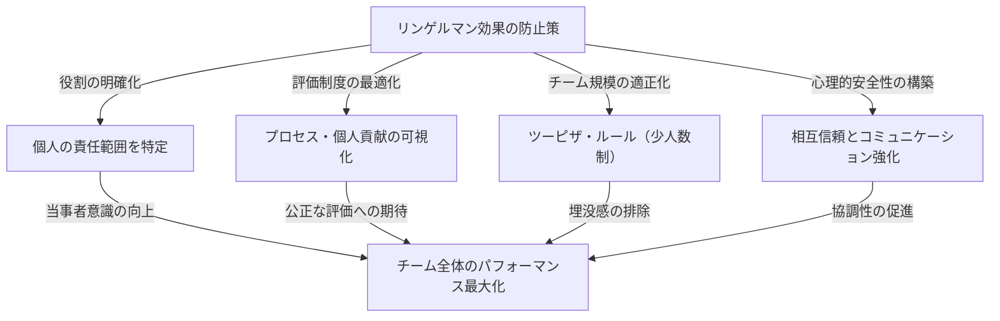

# リンゲルマン効果（社会的手抜き）とは何か？組織を蝕む見えない罠の正体

ビジネスの現場や日常生活の中で、「人数が増えれば増えるほど、なぜか一人ひとりのパフォーマンスが落ちている気がする」と感じたことはないでしょうか？1人で仕事をしているときは非常に優秀で迅速に行動する人物が、5人、10人というチームに組み込まれた途端、どこか他人任せになり、目立った成果を出さなくなる。これは決してその人の能力が急激に低下したわけでも、性格が突然怠惰になったわけでもありません。

この現象には、心理学および組織行動学の分野で明確な名前がつけられています。それが**「リンゲルマン効果（Ringelmann Effect）」**、別名**「社会的手抜き（Social Loafing）」**です。

本記事では、このリンゲルマン効果がなぜ発生するのかという歴史的背景や心理的メカニズムから、現代のビジネス組織においてどのような形で現れるのか、そしてこの罠を回避し、チームの生産性を真の意味で最大化するためにはどのような具体的な対策を講じるべきなのかについて、極めて詳細かつ実践的に解説していきます。数千文字にわたるこの徹底ガイドを通じて、あなたの組織やチームが抱える「見えない非効率」を打ち破るヒントを見つけてください。

---

## 1. 歴史的背景：マクシミリアン・リンゲルマンの綱引き実験

リンゲルマン効果の発見は、100年以上前の1913年にまで遡ります。フランスの農学者であるマクシミリアン・リンゲルマン（Maximilien Ringelmann）は、農業における労働者の作業効率を研究する過程で、非常に興味深い現象に気づきました。彼は、人が集団で作業を行う際、個人の作業量がどのように変化するかを測定するために「綱引き」を用いた実験を行いました。

### 実験の概要と驚くべき結果
実験のルールは極めてシンプルです。被験者にロープを引かせ、その牽引力を測定器で計測するというものでした。まずは1人で引かせた場合の平均牽引力を「100%（約63kg）」と定義します。論理的に考えれば、2人で引けば200%、3人で引けば300%、8人で引けば800%の力が発揮されるはずです。

しかし、結果は期待を大きく裏切るものでした。
- **1人の場合**：100%（本来の力を発揮）
- **2人の場合**：約93%（1人あたりの力がわずかに低下）
- **3人の場合**：約85%
- **4人の場合**：約77%
- **8人の場合**：約49%（1人あたり、本来の半分の力しか出していない）

この結果が示す事実は残酷なほど明確でした。<strong>「集団の人数が増えるほど、一人ひとりが発揮する力は反比例して低下する」</strong>ということです。8人がかりで綱を引いているとき、彼らは決して「手を抜こう」と悪意を持っていたわけではありません。しかし、無意識のうちに「自分が全力を出さなくても、誰かがやってくれるだろう」という心理が働き、結果として個人のパフォーマンスが半減してしまったのです。

この画期的な発見は、後に多くの心理学者や組織行動学者によって追試され、力仕事だけでなく、ブレインストーミングなどの知的作業や、会議での発言、さらには緊急時の人助け（傍観者効果）など、あらゆる人間の集団活動において同様の「手抜き」が発生することが証明されました。

---

## 2. リンゲルマン効果が発生する心理的メカニズム

では、なぜ人は集団になると無意識に手を抜いてしまうのでしょうか。その背景には、人間の防衛本能や社会的な認知バイアスが複雑に絡み合っています。リンゲルマン効果を引き起こす主な要因は、以下の4つに大別されます。

### ① 責任の分散（Diffusion of Responsibility）
最も大きな要因が「責任の分散」です。1人でタスクを担当している場合、その成否は100%自分にかかっています。成功すれば自分の手柄になり、失敗すれば自分の責任になります。しかし、複数人でタスクを共有すると「自分がやらなくても他の誰かがやってくれるだろう」「失敗しても自分の責任は数分の一で済む」という心理的安心感が生まれます。これが当事者意識を低下させます。

### ② 評価の不透明性（Lack of Identifiability）
集団作業において、個人の貢献度が明確に測定できない場合、人は努力を怠る傾向にあります。先ほどの綱引き実験のように「誰がどれだけ強く引いているか」が個別に見えない状況下では、「全力を出しても評価されないなら、適当にやっても同じだ」という心理（無力感や徒労感）が働きます。

### ③ 同調圧力と「タダ乗り（フリーライダー）」
優秀なメンバーが数人いるチームでは、「彼らに任せておけば仕事は回る」と学習してしまうメンバーが現れます。これが「フリーライダー（タダ乗り）」と呼ばれる現象です。さらに恐ろしいのは、一生懸命働いているメンバーも「あいつがサボっているのに、自分だけ全力でやるのはバカバカしい」と感じ、手抜きを始めることです。これを**サッカー効果（Sucker Effect：バカを見る効果）**と呼びます。

### ④ 目的や目標の不明確さ
チームの向かっている方向や、その仕事が組織全体にどのような価値をもたらすのか（タスクの有意味性）が曖昧な場合、個人のモチベーションは著しく低下します。「なんのためにやっているのかわからない作業」を大人数で分担させられたとき、手抜きは最大化します。

---

## 3. 現代ビジネスにおけるリンゲルマン効果の脅威

リンゲルマン効果は、現代のビジネスシーンにおいて日常的に発生しており、組織の生産性を静かに、しかし確実に削り取っています。具体的にどのような場面でこの罠が潜んでいるのかを見ていきましょう。

### 肥大化した会議と「沈黙する参加者」
「念のため関係者を全員呼んでおこう」という発想で設定された10人以上の会議は、リンゲルマン効果の温床です。参加者が多ければ多いほど、「自分が発言しなくても誰かが意見を出すだろう」と考え、大半の参加者が傍観者となります。結果として、発言するのは一部のマネージャーや声の大きい社員のみとなり、多様な意見を集めるという会議本来の目的が失われます。

### プロジェクトの責任者不在
大規模なプロジェクトで「全員がリーダーシップを持って推進しよう」というスローガンが掲げられることがあります。しかし、これは危険な兆候です。役割と責任が明確に個人に割り当てられていない場合、「全員の責任は、誰の責任でもない」状態に陥ります。タスクの押し付け合いや、期限直前になって「誰もやっていなかった」というトラブルが頻発します。

### CCメールの乱用
情報共有のために数十人が宛先に入った「CCメール」。これも社会的手抜きを誘発します。「これだけの人が見ているのだから、誰かが対応・返信するだろう」と思い込み、結果的に全員がスルーしてしまうという事態が発生します。

---

## 4. リンゲルマン効果を打破する具体的な防衛策

組織からリンゲルマン効果を完全に排除することは、人間の心理構造上不可能かもしれません。しかし、適切なマネジメントとチームデザインによって、その影響を最小限に抑え、個人のパフォーマンスを引き出すことは十分に可能です。ここでは、具体的な対策を解説します。

### ① チーム規模の適正化（ツーピザ・ルールの導入）
Amazonの創業者ジェフ・ベゾスが提唱した「ツーピザ・ルール（Two-Pizza Rule）」は、リンゲルマン効果を防ぐ最も有名な手法の一つです。これは「チームの人数は、2枚のピザを分け合ってちょうど満腹になる程度の人数（およそ5〜8人）にすべきだ」という経験則です。チームがこれ以上の規模になる場合は、サブチームに分割することで、個人の「埋没感」を防ぎ、一人ひとりの存在意義を高めることができます。

### ② 個人の役割と責任（KPI）の明確化
プロジェクトを開始する前に、誰が・何を・いつまでに・どのレベルで達成するのかを明確に定義し、ドキュメント化します。「全員で頑張る」ではなく、「あなたは〇〇の責任者である」という当事者意識を持たせることが重要です。RACIチャート（実行責任者、説明責任者、協業先、報告先をマトリクス化したもの）などを活用すると効果的です。

### ③ プロセスと貢献度の可視化
結果だけでなく、そこに至るプロセスや個人の努力を可視化する仕組みが必要です。タスク管理ツール（Jira, Trello, Asanaなど）を導入し、誰がどのタスクを完了させたかをチーム全体で共有することで、「見られている」「評価されている」という健全なプレッシャーと承認欲求を満たす環境を構築します。

### ④ 内発的動機づけと目標の共有
メンバーがタスクに対して意義を見出せるよう、ビジョンや目的を繰り返し伝えます。「なぜこの仕事が必要なのか」「これが顧客や社会にどう役立つのか」を理解しているメンバーは、集団の中にいても手を抜くことなく、自律的に動くようになります。

### ⑤ 心理的安全性の担保
「手抜きをしているわけではないが、やり方がわからなくて止まっている」というメンバーが、すぐに助けを求められる環境を作ります。失敗を許容し、相互に支援し合える心理的安全性（Psychological Safety）が高いチームでは、サッカー効果（他人の手抜きを見て自分も手を抜く現象）が発生しにくくなります。

---

## 5. まとめ：個の力を最大化する組織づくり

リンゲルマン効果（社会的手抜き）は、人間の怠慢さから来るものではなく、集団という環境が引き起こす自然な心理的反応です。したがって、「もっとやる気を出せ」「当事者意識を持て」といった精神論で解決しようとするのはマネジメントの怠慢と言わざるを得ません。

真に優れた組織やリーダーは、人間が手を抜いてしまう生き物であることを前提とした上で、<strong>「誰もが全力を出したくなる、あるいは全力を出さざるを得ない環境」</strong>をシステムとして構築します。チームを少人数に保ち、役割を明確にし、貢献を正当に評価する。この基本を徹底することこそが、リンゲルマン効果という見えない罠から組織を救い出し、圧倒的なパフォーマンスを生み出す唯一の道なのです。

あなたのチームでも、今日から「会議の人数を絞る」「タスクの担当者を1人に特定する」といった小さな工夫から始めてみてはいかがでしょうか。その小さな一歩が、組織全体の生産性を劇的に変えるきっかけになるはずです。
