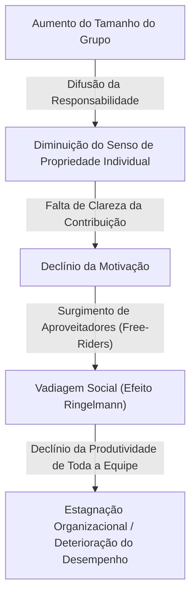
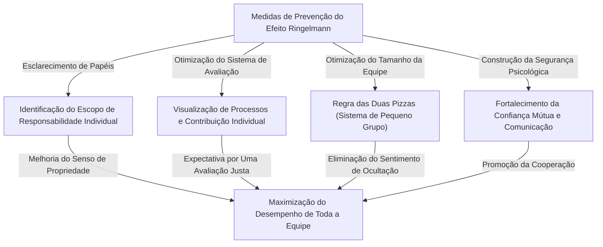

# O que é o Efeito Ringelmann (Vadiagem Social)? A verdadeira identidade da armadilha invisível que corrói a organização

Você já sentiu, no ambiente de negócios ou na vida cotidiana, que "quanto mais o número de pessoas aumenta, o desempenho individual de alguma forma parece cair"? Uma pessoa que age de forma muito excelente e rápida ao trabalhar sozinha, de repente passa a depender dos outros e deixa de produzir resultados notáveis assim que é incorporada a uma equipe de 5 ou 10 pessoas. Isso não significa absolutamente que a capacidade da pessoa tenha caído de repente, nem que sua personalidade tenha se tornado repentinamente preguiçosa.

Este fenômeno tem um nome claro nos campos da psicologia e do comportamento organizacional. Trata-se do **"Efeito Ringelmann (Ringelmann Effect)"**, também conhecido como **"Vadiagem Social (Social Loafing)"**.

Neste artigo, explicaremos de forma extremamente detalhada e prática, desde o contexto histórico e os mecanismos psicológicos de por que esse Efeito Ringelmann ocorre, até como ele se manifesta nas organizações empresariais modernas e quais medidas concretas devem ser tomadas para evitar essa armadilha e maximizar a produtividade da equipe no verdadeiro sentido. Através deste guia completo de milhares de palavras, esperamos que você encontre dicas para quebrar a "ineficiência invisível" que sua organização ou equipe enfrenta.

---

## 1. Contexto Histórico: A Experiência de Cabo de Guerra de Maximilien Ringelmann

A descoberta do Efeito Ringelmann remonta a 1913, há mais de 100 anos. O engenheiro agrônomo francês Maximilien Ringelmann notou um fenômeno muito interessante no processo de pesquisa da eficiência do trabalho dos trabalhadores na agricultura. Ele realizou um experimento usando um "cabo de guerra" para medir como a quantidade de trabalho individual muda quando as pessoas trabalham em grupos.

### Visão Geral do Experimento e Resultados Surpreendentes
As regras do experimento são extremamente simples. Os indivíduos foram solicitados a puxar uma corda, e sua força de tração foi medida com um instrumento de medição. Primeiro, a força média de tração ao puxar sozinho é definida como "100% (cerca de 63 kg)". Pensando logicamente, se 2 pessoas puxarem, 200% da força deverá ser exercida, se 3 pessoas puxarem, 300%, e se 8 pessoas puxarem, 800%.

No entanto, os resultados traíram amplamente as expectativas.
- **Para 1 pessoa**: 100% (exerce sua força original)
- **Para 2 pessoas**: cerca de 93% (a força por pessoa diminui ligeiramente)
- **Para 3 pessoas**: cerca de 85%
- **Para 4 pessoas**: cerca de 77%
- **Para 8 pessoas**: cerca de 49% (por pessoa, exercem apenas metade da força original)

O fato mostrado por este resultado foi cruelmente claro. Trata-se de **"à medida que o número de pessoas no grupo aumenta, a força exercida por cada indivíduo diminui de forma inversamente proporcional"**. Quando 8 pessoas puxam a corda, eles não tinham nenhuma intenção maliciosa de "economizar esforço". No entanto, a psicologia de "mesmo que eu não dê o meu melhor, alguém o fará" operou inconscientemente e, como resultado, o desempenho individual caiu pela metade.

Esta descoberta inovadora foi posteriormente replicada por muitos psicólogos e estudiosos do comportamento organizacional e provou que uma "vadiagem" semelhante ocorre em todas as atividades de grupo humano, não apenas no trabalho físico, mas também no trabalho intelectual como brainstorming, discursos em reuniões, e até mesmo na ajuda a pessoas em emergências (Efeito Espectador).

---

## 2. Mecanismo Psicológico Onde Ocorre o Efeito Ringelmann

Então, por que as pessoas relaxam inconscientemente quando estão em grupos? Em seu contexto, o instinto de defesa humana e os vieses cognitivos sociais estão intrinsecamente interligados. Os principais fatores que causam o Efeito Ringelmann são divididos nos seguintes 4 grupos.

### ① Difusão da Responsabilidade (Diffusion of Responsibility)
O maior fator é a "difusão da responsabilidade". Quando você é responsável por uma tarefa sozinho, seu sucesso ou fracasso depende 100% de você. Se for bem-sucedido, será seu mérito; se falhar, será sua responsabilidade. No entanto, quando as tarefas são compartilhadas por várias pessoas, surge uma sensação de segurança psicológica de que "mesmo que eu não o faça, alguém o fará" e "mesmo que eu falhe, minha responsabilidade será apenas uma fração". Isso diminui o senso de propriedade.

### ② Falta de Clareza na Avaliação (Lack of Identifiability)
No trabalho em grupo, quando o grau de contribuição de um indivíduo não pode ser medido claramente, as pessoas tendem a negligenciar o esforço. Como no experimento do cabo de guerra mencionado anteriormente, numa situação onde não se pode ver individualmente "quem está puxando o quão forte", entra em ação a psicologia (sensação de impotência ou futilidade) de que "se eu não for avaliado mesmo que dê o meu melhor, será a mesma coisa se eu o fizer de qualquer jeito".

### ③ Pressão dos Pares e "Aproveitadores (Free-rider)"
Numa equipe com vários membros excelentes, aparecerão membros que aprendem que "se deixarmos para eles, o trabalho será feito". Este é um fenômeno chamado "Aproveitador (Free-rider)". O que é ainda mais assustador é que até os membros que trabalham arduamente sentem que "é estúpido dar o meu melhor sozinho enquanto aquele cara está matando trabalho" e começam a relaxar. Isso é chamado de **Efeito Otário (Sucker Effect)**.

### ④ Falta de Clareza nos Propósitos e Objetivos
Quando a direção para onde a equipe está indo e que valor o trabalho trará para toda a organização (significado da tarefa) são ambíguos, a motivação individual diminui significativamente. A vadiagem é maximizada quando um grande número de pessoas é designado para compartilhar "tarefas cujo propósito não é compreendido".

---

## 3. A Ameaça do Efeito Ringelmann nos Negócios Modernos

O Efeito Ringelmann ocorre no dia a dia no cenário empresarial moderno, corroendo silenciosamente, mas com certeza, a produtividade da organização. Vejamos especificamente em quais situações esta armadilha está escondida.

### Reuniões Inchadas e "Participantes Silenciosos"
Reuniões com mais de 10 pessoas marcadas com a ideia de "vamos chamar todos os envolvidos por precaução" são um terreno fértil para o Efeito Ringelmann. Quanto maior for o número de participantes, mais pensarão "mesmo que eu não fale, alguém dará a sua opinião", e a maioria dos participantes torna-se espectadora. Como resultado, apenas alguns gerentes e funcionários com voz forte falam, e o propósito original da reunião de reunir opiniões diversas é perdido.

### Ausência do Responsável Pelo Projeto
Em projetos de grande escala, às vezes surge o slogan "vamos todos assumir a liderança e promover isso". No entanto, isso é um sinal de perigo. Quando papéis e responsabilidades não são claramente atribuídos aos indivíduos, a situação cai em um estado de "a responsabilidade de todos não é responsabilidade de ninguém". Problemas como empurrar tarefas uns para os outros e perceber que "ninguém tinha feito isso" pouco antes do prazo se tornam frequentes.

### Uso Excessivo de E-mails em CC
"E-mails em CC" com dezenas de destinatários para compartilhamento de informações. Isso também induz a vadiagem social. As pessoas assumem que "como muitas pessoas estão assistindo isso, alguém responderá ou reagirá", o que resulta em uma situação em que todos os ignoram.

---

## 4. Medidas de Defesa Concretas Para Romper o Efeito Ringelmann

Pode ser impossível eliminar completamente o Efeito Ringelmann das organizações devido à estrutura psicológica humana. No entanto, através da gestão adequada e do design da equipe, é perfeitamente possível minimizar o seu impacto e extrair o desempenho individual. Aqui, explicaremos as medidas concretas.

### ① Otimização do Tamanho da Equipe (Introdução da Regra das Duas Pizzas)
A "Regra das Duas Pizzas (Two-Pizza Rule)" proposta pelo fundador da Amazon, Jeff Bezos, é um dos métodos mais famosos para prevenir o Efeito Ringelmann. Esta é uma regra empírica que diz que "o número de pessoas em uma equipe deve ser tal que compartilhar duas pizzas seja exatamente suficiente para satisfazer a todos (cerca de 5 a 8 pessoas)". Se a equipe crescer além desse tamanho, dividi-la em subequipes pode evitar o "sentimento de ocultação" individual e aumentar o sentido de existência de cada pessoa.

### ② Esclarecimento dos Papéis e Responsabilidades Individuais (KPI)
Antes de iniciar um projeto, defina claramente e documente quem, o que, até quando e em que nível deve ser alcançado. É importante ter um senso de propriedade de "você é o responsável por XX" em vez de "vamos todos trabalhar duro". O uso do gráfico RACI (uma matriz que mostra quem é Responsável pela Execução, Responsável pela Aprovação, Consultado e Informado) e semelhantes é eficaz.

### ③ Visualização de Processos e Nível de Contribuição
É necessário um mecanismo para visualizar não apenas os resultados, mas também os processos e os esforços individuais que levam até eles. Ao introduzir ferramentas de gerenciamento de tarefas (Jira, Trello, Asana, etc.) e compartilhar com toda a equipe quem concluiu qual tarefa, construímos um ambiente que satisfaz o desejo de reconhecimento e uma pressão saudável de ser "observado" e "avaliado".

### ④ Motivação Intrínseca e Compartilhamento de Objetivos
Comunique a visão e o propósito repetidamente para que os membros possam encontrar significado em suas tarefas. Os membros que entendem "por que este trabalho é necessário" e "como isto é útil para os clientes e a sociedade" mover-se-ão de forma autônoma e não relaxarão, mesmo que estejam em um grupo.

### ⑤ Garantia da Segurança Psicológica
Crie um ambiente no qual os membros que "não estão de vadiagem, mas estão travados porque não sabem como fazê-lo" possam pedir ajuda imediatamente. Em uma equipe com alta Segurança Psicológica (Psychological Safety) que tolera fracassos e apoia uns aos outros, o Efeito Otário (o fenômeno de relaxar ao ver os outros relaxarem) é menos propenso a ocorrer.

---

## 5. Conclusão: Criação de Organização Que Maximiza o Poder Individual

O Efeito Ringelmann (vadiagem social) não advém da preguiça humana, mas é uma reação psicológica natural causada pelo ambiente do grupo. Portanto, devo dizer que tentar resolvê-lo através da teoria moral, como "mostre mais motivação" ou "tenha um senso de propriedade", é uma negligência na gestão.

Organizações e líderes verdadeiramente excelentes assumem que os humanos são criaturas que relaxam e constroem um **"ambiente onde todos querem ou são forçados a dar o seu melhor"** como um sistema. Mantenha a equipe em um número pequeno, esclareça os papéis e avalie as contribuições de maneira justa. Ser minucioso com esse básico é a única maneira de salvar a organização da armadilha invisível chamada Efeito Ringelmann e produzir um desempenho esmagador.

Por que você não começa com as pequenas inovações de "reduzir o número de participantes em reuniões" ou "especificar um indivíduo responsável pela tarefa" em sua equipe a partir de hoje? Esse pequeno passo deve ser um catalisador para mudar drasticamente a produtividade de toda a organização.
