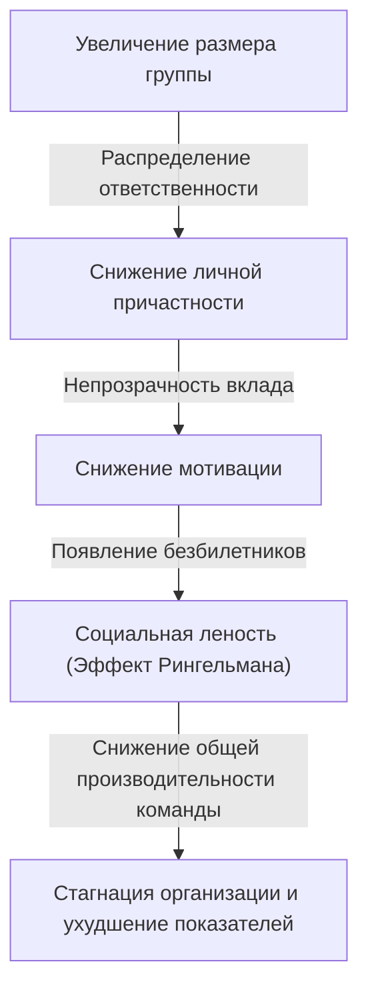
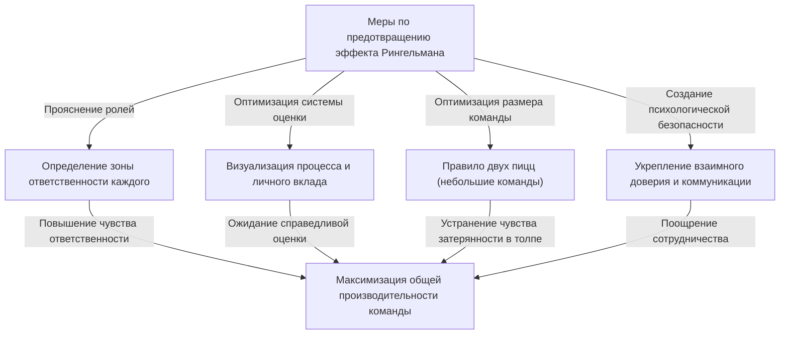

# Что такое эффект Рингельмана (социальная леность)? Истинное лицо невидимой ловушки, разрушающей организации

Случалось ли вам замечать на работе или в повседневной жизни: «Чем больше людей, тем ниже, кажется, производительность каждого отдельного человека»? Человек, который отлично и быстро работает в одиночку, попадая в команду из 5 или 10 человек, вдруг начинает перекладывать ответственность на других и перестает выдавать заметные результаты. Это вовсе не означает, что его способности резко упали или что он внезапно стал ленивым.

Для этого явления в психологии и организационном поведении есть четкое название: **«Эффект Рингельмана (Ringelmann Effect)»**, также известный как **«Социальная леность (Social Loafing)»**.

В этой статье мы подробно и максимально практично объясним, почему возникает этот эффект с точки зрения исторического контекста и психологических механизмов, как он проявляется в современных бизнес-организациях, и какие конкретные меры необходимо предпринять, чтобы избежать этой ловушки и по-настоящему максимизировать производительность команды. Прочитав это всеобъемлющее руководство, состоящее из тысяч слов, вы найдете подсказки, как преодолеть «невидимую неэффективность» вашей организации или команды.

---

## 1. Исторический контекст: эксперимент с перетягиванием каната Максимилиана Рингельмана

Открытие эффекта Рингельмана восходит к 1913 году, более 100 лет назад. Французский агроном Максимилиан Рингельман (Maximilien Ringelmann) в процессе изучения производительности труда сельскохозяйственных рабочих заметил очень интересное явление. Чтобы измерить, как меняется объем работы отдельного человека при групповой работе, он провел эксперимент с «перетягиванием каната».

### Описание эксперимента и удивительные результаты
Правила эксперимента были предельно просты. Испытуемых просили тянуть канат, а сила их тяги измерялась специальным прибором. Сначала средняя сила тяги одного человека была определена как «100% (около 63 кг)». По логике, двое людей должны были бы тянуть на 200%, трое — на 300%, а восемь — на 800%.

Однако результаты сильно разошлись с ожиданиями.
- **1 человек**: 100% (использует всю свою силу)
- **2 человека**: около 93% (сила на одного человека немного снижается)
- **3 человека**: около 85%
- **4 человека**: около 77%
- **8 человек**: около 49% (каждый использует лишь половину своей первоначальной силы)

Факты, которые показали эти результаты, были жестоко очевидны: **«Чем больше численность группы, тем больше индивидуальная сила каждого снижается в обратной пропорции»**. Когда восемь человек тянули канат, у них не было злого умысла «схалтурить». Однако подсознательно срабатывала психология: «Даже если я не выложусь на все сто, кто-нибудь другой это сделает», в результате чего личная производительность падала вдвое.

Это революционное открытие позже было подтверждено многими психологами и специалистами по организационному поведению. Было доказано, что подобная «леность» возникает в любой групповой деятельности людей: не только при физическом труде, но и при интеллектуальной работе, такой как мозговой штурм, при высказываниях на собраниях и даже при помощи людям в чрезвычайных ситуациях (эффект свидетеля).

---

## 2. Психологический механизм возникновения эффекта Рингельмана

Так почему же люди бессознательно начинают халтурить, когда оказываются в группе? За этим стоит сложное переплетение человеческих защитных инстинктов и социальных когнитивных искажений. Основные факторы, вызывающие эффект Рингельмана, можно разделить на четыре категории:

### ① Распределение ответственности (Diffusion of Responsibility)
Самый большой фактор — это «распределение ответственности». Когда человек отвечает за задачу в одиночку, ее успех или провал на 100% зависит от него. Успех станет его заслугой, а провал — его виной. Однако, если задачу делят несколько человек, возникает психологическое чувство безопасности: «Даже если я этого не сделаю, сделает кто-то другой» или «Даже если мы потерпим неудачу, моя доля ответственности будет лишь частью общей». Это снижает чувство личной ответственности.

### ② Непрозрачность оценки (Lack of Identifiability)
При групповой работе, когда личный вклад невозможно четко измерить, люди склонны пренебрегать усилиями. Как в эксперименте с перетягиванием каната, когда не видно, «кто и насколько сильно тянет», срабатывает психология (чувство бессилия и тщетности): «Если я выложусь на полную, но это не будет оценено, то результат будет таким же, как если бы я работал спустя рукава».

### ③ Конформизм и «Безбилетники» (Free Riders)
В команде с несколькими высококлассными специалистами появляются участники, которые усваивают: «Если доверить работу им, то все будет сделано». Это явление называется «безбилетник» (free rider). Что еще хуже, те, кто работает изо всех сил, тоже начинают халтурить, чувствуя: «Глупо выкладываться на полную, когда тот парень бездельничает». Это называется **«Эффект простака» (Sucker Effect)**.

### ④ Неясность целей и задач
Когда направление, в котором движется команда, или ценность, которую эта работа приносит всей организации (значимость задачи), туманны, личная мотивация значительно падает. Когда задачу, «смысл которой непонятен», делят между большим количеством людей, уровень халтуры достигает максимума.

---

## 3. Угроза эффекта Рингельмана в современном бизнесе

Эффект Рингельмана повсеместно встречается в современном бизнесе, тихо, но верно снижая производительность организаций. Давайте посмотрим, в каких именно ситуациях скрывается эта ловушка.

### Раздутые совещания и «молчаливые участники»
Совещания с участием 10 и более человек, организованные с мыслью «давайте позовем всех причастных на всякий случай», — это рассадник эффекта Рингельмана. Чем больше участников, тем чаще возникает мысль: «Кто-то другой выскажет свое мнение, даже если я промолчу», и большинство становится просто наблюдателями. В результате говорят только некоторые менеджеры или самые громкие сотрудники, а первоначальная цель совещания — собрать разные мнения — теряется.

### Отсутствие ответственного за проект
В крупных проектах часто выдвигается лозунг: «Давайте все проявим лидерство и будем двигать проект вперед». Однако это опасный симптом. Если роли и обязанности не закреплены четко за конкретными людьми, возникает ситуация, когда «общая ответственность означает, что никто не несет ответственности». Возникает перекладывание задач друг на друга и частые проблемы перед самым дедлайном, когда выясняется, что «никто этого не сделал».

### Злоупотребление копиями в электронных письмах (CC)
Электронные письма, в которых в копии (CC) стоят десятки человек для «обмена информацией», также провоцируют социальную леность. Люди думают: «Раз это видит столько людей, кто-нибудь точно ответит», и в итоге письмо игнорируют все.

---

## 4. Конкретные меры защиты для преодоления эффекта Рингельмана

Полностью исключить эффект Рингельмана из организации может быть невозможно из-за особенностей человеческой психологии. Однако с помощью правильного менеджмента и дизайна команды можно свести его влияние к минимуму и раскрыть потенциал каждого сотрудника. Здесь мы рассмотрим конкретные меры.

### ① Оптимизация размера команды (Внедрение правила двух пицц)
«Правило двух пицц (Two-Pizza Rule)», предложенное основателем Amazon Джеффом Безосом, является одним из самых известных методов предотвращения эффекта Рингельмана. Это эмпирическое правило гласит: «Команда должна быть такого размера, чтобы двух пицц хватило накормить всех (примерно 5-8 человек)». Если команда превышает этот размер, ее разделение на подкоманды поможет предотвратить чувство «затерянности в толпе» у отдельных участников и повысить значимость каждого.

### ② Четкое определение личных ролей и обязанностей (KPI)
Перед началом проекта четко определите и задокументируйте: кто, что, к какому сроку и на каком уровне должен выполнить. Важно воспитать чувство личной ответственности: не «мы все будем стараться», а «ты отвечаешь за это». Эффективно использовать такие инструменты, как матрица RACI (Responsible, Accountable, Consulted, Informed — Исполнитель, Ответственный, Консультант, Наблюдатель).

### ③ Визуализация процесса и вклада
Необходима система, которая делает видимыми не только результаты, но и процесс их достижения, а также личные усилия. Внедрение инструментов управления задачами (таких как Jira, Trello, Asana) и совместное использование информации о том, кто какую задачу выполнил, создает здоровое давление от того, что за тобой «наблюдают» и тебя «оценивают», а также удовлетворяет потребность в признании.

### ④ Внутренняя мотивация и общие цели
Постоянно рассказывайте о видении и целях, чтобы участники видели смысл в своих задачах. Сотрудники, которые понимают: «Почему эта работа необходима?» и «Как это поможет клиентам или обществу?», будут действовать автономно и не станут халтурить, даже находясь в группе.

### ⑤ Обеспечение психологической безопасности
Создайте среду, в которой сотрудник, который «не халтурит, но застрял, потому что не знает, как сделать», может сразу же попросить о помощи. В командах с высоким уровнем психологической безопасности (Psychological Safety), где допускаются ошибки и поддерживается взаимопомощь, «эффект простака» (когда человек начинает халтурить, глядя на других) возникает реже.

---

## 5. Заключение: создание организации, максимизирующей силу личности

Эффект Рингельмана (социальная леность) — это не следствие человеческой лени, а естественная психологическая реакция, вызываемая групповой средой. Поэтому попытки решить эту проблему призывами «старайтесь больше» или «проявляйте больше ответственности» можно назвать лишь управленческой ленью.

По-настоящему выдающиеся организации и лидеры исходят из того, что люди склонны халтурить, и выстраивают систему, в которой **«каждый сам хочет выложиться на полную или вынужден это сделать»**. Поддерживайте небольшой размер команд, четко распределяйте роли и справедливо оценивайте вклад каждого. Тщательное соблюдение этих основ — единственный способ спасти организацию от невидимой ловушки эффекта Рингельмана и достичь выдающейся производительности.

Почему бы вам не начать с небольших изменений в своей команде уже сегодня, например, «ограничить число участников совещаний» или «назначать только одного ответственного за задачу»? Эти маленькие шаги могут стать ключом к радикальному изменению производительности всей организации.
