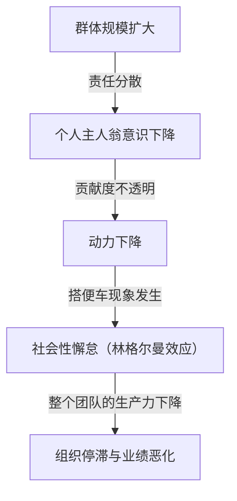
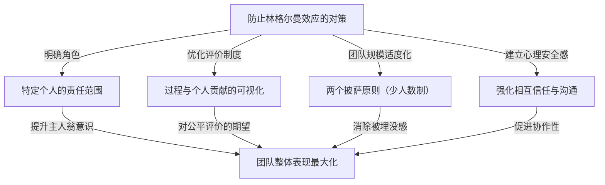

# 什么是林格尔曼效应（社会性懈怠）？侵蚀组织的无形陷阱之真面目

在商业现场或日常生活中，你是否曾感到“人数越多，不知为何每个人的表现似乎就越差”？当一个人单独工作时表现非常出色、行动迅速，但一旦被编入5人、10人的团队中，就会不知不觉把事情推给别人，不再交出显著的成果。这绝不是那个人的能力突然下降，也不是性格突然变得懒惰。

这种现象在心理学和组织行为学领域有一个明确的名字。那就是**“林格尔曼效应（Ringelmann Effect）”**，别名**“社会性懈怠（Social Loafing）”**。

本文将从林格尔曼效应发生的历史背景和心理机制，到其在现代商业组织中以何种形式出现，再到为了避开这个陷阱并真正最大化团队生产力应采取哪些具体对策，进行极其详细且实用的解说。通过这篇长达数千字的彻底指南，希望能为你打破你的组织或团队所面临的“无形低效”提供启示。

---

## 1. 历史背景：马克斯·林格尔曼的拔河实验

林格尔曼效应的发现可以追溯到100多年前的1913年。法国农学家马克斯·林格尔曼（Maximilien Ringelmann）在研究农业工人的工作效率的过程中，注意到了一个非常有趣的现象。为了测量人们在群体中进行作业时个人工作量会如何变化，他利用“拔河”进行了一项实验。

### 实验概要与令人惊讶的结果
实验的规则非常简单。让受试者拉绳子，并用测量仪记录其牵引力。首先将一个人拉时的平均牵引力定义为“100%（约63kg）”。按逻辑思考，如果两个人拉，应该发挥200%的力量，三个人拉是300%，八个人拉则是800%。

然而，结果却大失所望。
- **1人的情况**：100%（发挥了原本的力量）
- **2人的情况**：约93%（人均力量略有下降）
- **3人的情况**：约85%
- **4人的情况**：约77%
- **8人的情况**：约49%（每个人只发挥了原本力量的一半）

这一结果所揭示的事实残酷地明确。**“随着群体人数的增加，每个人所发挥的力量会成反比地下降”**。当8个人一起拉绳子时，他们绝不是怀着“偷懒”的恶意。然而，在无意识中“即使我不全力以赴，也会有别人去做吧”的心理发挥了作用，结果导致个人表现减半。

这项划时代的发现后来被许多心理学家和组织行为学家复现，不仅在体力劳动中，在头脑风暴等智力工作、会议发言、甚至紧急情况下的救人（旁观者效应）等所有人类群体活动中，都证明了同样的“懈怠”会发生。

---

## 2. 林格尔曼效应发生的心理机制

那么，为什么人在群体中会无意识地偷懒呢？其背景是人类的防卫本能和社会认知偏见复杂交织。引发林格尔曼效应的主要因素大致分为以下四点。

### ① 责任分散（Diffusion of Responsibility）
最大的因素是“责任分散”。当一个人负责一项任务时，其成败100%取决于自己。成功是自己的功劳，失败是自己的责任。但是，当多人分担任务时，就会产生一种“即使我不做也会有其他人做”“即使失败，自己的责任也只有几分之一”的心理安全感。这降低了主人翁意识（当事人意识）。

### ② 评价的不透明性（Lack of Identifiability）
在群体作业中，如果个人的贡献度无法被明确衡量，人们往往倾向于怠惰。就像之前的拔河实验一样，在看不见“谁用了多少力”的状况下，会产生“即使全力以赴也得不到评价，随便做做也一样”的心理（无力感或徒劳感）。

### ③ 从众压力与“搭便车（Free Rider）”
在有几名优秀成员的团队中，会出现一些学习到“交给他们工作就能运转”的成员。这就是被称为“搭便车（Free Rider）”的现象。更可怕的是，那些拼命工作的成员也会觉得“那家伙在偷懒，只有我全力坚守太傻了”，从而开始懈怠。这被称为**“傻瓜效应（Sucker Effect）”**。

### ④ 目的或目标不明确
如果团队前进的方向，或者该工作将给整个组织带来什么价值（任务的意义性）含糊不清，个人的动力就会显著下降。当要求一大群人分担一项“不知道为了什么而做的任务”时，懈怠就会最大化。

---

## 3. 现代商业中林格尔曼效应的威胁

林格尔曼效应在现代商业场景中经常发生，正悄无声息却确实地削弱着组织的生产力。让我们看看这种陷阱具体潜伏在哪些场景中。

### 臃肿的会议与“沉默的参与者”
出于“为了保险起见把相关人员都叫上”的想法而设定的10人以上的会议，是林格尔曼效应的温床。参与者越多，他们越会认为“即使我不发言也会有人提出意见”，大半的参与者成了旁观者。结果，只有部分经理或嗓门大的员工发言，失去了收集多样化意见的会议本来目的。

### 项目负责人缺位
在大型项目中，有时会提出“所有人都要带着领导力来推进”的口号。然而，这是一个危险的信号。如果没有明确地将角色和责任分配到个人身上，就会陷入“所有人的责任就是没有人的责任”的状态。互相推诿任务，或者到了截止日期前才发现“谁也没做”的麻烦会频繁发生。

### 滥用抄送邮件
为了共享信息而将几十个人放在收件人列表中的“抄送邮件”。这也会诱发社会性懈怠。人们会认为“有这么多人看着，总会有人处理或回复吧”，结果发生所有人都不理会的情况。

---

## 4. 打破林格尔曼效应的具体防御对策

由于人类的心理结构，可能无法从组织中完全消除林格尔曼效应。但是，通过适当的管理和团队设计，完全可以将这种影响降到最低，并激发个人的表现。在这里，我们将解说具体的对策。

### ① 团队规模适度化（引入两个披萨原则）
亚马逊创始人杰夫·贝佐斯提倡的“两个披萨原则（Two-Pizza Rule）”，是防止林格尔曼效应最著名的方法之一。这是一条经验法则，即“团队的人数应保持在分享两个披萨就能刚好饱腹的程度（大约5到8人）”。如果团队超过这个规模，应将其划分为子团队，从而防止个人的“被埋没感”，提高每个人的存在意义。

### ② 明确个人的角色和责任（KPI）
在项目开始之前，要明确定义并记录谁、在什么时候之前、以什么水平、完成什么。“大家一起努力”是不够的，重要的是要让他们有“你是〇〇的负责人”的主人翁意识。活用 RACI 矩阵（执行责任人、最终责任人、被咨询者、被通知者）等会很有效。

### ③ 过程与贡献度的可视化
不仅是结果，还需要有将达到结果的过程和个人的努力可视化的机制。通过引入任务管理工具（Jira, Trello, Asana等），在整个团队中共享谁完成了哪项任务，构建一个满足“被看到”“被评价”这种健康压力和被认可欲求的环境。

### ④ 内在动机与目标共享
为了让成员能够发现任务的意义，要反复传达愿景和目的。理解了“为什么需要这项工作”“这对客户或社会有什么帮助”的成员，即使在群体中也不会偷懒，而是会自主行动。

### ⑤ 确保心理安全感
营造一个让觉得“不是在偷懒，而是不知道怎么做卡住了”的成员能够立即求助的环境。在允许失败、相互支持的心理安全感（Psychological Safety）高的团队中，很难发生傻瓜效应（看到别人偷懒自己也偷懒的现象）。

---

## 5. 总结：打造使个人力量最大化的组织

林格尔曼效应（社会性懈怠）并非来自于人类的懒惰，而是群体环境引发的自然心理反应。因此，试图通过“拿出更多干劲”“要有主人翁意识”这样的精神论来解决，只能说是管理的懈怠。

真正优秀的组织和领导者，在前提是人类这种生物会偷懒的基础上，会将**“建立一个让任何人都想全力以赴，或者不得不全力以赴的环境”**作为系统来构建。将团队保持在少数人，明确角色，公正地评价贡献。彻底贯彻这些基本，才是将组织从林格尔曼效应这个无形陷阱中拯救出来，产生压倒性表现的唯一途径。

在你的团队中，不妨从今天开始尝试“精简会议人数”“指定单个任务负责人”这样的小改变。这一小步必将成为戏剧性地改变整个组织生产力的契机。
