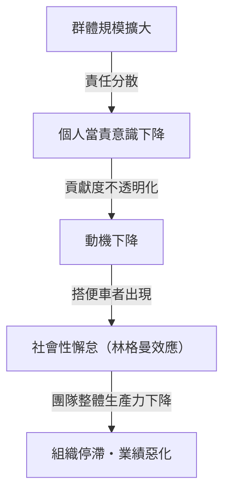
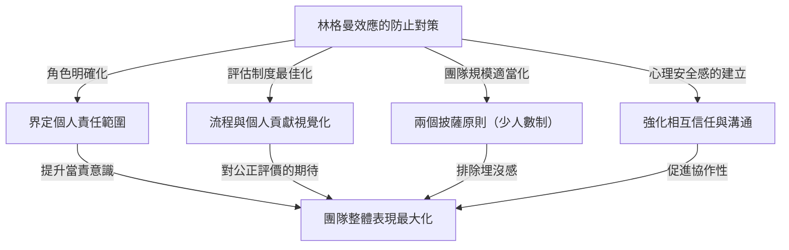

# 何謂林格曼效應（社會性懈怠）？侵蝕組織的無形陷阱之真面目

在商業現場或日常生活中，您是否曾經覺得「人數越多，每個人表現出的效率似乎反而越低」？一個人在工作時非常優秀且行動迅速的人，一旦被編入5人或10人的團隊中，不知為何就會變得依賴他人，不再有突出的表現。這絕對不是因為那個人的能力突然下降，也不是性格突然變得懶惰。

這種現象在心理學和組織行為學領域有一個明確的名稱。這就是**「林格曼效應（Ringelmann Effect）」**，又稱**「社會性懈怠（Social Loafing）」**。

本文將詳細且實用地解說林格曼效應為何發生的歷史背景與心理機制，它在現代商業組織中會以何種形式出現，以及為了避開這個陷阱並真正最大化團隊生產力，我們應該採取哪些具體的對策。希望透過這篇數千字的詳盡指南，您能找到打破您的組織或團隊所面臨的「無形低效」的啟發。

---

## 1. 歷史背景：馬克西米連·林格曼的拔河實驗

林格曼效應的發現可以追溯到100多年前的1913年。法國農學家馬克西米連·林格曼（Maximilien Ringelmann）在研究農業工人工作效率的過程中，注意到了一個非常有趣的現象。為了解個人在群體作業時的工作量會如何變化，他利用「拔河」進行了一項實驗。

### 實驗概要與令人驚訝的結果
實驗規則非常簡單。他讓受試者拉繩子，並用測量儀器記錄他們的拉力。首先，將1個人拉繩時的平均拉力定義為「100%（約63公斤）」。從邏輯上來想，2個人拉應該發揮200%，3個人拉發揮300%，8個人拉發揮800%的力量。

然而，結果卻大出所料。
- **1人的情況**：100%（發揮原本的力量）
- **2人的情況**：約93%（每人平均發揮的力量略微下降）
- **3人的情況**：約85%
- **4人的情況**：約77%
- **8人的情況**：約49%（每人平均只發揮了原本一半的力量）

這個結果所顯示的事實殘酷地明確。**「群體人數越多，每個人發揮的力量就越成反比下降」**。當8個人一起拉繩子時，他們絕對不是惡意地想要「偷懶」。但是，他們在無意識中產生了「即使我不出全力，也會有別人來做吧」的心理，結果導致個人的表現減半。

這項劃時代的發現在後來被許多心理學家和組織行為學家重新測試，證明了不只是體力勞動，在腦力激盪等智力作業、會議發言，甚至緊急情況下的救助（旁觀者效應）等所有人類的群體活動中，都會發生同樣的「懈怠」。

---

## 2. 發生林格曼效應的心理機制

那麼，為什麼人在群體中會無意識地偷懶呢？其背景交織著人類的防禦本能與社會認知偏誤。引發林格曼效應的主要因素可以分為以下四種。

### ① 責任分散（Diffusion of Responsibility）
最大的因素是「責任分散」。當由1個人負責一項任務時，其成敗100%取決於自己。成功是自己的功勞，失敗則是自己的責任。然而，當多人共同分擔任務時，會產生「即使我不做，也會有別人來做吧」、「即使失敗，我也只需負幾分之一的責任」的心理安全感。這會降低個人的當責意識。

### ② 評價的不透明性（Lack of Identifiability）
在群體作業中，如果無法明確衡量個人的貢獻度，人就會傾向於怠惰。就像前面的拔河實驗一樣，在無法個別看出「誰用了多少力」的狀況下，就會產生「既然盡了全力也不會被評價，那隨便做也是一樣的」的心理（無力感或徒勞感）。

### ③ 同儕壓力與「搭便車（Free Rider）」
在有幾位優秀成員的團隊中，會出現一些成員學會了「交給他們做事情就能運轉」。這就是被稱為「搭便車」的現象。更可怕的是，連努力工作的成員也會覺得「那傢伙在偷懶，只有我全力以赴太傻了」，進而開始偷懶。這被稱為**被騙者效應（Sucker Effect：怕吃虧效應）**。

### ④ 目的與目標的不明確
如果團隊的前進方向，或是該工作能為整個組織帶來什麼價值（任務的意義）模糊不清，個人的動機會顯著下降。當一大群人被分派去做「不知道為了什麼而做的作業」時，懈怠將達到最大化。

---

## 3. 現代商業中林格曼效應的威脅

林格曼效應在現代商業場景中是日常發生的，正在安靜卻確實地削弱組織的生產力。讓我們來看看這個陷阱具體潛伏在哪些場面中。

### 臃腫的會議與「沉默的參與者」
以「以防萬一，把所有關係人都叫來吧」的思維所安排的10人以上的會議，正是林格曼效應的溫床。參與者越多，大家就會認為「即使我不發言，也會有人提出意見」，大半的參與者變成了旁觀者。結果只有部分管理者或聲音大的人在發言，失去了收集多元意見這個會議原有的目的。

### 專案負責人缺席
在大型專案中，有時會提出「全員都要有領導力來推動」的口號。然而，這是一個危險的徵兆。如果角色和責任沒有明確分配給個人，就會陷入「大家的責任，就是沒有人的責任」的狀態。推諉任務，或者到了期限前才發現「根本沒人做」的問題會頻繁發生。

### 濫用副本（CC）郵件
為了資訊共享而將幾十個人加入收件人副本的「CC郵件」。這也會引發社會性懈怠。「既然有這麼多人在看，總會有人處理或回覆吧」，結果導致所有人都忽略了這封信的狀況。

---

## 4. 打破林格曼效應的具體防禦對策

要從組織中完全排除林格曼效應，就人類心理結構而言或許是不可能的。但是，透過適當的管理與團隊設計，將其影響降至最低並引發個人的表現是絕對可行的。在此將解說具體的對策。

### ① 團隊規模適當化（導入兩個披薩原則）
Amazon創辦人傑夫·貝佐斯（Jeff Bezos）提倡的「兩個披薩原則（Two-Pizza Rule）」，是防止林格曼效應最著名的方法之一。這是一個經驗法則，意思是「團隊的人數，應該是兩塊披薩剛好夠大家吃飽的人數（大約5到8人）」。如果團隊規模超過這個人數，可以將其分割為子團隊，以防止個人的「埋沒感」，並提升每個人的存在價值。

### ② 明確個人角色與責任（KPI）
在專案開始之前，明確定義並文件化誰、做什麼、何時完成、達到什麼標準。重要的不是「大家一起努力」，而是讓人有「你是某某負責人」的當責意識。活用 RACI 矩陣（將執行負責人、說明負責人、協作對象、報告對象矩陣化）等工具會很有效。

### ③ 流程與貢獻度的視覺化
不僅是結果，還需要有將達成結果的流程與個人努力視覺化的機制。導入任務管理工具（如 Jira、Trello、Asana 等），讓團隊全體共享誰完成了哪項任務，藉此建立一個能滿足「被看見」、「被評價」這種健康的壓力與認同需求的環境。

### ④ 內在動機與目標共享
為了讓成員能從任務中找到意義，要不斷重申願景與目的。了解「為什麼需要這份工作」、「這對客戶或社會有什麼幫助」的成員，即使在群體中也不會偷懶，而會自主地行動。

### ⑤ 確保心理安全感
建立一個讓「雖然沒有偷懶，但因為不知道怎麼做而停滯不前」的成員能立刻尋求幫助的環境。在允許失敗且能互相支援、心理安全感（Psychological Safety）高的團隊中，被騙者效應（看到別人偷懶自己也跟著偷懶的現象）就不容易發生。

---

## 5. 總結：建立最大化個人力量的組織

林格曼效應（社會性懈怠）並非來自人類的怠惰，而是群體環境所引發的自然心理反應。因此，想要用「再多點幹勁」、「要有當責意識」這類精神喊話來解決，不得不說是管理的怠惰。

真正優秀的組織和領導者，會在理解人類是會偷懶的生物這一前提下，作為系統建立一個**「讓任何人都會想全力以赴，或者不得不全力以赴的環境」**。保持團隊為少人數、明確角色分配、並公正地評價貢獻。徹底貫徹這個基本原則，才是將組織從林格曼效應這個無形陷阱中拯救出來，並創造壓倒性績效的唯一途徑。

您的團隊不妨也從今天開始，嘗試「縮減會議人數」、「將任務負責人指定為1人」等小巧思。這小小的一步，必定會成為戲劇性改變組織整體生產力的契機。
