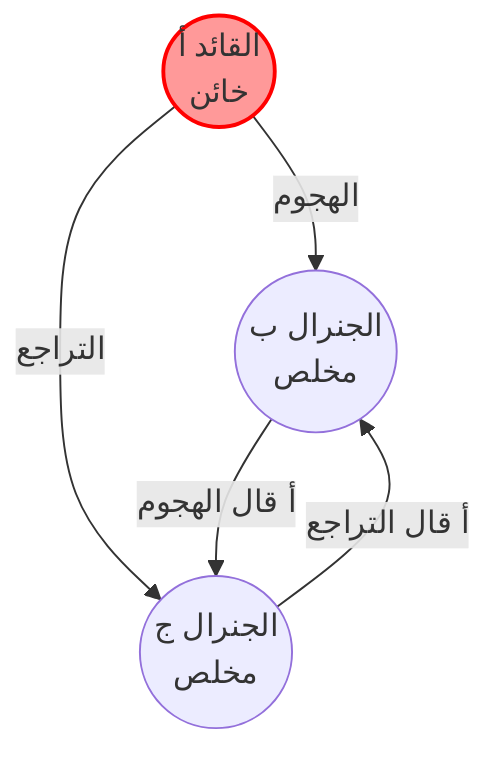
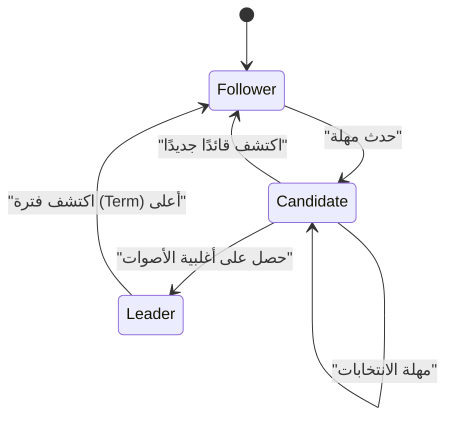
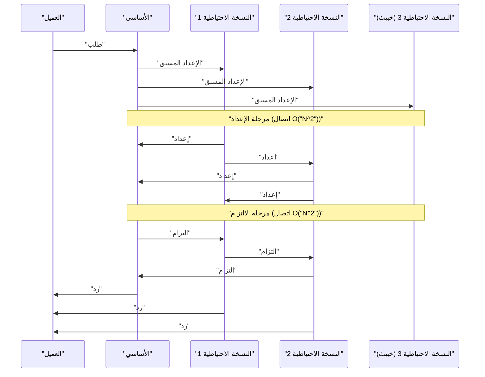

في صميم الحوسبة السحابية الحديثة وتقنية البلوكتشين، توجد **خوارزميات الإجماع** التي تقوم بمشاركة الحالة ومزامنتها بين أجهزة كمبيوتر متعددة (العقد). في هذا المقال، سنبدأ بالأساس النظري، "مشكلة الجنرالات البيزنطيين"، ونتعمق في **Paxos** و **Raft** اللتين تُستخدمان على نطاق واسع في الأنظمة العملية، بالإضافة إلى **BFT (التسامح مع الأخطاء البيزنطية)** في البيئات التي يتواجد فيها مشاركون خبيثون، مصحوبًا بالبراهين الرياضية وتنفيذ الكود.

## 1. الإجماع والتحديات في الأنظمة الموزعة

في الأنظمة الموزعة، تحدث إخفاقات مختلفة لا يمكن أن تحدث في جهاز كمبيوتر واحد، مثل تأخيرات الشبكة، وفقدان الحزم، وانهيار العقد، أو حتى التلاعب الخبيث. خوارزمية الإجماع هي آلية للحفاظ على حالة متسقة عبر النظام بأكمله مع تحمل هذه الإخفاقات.

يُصنف التسامح مع الأخطاء في النظام بشكل أساسي إلى فئتين:

1.  **CFT (التسامح مع أخطاء الانهيار)** : يمكنه تحمل توقف العقد (الانهيار) وانقسامات الشبكة، ولكنه لا يفترض وجود سلوكيات (خبيثة) حيث ترسل العقد بيانات كاذبة.
2.  **BFT (التسامح مع الأخطاء البيزنطية)** : يمكنه تحمل ليس فقط توقف العقد، ولكن أيضًا المواقف التي ترسل فيها العقد الخبيثة رسائل غير صالحة عشوائية.

المفهوم الذي أدى إلى ظهور BFT هو **مشكلة الجنرالات البيزنطيين** الشهيرة.

---

## 2. مشكلة الجنرالات البيزنطيين (Byzantine Generals Problem)

تم اقتراح "مشكلة الجنرالات البيزنطيين" في عام 1982 من قبل ليزلي لامبورت وروبرت شوستاك ومارشال بيس، وهي تمثل نموذجًا لكيفية وصول جميع المشاركين الصادقين إلى إجماع في شبكة يختلط فيها المشاركون الخبيثون.

### 2.1 تعريف المشكلة

يقوم جنرالات الإمبراطورية البيزنطية بمحاصرة مدينة العدو. إنهم متباعدون جغرافيًا ويمكنهم التواصل من خلال الرسل فقط. يجب على الجنرالات الاتفاق على أحد الإجراءين: "الهجوم" أو "التراجع". ومع ذلك، هناك خونة (عقد خبيثة) بين الجنرالات قد يرسلون رسائل كاذبة لإرباك الجنرالات الآخرين.

الشروط التي يجب أن يتخذها الجنرالات المخلصون هي كما يلي:

1.  يجب على جميع الجنرالات المخلصين الاتفاق على نفس خطة العمل (هجوم أو تراجع).
2.  يجب ألا يتسبب عدد قليل من الخونة في جعل الجنرالات المخلصين يتفقون على قرار خاطئ (أو غير متسق).

### 2.2 الصياغة الرياضية والاستحالة

لنفترض أن العدد الإجمالي للجنرالات هو $ n $ وعدد الخونة هو $ f $. أثبت لامبورت وآخرون رياضيًا أنه في حالة إمكانية التلاعب بالرسائل (رسائل غير موقعة)، يكون الإجماع مستحيلاً ما لم يتم استيفاء الشرط التالي:

$ n > 3f $

بعبارة أخرى، يجب أن يكون العدد الإجمالي للعقد أكبر من ثلاثة أضعاف عدد الخونة. وعلى العكس من ذلك، إذا كان $ 1/3 $ أو أكثر من جميع العقد عقدًا خبيثة، فلا يمكن للنظام الوصول إلى إجماع آمن.

كمثال، فكر في حالة $ n = 3 $ و $ f = 1 $. لنفترض أن هناك جنرالات أ (القائد) وب وج، وأن أ هو الخائن.
يخبر أ الجنرال ب بـ "الهجوم" والجنرال ج بـ "التراجع". يتبادل ب وج الرسائل التي تلقوها من أ مع بعضهم البعض، لكن ب يدعي "أمرني أ بالهجوم"، وج يدعي "أمرني أ بالتراجع". في هذا الوقت، يصبح من المستحيل على ب وج تحديد ما إذا كان الطرف الآخر يكذب أم أن أ يكذب.

فيما يلي مخطط Mermaid يوضح هذه الحالة المستحيلة حيث $ n = 3 $.



---

## 3. Paxos: المعيار الذهبي للإجماع النظري

في مجال CFT (التسامح مع أخطاء الانهيار)، الذي لا يأخذ في الاعتبار الأخطاء البيزنطية، فإن أول خوارزمية قوية هي **Paxos**. اقترحها أيضًا ليزلي لامبورت في عام 1989 (ونُشرت في عام 1998)، وتُستخدم في نظام Chubby و Spanner من Google، وغيرها.

### 3.1 أدوار ومراحل Paxos

يتكون Paxos من عدة مقترحين (Proposer)، ومستقبلين (Acceptor)، ومتعلمين (Learner). Paxos الأساسي (Single-Decree Paxos) هو عملية للاتفاق على قيمة واحدة وينقسم إلى المرحلتين التاليتين:

*   **المرحلة 1: الإعداد (Prepare)**
    1.  يختار المقترح رقم اقتراح فريد $ n $ ويرسل طلب `"Prepare(n)"` إلى أغلبية المستقبلين.
    2.  إذا كان $ n $ أكبر من أي رقم `Prepare` تلقاه المستقبل من قبل، فإنه يعد بعدم قبول أي اقتراحات أقل من $ n $ من الآن فصاعدًا، ويرد بأي قيمة قبلها في الماضي إن وجدت.
*   **المرحلة 2: القبول (Accept)**
    1.  إذا تلقى المقترح ردودًا من أغلبية المستقبلين، فإنه يرسل طلب `"Accept(n, v)"`. هنا $ v $ هي القيمة التي تحتوي على أعلى رقم اقتراح من بين القيم المدرجة في الردود، أو إذا لم تكن موجودة، فهي القيمة التي يريد هو اقتراحها.
    2.  يقبل المستقبل الاقتراح طالما لم يقدم وعدًا لرقم أكبر.

### 3.2 محاكاة Paxos باستخدام Python

فيما يلي كود Python مبسط يحاكي سلوك المرحلة 1 والمرحلة 2 من Paxos.

```python
import random

class Acceptor:
    def __init__(self, id):
        self.id = id
        self.min_proposal_num = -1
        self.accepted_num = -1
        self.accepted_value = None

    def receive_prepare(self, n):
        if n > self.min_proposal_num:
            self.min_proposal_num = n
            return True, self.accepted_num, self.accepted_value
        return False, None, None

    def receive_accept(self, n, v):
        if n >= self.min_proposal_num:
            self.min_proposal_num = n
            self.accepted_num = n
            self.accepted_value = v
            return True
        return False

class Proposer:
    def __init__(self, id, value, acceptors):
        self.id = id
        self.value = value
        self.acceptors = acceptors
        self.proposal_num = id  # إنشاء رقم فريد بسيط

    def run(self):
        # المرحلة 1: الإعداد
        promises = []
        highest_accepted_num = -1
        value_to_propose = self.value

        for acceptor in self.acceptors:
            promised, acc_num, acc_val = acceptor.receive_prepare(self.proposal_num)
            if promised:
                promises.append(acceptor)
                if acc_num > highest_accepted_num:
                    highest_accepted_num = acc_num
                    value_to_propose = acc_val

        # التحقق من الأغلبية
        if len(promises) > len(self.acceptors) / 2:
            # المرحلة 2: القبول
            accepts = 0
            for acceptor in promises:
                if acceptor.receive_accept(self.proposal_num, value_to_propose):
                    accepts += 1
            
            if accepts > len(self.acceptors) / 2:
                print(f"Proposer {self.id}: Consensus reached on value '{value_to_propose}'")
                return True
        
        print(f"Proposer {self.id}: Failed to reach consensus.")
        return False

# تشغيل المحاكاة
acceptors = [Acceptor(i) for i in range(5)]
proposer1 = Proposer(10, "Value_A", acceptors)
proposer2 = Proposer(20, "Value_B", acceptors)

# محاكاة حالة التنافس
proposer1.run()
proposer2.run()
```

---

## 4. Raft: الخوارزمية التي سعت إلى سهولة الفهم

في حين أن Paxos قوي للغاية، إلا أن خوارزميته كانت معقدة ويصعب تنفيذها في الأنظمة الحقيقية. لذلك، في عام 2014، تم تصميم **Raft** من قبل دييجو أونجارو وجون أوسترهوت، مع التركيز بشكل أساسي على **"سهولة الفهم (Understandability)"**. حاليًا، تُستخدم على نطاق واسع في أنظمة مثل etcd و Consul.

### 4.1 المفاهيم الأساسية لـ Raft

تقوم Raft بتقسيم حالة النظام بالكامل إلى مشكلتين فرعيتين: **انتخاب القائد (Leader Election)** و **نسخ السجل (Log Replication)**.

تأخذ العقد دائمًا إحدى الحالات الثلاث التالية:
*   **القائد (Leader)** : يتلقى الطلبات من العملاء وينسخ السجلات إلى العقد الأخرى.
*   **التابع (Follower)** : يتبع الطلبات الواردة من القائد.
*   **المرشح (Candidate)** : حالة يرشح فيها نفسه ليصبح قائدًا جديدًا في حالة تعطل القائد.



### 4.2 آلية انتخاب القائد

في Raft، يتم استخدام ساعة منطقية تسمى **الفترة (Term)**. يمتلك كل تابع **مهلة انتخابات عشوائية (Election Timeout)**، وعندما ينقطع نبض القلب من القائد وتحدث مهلة، فإنه يصبح مرشحًا ويطلب التصويت لنفسه (RequestVote). تصبح العقدة التي تحصل على أغلبية الأصوات هي القائد الجديد. من خلال جعل المهلة عشوائية، فإنه يمنع تقسيم الأصوات (Split Vote).

### 4.3 تعريف أنواع حالة عقدة Raft باستخدام Haskell

إن نمذجة انتقالات الحالة في Raft باستخدام لغة برمجة وظيفية توضح مدى متانتها. فيما يلي مثال لتعريف نوع مبسط باستخدام Haskell.

```haskell
module Raft where

data NodeState = Follower | Candidate | Leader
    deriving (Show, Eq)

type Term = Int
type NodeId = String

data RaftNode = RaftNode {
    nodeId      :: NodeId,
    currentTerm :: Term,
    votedFor    :: Maybe NodeId,
    state       :: NodeState,
    logEntries  :: [LogEntry]
} deriving (Show)

data LogEntry = LogEntry {
    term    :: Term,
    command :: String
} deriving (Show)

-- مثال على توقيع دالة انتقال الحالة
handleTimeout :: RaftNode -> RaftNode
handleTimeout node =
    if state node == Leader 
    then node
    else node { 
        state = Candidate, 
        currentTerm = currentTerm node + 1, 
        votedFor = Just (nodeId node) 
    }
```

وبهذه الطريقة، من خلال وصف انتقالات الحالة كدوال بحتة، يصبح من الأسهل التحقق من صحة منطق Raft.

---

## 5. التسامح العملي مع الأخطاء البيزنطية: PBFT

تعد Paxos و Raft من نوع CFT (مقاومة للانهيار)، لكنها تكون عاجزة عند وجود عقد خبيثة في الشبكة. ولمعالجة هذه المشكلة (مشكلة الجنرالات البيزنطيين) مع أداء عملي، تم تقديم **PBFT (التسامح العملي مع الأخطاء البيزنطية)** في عام 1999 من قبل ميغيل كاسترو وباربرا ليسكوف.

### 5.1 مراحل اتصال PBFT

في PBFT، يوجد قائد (Primary) وتوابع (Backup)، ويتم إجراء اتصال متعدد البث في 3 مراحل للطلبات الواردة من العملاء.

1.  **الإعداد المسبق (Pre-prepare)** : يقوم القائد بتعيين رقم تسلسلي للطلب ويبثه إلى جميع العقد.
2.  **الإعداد (Prepare)** : عند استلام الطلب، تتحقق كل عقدة منه ثم تبث رسالة `"Prepare"` لجميع العقد الأخرى. عند تلقي $ 2f $ من رسائل `"Prepare"`، تصبح العقدة في حالة الإعداد (Prepared).
3.  **الالتزام (Commit)** : تقوم العقد التي وصلت إلى حالة الإعداد ببث رسالة `"Commit"` إلى جميع العقد. عند تلقي $ 2f + 1 $ من رسائل `"Commit"`، يكتمل الإجماع ويتم تنفيذ الطلب.



يعمل PBFT في تكوين عقدة بـ $ n = 3f + 1 $ مستوفيًا لشرط $ n > 3f $ المذكور أعلاه، ويتضمن عبء اتصال يبلغ $ O(N^2) $ بين العقد، ولكنه يوفر إجماعًا نهائيًا (Finality). يتم اعتماد هذا على نطاق واسع في تقنيات البلوكتشين لاتحاد الشركات الحديثة (مثل Hyperledger Fabric).

### 5.2 إعادة تأكيد القيود الرياضية

لكي يحافظ PBFT على الأمان، يُفترض أن تكون الرسائل المتبادلة في النظام آمنة تشفيريًا (غير قابلة للتزوير). إذا كان حجم النصاب (Quorum) هو $ Q $، فيجب استيفاء الشروط التالية:

$ Q = 2f + 1 \\\\ n = 3f + 1 $

يجب أن يحتوي تقاطع أي نصابين $ Q_1 $ و $ Q_2 $ دائمًا على عقدة صحيحة واحدة على الأقل.
$ |Q_1 \cap Q_2| = 2Q - n = 2(2f + 1) - (3f + 1) = f + 1 $
بهذه الطريقة، حتى إذا كانت هناك $ f $ من العقد الخبيثة تنتمي إلى كلا النصابين، فسيتم دائمًا تضمين عقدة صادقة واحدة على الأقل، مما يثبت اتساق النظام بأكمله.

---

## 6. الخلاصة: تطور خوارزميات الإجماع

في هذا المقال، شرحنا مسألة تكوين الإجماع، وهي التحدي الأكبر في الأنظمة الموزعة، بدءًا من "مشكلة الجنرالات البيزنطيين" النظرية، مرورًا بـ **Paxos** و **Raft** المقاومة للانهيار، وصولاً إلى **PBFT** المقاومة للعقد الخبيثة.

*   **Paxos** : أساس قوي مثبت رياضيًا، لكن التعقيد يمثل تحديًا.
*   **Raft** : سعت إلى سهولة الفهم والتنفيذ، وأصبحت المعيار الفعلي لأنظمة [KVS](https://kenji.blog/ar/p/nosql-database-selection-kvs-document-graph-wide-column/) الموزعة الحديثة.
*   **PBFT** : حققت إجماعًا حتميًا في البيئات التي تختلط فيها العقد الخبيثة، لتصبح أساسًا لتقنية البلوكتشين.

اليوم، تولد خوارزميات BFT جديدة باستمرار تعمل على تحسين قابلية التوسع مع تقليل عبء الاتصال في PBFT، مثل **Nakamoto [Consensus](https://kenji.blog/ar/p/blockchain-technology-smart-contract-distributed-ledger/) ([PoW](https://kenji.blog/ar/p/blockchain-technology-smart-contract-distributed-ledger/))** الذي اعتمدته البيتكوين، و Tendermint، و HotStuff. يعد اختيار خوارزمية الإجماع المناسبة بناءً على متطلبات النظام (موثوقية العقد، والإنتاجية المطلوبة، وزمن الانتقال) أمرًا أساسيًا لبناء نظام موزع قوي.
