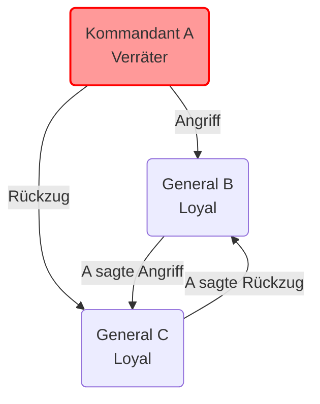
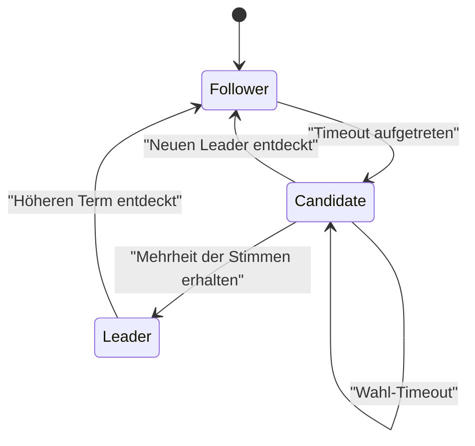
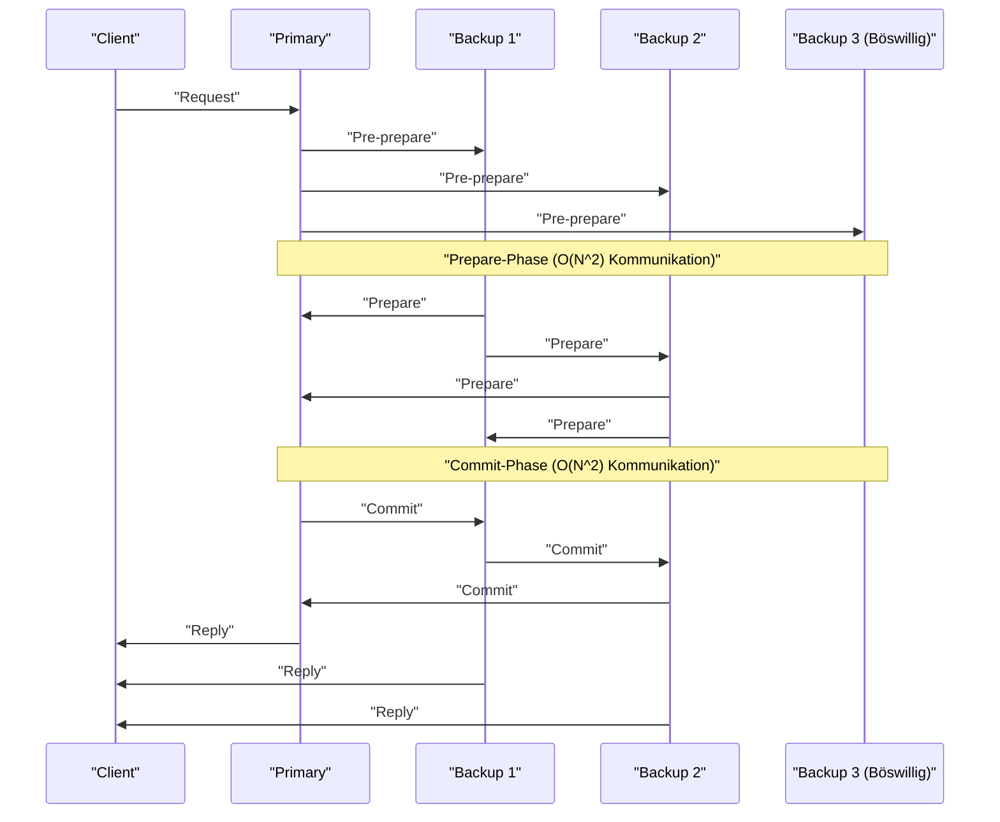

Im Kern der modernen Cloud-Computing- und [Blockchain](https://kenji.blog/de/p/blockchain-technology-smart-contract-distributed-ledger/)-Technologien gibt es **Konsensalgorithmen** (consensus algorithms), die den [Zustand](https://kenji.blog/de/p/state-management-history-redux-context-recoil-zustand/) über mehrere Computer (Knoten) hinweg teilen und synchronisieren. In diesem Artikel werden wir von den theoretischen Grundlagen des "Problems der byzantinischen Generäle" (Byzantine Generals Problem) ausgehen und uns eingehend mit **Paxos** und **Raft**, die in praktischen Systemen weit verbreitet sind, sowie mit **BFT (Byzantine Fault Tolerance)** in Umgebungen mit böswilligen Teilnehmern befassen, einschließlich mathematischer Beweise und Code-Implementierungen.

## 1. Konsensbildung und Herausforderungen in verteilten Systemen

In verteilten Systemen treten verschiedene Fehler auf, die auf einem einzelnen Computer nicht möglich sind, wie Netzwerkverzögerungen, Paketverluste, Knotenabstürze oder sogar böswillige Manipulationen. Der Konsensalgorithmus ist ein Mechanismus, um trotz dieser Fehler einen konsistenten Zustand ([State](https://kenji.blog/de/p/iac-infrastructure-as-code-terraform/)) im gesamten System aufrechtzuerhalten.

Die Fehlertoleranz des Systems wird hauptsächlich in die folgenden zwei Kategorien eingeteilt:

1.  **CFT (Crash Fault Tolerance)** : Kann das Stoppen (Abstürzen) von Knoten und Netzwerkpartitionierungen tolerieren, geht aber nicht von Knoten aus, die gefälschte Daten senden (böswilliges Verhalten).
2.  **BFT (Byzantine Fault Tolerance)** : Kann nicht nur Knotenabstürze tolerieren, sondern auch Situationen, in denen böswillige Knoten beliebige ungültige Nachrichten senden.

Das berühmte **Problem der byzantinischen Generäle** hat dieses BFT-Konzept hervorgebracht.

---

## 2. Problem der byzantinischen Generäle (Byzantine Generals Problem)

Das 1982 von Leslie Lamport, Robert Shostak und Marshall Pease vorgeschlagene "Problem der byzantinischen Generäle" modelliert, wie man unter korrekten Teilnehmern in einem Netzwerk mit böswilligen Teilnehmern einen Konsens erzielt.

### 2.1 Definition des Problems

Generäle des byzantinischen Reiches belagern eine feindliche Stadt. Sie sind geografisch getrennt und können nur durch Boten kommunizieren. Die Generäle müssen sich auf einen Aktionsplan einigen: entweder "Angriff" oder "Rückzug". Unter den Generälen befinden sich jedoch Verräter (böswillige Knoten), die falsche Nachrichten senden können, um die anderen Generäle zu verwirren.

Die Bedingungen, die loyale Generäle erfüllen müssen, sind:

1.  Alle loyalen Generäle müssen sich auf denselben Aktionsplan (Angriff oder Rückzug) einigen.
2.  Eine kleine Anzahl von Verrätern darf loyale Generäle nicht dazu bringen, einen falschen (oder inkonsistenten) Konsens zu erzielen.

### 2.2 Mathematische Formulierung und Unmöglichkeit

Sei $ n $ die Gesamtzahl der Generäle und $ f $ die Anzahl der Verräter. Lamport und seine Kollegen bewiesen mathematisch, dass in Fällen, in denen Nachrichten manipuliert werden können (unsignierte Nachrichten), ein Konsens unmöglich ist, es sei denn, die folgende Bedingung ist erfüllt.

$ n > 3f $

Das heißt, die Gesamtzahl der Knoten muss mehr als das Dreifache der Anzahl der Verräter betragen. Umgekehrt kann das System keinen sicheren Konsens erreichen, wenn $ 1/3 $ oder mehr aller Knoten böswillig sind.

Betrachten wir als Beispiel den Fall von $ n = 3 $ und $ f = 1 $. Angenommen, es gibt die Generäle A (Kommandant), B und C, und A ist ein Verräter.
A sagt B "Angriff" und C "Rückzug". B und C tauschen die von A empfangenen Nachrichten miteinander aus, aber B behauptet "A sagte Angriff" und C behauptet "A sagte Rückzug". Zu diesem Zeitpunkt wird es für B und C unmöglich festzustellen, ob die andere Partei lügt oder ob A lügt.

Das Folgende ist ein Mermaid-Diagramm, das diesen unmöglichen Fall für $ n = 3 $ veranschaulicht.



---

## 3. Paxos: Ein Meilenstein des theoretischen Konsenses

Im Bereich von CFT (Crash Fault Tolerance), der byzantinische Fehler nicht berücksichtigt, war **Paxos** der erste leistungsstarke Algorithmus. Er wurde ebenfalls 1989 von Leslie Lamport vorgeschlagen (veröffentlicht 1998) und wird in Googles Chubby und Spanner verwendet.

### 3.1 Rolle und Phasen von Paxos

Paxos besteht aus mehreren Proposern (Vorschlagenden), Acceptors (Akzeptierenden) und Learnern (Lernenden). Das grundlegende Paxos (Single-Decree Paxos) ist ein Prozess zur Einigung auf einen einzigen Wert und ist in die folgenden zwei Phasen unterteilt.

*   **Phase 1: Prepare (Vorbereitung)**
    1.  Der Proposer wählt eine eindeutige Vorschlagsnummer $ n $ und sendet eine `Prepare(n)`-Anfrage an die Mehrheit der Acceptors.
    2.  Wenn $ n $ größer ist als die Nummer einer zuvor empfangenen `Prepare`-Anfrage, verspricht der Acceptor, keine Vorschläge mehr zu akzeptieren, die kleiner als $ n $ sind, und gibt alle zuvor akzeptierten Werte zurück, falls vorhanden.
*   **Phase 2: Accept (Akzeptanz)**
    1.  Sobald der Proposer Antworten von einer Mehrheit der Acceptors erhält, sendet er eine `Accept(n, v)`-Anfrage. Hier ist $ v $ der Wert mit der höchsten Vorschlagsnummer unter den in den Antworten enthaltenen Werten, oder der Wert, den er selbst vorschlagen möchte, wenn kein solcher existiert.
    2.  Der Acceptor akzeptiert den Vorschlag, sofern er kein Versprechen für eine höhere Nummer abgegeben hat.

### 3.2 Paxos-Simulation in Python

Der folgende Python-Code simuliert auf vereinfachte Weise das Verhalten der Phasen 1 und 2 von Paxos.

```python
import random

class Acceptor:
    def __init__(self, id):
        self.id = id
        self.min_proposal_num = -1
        self.accepted_num = -1
        self.accepted_value = None

    def receive_prepare(self, n):
        if n > self.min_proposal_num:
            self.min_proposal_num = n
            return True, self.accepted_num, self.accepted_value
        return False, None, None

    def receive_accept(self, n, v):
        if n >= self.min_proposal_num:
            self.min_proposal_num = n
            self.accepted_num = n
            self.accepted_value = v
            return True
        return False

class Proposer:
    def __init__(self, id, value, acceptors):
        self.id = id
        self.value = value
        self.acceptors = acceptors
        self.proposal_num = id  # Einfache Generierung eindeutiger Nummern

    def run(self):
        # Phase 1: Prepare
        promises = []
        highest_accepted_num = -1
        value_to_propose = self.value

        for acceptor in self.acceptors:
            promised, acc_num, acc_val = acceptor.receive_prepare(self.proposal_num)
            if promised:
                promises.append(acceptor)
                if acc_num > highest_accepted_num:
                    highest_accepted_num = acc_num
                    value_to_propose = acc_val

        # Mehrheitsprüfung
        if len(promises) > len(self.acceptors) / 2:
            # Phase 2: Accept
            accepts = 0
            for acceptor in promises:
                if acceptor.receive_accept(self.proposal_num, value_to_propose):
                    accepts += 1
            
            if accepts > len(self.acceptors) / 2:
                print(f"Proposer {self.id}: Consensus reached on value '{value_to_propose}'")
                return True
        
        print(f"Proposer {self.id}: Failed to reach consensus.")
        return False

# Ausführung der Simulation
acceptors = [Acceptor(i) for i in range(5)]
proposer1 = Proposer(10, "Value_A", acceptors)
proposer2 = Proposer(20, "Value_B", acceptors)

# Simulation einer Race Condition
proposer1.run()
proposer2.run()
```

---

## 4. Raft: Ein auf Verständlichkeit ausgelegter Algorithmus

Während Paxos sehr mächtig ist, ist sein Algorithmus komplex und schwierig in realen Systemen zu implementieren. Daher wurde **Raft** 2014 von Diego Ongaro und John Ousterhout mit dem Schwerpunkt auf **"Verständlichkeit" (Understandability)** entworfen. Heute ist es in etcd, Consul und anderen weit verbreitet.

### 4.1 Schlüsselkonzepte von Raft

Raft unterteilt den Gesamtsystemzustand in zwei Teilprobleme: **Wahl des Anführers (Leader Election)** und **Log-Replikation (Log Replication)**.

Ein Knoten befindet sich immer in einem der folgenden drei Zustände:
*   **Leader (Anführer)** : Empfängt Anfragen von Clients und repliziert Logs auf andere Knoten.
*   **Follower (Anhänger)** : Befolgt Anfragen vom Leader.
*   **Candidate (Kandidat)** : [Zustand](https://kenji.blog/de/p/state-management-history-redux-context-recoil-zustand/) der Kandidatur als neuer Leader, wenn der aktuelle Leader ausfällt.



### 4.2 Mechanismus der Leader-Wahl

Raft verwendet eine logische Uhr namens **Term (Amtszeit)**. Jeder Follower hat ein zufälliges **Wahl-Timeout (Election Timeout)**. Wenn der Heartbeat vom Leader stoppt und ein Timeout auftritt, wird er zu einem Candidate und fordert Stimmen für sich an (RequestVote). Der Knoten, der die Mehrheit der Stimmen erhält, wird der neue Leader. Die zufällige Gestaltung der Timeouts verhindert eine Stimmenaufteilung (Split Vote).

### 4.3 Typdefinition des Raft-Knotenzustands in Haskell

Die Modellierung von Raft-[Zustand](https://kenji.blog/de/p/state-management-history-redux-context-recoil-zustand/)sübergängen mit einer funktionalen Sprache macht deren Robustheit klarer. Nachfolgend finden Sie ein Beispiel für eine vereinfachte Typdefinition in Haskell.

```haskell
module Raft where

data NodeState = Follower | Candidate | Leader
    deriving (Show, Eq)

type Term = Int
type NodeId = String

data RaftNode = RaftNode {
    nodeId      :: NodeId,
    currentTerm :: Term,
    votedFor    :: Maybe NodeId,
    state       :: NodeState,
    logEntries  :: [LogEntry]
} deriving (Show)

data LogEntry = LogEntry {
    term    :: Term,
    command :: String
} deriving (Show)

-- Beispiel für die Signatur der Zustandsübergangsfunktion
handleTimeout :: RaftNode -> RaftNode
handleTimeout node =
    if state node == Leader 
    then node
    else node { 
        state = Candidate, 
        currentTerm = currentTerm node + 1, 
        votedFor = Just (nodeId node) 
    }
```

Durch die Beschreibung von [Zustand](https://kenji.blog/de/p/state-management-history-redux-context-recoil-zustand/)sübergängen als reine Funktionen auf diese Weise wird es einfacher, die Korrektheit der Raft-Logik zu verifizieren.

---

## 5. Praktische byzantinische Fehlertoleranz: PBFT

Paxos und Raft sind CFT (absturztolerant), aber sie sind machtlos, wenn böswillige Knoten im Netzwerk existieren. Die Lösung für dieses Problem (das Problem der byzantinischen Generäle) mit praktischer Leistung war **PBFT (Practical Byzantine Fault Tolerance)**, das 1999 von Miguel Castro und Barbara Liskov eingeführt wurde.

### 5.1 Kommunikationsphasen in PBFT

In PBFT gibt es einen Leader (Primary) und Follower (Backup), und die folgende 3-Phasen-Multicast-Kommunikation wird für Client-Anfragen durchgeführt.

1.  **Pre-prepare** : Der Primary weist der Anfrage eine Sequenznummer zu und sendet sie an alle Knoten.
2.  **Prepare** : Jeder Knoten empfängt die Anfrage, verifiziert sie und sendet dann eine `Prepare`-Nachricht an alle anderen Knoten. Nach Erhalt von $ 2f $ `Prepare`-Nachrichten tritt der Knoten in den Prepared-[Zustand](https://kenji.blog/de/p/state-management-history-redux-context-recoil-zustand/) ein.
3.  **Commit** : Ein Knoten im Prepared-Zustand sendet eine `Commit`-Nachricht an alle Knoten. Nach Erhalt von $ 2f + 1 $ `Commit`-Nachrichten ist der Konsens abgeschlossen und die Anfrage wird ausgeführt.



PBFT arbeitet mit einer Knotenkonfiguration von $ n = 3f + 1 $, die die zuvor erwähnte Bedingung $ n > 3f $ erfüllt. Es beinhaltet einen Kommunikations-Overhead von $ O(N^2) $ zwischen den Knoten, bietet jedoch eine endgültige Übereinkunft (Finality). Dies wird in modernen Konsortium-[Blockchain](https://kenji.blog/de/p/blockchain-technology-smart-contract-distributed-ledger/)s (wie Hyperledger Fabric) weit verbreitet verwendet.

### 5.2 Erneute Überprüfung der mathematischen Einschränkungen

Damit PBFT die Sicherheit aufrechterhalten kann, wird davon ausgegangen, dass die im System ausgetauschten Nachrichten kryptografisch sicher (nicht fälschbar) sind. Wenn $ Q $ die Größe des Quorums ist, müssen die folgenden Bedingungen erfüllt sein.

$ Q = 2f + 1 \\\\ n = 3f + 1 $

Die Schnittmenge von zwei beliebigen Quoren $ Q_1 $ und $ Q_2 $ muss immer mindestens einen korrekten Knoten enthalten.

$ |Q_1 \cap Q_2| = 2Q - n = 2(2f + 1) - (3f + 1) = f + 1 $

Auf diese Weise wird die Konsistenz des gesamten Systems bewiesen, denn selbst wenn $ f $ böswillige Knoten zu beiden Quoren gehören, ist immer mindestens ein ehrlicher Knoten enthalten.

---

## 6. Zusammenfassung: Die Evolution von Konsensalgorithmen

In diesem Artikel haben wir die Konsensbildung, die größte Herausforderung in verteilten Systemen, von dem theoretischen "Problem der byzantinischen Generäle" über das absturztolerante **Paxos** und **Raft** bis hin zu **PBFT**, das resistent gegen böswillige Knoten ist, erklärt.

*   **Paxos** : Eine mathematisch bewiesene, robuste Grundlage, aber die Komplexität ist ein Problem.
*   **Raft** : Legt den Fokus auf Verständlichkeit und einfache Implementierung und ist zum De-facto-Standard für moderne verteilte [KVS](https://kenji.blog/de/p/nosql-database-selection-kvs-document-graph-wide-column/) geworden.
*   **PBFT** : Erreicht einen deterministischen Konsens in Umgebungen mit böswilligen Knoten und wurde zur Grundlage der Blockchain-Technologie.

Heute entstehen ständig neue BFT-Algorithmen, wie der in Bitcoin verwendete **Nakamoto [Consensus](https://kenji.blog/de/p/blockchain-technology-smart-contract-distributed-ledger/) ([PoW](https://kenji.blog/de/p/blockchain-technology-smart-contract-distributed-ledger/))**, Tendermint und HotStuff, die den Kommunikations-Overhead von PBFT reduzieren und die Skalierbarkeit verbessern. Die Wahl des richtigen Konsensalgorithmus in Abhängigkeit von den Systemanforderungen (Knotenzuverlässigkeit, erforderlicher Durchsatz, Latenz) ist der Schlüssel zum Aufbau eines robusten verteilten Systems.
