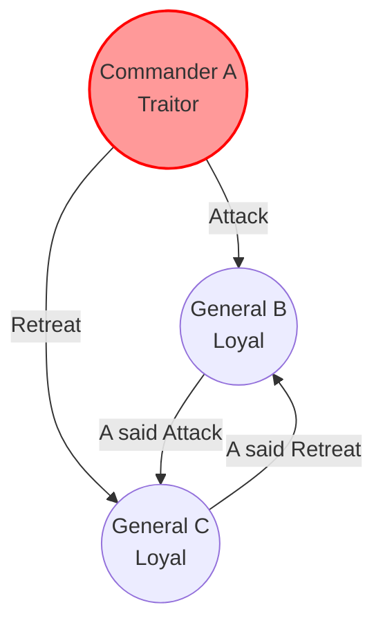
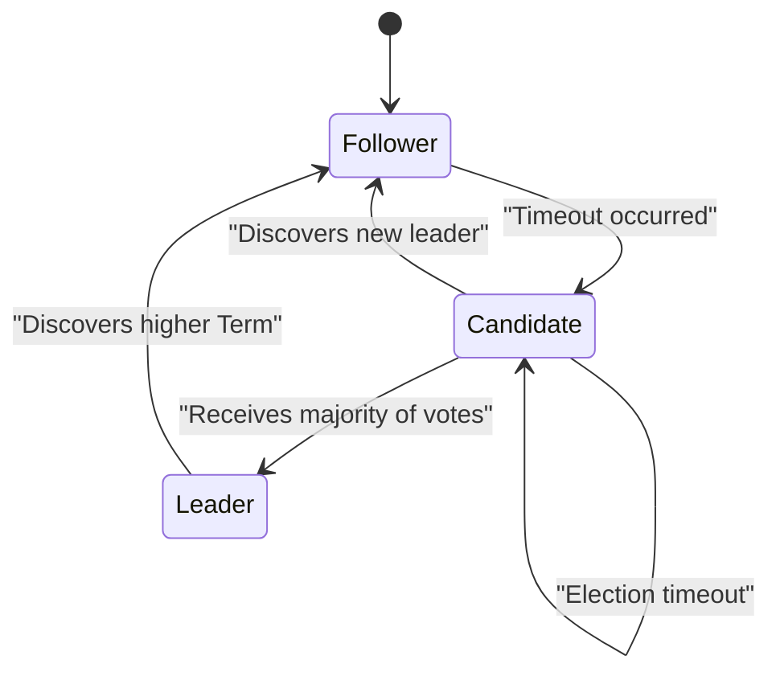
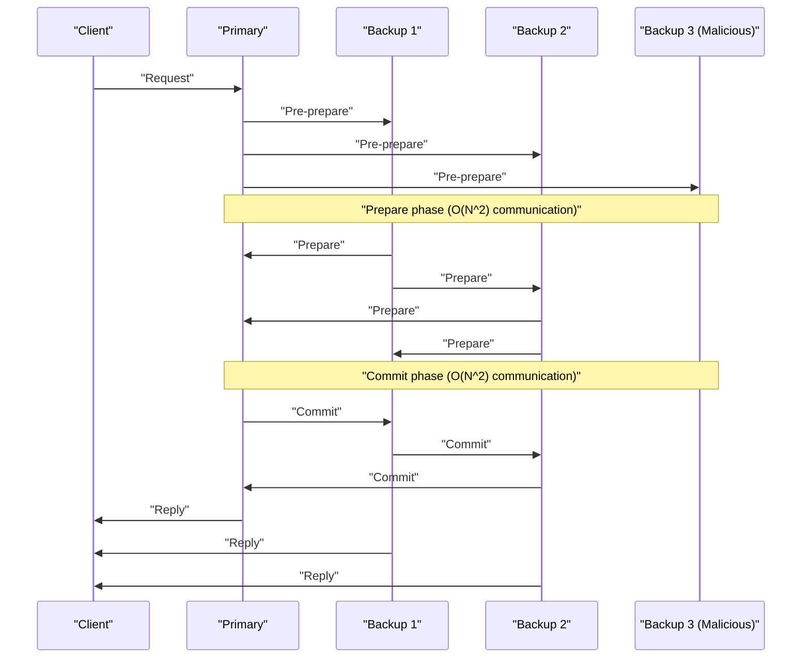

At the core of modern cloud computing and blockchain technologies lies the **consensus algorithm**, which allows multiple computers (nodes) to share and agree on a state. In this article, we will delve deeply into its theoretical foundation, the "Byzantine Generals Problem," and explore **Paxos** and **Raft**, which are widely adopted in practical systems, as well as **BFT (Byzantine Fault Tolerance)** in environments where malicious participants exist. We will include mathematical proofs and code implementations.

## 1. Consensus and Challenges in [Distributed System](https://kenji.blog/en/p/cap-theorem-distributed-systems/)s

In distributed systems, various failures that cannot occur on a single computer, such as network delays, packet loss, node crashes, or malicious tampering, can occur. Consensus algorithms are the mechanism for maintaining a consistent state across the entire system while withstanding these failures.

The fault tolerance of a system is mainly classified into the following two types:

1.  **CFT (Crash Fault Tolerance)** : Can withstand node stops (crashes) and network partitions, but does not assume nodes sending false data (malicious behavior).
2.  **BFT (Byzantine Fault Tolerance)** : Can withstand not only node stops but also situations where malicious nodes send arbitrary incorrect messages.

The concept of BFT originated from the famous **Byzantine Generals Problem**.

---

## 2. Byzantine Generals Problem

Proposed in 1982 by Leslie Lamport, Robert Shostak, and Marshall Pease, the "Byzantine Generals Problem" models how loyal participants can reach a consensus in a network mixed with malicious participants.

### 2.1 Definition of the Problem

Generals of the Byzantine Empire are besieging an enemy city. They are geographically separated and can only communicate through messengers. The generals must agree on a common plan of action, either to "attack" or "retreat." However, there are traitors (malicious nodes) among the generals who might send false messages to confuse the other generals.

The conditions that the loyal generals must satisfy are as follows:

1.  All loyal generals must agree on the same plan of action (attack or retreat).
2.  A small number of traitors must not cause the loyal generals to adopt a bad (or inconsistent) plan.

### 2.2 Mathematical Formulation and Impossibility

Let $ n $ be the total number of generals and $ f $ be the number of traitors. Lamport and colleagues mathematically proved that if messages can be forged (unsigned messages), consensus is impossible unless the following condition is met:

$ n > 3f $

In other words, the total number of nodes must be strictly greater than three times the number of traitors. Conversely, if $ 1/3 $ or more of all nodes are malicious, the system cannot reach a secure consensus.

As an example, consider the case where $ n = 3 $ and $ f = 1 $. There are Generals A (Commander), B, and C, and A is the traitor.
A tells B to "attack" and C to "retreat." B and C exchange the messages they received from A, but B claims "A told me to attack," while C claims "A told me to retreat." At this point, it becomes impossible for B and C to determine whether the other is lying or if A is lying.

Below is a Mermaid diagram showing this impossible case of $ n = 3 $.



---

## 3. Paxos: The Monument of Theoretical Consensus

In the realm of CFT (Crash Fault Tolerance), which does not consider Byzantine faults, the first powerful algorithm is **Paxos**. Also proposed by Leslie Lamport in 1989 (published in 1998), it is used in Google's Chubby, Spanner, and others.

### 3.1 Roles and Phases in Paxos

Paxos consists of multiple Proposers, Acceptors, and Learners. Basic Paxos (Single-Decree Paxos) is a process for agreeing on a single value and is divided into the following two phases.

*   **Phase 1: Prepare (Preparation)**
    1.  A Proposer chooses a unique proposal number $ n $ and sends a `Prepare(n)` request to a majority of Acceptors.
    2.  If $ n $ is greater than any `Prepare` number the Acceptor has received so far, it promises not to accept any proposals numbered less than $ n $ in the future, and responds with the highest-numbered proposal it has accepted, if any.
*   **Phase 2: Accept (Acceptance)**
    1.  When the Proposer receives responses from a majority of Acceptors, it sends an `Accept(n, v)` request. Here, $ v $ is the value of the highest-numbered proposal among the responses, or the Proposer's own value if no proposals were returned.
    2.  The Acceptor accepts the proposal unless it has already promised not to for a higher proposal number.

### 3.2 Paxos Simulation in Python

Below is Python code that simplifies and simulates the behavior of Paxos Phase 1 and Phase 2.

```python
import random

class Acceptor:
    def __init__(self, id):
        self.id = id
        self.min_proposal_num = -1
        self.accepted_num = -1
        self.accepted_value = None

    def receive_prepare(self, n):
        if n > self.min_proposal_num:
            self.min_proposal_num = n
            return True, self.accepted_num, self.accepted_value
        return False, None, None

    def receive_accept(self, n, v):
        if n >= self.min_proposal_num:
            self.min_proposal_num = n
            self.accepted_num = n
            self.accepted_value = v
            return True
        return False

class Proposer:
    def __init__(self, id, value, acceptors):
        self.id = id
        self.value = value
        self.acceptors = acceptors
        self.proposal_num = id  # Simple unique number generation

    def run(self):
        # Phase 1: Prepare
        promises = []
        highest_accepted_num = -1
        value_to_propose = self.value

        for acceptor in self.acceptors:
            promised, acc_num, acc_val = acceptor.receive_prepare(self.proposal_num)
            if promised:
                promises.append(acceptor)
                if acc_num > highest_accepted_num:
                    highest_accepted_num = acc_num
                    value_to_propose = acc_val

        # Majority check
        if len(promises) > len(self.acceptors) / 2:
            # Phase 2: Accept
            accepts = 0
            for acceptor in promises:
                if acceptor.receive_accept(self.proposal_num, value_to_propose):
                    accepts += 1
            
            if accepts > len(self.acceptors) / 2:
                print(f"Proposer {self.id}: Consensus reached on value '{value_to_propose}'")
                return True
        
        print(f"Proposer {self.id}: Failed to reach consensus.")
        return False

# Run simulation
acceptors = [Acceptor(i) for i in range(5)]
proposer1 = Proposer(10, "Value_A", acceptors)
proposer2 = Proposer(20, "Value_B", acceptors)

# Simulate race condition
proposer1.run()
proposer2.run()
```

---

## 4. Raft: An Algorithm Designed for Understandability

While Paxos is extremely powerful, its algorithm is complex, making practical implementation difficult. Therefore, in 2014, Diego Ongaro and John Ousterhout designed **Raft** with a primary focus on **"Understandability"**. It is currently widely used in systems like etcd and Consul.

### 4.1 Core Concepts of Raft

Raft divides the problem of maintaining system state into two subproblems: **Leader Election** and **Log Replication**.

Nodes are always in one of the following three states:
*   **Leader** : Receives requests from clients and replicates logs to other nodes.
*   **Follower** : Obeys requests from the leader.
*   **Candidate** : A state a node enters to run for a new leader when the current leader fails.



### 4.2 Leader Election Mechanism

Raft uses a logical clock called a **Term**. Each follower has a randomized **Election Timeout**. If heartbeats from the leader stop and a timeout occurs, the node becomes a Candidate and requests votes for itself (RequestVote). The node that receives a majority of votes becomes the new Leader. By randomizing timeouts, Raft prevents split votes.

### 4.3 Type Definition of Raft Node [State](https://kenji.blog/en/p/iac-infrastructure-as-code-terraform/) in Haskell

Modeling Raft state transitions using a functional programming language clarifies its robustness. Below is an example of simplified type definitions in Haskell.

```haskell
module Raft where

data NodeState = Follower | Candidate | Leader
    deriving (Show, Eq)

type Term = Int
type NodeId = String

data RaftNode = RaftNode {
    nodeId      :: NodeId,
    currentTerm :: Term,
    votedFor    :: Maybe NodeId,
    state       :: NodeState,
    logEntries  :: [LogEntry]
} deriving (Show)

data LogEntry = LogEntry {
    term    :: Term,
    command :: String
} deriving (Show)

-- Example signature of state transition function
handleTimeout :: RaftNode -> RaftNode
handleTimeout node =
    if state node == Leader 
    then node
    else node { 
        state = Candidate, 
        currentTerm = currentTerm node + 1, 
        votedFor = Just (nodeId node) 
    }
```

By describing state transitions as pure functions in this way, verifying the correctness of Raft's logic becomes much easier.

---

## 5. Practical Byzantine Fault Tolerance: PBFT

Paxos and Raft are CFT (crash-tolerant), but they are powerless when malicious nodes exist in the network. To address this problem (the Byzantine Generals Problem) with practical performance, Miguel Castro and Barbara Liskov introduced **PBFT (Practical Byzantine Fault Tolerance)** in 1999.

### 5.1 Communication Phases of PBFT

In PBFT, there is a leader (Primary) and followers (Backups). The system uses the following three-phase multicast communication for client requests:

1.  **Pre-prepare** : The Primary assigns a sequence number to the request and broadcasts it to all nodes.
2.  **Prepare** : Upon receiving the request, each node verifies it and broadcasts a `Prepare` message to all other nodes. Once a node receives $ 2f $ `Prepare` messages, it enters the Prepared state.
3.  **Commit** : Nodes in the Prepared state broadcast a `Commit` message to all nodes. When $ 2f + 1 $ `Commit` messages are received, consensus is achieved, and the request is executed.



PBFT operates with a node configuration of $ n = 3f + 1 $, fulfilling the aforementioned condition of $ n > 3f $. It incurs an $ O(N^2) $ communication overhead between nodes but provides deterministic finality. This is widely adopted in modern consortium blockchains (such as Hyperledger Fabric).

### 5.2 Re-verification of Mathematical Constraints

For PBFT to maintain safety, it assumes that messages exchanged within the system are cryptographically secure (unforgeable). Let the size of a Quorum be $ Q $. The following conditions must be met:

$ Q = 2f + 1 \\\\ n = 3f + 1 $

The intersection of any two quorums $ Q_1 $ and $ Q_2 $ must contain at least one honest node:
$ |Q_1 \cap Q_2| = 2Q - n = 2(2f + 1) - (3f + 1) = f + 1 $
In this way, even if $ f $ malicious nodes belong to both quorums, there is always at least one honest node included, thereby proving the consistency of the entire system.

---

## 6. Conclusion: The Evolution of Consensus Algorithms

In this article, we explained consensus formation, the greatest challenge in distributed systems, starting from the theoretical "Byzantine Generals Problem," moving to crash-tolerant **Paxos** and **Raft**, and covering **PBFT**, which is resistant to malicious nodes.

*   **Paxos** : A mathematically proven, robust foundation, though complexity is an issue.
*   **Raft** : Pursues understandability and ease of implementation, becoming the de facto standard for modern distributed KVS.
*   **PBFT** : Achieves deterministic consensus in environments mixed with malicious nodes, forming the foundation of blockchain technology.

Today, new BFT algorithms like the **Nakamoto Consensus (PoW)** adopted by Bitcoin, Tendermint, and HotStuff continue to emerge, reducing the communication overhead of PBFT while improving scalability. Selecting the appropriate consensus algorithm based on system requirements (node reliability, required throughput, latency) is the key to building a robust distributed system.
