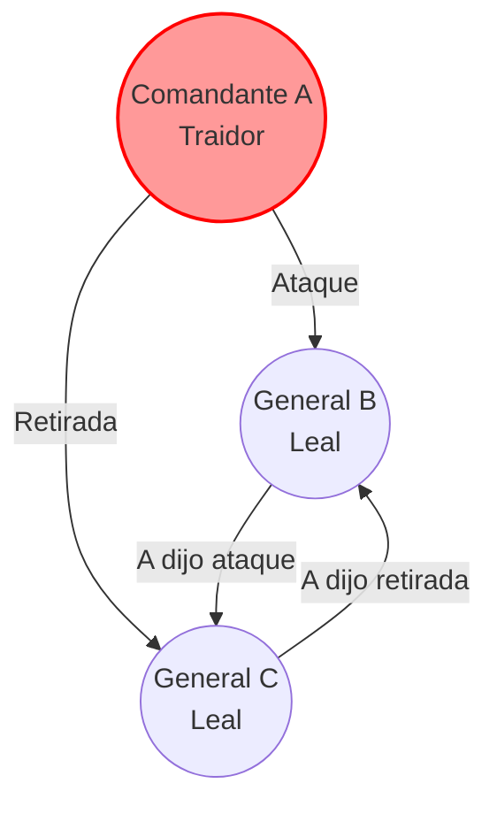
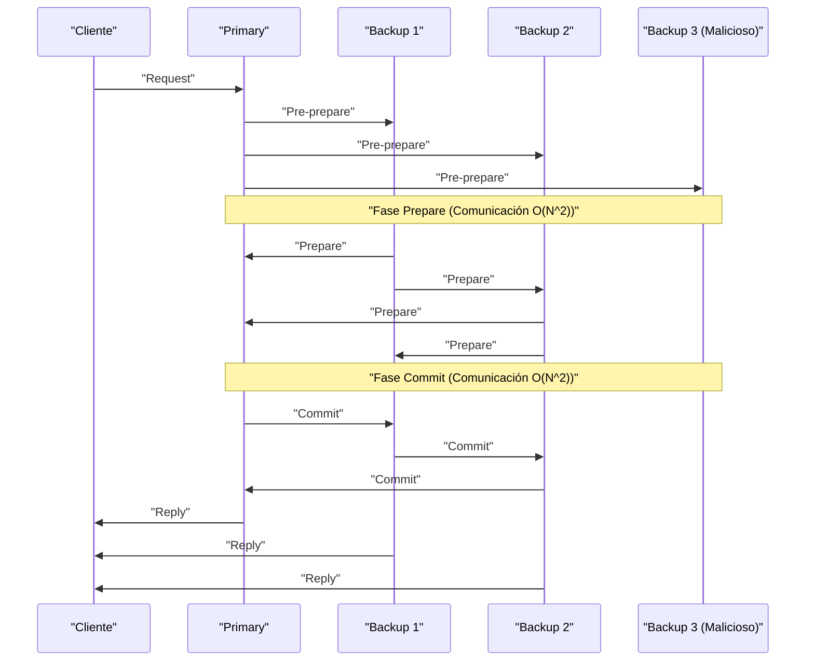

En la base que sustenta la computación en la nube y la tecnología blockchain modernas se encuentra el **algoritmo de consenso**, el cual permite que varios ordenadores (nodos) compartan y acuerden un estado. En este artículo, profundizaremos en el fundamento teórico de esto a través del "problema de los generales bizantinos", y exploraremos **Paxos** y **Raft**, que son ampliamente adoptados en sistemas prácticos, así como **BFT (Byzantine Fault Tolerance)** para entornos con participantes maliciosos, mediante pruebas matemáticas y código.

## 1. Formación de consenso en sistemas distribuidos y sus desafíos

En los sistemas distribuidos, pueden ocurrir varias fallas que son imposibles en un solo ordenador, como latencia de red, pérdida de paquetes, caída de nodos o manipulaciones maliciosas. Un mecanismo para mantener un estado consistente en todo el sistema mientras se resisten estas fallas es el algoritmo de consenso.

La tolerancia a fallas de un sistema se clasifica principalmente en dos tipos:

1.  **CFT (Crash Fault Tolerance)** : Puede tolerar paradas de nodos (caídas) y particiones de red, pero no asume comportamientos maliciosos donde los nodos envíen datos falsos.
2.  **BFT (Byzantine Fault Tolerance)** : Puede tolerar no solo paradas de nodos, sino también situaciones en las que nodos maliciosos envían mensajes incorrectos arbitrarios.

El famoso **problema de los generales bizantinos** dio origen a este concepto de BFT.

---

## 2. El problema de los generales bizantinos (Byzantine Generals Problem)

Propuesto por Leslie Lamport, Robert Shostak y Marshall Pease en 1982, el "problema de los generales bizantinos" modela cómo lograr un consenso entre todos los participantes honestos en una red donde hay participantes maliciosos.

### 2.1 Definición del problema

Los generales del Imperio Bizantino están asediando una ciudad enemiga. Están separados geográficamente y solo pueden comunicarse a través de mensajeros. Los generales deben ponerse de acuerdo en un plan de acción: "atacar" o "retirarse". Sin embargo, hay traidores (nodos maliciosos) entre los generales que podrían enviar mensajes falsos para confundir a los demás.

Las condiciones que los generales leales deben cumplir son:

1.  Todos los generales leales deben acordar el mismo plan de acción (atacar o retirarse).
2.  Un pequeño número de traidores no debe causar que los generales leales adopten un consenso incorrecto (o inconsistente).

### 2.2 Formulación matemática e imposibilidad

Sea $ n $ el número total de generales y $ f $ el número de traidores. Lamport y sus colegas demostraron matemáticamente que, en el caso de que los mensajes puedan ser alterados (mensajes sin firma), el consenso es imposible a menos que se cumpla la siguiente condición:

$ n > 3f $

Es decir, el número total de nodos debe ser más de tres veces el número de traidores. Por el contrario, si un $ 1/3 $ o más del total de nodos son maliciosos, el sistema no puede alcanzar un consenso seguro.

Consideremos un ejemplo donde $ n = 3 $ y $ f = 1 $. Hay tres generales A (comandante), B y C, y supongamos que A es un traidor.
A le dice a B "atacar" y a C "retirarse". B y C intercambian los mensajes que recibieron de A, pero B afirma "A me dijo que atacara", y C afirma "A me dijo que me retirara". En este momento, resulta imposible para B y C determinar si el otro está mintiendo o si A está mintiendo.

A continuación se muestra un diagrama Mermaid que ilustra este caso imposible con $ n = 3 $.



---

## 3. Paxos: El hito del consenso teórico

En el ámbito de CFT (Crash Fault Tolerance), donde no se consideran las fallas bizantinas, el primer algoritmo poderoso fue **Paxos**. También propuesto por Leslie Lamport en 1989 (y publicado en 1998), se utiliza en sistemas como Chubby y Spanner de Google.

### 3.1 Roles y fases de Paxos

Paxos consta de varios Proposers (proponentes), Acceptors (aceptadores) y Learners (aprendices). El Paxos básico (Single-Decree Paxos) es un proceso para acordar un único valor y se divide en las dos fases siguientes:

*   **Fase 1: Prepare (Preparación)**
    1.  El Proposer elige un número de propuesta único $ n $ y envía una solicitud "Prepare(n)" a la mayoría de los Acceptors.
    2.  Si $ n $ es mayor que cualquier número de "Prepare" recibido anteriormente, el Acceptor promete no aceptar propuestas con un número menor que $ n $ en el futuro, y responde con cualquier valor que haya aceptado previamente.
*   **Fase 2: Accept (Aceptación)**
    1.  Cuando el Proposer recibe respuestas de una mayoría de los Acceptors, envía una solicitud "Accept(n, v)". Aquí, $ v $ es el valor asociado con el número de propuesta más alto incluido en las respuestas, o el valor que desea proponer si no hay ninguno.
    2.  El Acceptor acepta la propuesta si no ha hecho una promesa para un número mayor.

### 3.2 Simulación de Paxos en Python

A continuación se muestra un código en Python que simula de forma simplificada el comportamiento de la Fase 1 y la Fase 2 de Paxos.

```python
import random

class Acceptor:
    def __init__(self, id):
        self.id = id
        self.min_proposal_num = -1
        self.accepted_num = -1
        self.accepted_value = None

    def receive_prepare(self, n):
        if n > self.min_proposal_num:
            self.min_proposal_num = n
            return True, self.accepted_num, self.accepted_value
        return False, None, None

    def receive_accept(self, n, v):
        if n >= self.min_proposal_num:
            self.min_proposal_num = n
            self.accepted_num = n
            self.accepted_value = v
            return True
        return False

class Proposer:
    def __init__(self, id, value, acceptors):
        self.id = id
        self.value = value
        self.acceptors = acceptors
        self.proposal_num = id  # Generación simple de número único

    def run(self):
        # Fase 1: Prepare
        promises = []
        highest_accepted_num = -1
        value_to_propose = self.value

        for acceptor in self.acceptors:
            promised, acc_num, acc_val = acceptor.receive_prepare(self.proposal_num)
            if promised:
                promises.append(acceptor)
                if acc_num > highest_accepted_num:
                    highest_accepted_num = acc_num
                    value_to_propose = acc_val

        # Comprobación de mayoría
        if len(promises) > len(self.acceptors) / 2:
            # Fase 2: Accept
            accepts = 0
            for acceptor in promises:
                if acceptor.receive_accept(self.proposal_num, value_to_propose):
                    accepts += 1
            
            if accepts > len(self.acceptors) / 2:
                print(f"Proposer {self.id}: Consensus reached on value '{value_to_propose}'")
                return True
        
        print(f"Proposer {self.id}: Failed to reach consensus.")
        return False

# Ejecución de simulación
acceptors = [Acceptor(i) for i in range(5)]
proposer1 = Proposer(10, "Value_A", acceptors)
proposer2 = Proposer(20, "Value_B", acceptors)

# Simulación de condición de carrera
proposer1.run()
proposer2.run()
```

---

## 4. Raft: Un algoritmo en busca de la comprensibilidad

Aunque Paxos es extremadamente poderoso, su algoritmo es complejo y difícil de implementar en sistemas reales. Por ello, en 2014, Diego Ongaro y John Ousterhout diseñaron **Raft**, enfocándose principalmente en la **"comprensibilidad" (Understandability)**. Actualmente, se utiliza ampliamente en herramientas como etcd y Consul.

### 4.1 Conceptos clave de Raft

Raft divide el estado de todo el sistema en dos subproblemas: **elección de líder (Leader Election)** y **replicación de registros (Log Replication)**.

Un nodo siempre asume uno de los siguientes tres estados:
*   **Leader (Líder)** : Recibe solicitudes de clientes y replica registros a otros nodos.
*   **Follower (Seguidor)** : Obedece las solicitudes del líder.
*   **Candidate (Candidato)** : Estado en el que el nodo se postula para convertirse en un nuevo líder cuando el líder cae.

```mermaid
stateDiagram-v2
    [*] --> "Follower"
    "Follower" --> "Candidate" : "Ocurre tiempo de espera"
    "Candidate" --> "Candidate" : "Tiempo de espera de elección"
    "Candidate" --> "Leader" : "Gana mayoría de votos"
    "Candidate" --> "Follower" : "Descubre un nuevo líder"
    "Leader" --> "Follower" : "Descubre un Term mayor"
```

### 4.2 Mecanismo de elección de líder

Raft utiliza un reloj lógico llamado **Term (Mandato)**. Cada seguidor tiene un **tiempo de espera de elección (Election Timeout)** aleatorio. Si el latido del líder se detiene y se agota el tiempo, el nodo se convierte en Candidate y solicita votos para sí mismo (RequestVote). El nodo que obtiene una mayoría de votos se convierte en el nuevo Leader. Al hacer que el tiempo de espera sea aleatorio, se evita la división de votos (Split Vote).

### 4.3 Definición de tipos de estado del nodo Raft en Haskell

Modelar las transiciones de estado de Raft utilizando un lenguaje funcional hace que su robustez sea aún más clara. A continuación se muestra un ejemplo simplificado de definiciones de tipos en Haskell.

```haskell
module Raft where

data NodeState = Follower | Candidate | Leader
    deriving (Show, Eq)

type Term = Int
type NodeId = String

data RaftNode = RaftNode {
    nodeId      :: NodeId,
    currentTerm :: Term,
    votedFor    :: Maybe NodeId,
    state       :: NodeState,
    logEntries  :: [LogEntry]
} deriving (Show)

data LogEntry = LogEntry {
    term    :: Term,
    command :: String
} deriving (Show)

-- Ejemplo de firma de función para transición de estado
handleTimeout :: RaftNode -> RaftNode
handleTimeout node =
    if state node == Leader 
    then node
    else node { 
        state = Candidate, 
        currentTerm = currentTerm node + 1, 
        votedFor = Just (nodeId node) 
    }
```

Al describir las transiciones de estado como funciones puras de esta manera, se facilita la verificación de la corrección lógica de Raft.

---

## 5. Tolerancia práctica a fallas bizantinas: PBFT

Mientras que Paxos y Raft son CFT (tolerantes a caídas), resultan inútiles cuando existen nodos maliciosos en la red. Para este problema (el problema de los generales bizantinos), **PBFT (Practical Byzantine Fault Tolerance)**, introducido por Miguel Castro y Barbara Liskov en 1999, proporcionó una solución con un rendimiento práctico.

### 5.1 Fases de comunicación en PBFT

En PBFT, existen un líder (Primary) y seguidores (Backup). Ante una solicitud de un cliente, se llevan a cabo las siguientes tres fases de comunicación por multidifusión:

1.  **Pre-prepare** : El Primary asigna un número de secuencia a la solicitud y lo transmite a todos los nodos.
2.  **Prepare** : Al recibir la solicitud, cada nodo la verifica y luego transmite un mensaje de "Prepare" al resto de los nodos. Tras recibir $ 2f $ mensajes de "Prepare", el nodo entra en el estado Prepared.
3.  **Commit** : Los nodos en el estado Prepared transmiten un mensaje de "Commit" a todos los demás nodos. Tras recibir $ 2f + 1 $ mensajes de "Commit", el consenso se completa y la solicitud se ejecuta.



PBFT opera bajo la configuración de nodos $ n = 3f + 1 $ que satisface la condición $ n > 3f $ mencionada anteriormente, y conlleva una sobrecarga de comunicación $ O(N^2) $ entre los nodos, pero proporciona una finalidad determinista (Finality). Esto es ampliamente adoptado en blockchains de tipo consorcio modernas (como Hyperledger Fabric).

### 5.2 Reevaluación de restricciones matemáticas

Para que PBFT mantenga su seguridad, requiere que los mensajes intercambiados en el sistema sean criptográficamente seguros (no falsificables). Sea $ Q $ el tamaño de un quórum (Quorum), se deben cumplir las siguientes condiciones:

$ Q = 2f + 1 \\\\ n = 3f + 1 $

La intersección de cualquier par de quórums $ Q_1 $ y $ Q_2 $ debe contener al menos un nodo correcto.
$ |Q_1 \cap Q_2| = 2Q - n = 2(2f + 1) - (3f + 1) = f + 1 $
De esta manera, incluso si los $ f $ nodos maliciosos pertenecen a ambos quórums, siempre habrá al menos un nodo honesto incluido, demostrando así la consistencia de todo el sistema.

---

## 6. Conclusión: La evolución de los algoritmos de consenso

Este artículo ha explorado la formación de consenso, que es el mayor desafío en los sistemas distribuidos, comenzando por el teórico "problema de los generales bizantinos", hasta **Paxos** y **Raft** tolerantes a caídas, y **PBFT**, que tolera nodos maliciosos.

*   **Paxos** : Posee una base sólida probada matemáticamente, pero su complejidad es un desafío.
*   **Raft** : Se enfoca en la comprensibilidad y la facilidad de implementación, convirtiéndose en el estándar de facto para los modernos [KVS](https://kenji.blog/es/p/nosql-database-selection-kvs-document-graph-wide-column/) distribuidos.
*   **PBFT** : Logra un consenso determinista en entornos mixtos con nodos maliciosos, formando la base de la tecnología blockchain.

Hoy en día, nuevos algoritmos BFT continúan surgiendo, como **Nakamoto [Consensus](https://kenji.blog/es/p/blockchain-technology-smart-contract-distributed-ledger/) ([PoW](https://kenji.blog/es/p/blockchain-technology-smart-contract-distributed-ledger/))** adoptado por Bitcoin, así como Tendermint y HotStuff, que reducen la sobrecarga de comunicación de PBFT y mejoran la escalabilidad. Seleccionar el algoritmo de consenso adecuado según los requisitos de tu sistema (fiabilidad del nodo, rendimiento requerido, latencia) es la clave para construir sistemas distribuidos robustos.
