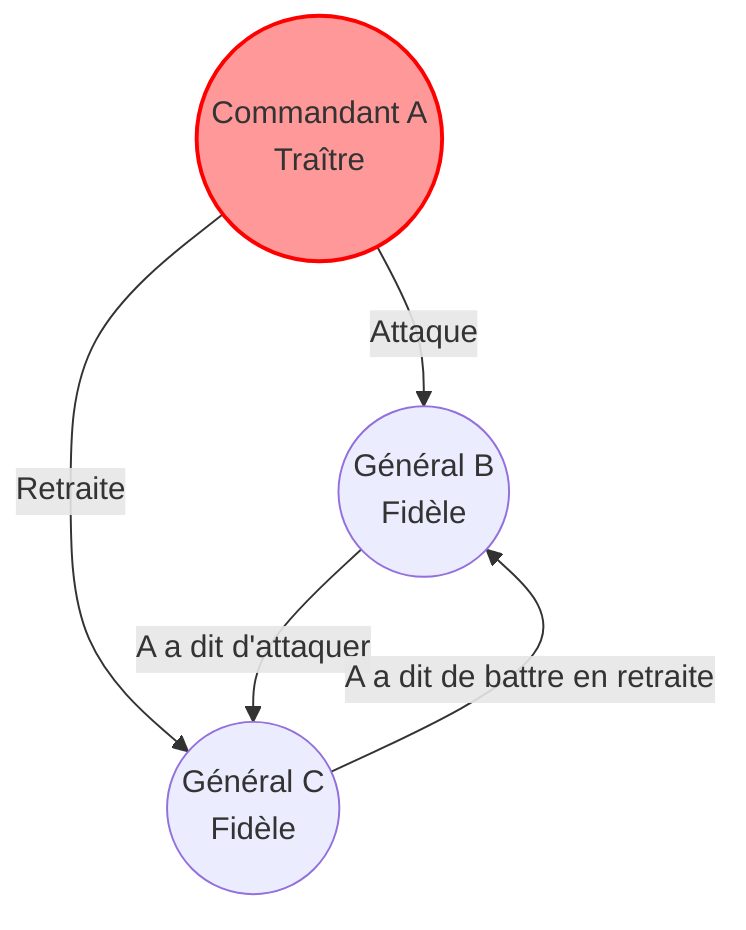
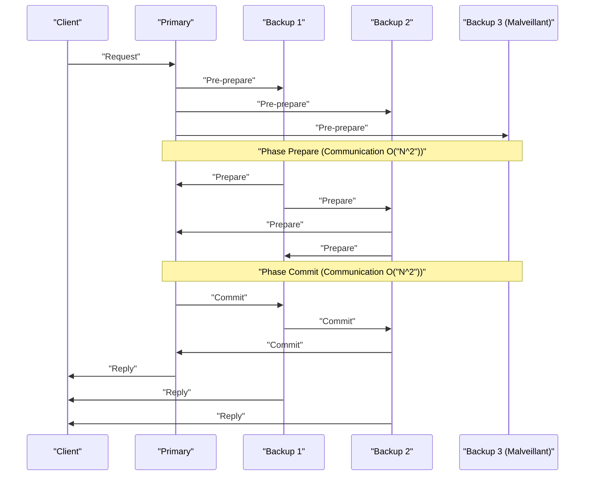

Au cœur de l'informatique en nuage moderne et de la technologie blockchain, on trouve les **algorithmes de consensus**, qui permettent à plusieurs ordinateurs (nœuds) de partager et de convenir d'un état commun. Dans cet article, nous explorerons les fondements théoriques en commençant par le « problème des généraux byzantins », puis nous plongerons en profondeur, avec des preuves mathématiques et des implémentations de code, dans **Paxos** et **Raft**, largement adoptés dans les systèmes pratiques, ainsi que dans la **BFT (Byzantine Fault Tolerance)**, qui résiste aux environnements où des participants malveillants sont présents.

## 1. La formation de consensus et les défis dans les systèmes distribués

Dans un système distribué, diverses pannes qui ne peuvent pas se produire sur un seul ordinateur surviennent, telles que les retards du réseau, la perte de paquets, les plantages de nœuds ou encore les falsifications malveillantes. Un algorithme de consensus est un mécanisme permettant de maintenir un état cohérent (state) pour l'ensemble du système tout en tolérant ces pannes.

La tolérance aux pannes du système est principalement divisée en deux catégories :

1.  **CFT (Crash Fault Tolerance)** : Peut tolérer l'arrêt (plantage) des nœuds et le partitionnement du réseau, mais ne suppose pas d'actions malveillantes où un nœud envoie de fausses données.
2.  **BFT (Byzantine Fault Tolerance)** : Peut tolérer non seulement l'arrêt des nœuds, mais aussi des situations où des nœuds malveillants envoient des messages arbitraires et incorrects.

Le concept de BFT trouve son origine dans le célèbre **problème des généraux byzantins**.

---

## 2. Le problème des généraux byzantins (Byzantine Generals Problem)

Proposé en 1982 par Leslie Lamport, Robert Shostak et Marshall Pease, le « problème des généraux byzantins » modélise la manière dont les participants honnêtes peuvent parvenir à un consensus dans un réseau où se mêlent des participants malveillants.

### 2.1 Définition du problème

Les généraux de l'empire byzantin assiègent une ville ennemie. Ils sont géographiquement séparés et ne peuvent communiquer que par des messagers. Les généraux doivent s'entendre sur un plan d'action : soit « attaquer », soit « battre en retraite ». Cependant, des traîtres (nœuds malveillants) se cachent parmi les généraux et peuvent envoyer de faux messages pour semer la confusion parmi les autres.

Les conditions que les généraux fidèles doivent remplir sont les suivantes :

1.  Tous les généraux fidèles doivent s'accorder sur le même plan d'action (attaquer ou se retirer).
2.  Un petit nombre de traîtres ne doit pas amener les généraux fidèles à adopter un mauvais consensus (ou un consensus incohérent).

### 2.2 Formulation mathématique et impossibilité

Soit $ n $ le nombre total de généraux et $ f $ le nombre de traîtres. Lamport et ses collègues ont prouvé mathématiquement que, dans le cas où les messages peuvent être falsifiés (messages non signés), un consensus est impossible à moins que la condition suivante ne soit remplie :

$ n > 3f $

En d'autres termes, le nombre total de nœuds doit être supérieur à plus de trois fois le nombre de traîtres. Inversement, si un tiers ( $ 1/3 $ ) ou plus des nœuds sont malveillants, le système ne peut pas parvenir à un consensus sûr.

Prenons l'exemple où $ n = 3 $ et $ f = 1 $. Il y a les généraux A (commandant), B et C, et supposons que A est un traître.
A dit à B d'« attaquer » et à C de « battre en retraite ». B et C échangent les messages qu'ils ont reçus de A, mais B affirme « A a dit d'attaquer » et C affirme « A a dit de battre en retraite ». À ce moment-là, il devient impossible pour B et C de déterminer si c'est l'autre qui ment ou si c'est A qui a menti.

Voici un diagramme Mermaid illustrant ce cas impossible où $ n = 3 $.



---

## 3. Paxos : Le monument du consensus théorique

Dans le domaine de la CFT (Crash Fault Tolerance), qui ne prend pas en compte les pannes byzantines, le premier algorithme puissant est **Paxos**. Également proposé par Leslie Lamport en 1989 (et publié en 1998), il est utilisé dans Chubby et Spanner de Google, etc.

### 3.1 Rôle et phases de Paxos

Paxos est composé de plusieurs Proposers (proposants), Acceptors (accepteurs) et Learners (apprenants). Le Paxos de base (Single-Decree Paxos) est un processus permettant de s'accorder sur une valeur unique, divisé en deux phases.

*   **Phase 1 : Prepare (Préparation)**
    1.  Le Proposer choisit un numéro de proposition unique $ n $ et envoie une requête `Prepare(n)` à la majorité des Acceptors.
    2.  Si $ n $ est supérieur à tout numéro de `Prepare` reçu précédemment, l'Acceptor promet de ne plus accepter de propositions inférieures à $ n $ et renvoie la valeur acceptée dans le passé, s'il y en a une.
*   **Phase 2 : Accept (Acceptation)**
    1.  Lorsque le Proposer obtient une réponse de la majorité des Acceptors, il envoie une requête `Accept(n, v)`. Ici, $ v $ est la valeur associée au numéro de proposition le plus élevé parmi les réponses reçues, ou sa propre valeur si aucune n'a été renvoyée.
    2.  L'Acceptor accepte la proposition, à condition qu'il n'ait pas promis de répondre à un numéro plus élevé.

### 3.2 Simulation de Paxos en Python

Voici un code Python simplifié simulant le comportement de la phase 1 et de la phase 2 de Paxos.

```python
import random

class Acceptor:
    def __init__(self, id):
        self.id = id
        self.min_proposal_num = -1
        self.accepted_num = -1
        self.accepted_value = None

    def receive_prepare(self, n):
        if n > self.min_proposal_num:
            self.min_proposal_num = n
            return True, self.accepted_num, self.accepted_value
        return False, None, None

    def receive_accept(self, n, v):
        if n >= self.min_proposal_num:
            self.min_proposal_num = n
            self.accepted_num = n
            self.accepted_value = v
            return True
        return False

class Proposer:
    def __init__(self, id, value, acceptors):
        self.id = id
        self.value = value
        self.acceptors = acceptors
        self.proposal_num = id  # Génération simple d'un numéro unique

    def run(self):
        # Phase 1 : Prepare
        promises = []
        highest_accepted_num = -1
        value_to_propose = self.value

        for acceptor in self.acceptors:
            promised, acc_num, acc_val = acceptor.receive_prepare(self.proposal_num)
            if promised:
                promises.append(acceptor)
                if acc_num > highest_accepted_num:
                    highest_accepted_num = acc_num
                    value_to_propose = acc_val

        # Vérification de la majorité
        if len(promises) > len(self.acceptors) / 2:
            # Phase 2 : Accept
            accepts = 0
            for acceptor in promises:
                if acceptor.receive_accept(self.proposal_num, value_to_propose):
                    accepts += 1
            
            if accepts > len(self.acceptors) / 2:
                print(f"Proposer {self.id}: Consensus atteint sur la valeur '{value_to_propose}'")
                return True
        
        print(f"Proposer {self.id}: Échec de l'obtention du consensus.")
        return False

# Exécution de la simulation
acceptors = [Acceptor(i) for i in range(5)]
proposer1 = Proposer(10, "Valeur_A", acceptors)
proposer2 = Proposer(20, "Valeur_B", acceptors)

# Simulation d'une condition de concurrence
proposer1.run()
proposer2.run()
```

---

## 4. Raft : L'algorithme axé sur la compréhensibilité

Bien que Paxos soit très puissant, son algorithme est complexe et difficile à implémenter dans des systèmes réels. C'est pourquoi en 2014, Diego Ongaro et John Ousterhout ont conçu **Raft**, avec un accent principal sur **« la compréhensibilité (Understandability) »**. Aujourd'hui, il est largement utilisé dans etcd, Consul, etc.

### 4.1 Concepts clés de Raft

Raft divise l'état global du système en deux sous-problèmes : **l'élection du leader (Leader Election)** et **la réplication du journal (Log Replication)**.

Les nœuds prennent toujours l'un des trois états suivants :
*   **Leader** : Reçoit les requêtes des clients et réplique les journaux sur d'autres nœuds.
*   **Follower (Suiveur)** : Obéit aux requêtes du leader.
*   **Candidate (Candidat)** : État où il se présente pour devenir le nouveau leader lorsque le leader tombe en panne.

```mermaid
stateDiagram-v2
    [*] --> "Follower"
    "Follower" --> "Candidate" : "Expiration du délai"
    "Candidate" --> "Candidate" : "Délai d'élection écoulé"
    "Candidate" --> "Leader" : "Obtient la majorité des votes"
    "Candidate" --> "Follower" : "Découvre un nouveau leader"
    "Leader" --> "Follower" : "Découvre un Term supérieur"
```

### 4.2 Le mécanisme d'élection du leader

Raft utilise une horloge logique appelée **Term (Mandat)**. Chaque follower possède un **délai d'élection (Election Timeout)** aléatoire. Si les battements de cœur (heartbeats) du leader s'arrêtent et que le délai expire, il devient Candidate et demande qu'on vote pour lui (RequestVote). Le nœud qui obtient la majorité des voix devient le nouveau Leader. En rendant les délais aléatoires, on évite le partage des votes (Split Vote).

### 4.3 Définition des types d'état d'un nœud Raft en Haskell

Modéliser les transitions d'état de Raft à l'aide d'un langage fonctionnel rend sa robustesse plus évidente. Voici un exemple de définition de type simplifiée en Haskell.

```haskell
module Raft where

data NodeState = Follower | Candidate | Leader
    deriving (Show, Eq)

type Term = Int
type NodeId = String

data RaftNode = RaftNode {
    nodeId      :: NodeId,
    currentTerm :: Term,
    votedFor    :: Maybe NodeId,
    state       :: NodeState,
    logEntries  :: [LogEntry]
} deriving (Show)

data LogEntry = LogEntry {
    term    :: Term,
    command :: String
} deriving (Show)

-- Exemple de signature pour une fonction de transition d'état
handleTimeout :: RaftNode -> RaftNode
handleTimeout node =
    if state node == Leader 
    then node
    else node { 
        state = Candidate, 
        currentTerm = currentTerm node + 1, 
        votedFor = Just (nodeId node) 
    }
```

En écrivant ainsi les transitions d'état sous forme de fonctions pures, il devient plus facile de vérifier l'exactitude de la logique de Raft.

---

## 5. La tolérance pratique aux pannes byzantines : PBFT

Paxos et Raft sont CFT (tolérants aux plantages), mais impuissants s'il y a des nœuds malveillants sur le réseau. Face à ce problème (le problème des généraux byzantins), **PBFT (Practical Byzantine Fault Tolerance)**, présenté par Miguel Castro et Barbara Liskov en 1999, a apporté une solution avec des performances pratiques.

### 5.1 Phases de communication de PBFT

Dans PBFT, il y a un leader (Primary) et des suiveurs (Backup), qui communiquent par multicast en 3 phases pour les requêtes des clients.

1.  **Pre-prepare** : Le Primary attribue un numéro de séquence à la requête et le diffuse (broadcast) à tous les nœuds.
2.  **Prepare** : Lorsqu'un nœud reçoit une requête, il la vérifie et diffuse un message `Prepare` à tous les autres nœuds. Après avoir reçu $ 2f $ messages `Prepare`, le nœud passe à l'état Prepared.
3.  **Commit** : Le nœud en état Prepared diffuse un message `Commit` à tous les nœuds. Après avoir reçu $ 2f + 1 $ messages `Commit`, le consensus est atteint et la requête est exécutée.



PBFT fonctionne avec une configuration de $ n = 3f + 1 $ nœuds, satisfaisant la condition $ n > 3f $ mentionnée précédemment, et implique une surcharge de communication de $ O(N^2) $ entre les nœuds, mais offre une finalité (Finality) déterministe. Il est largement adopté dans les blockchains de consortium modernes (comme Hyperledger Fabric).

### 5.2 Réaffirmation des contraintes mathématiques

Pour que PBFT reste sûr, les messages échangés dans le système doivent être cryptographiquement sûrs (infalsifiables). Si $ Q $ est la taille d'un quorum, les conditions suivantes doivent être remplies :

$ Q = 2f + 1 \\\\ n = 3f + 1 $

L'intersection de deux quorums arbitraires $ Q_1 $ et $ Q_2 $ doit toujours contenir au moins un nœud correct.
$ |Q_1 \cap Q_2| = 2Q - n = 2(2f + 1) - (3f + 1) = f + 1 $
De cette façon, même si $ f $ nœuds malveillants appartiennent aux deux quorums, il y aura toujours au moins un nœud honnête inclus, prouvant ainsi la cohérence du système dans son ensemble.

---

## 6. Conclusion : L'évolution des algorithmes de consensus

Cet article a couvert le plus grand défi des systèmes distribués, la formation de consensus, en partant du modèle théorique du « problème des généraux byzantins », en passant par **Paxos** et **Raft** qui offrent une tolérance aux plantages, jusqu'à **PBFT** qui résiste aux nœuds malveillants.

*   **Paxos** : Une base solide et mathématiquement prouvée, mais sa complexité est un défi.
*   **Raft** : En privilégiant la compréhensibilité et la facilité d'implémentation, il est devenu le standard de facto des [KVS](https://kenji.blog/fr/p/nosql-database-selection-kvs-document-graph-wide-column/) distribués modernes.
*   **PBFT** : Permet un consensus déterministe dans des environnements mixtes avec des nœuds malveillants, servant de base à la technologie blockchain.

Aujourd'hui, de nouveaux algorithmes BFT naissent les uns après les autres, tels que le **Nakamoto [Consensus](https://kenji.blog/fr/p/blockchain-technology-smart-contract-distributed-ledger/) ([PoW](https://kenji.blog/fr/p/blockchain-technology-smart-contract-distributed-ledger/))** adopté par Bitcoin, ainsi que Tendermint, HotStuff, etc., qui améliorent l'évolutivité tout en réduisant la surcharge de communication de PBFT. Choisir le bon algorithme de consensus en fonction des exigences du système (fiabilité des nœuds, débit requis, latence) est la clé pour construire des systèmes distribués robustes.
