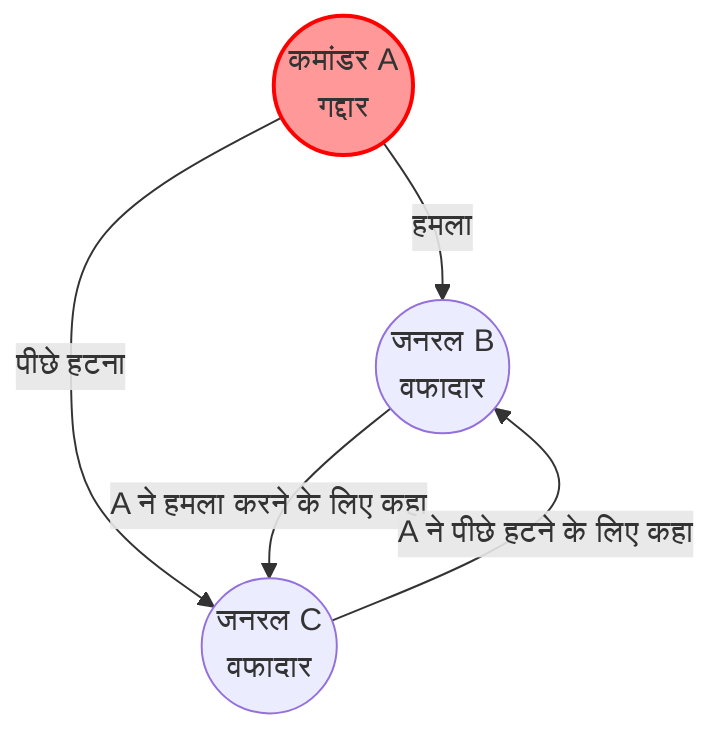
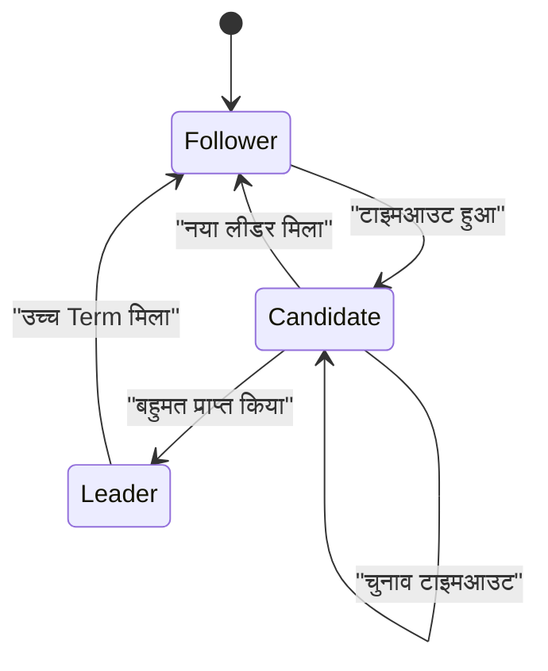
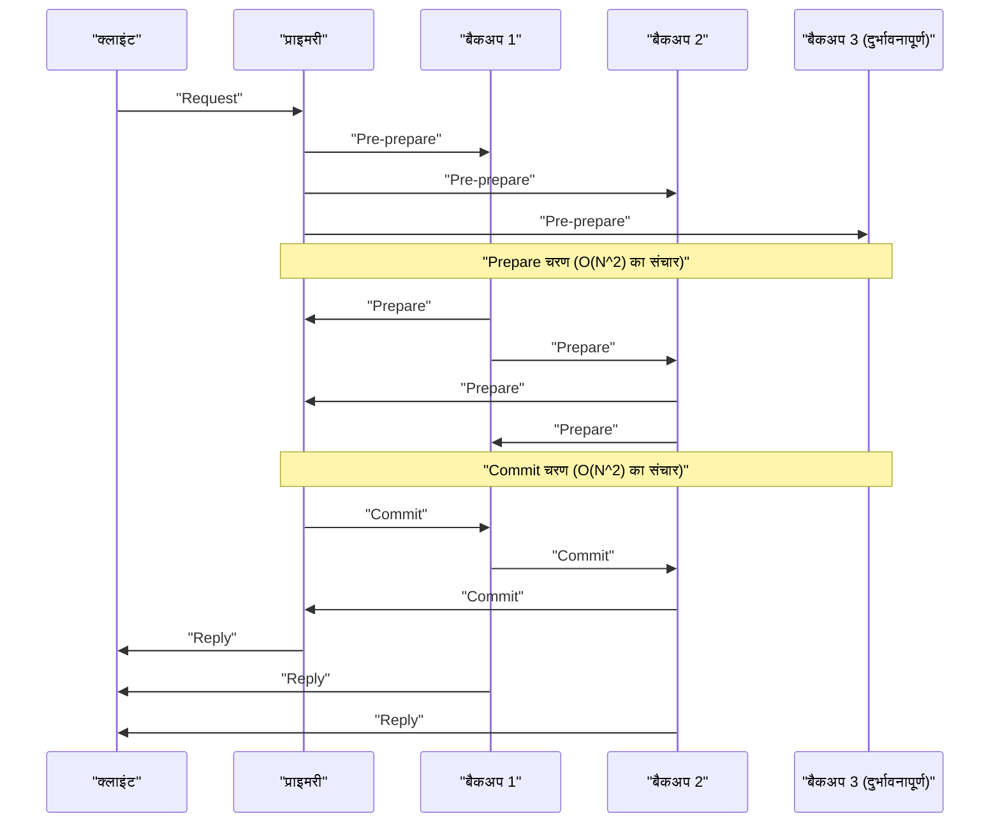

आधुनिक क्लाउड कंप्यूटिंग और ब्लॉकचेन तकनीक की नींव में **कंसेंसस एल्गोरिदम** मौजूद हैं, जो कई कंप्यूटरों (नोड्स) के बीच स्थिति साझा और संरेखित करते हैं। इस लेख में, इसके सैद्धांतिक आधार "बाइज़ेंटाइन जनरल्स प्रॉब्लम" (Byzantine Generals Problem) से शुरू होकर, व्यावहारिक प्रणालियों में व्यापक रूप से उपयोग किए जाने वाले **Paxos** और **Raft** , और दुर्भावनापूर्ण प्रतिभागियों वाले वातावरण में **BFT (Byzantine Fault Tolerance)** के बारे में, गणितीय प्रमाण और कोड कार्यान्वयन के साथ गहराई से चर्चा करेंगे।

## 1. वितरित प्रणालियों में सहमति निर्माण और चुनौतियाँ

वितरित प्रणालियों में, नेटवर्क विलंब, पैकेट हानि, नोड क्रैश, या दुर्भावनापूर्ण छेड़छाड़ जैसी विभिन्न विफलताएं होती हैं, जो एक एकल कंप्यूटर में संभव नहीं हैं। इन विफलताओं का सामना करते हुए, पूरे सिस्टम को एक सुसंगत स्थिति (स्टेट) में रखने का तंत्र कंसेंसस एल्गोरिदम है।

सिस्टम की दोष सहनशीलता को मुख्य रूप से निम्नलिखित दो श्रेणियों में बांटा गया है:

1.  **CFT (Crash Fault Tolerance)** : यह नोड्स के रुकने (क्रैश) और नेटवर्क विभाजन को सहन कर सकता है, लेकिन यह नहीं मानता कि नोड गलत डेटा भेजेंगे (दुर्भावनापूर्ण व्यवहार)।
2.  **BFT (Byzantine Fault Tolerance)** : न केवल नोड क्रैश, बल्कि यह ऐसी स्थिति को भी सहन कर सकता है जहां दुर्भावनापूर्ण नोड कोई भी अमान्य संदेश भेजते हैं।

इस BFT की अवधारणा को जन्म देने वाला प्रसिद्ध **बाइज़ेंटाइन जनरल्स प्रॉब्लम** (Byzantine Generals Problem) है।

---

## 2. बाइज़ेंटाइन जनरल्स प्रॉब्लम (Byzantine Generals Problem)

1982 में लेस्ली लैम्पोर्ट, रॉबर्ट शोस्टक और मार्शल पीस द्वारा प्रस्तावित "बाइज़ेंटाइन जनरल्स प्रॉब्लम", इस बात का एक मॉडल है कि दुर्भावनापूर्ण प्रतिभागियों वाले नेटवर्क में सभी सही प्रतिभागी कैसे सहमति बना सकते हैं।

### 2.1 समस्या की परिभाषा

बाइज़ेंटाइन साम्राज्य के जनरलों ने दुश्मन के शहर को घेर रखा है। वे भौगोलिक रूप से दूर हैं और केवल दूतों के माध्यम से संवाद कर सकते हैं। जनरलों को "हमला" या "पीछे हटना" में से किसी एक कार्रवाई पर सहमत होना चाहिए। हालाँकि, जनरलों में गद्दार (दुर्भावनापूर्ण नोड्स) भी हैं, जो अन्य जनरलों को भ्रमित करने के लिए झूठे संदेश भेज सकते हैं।

वफादार जनरलों द्वारा पूरी की जाने वाली शर्तें इस प्रकार हैं:

1.  सभी वफादार जनरलों को एक ही कार्य योजना (हमला या पीछे हटना) पर सहमत होना चाहिए।
2.  मुट्ठी भर गद्दारों को वफादार जनरलों को गलत (या असंगत) सहमति नहीं बनाने देनी चाहिए।

### 2.2 गणितीय निरूपण और असंभवता

मान लें कि जनरलों की कुल संख्या $ n $ है और गद्दारों की संख्या $ f $ है। लैम्पोर्ट और अन्य ने गणितीय रूप से साबित किया कि यदि संदेशों के साथ छेड़छाड़ की जा सकती है (बिना हस्ताक्षर वाले संदेश), तो सहमति तब तक असंभव है जब तक कि निम्नलिखित शर्तें पूरी न हों।

$ n > 3f $

यानी, नोड्स की कुल संख्या गद्दारों की संख्या के 3 गुना से अधिक होनी चाहिए। इसके विपरीत, यदि कुल नोड्स का $ 1/3 $ या अधिक दुर्भावनापूर्ण हैं, तो सिस्टम एक सुरक्षित सहमति तक नहीं पहुँच सकता।

उदाहरण के लिए, $ n = 3 $ और $ f = 1 $ के मामले पर विचार करें। मान लें कि जनरल A (कमांडर), B और C हैं, और A गद्दार है।

A, B से "हमला" करने और C से "पीछे हटने" के लिए कहता है। B और C एक दूसरे के साथ A से प्राप्त संदेशों का आदान-प्रदान करते हैं, लेकिन B दावा करता है "A ने हमला करने के लिए कहा", और C दावा करता है "A ने पीछे हटने के लिए कहा"। इस समय, B और C के लिए यह निर्धारित करना असंभव हो जाता है कि दूसरा व्यक्ति झूठ बोल रहा है या A झूठ बोल रहा है।

नीचे इस $ n = 3 $ के असंभव मामले को दर्शाने वाला एक मर्मेड (Mermaid) आरेख दिया गया है।



---

## 3. Paxos: सैद्धांतिक सहमति का मील का पत्थर

CFT (Crash Fault Tolerance) के क्षेत्र में, जो बाइज़ेंटाइन विफलताओं पर विचार नहीं करता, पहला शक्तिशाली एल्गोरिदम **Paxos** है। इसे भी 1989 में लेस्ली लैम्पोर्ट द्वारा प्रस्तावित किया गया था (1998 में प्रकाशित), और इसका उपयोग Google के Chubby और Spanner आदि में किया जाता है।

### 3.1 Paxos की भूमिका और चरण

Paxos में कई प्रस्तावक (Proposer), स्वीकारकर्ता (Acceptor) और शिक्षार्थी (Learner) होते हैं। बेसिक पैक्सोस (Single-Decree Paxos) एकल मूल्य पर सहमत होने की एक प्रक्रिया है, जिसे निम्नलिखित दो चरणों में विभाजित किया गया है:

*   **चरण 1: Prepare (तैयारी)**
    1.  प्रस्तावक एक अद्वितीय प्रस्ताव संख्या $ n $ चुनता है और स्वीकारकर्ताओं के बहुमत को `Prepare(n)` अनुरोध भेजता है।
    2.  यदि $ n $ किसी भी पिछले प्राप्त `Prepare` संख्या से बड़ा है, तो स्वीकारकर्ता वादा करता है कि वह भविष्य में $ n $ से कम के प्रस्तावों को स्वीकार नहीं करेगा, और यदि उसने अतीत में कोई मूल्य स्वीकार किया है तो उसे वापस कर देता है।
*   **चरण 2: Accept (स्वीकृति)**
    1.  जब प्रस्तावक को स्वीकारकर्ताओं के बहुमत से प्रतिक्रिया मिलती है, तो वह `Accept(n, v)` अनुरोध भेजता है। यहाँ $ v $ प्रतिक्रियाओं में शामिल उच्चतम प्रस्ताव संख्या वाला मूल्य है, या यदि कोई नहीं है, तो वह मूल्य जिसे वह स्वयं प्रस्तावित करना चाहता है।
    2.  स्वीकारकर्ता प्रस्ताव को तब तक स्वीकार कर लेता है जब तक उसने किसी बड़ी संख्या के लिए कोई वादा नहीं किया हो।

### 3.2 Python के साथ Paxos का अनुकरण

यहाँ एक Python कोड है जो पैक्सोस के चरण 1 और चरण 2 के व्यवहार को सरलीकृत करके अनुकरण करता है।

```python
import random

class Acceptor:
    def __init__(self, id):
        self.id = id
        self.min_proposal_num = -1
        self.accepted_num = -1
        self.accepted_value = None

    def receive_prepare(self, n):
        if n > self.min_proposal_num:
            self.min_proposal_num = n
            return True, self.accepted_num, self.accepted_value
        return False, None, None

    def receive_accept(self, n, v):
        if n >= self.min_proposal_num:
            self.min_proposal_num = n
            self.accepted_num = n
            self.accepted_value = v
            return True
        return False

class Proposer:
    def __init__(self, id, value, acceptors):
        self.id = id
        self.value = value
        self.acceptors = acceptors
        self.proposal_num = id  # सरल अद्वितीय संख्या निर्माण

    def run(self):
        # चरण 1: Prepare
        promises = []
        highest_accepted_num = -1
        value_to_propose = self.value

        for acceptor in self.acceptors:
            promised, acc_num, acc_val = acceptor.receive_prepare(self.proposal_num)
            if promised:
                promises.append(acceptor)
                if acc_num > highest_accepted_num:
                    highest_accepted_num = acc_num
                    value_to_propose = acc_val

        # बहुमत की जांच
        if len(promises) > len(self.acceptors) / 2:
            # चरण 2: Accept
            accepts = 0
            for acceptor in promises:
                if acceptor.receive_accept(self.proposal_num, value_to_propose):
                    accepts += 1
            
            if accepts > len(self.acceptors) / 2:
                print(f"Proposer {self.id}: Consensus reached on value '{value_to_propose}'")
                return True
        
        print(f"Proposer {self.id}: Failed to reach consensus.")
        return False

# अनुकरण का निष्पादन
acceptors = [Acceptor(i) for i in range(5)]
proposer1 = Proposer(10, "Value_A", acceptors)
proposer2 = Proposer(20, "Value_B", acceptors)

# रेस कंडीशन का अनुकरण
proposer1.run()
proposer2.run()
```

---

## 4. Raft: समझने में आसानी के लिए डिज़ाइन किया गया एल्गोरिदम

Paxos बहुत शक्तिशाली है, लेकिन इसका एल्गोरिदम जटिल है और इसे वास्तविक प्रणालियों में लागू करना मुश्किल था। इसलिए, 2014 में, डिएगो ओंगारो और जॉन ऑस्टरहौट ने **"समझने में आसानी (Understandability)"** पर ध्यान केंद्रित करते हुए **Raft** को डिज़ाइन किया। वर्तमान में, इसका व्यापक रूप से etcd, Consul आदि में उपयोग किया जाता है।

### 4.1 Raft की मुख्य अवधारणाएँ

Raft पूरे सिस्टम की स्थिति को दो उप-समस्याओं में विभाजित करता है: **लीडर का चुनाव (Leader Election)** और **लॉग प्रतिकृति (Log Replication)** ।

नोड्स हमेशा निम्नलिखित तीन स्थितियों में से एक में होते हैं:
*   **लीडर (Leader)** : ग्राहकों (क्लाइंट्स) से अनुरोध प्राप्त करता है और अन्य नोड्स में लॉग की प्रतिकृति बनाता है।
*   **अनुयायी (Follower)** : लीडर के अनुरोधों का पालन करता है।
*   **उम्मीदवार (Candidate)** : जब लीडर डाउन हो जाता है, तो नया लीडर बनने के लिए उम्मीदवारी प्रस्तुत करने की स्थिति।



### 4.2 लीडर चुनाव का तंत्र

Raft में **Term (कार्यकाल)** नामक लॉजिकल घड़ी का उपयोग किया जाता है। प्रत्येक अनुयायी के पास एक यादृच्छिक **चुनाव टाइमआउट (Election Timeout)** होता है, और यदि लीडर से हार्टबीट बंद हो जाती है और टाइमआउट होता है, तो वह उम्मीदवार (Candidate) बन जाता है और अपने लिए वोट का अनुरोध (RequestVote) करता है। बहुमत प्राप्त करने वाला नोड नया लीडर बन जाता है। टाइमआउट को यादृच्छिक बनाकर, वोटों के विभाजन (Split Vote) को रोका जाता है।

### 4.3 हास्केल (Haskell) के साथ Raft नोड स्थिति की टाइप परिभाषा

फ़ंक्शनल (Functional) भाषा का उपयोग करके Raft के राज्य संक्रमण को मॉडल करने से इसकी मजबूती अधिक स्पष्ट हो जाती है। नीचे हास्केल का उपयोग करके सरलीकृत टाइप परिभाषा का एक उदाहरण दिया गया है।

```haskell
module Raft where

data NodeState = Follower | Candidate | Leader
    deriving (Show, Eq)

type Term = Int
type NodeId = String

data RaftNode = RaftNode {
    nodeId      :: NodeId,
    currentTerm :: Term,
    votedFor    :: Maybe NodeId,
    state       :: NodeState,
    logEntries  :: [LogEntry]
} deriving (Show)

data LogEntry = LogEntry {
    term    :: Term,
    command :: String
} deriving (Show)

-- स्थिति संक्रमण फ़ंक्शन के हस्ताक्षर का उदाहरण
handleTimeout :: RaftNode -> RaftNode
handleTimeout node =
    if state node == Leader 
    then node
    else node { 
        state = Candidate, 
        currentTerm = currentTerm node + 1, 
        votedFor = Just (nodeId node) 
    }
```

इस प्रकार, स्थिति संक्रमण को एक शुद्ध फ़ंक्शन (pure function) के रूप में लिखकर, Raft के लॉजिक की वैधता को सत्यापित करना आसान हो जाता है।

---

## 5. व्यावहारिक बाइज़ेंटाइन दोष सहनशीलता: PBFT

Paxos और Raft CFT (क्रैश सहिष्णु) हैं, लेकिन यदि नेटवर्क में दुर्भावनापूर्ण नोड्स हैं तो वे शक्तिहीन हैं। इस समस्या (बाइज़ेंटाइन जनरल्स प्रॉब्लम) का व्यावहारिक प्रदर्शन के साथ समाधान 1999 में मिगुएल कास्त्रो और बारबरा लिस्कोव द्वारा प्रस्तुत **PBFT (Practical Byzantine Fault Tolerance)** द्वारा दिया गया था।

### 5.1 PBFT के संचार चरण

PBFT में, एक लीडर (Primary) और अनुयायी (Backup) होते हैं, और क्लाइंट के अनुरोधों के लिए निम्नलिखित 3 चरणों का मल्टीकास्ट संचार किया जाता है:

1.  **Pre-prepare** : प्राइमरी (Primary) अनुरोध को एक अनुक्रम (Sequence) संख्या प्रदान करता है और इसे सभी नोड्स में प्रसारित करता है।
2.  **Prepare** : प्रत्येक नोड अनुरोध प्राप्त करता है, उसे सत्यापित करता है, और फिर अन्य सभी नोड्स में एक `Prepare` संदेश प्रसारित करता है। $ 2f $ `Prepare` संदेश प्राप्त करने के बाद, नोड Prepared स्थिति में आ जाता है।
3.  **Commit** : Prepared स्थिति में मौजूद नोड्स सभी नोड्स में `Commit` संदेश प्रसारित करते हैं। $ 2f + 1 $ `Commit` संदेश प्राप्त करने पर, सहमति पूरी हो जाती है और अनुरोध निष्पादित किया जाता है।



PBFT $ n = 3f + 1 $ के नोड कॉन्फ़िगरेशन में काम करता है, जो उपर्युक्त $ n > 3f $ शर्त को पूरा करता है। हालांकि इसमें नोड्स के बीच $ O(N^2) $ संचार ओवरहेड शामिल है, यह एक निश्चित सहमति (Finality) प्रदान करता है। इसे आज के कंसोर्टियम-प्रकार के ब्लॉकचेन (जैसे Hyperledger Fabric) में व्यापक रूप से अपनाया जाता है।

### 5.2 गणितीय बाधाओं की पुन: पुष्टि

PBFT को सुरक्षित रहने के लिए, यह माना जाता है कि सिस्टम के भीतर आदान-प्रदान किए गए संदेश क्रिप्टोग्राफ़िक रूप से सुरक्षित (अक्षम्य / जाली नहीं बनाए जा सकते) हैं। यदि कोरम (Quorum) का आकार $ Q $ है, तो निम्नलिखित शर्तों को पूरा किया जाना चाहिए:

$ Q = 2f + 1 \\\\ n = 3f + 1 $

किन्हीं दो कोरम $ Q_1 $ और $ Q_2 $ के प्रतिच्छेदन में कम से कम एक सही नोड अवश्य शामिल होना चाहिए।

$ |Q_1 \cap Q_2| = 2Q - n = 2(2f + 1) - (3f + 1) = f + 1 $

इस प्रकार, भले ही $ f $ दुर्भावनापूर्ण नोड्स दोनों कोरम के हों, हमेशा कम से कम एक ईमानदार नोड शामिल होगा, जिससे पूरे सिस्टम की स्थिरता (consistency) साबित होती है।

---

## 6. निष्कर्ष: कंसेंसस एल्गोरिदम का विकास

इस लेख में, हमने वितरित प्रणालियों की सबसे बड़ी चुनौती, कंसेंसस (सहमति) निर्माण के बारे में सैद्धांतिक "बाइज़ेंटाइन जनरल्स प्रॉब्लम" से शुरू करते हुए, क्रैश सहिष्णुता वाले **Paxos** और **Raft** , और दुर्भावनापूर्ण नोड्स के प्रति प्रतिरोधी **PBFT** के बारे में चर्चा की।

*   **Paxos** : गणितीय रूप से सिद्ध मजबूत नींव है, लेकिन इसकी जटिलता एक चुनौती है।
*   **Raft** : समझने और लागू करने में आसानी का अनुसरण करता है, जो आधुनिक वितरित KVS के लिए डी फैक्टो (de facto) मानक बन गया है।
*   **PBFT** : ऐसे वातावरण में निश्चित सहमति प्राप्त करता है जहां दुर्भावनापूर्ण नोड मिश्रित होते हैं, और यह ब्लॉकचेन तकनीक की नींव बन गया है।

आज, **नाकामोतो कंसेंसस (Nakamoto Consensus - PoW)** जिसे बिटकॉइन ने अपनाया है, और Tendermint, HotStuff आदि जैसे नए BFT एल्गोरिदम लगातार सामने आ रहे हैं जो PBFT के संचार ओवरहेड को कम करते हुए स्केलेबिलिटी में सुधार करते हैं। सिस्टम की आवश्यकताओं (नोड की विश्वसनीयता, आवश्यक थ्रूपुट, लेटेंसी) के आधार पर उपयुक्त कंसेंसस एल्गोरिदम का चयन करना एक मजबूत वितरित प्रणाली के निर्माण की कुंजी है।
