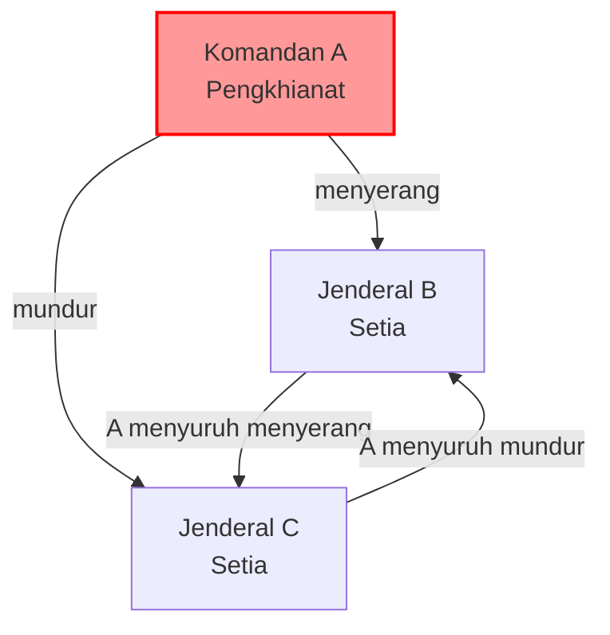
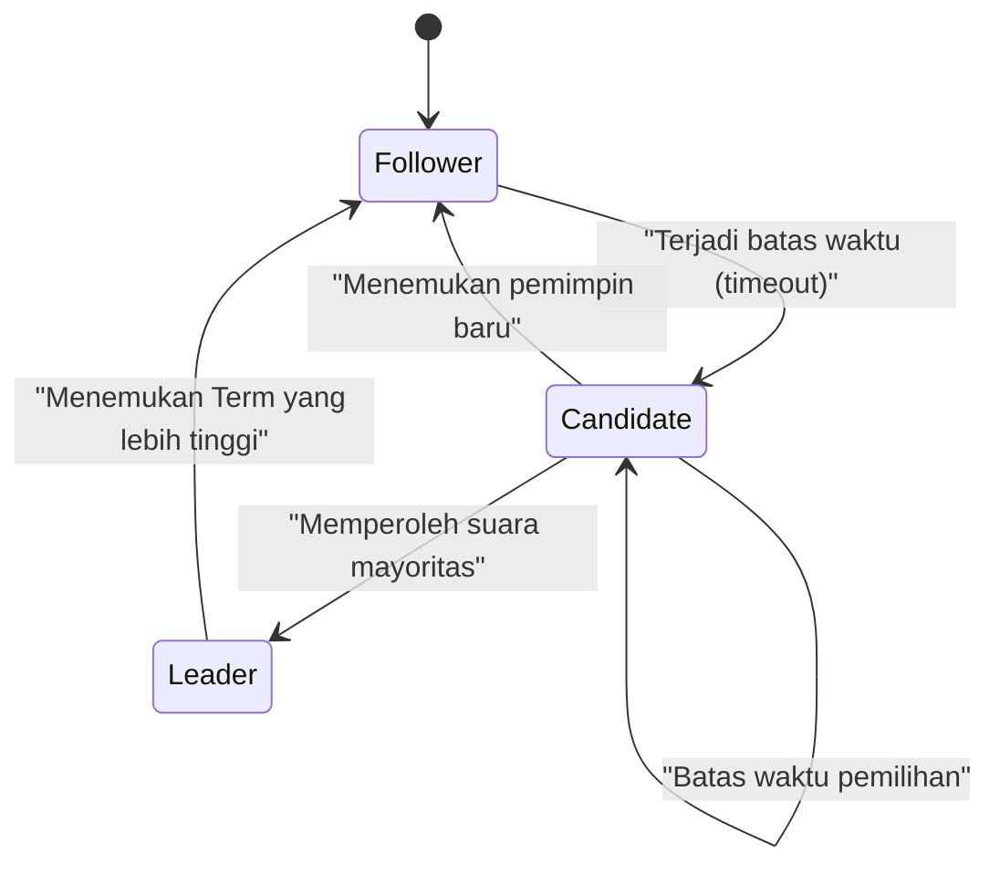
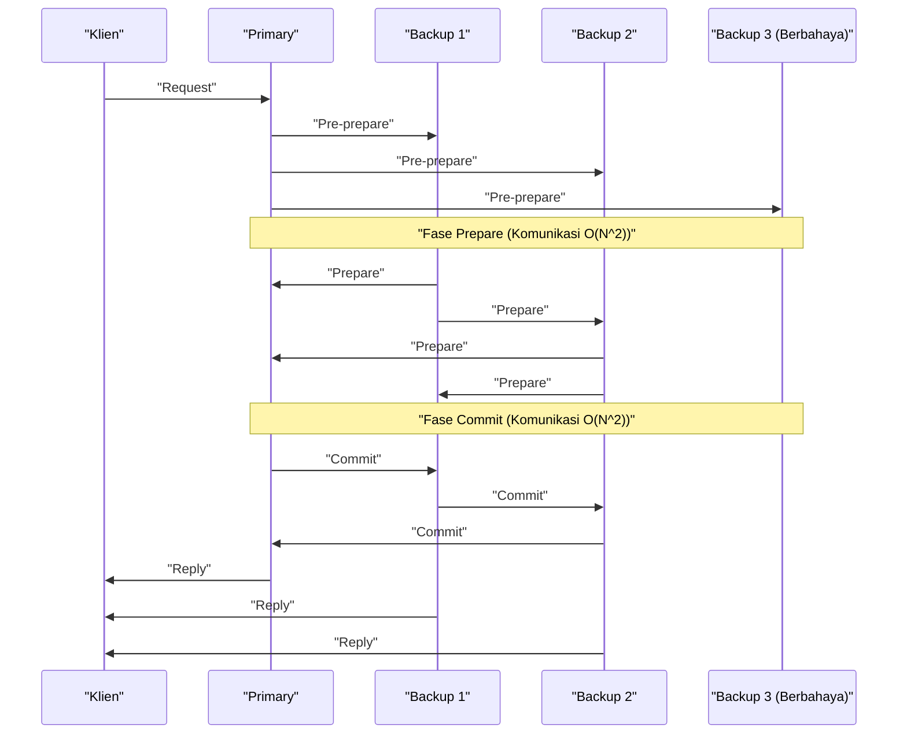

Di jantung komputasi awan modern dan teknologi blockchain, terdapat **algoritma konsensus** yang berbagi dan menyinkronkan status di antara banyak komputer (node). Artikel ini akan membahas dasar teori "Masalah Jenderal Bizantium" hingga algoritma yang banyak digunakan dalam sistem praktis seperti **Paxos** dan **Raft** , serta **BFT (Byzantine Fault Tolerance)** di lingkungan dengan partisipan berbahaya, dengan menyertakan bukti matematis dan implementasi kode.

## 1. Pembentukan Kesepakatan dan Tantangan dalam Sistem Terdistribusi

Dalam sistem terdistribusi, berbagai kegagalan yang tidak mungkin terjadi pada komputer tunggal dapat terjadi, seperti latensi jaringan, hilangnya paket, *crash* pada node, atau pemalsuan berbahaya. Mekanisme untuk mempertahankan status yang konsisten secara keseluruhan di seluruh sistem sambil bertahan dari kegagalan-kegagalan ini adalah algoritma konsensus.

Toleransi kesalahan sistem umumnya dibagi menjadi dua kategori:

1.  **CFT (Crash Fault Tolerance)** : Tahan terhadap berhentinya node (*crash*) atau partisi jaringan, tetapi tidak memperhitungkan tindakan berbahaya di mana node mengirim data palsu.
2.  **BFT (Byzantine Fault Tolerance)** : Selain berhentinya node, juga tahan terhadap situasi di mana node berbahaya mengirim pesan palsu secara sewenang-wenang.

Konsep BFT ini melahirkan **Masalah Jenderal Bizantium** yang terkenal.

---

## 2. Masalah Jenderal Bizantium (Byzantine Generals Problem)

Diusulkan pada tahun 1982 oleh Leslie Lamport, Robert Shostak, dan Marshall Pease, "Masalah Jenderal Bizantium" memodelkan bagaimana partisipan yang jujur dapat mencapai kesepakatan dalam jaringan yang bercampur dengan partisipan berbahaya.

### 2.1 Definisi Masalah

Jenderal-jenderal Kekaisaran Bizantium mengepung kota musuh. Mereka terpisah secara geografis dan hanya dapat berkomunikasi melalui utusan. Para jenderal harus menyepakati tindakan apakah akan "menyerang" atau "mundur". Namun, di antara para jenderal tersebut ada pengkhianat (node berbahaya) yang mungkin mengirim pesan palsu untuk membingungkan jenderal lainnya.

Syarat-syarat yang harus dipenuhi oleh jenderal yang setia adalah sebagai berikut:

1.  Semua jenderal yang setia harus menyepakati rencana tindakan yang sama (menyerang atau mundur).
2.  Segelintir pengkhianat tidak boleh membuat jenderal yang setia menyepakati hal yang salah (atau tidak konsisten).

### 2.2 Formulasi Matematis dan Ketidakmungkinan

Misalkan jumlah total jenderal adalah $ n $ dan jumlah pengkhianat adalah $ f $. Lamport dan rekan-rekannya membuktikan secara matematis bahwa ketika pesan dapat diubah (pesan tanpa tanda tangan), kesepakatan tidak mungkin tercapai kecuali jika memenuhi syarat berikut:

$ n > 3f $

Artinya, jumlah total node harus lebih dari tiga kali lipat jumlah pengkhianat. Sebaliknya, jika lebih dari atau sama dengan $ 1/3 $ dari total node adalah node berbahaya, sistem tidak dapat mencapai kesepakatan yang aman.

Sebagai contoh, pertimbangkan kasus di mana $ n = 3 $ dan $ f = 1 $. Ada Jenderal A (Komandan), B, dan C, dengan A sebagai pengkhianat.
A memberitahu B untuk "menyerang" dan C untuk "mundur". B dan C saling bertukar pesan yang mereka terima dari A, tetapi B mengklaim "A menyuruh menyerang" dan C mengklaim "A menyuruh mundur". Pada saat ini, tidak mungkin bagi B dan C untuk menentukan apakah yang lain sedang berbohong, atau A yang berbohong.

Berikut adalah diagram Mermaid yang menunjukkan kasus yang tidak mungkin untuk $ n = 3 $ ini.



---

## 3. Paxos: Puncak dari Konsensus Teoretis

Dalam ranah CFT (Crash Fault Tolerance) yang tidak mempertimbangkan kesalahan Bizantium, algoritma tangguh pertama adalah **Paxos**. Juga diusulkan oleh Leslie Lamport pada tahun 1989 (diterbitkan pada tahun 1998), algoritma ini digunakan di Chubby Google, Spanner, dan lainnya.

### 3.1 Peran dan Fase Paxos

Paxos terdiri dari beberapa Proposer (Pengusul), Acceptor (Penerima), dan Learner (Pelajar). Paxos dasar (Single-Decree Paxos) adalah proses untuk menyepakati satu nilai, yang dibagi menjadi dua fase berikut:

*   **Fase 1: Prepare (Persiapan)**
    1.  Proposer memilih nomor usulan unik $ n $ dan mengirim permintaan `Prepare(n)` ke mayoritas Acceptor.
    2.  Jika $ n $ lebih besar dari nomor `Prepare` mana pun yang pernah diterima, Acceptor berjanji untuk tidak menerima usulan yang bernomor kurang dari $ n $, dan jika ada nilai yang diterima sebelumnya, ia akan mengembalikannya.
*   **Fase 2: Accept (Penerimaan)**
    1.  Setelah Proposer menerima tanggapan dari mayoritas Acceptor, ia mengirimkan permintaan `Accept(n, v)`. Di sini, $ v $ adalah nilai yang memiliki nomor usulan terbesar di antara nilai-nilai yang disertakan dalam tanggapan, atau jika tidak ada, nilai yang ingin diusulkan sendiri.
    2.  Acceptor menerima usulan asalkan belum membuat janji untuk nomor yang lebih besar.

### 3.2 Simulasi Paxos dengan Python

Berikut adalah kode Python yang menyederhanakan dan mensimulasikan perilaku Fase 1 dan Fase 2 Paxos.

```python
import random

class Acceptor:
    def __init__(self, id):
        self.id = id
        self.min_proposal_num = -1
        self.accepted_num = -1
        self.accepted_value = None

    def receive_prepare(self, n):
        if n > self.min_proposal_num:
            self.min_proposal_num = n
            return True, self.accepted_num, self.accepted_value
        return False, None, None

    def receive_accept(self, n, v):
        if n >= self.min_proposal_num:
            self.min_proposal_num = n
            self.accepted_num = n
            self.accepted_value = v
            return True
        return False

class Proposer:
    def __init__(self, id, value, acceptors):
        self.id = id
        self.value = value
        self.acceptors = acceptors
        self.proposal_num = id  # Pembuatan nomor unik sederhana

    def run(self):
        # Fase 1: Prepare
        promises = []
        highest_accepted_num = -1
        value_to_propose = self.value

        for acceptor in self.acceptors:
            promised, acc_num, acc_val = acceptor.receive_prepare(self.proposal_num)
            if promised:
                promises.append(acceptor)
                if acc_num > highest_accepted_num:
                    highest_accepted_num = acc_num
                    value_to_propose = acc_val

        # Pengecekan mayoritas
        if len(promises) > len(self.acceptors) / 2:
            # Fase 2: Accept
            accepts = 0
            for acceptor in promises:
                if acceptor.receive_accept(self.proposal_num, value_to_propose):
                    accepts += 1
            
            if accepts > len(self.acceptors) / 2:
                print(f"Proposer {self.id}: Konsensus tercapai pada nilai '{value_to_propose}'")
                return True
        
        print(f"Proposer {self.id}: Gagal mencapai konsensus.")
        return False

# Eksekusi simulasi
acceptors = [Acceptor(i) for i in range(5)]
proposer1 = Proposer(10, "Nilai_A", acceptors)
proposer2 = Proposer(20, "Nilai_B", acceptors)

# Simulasi kondisi balapan
proposer1.run()
proposer2.run()
```

---

## 4. Raft: Algoritma yang Mengutamakan Kemudahan Pemahaman

Meskipun Paxos sangat kuat, algoritmanya rumit dan sulit diterapkan pada sistem nyata. Oleh karena itu, pada tahun 2014, Diego Ongaro dan John Ousterhout merancang **Raft** dengan fokus utama pada **"kemudahan pemahaman (Understandability)"** . Saat ini, algoritma tersebut banyak digunakan di etcd, Consul, dll.

### 4.1 Konsep Utama Raft

Raft membagi keseluruhan status sistem menjadi dua sub-masalah: **Pemilihan Pemimpin (Leader Election)** dan **Replikasi Log (Log Replication)** .

Node selalu berada dalam salah satu dari tiga status berikut:
*   **Leader (Pemimpin)** : Menerima permintaan dari klien dan mereplikasi log ke node lain.
*   **Follower (Pengikut)** : Mengikuti permintaan dari pemimpin.
*   **Candidate (Kandidat)** : Status mencalonkan diri untuk menjadi pemimpin baru saat pemimpin turun.



### 4.2 Mekanisme Pemilihan Pemimpin

Raft menggunakan jam logis yang disebut **Term (Masa Jabatan)** . Setiap Follower memiliki **batas waktu pemilihan (Election Timeout)** yang acak. Jika detak jantung (heartbeat) dari Pemimpin terhenti dan waktu habis (timeout), Follower menjadi Candidate dan meminta suara (RequestVote) untuk dirinya sendiri. Node yang mendapat suara mayoritas menjadi Leader baru. Mengacak batas waktu (timeout) mencegah terbaginya suara (Split Vote).

### 4.3 Definisi Tipe Status Node Raft dengan Haskell

Memodelkan transisi status Raft menggunakan bahasa fungsional memperjelas ketahanannya. Berikut adalah contoh definisi tipe yang disederhanakan di Haskell.

```haskell
module Raft where

data NodeState = Follower | Candidate | Leader
    deriving (Show, Eq)

type Term = Int
type NodeId = String

data RaftNode = RaftNode {
    nodeId      :: NodeId,
    currentTerm :: Term,
    votedFor    :: Maybe NodeId,
    state       :: NodeState,
    logEntries  :: [LogEntry]
} deriving (Show)

data LogEntry = LogEntry {
    term    :: Term,
    command :: String
} deriving (Show)

-- Contoh tanda tangan fungsi transisi status
handleTimeout :: RaftNode -> RaftNode
handleTimeout node =
    if state node == Leader 
    then node
    else node { 
        state = Candidate, 
        currentTerm = currentTerm node + 1, 
        votedFor = Just (nodeId node) 
    }
```

Dengan mendeskripsikan transisi status sebagai fungsi murni seperti ini, kita menjadi lebih mudah memverifikasi kebenaran logika Raft.

---

## 5. Toleransi Kesalahan Bizantium yang Praktis: PBFT

Paxos dan Raft adalah CFT (toleransi crash), namun mereka tidak berdaya jika ada node berbahaya di jaringan. **PBFT (Practical Byzantine Fault Tolerance)** , yang diperkenalkan oleh Miguel Castro dan Barbara Liskov pada tahun 1999, memberikan solusi dengan kinerja praktis untuk masalah ini (Masalah Jenderal Bizantium).

### 5.1 Fase Komunikasi PBFT

Dalam PBFT, terdapat Pemimpin (Primary) dan Pengikut (Backup), yang melakukan komunikasi *multicast* tiga fase berikut terhadap permintaan dari klien:

1.  **Pre-prepare** : Primary menetapkan nomor urut (sequence number) pada permintaan dan menyiarkannya (broadcast) ke semua node.
2.  **Prepare** : Saat menerima permintaan, setiap node memverifikasi permintaan tersebut, lalu menyiarkan pesan `Prepare` ke semua node lainnya. Ketika menerima $ 2f $ pesan `Prepare`, node tersebut masuk ke status Prepared.
3.  **Commit** : Node yang berada dalam status Prepared menyiarkan pesan `Commit` ke semua node. Ketika menerima $ 2f + 1 $ pesan `Commit`, kesepakatan selesai dan permintaan dieksekusi.



PBFT beroperasi dengan konfigurasi $ n = 3f + 1 $ node, yang memenuhi syarat $ n > 3f $ seperti disebutkan sebelumnya. Meskipun melibatkan biaya (overhead) komunikasi antar node sebesar $ O(N^2) $, ini memberikan finalitas kesepakatan (Finality) yang pasti. Hal ini banyak digunakan dalam sistem *blockchain* tipe konsorsium modern (seperti Hyperledger Fabric).

### 5.2 Meninjau Kembali Kendala Matematis

Agar PBFT dapat menjaga keamanan, pesan yang dipertukarkan di dalam sistem harus aman secara kriptografis (tidak dapat dipalsukan). Jika ukuran kuorum (Quorum) adalah $ Q $, maka kondisi berikut harus dipenuhi.

$ Q = 2f + 1 \\\\ n = 3f + 1 $

Irisan (intersection) dari dua kuorum sewenang-wenang $ Q_1 $ dan $ Q_2 $ harus selalu menyertakan setidaknya satu node yang benar.
$ |Q_1 \cap Q_2| = 2Q - n = 2(2f + 1) - (3f + 1) = f + 1 $
Dengan cara ini, bahkan jika $ f $ node berbahaya termasuk dalam kedua kuorum, akan selalu ada setidaknya satu node jujur yang disertakan, sehingga konsistensi keseluruhan sistem dapat dibuktikan.

---

## 6. Kesimpulan: Evolusi Algoritma Konsensus

Artikel ini telah menjelaskan pembentukan konsensus, tantangan terbesar dalam sistem terdistribusi, dimulai dari "Masalah Jenderal Bizantium" secara teoritis, **Paxos** dan **Raft** yang memiliki toleransi *crash*, serta **PBFT** yang tahan terhadap lingkungan dengan node berbahaya.

*   **Paxos** : Fondasi tangguh yang terbukti secara matematis, tetapi kompleksitasnya menjadi masalah.
*   **Raft** : Mengutamakan kemudahan pemahaman dan implementasi, menjadi standar *de facto* untuk KVS terdistribusi modern.
*   **PBFT** : Mewujudkan kesepakatan deterministik di lingkungan dengan node berbahaya, menjadi dasar teknologi blockchain.

Saat ini, bermunculan algoritma BFT baru yang mengurangi biaya (overhead) komunikasi PBFT dan meningkatkan skalabilitas, seperti **Nakamoto [Consensus](https://kenji.blog/id/p/blockchain-technology-smart-contract-distributed-ledger/) ([PoW](https://kenji.blog/id/p/blockchain-technology-smart-contract-distributed-ledger/))** yang diadopsi oleh Bitcoin, Tendermint, HotStuff, dan lainnya. Memilih algoritma konsensus yang tepat sesuai dengan persyaratan sistem (keandalan node, *throughput* yang diperlukan, latensi) adalah kunci dalam membangun sistem terdistribusi yang tangguh.
