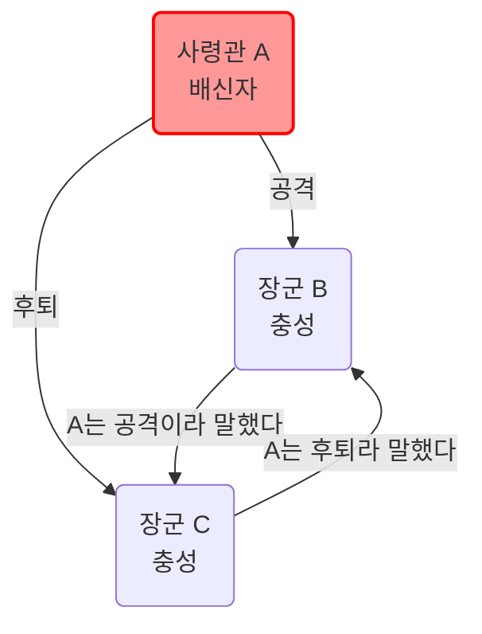
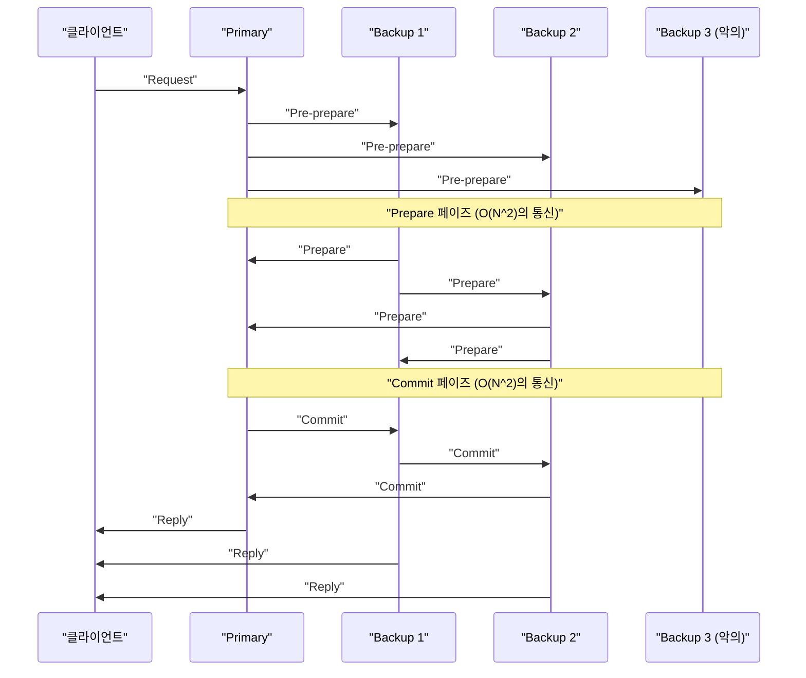

현대 클라우드 컴퓨팅이나 블록체인 기술을 지탱하는 근간에는 여러 컴퓨터(노드) 간에 상태를 공유하고 일치시키는 **합의 알고리즘** 이 존재합니다. 본 기사에서는 그 이론적 기초인 '비잔틴 장군 문제'부터 시작하여 실제 시스템에서 널리 채택되고 있는 **Paxos** 나 **Raft** , 나아가 악의적인 참여자가 존재하는 환경에서의 **BFT(Byzantine Fault Tolerance)** 에 대해 수학적 증명과 코드 구현을 섞어 깊이 파고듭니다.

## 1. 분산 시스템에서의 합의 형성과 과제

분산 시스템에서는 네트워크 지연, 패킷 손실, 노드 크래시, 또는 악의적인 변조 등 단일 컴퓨터에서는 일어날 수 없는 다양한 장애가 발생합니다. 이러한 장애를 견뎌내며 시스템 전체로서 일관된 상태(스테이트)를 유지하기 위한 메커니즘이 합의 알고리즘입니다.

시스템의 내결함성은 주로 다음 두 가지로 분류됩니다.

1.  **CFT (Crash Fault Tolerance)** : 노드 정지(크래시)나 네트워크 분할에는 견딜 수 있지만, 노드가 거짓 데이터를 보내는(악의적인) 행동은 가정하지 않습니다.
2.  **BFT (Byzantine Fault Tolerance)** : 노드 정지뿐만 아니라 악의적인 노드가 임의의 부정확한 메시지를 전송하는 상황에도 견딜 수 있습니다.

이 BFT 개념을 탄생시킨 것이 유명한 **비잔틴 장군 문제** 입니다.

---

## 2. 비잔틴 장군 문제 (Byzantine Generals Problem)

1982년 Leslie Lamport, Robert Shostak, Marshall Pease 등이 제창한 '비잔틴 장군 문제'는 악의적인 참여자가 섞여 있는 네트워크에서 어떻게 정직한 참여자 전원이 합의를 형성할 것인가를 모델링한 것입니다.

### 2.1 문제 정의

비잔틴 제국의 장군들이 적의 도시를 포위하고 있습니다. 그들은 지리적으로 떨어져 있으며 전령을 통해서만 통신할 수 있습니다. 장군들은 '공격' 또는 '후퇴' 중 하나의 행동에 합의해야 합니다. 하지만 장군 중에는 배신자(악의적인 노드)가 섞여 있어 다른 장군들을 혼란에 빠뜨리기 위해 거짓 메시지를 보낼 가능성이 있습니다.

충성스러운 장군들이 취해야 할 조건은 다음과 같습니다.

1.  모든 충성스러운 장군은 동일한 행동 계획(공격 또는 후퇴)에 합의해야 한다.
2.  소수의 배신자가 충성스러운 장군들에게 잘못된(또는 일관성 없는) 합의를 하게 해서는 안 된다.

### 2.2 수학적 공식화와 불가능성

장군의 총 수를 $ n $ , 배신자의 수를 $ f $ 라고 합시다. Lamport 등은 메시지가 변조될 수 있는(서명 없는 메시지) 경우 다음 조건을 만족하지 않는 한 합의가 불가능함을 수학적으로 증명했습니다.

$ n > 3f $

즉, 전체 노드 수가 배신자 수의 3배보다 많아야 합니다. 반대로 말하면 전체 노드의 $ 1/3 $ 이상이 악의적인 노드일 경우 시스템은 안전한 합의에 도달할 수 없습니다.

예를 들어 $ n = 3 $ , $ f = 1 $ 인 경우를 생각해보겠습니다. 장군 A(사령관), B, C가 있고 A가 배신자라고 가정합니다.
A는 B에게 '공격', C에게 '후퇴'라고 전달합니다. B와 C는 서로 A에게 받은 메시지를 교환하지만 B는 "A가 공격하라고 했다", C는 "A가 후퇴하라고 했다"고 주장합니다. 이때 B와 C는 상대방이 거짓말을 하는지 아니면 A가 거짓말을 하는지 판단할 수 없게 됩니다.

아래는 이 $ n = 3 $ 의 불가능한 경우를 보여주는 Mermaid 다이어그램입니다.



---

## 3. Paxos: 이론적 합의의 금자탑

비잔틴 장애를 고려하지 않는 CFT(Crash Fault Tolerance) 영역에서 최초의 강력한 알고리즘이 **Paxos** 입니다. 마찬가지로 Leslie Lamport가 1989년에 제안했으며(발표는 1998년), 구글의 Chubby나 Spanner 등에서 이용되고 있습니다.

### 3.1 Paxos의 역할과 페이즈

Paxos는 여러 Proposer(제안자), Acceptor(수락자), Learner(학습자)로 구성됩니다. 기본적인 Paxos(Single-Decree Paxos)는 단일 값을 합의하기 위한 과정으로, 다음의 두 페이즈로 나뉩니다.

*   **페이즈 1: Prepare (준비)**
    1.  Proposer는 고유한 제안 번호 $ n $ 을 선택하고 과반수의 Acceptor에게 `Prepare(n)` 요청을 보냅니다.
    2.  Acceptor는 $ n $ 이 지금까지 받은 어떤 `Prepare` 번호보다 크면 이후 $ n $ 미만의 제안을 수락하지 않을 것을 약속하고, 과거에 수락한 값이 있다면 그것을 응답합니다.
*   **페이즈 2: Accept (수락)**
    1.  Proposer가 과반수의 Acceptor로부터 응답을 얻으면 `Accept(n, v)` 요청을 보냅니다. 여기서 $ v $ 는 응답에 포함된 값 중 가장 큰 제안 번호를 가진 값이거나, 그것이 없다면 자신이 제안하고자 하는 값입니다.
    2.  Acceptor는 더 큰 번호에 대한 약속을 하지 않았다면 제안을 수락합니다.

### 3.2 Python을 이용한 Paxos 시뮬레이션

다음은 Paxos의 페이즈 1과 페이즈 2 동작을 간략화하여 시뮬레이션하는 Python 코드입니다.

```python
import random

class Acceptor:
    def __init__(self, id):
        self.id = id
        self.min_proposal_num = -1
        self.accepted_num = -1
        self.accepted_value = None

    def receive_prepare(self, n):
        if n > self.min_proposal_num:
            self.min_proposal_num = n
            return True, self.accepted_num, self.accepted_value
        return False, None, None

    def receive_accept(self, n, v):
        if n >= self.min_proposal_num:
            self.min_proposal_num = n
            self.accepted_num = n
            self.accepted_value = v
            return True
        return False

class Proposer:
    def __init__(self, id, value, acceptors):
        self.id = id
        self.value = value
        self.acceptors = acceptors
        self.proposal_num = id  # 간단한 고유 번호 생성

    def run(self):
        # 페이즈 1: Prepare
        promises = []
        highest_accepted_num = -1
        value_to_propose = self.value

        for acceptor in self.acceptors:
            promised, acc_num, acc_val = acceptor.receive_prepare(self.proposal_num)
            if promised:
                promises.append(acceptor)
                if acc_num > highest_accepted_num:
                    highest_accepted_num = acc_num
                    value_to_propose = acc_val

        # 과반수 확인
        if len(promises) > len(self.acceptors) / 2:
            # 페이즈 2: Accept
            accepts = 0
            for acceptor in promises:
                if acceptor.receive_accept(self.proposal_num, value_to_propose):
                    accepts += 1
            
            if accepts > len(self.acceptors) / 2:
                print(f"Proposer {self.id}: Consensus reached on value '{value_to_propose}'")
                return True
        
        print(f"Proposer {self.id}: Failed to reach consensus.")
        return False

# 시뮬레이션 실행
acceptors = [Acceptor(i) for i in range(5)]
proposer1 = Proposer(10, "Value_A", acceptors)
proposer2 = Proposer(20, "Value_B", acceptors)

# 경합 상태 시뮬레이션
proposer1.run()
proposer2.run()
```

---

## 4. Raft: 이해하기 쉬움을 추구한 알고리즘

Paxos는 매우 강력하지만 그 알고리즘은 복잡하여 실제 시스템에 구현하기 어려웠습니다. 그래서 2014년 Diego Ongaro와 John Ousterhout에 의해 **'이해하기 쉬움 (Understandability)'** 에 주안점을 두고 설계된 것이 **Raft** 입니다. 현재 etcd나 Consul 등에서 널리 사용되고 있습니다.

### 4.1 Raft의 주요 개념

Raft는 시스템 전체의 상태를 **리더 선출 (Leader Election)** 과 **로그 복제 (Log Replication)** 의 두 하위 문제로 분할합니다.

노드는 항상 다음 3가지 상태 중 하나를 취합니다.
*   **Leader (리더)** : 클라이언트로부터 요청을 받고 다른 노드에 로그를 복제합니다.
*   **Follower (팔로워)** : 리더의 요청을 따릅니다.
*   **Candidate (후보자)** : 리더가 다운되었을 때 새로운 리더가 되기 위해 입후보하는 상태입니다.

```mermaid
stateDiagram-v2
    [*] --> "Follower"
    "Follower" --> "Candidate" : "타임아웃 발생"
    "Candidate" --> "Candidate" : "선거 타임아웃"
    "Candidate" --> "Leader" : "과반수의 표를 획득"
    "Candidate" --> "Follower" : "새로운 리더를 발견"
    "Leader" --> "Follower" : "더 높은 Term을 발견"
```

### 4.2 리더 선출 메커니즘

Raft에서는 **Term (임기)** 이라는 논리 시계를 사용합니다. 각 팔로워는 무작위 **선거 타임아웃 (Election Timeout)** 을 가지고 있으며, 리더로부터의 하트비트가 끊겨 타임아웃이 발생하면 Candidate가 되어 자신에 대한 투표를 요청(RequestVote)합니다. 과반수의 표를 얻은 노드가 새로운 Leader가 됩니다. 타임아웃을 무작위로 함으로써 표 분할(Split Vote)을 방지하고 있습니다.

### 4.3 Haskell을 이용한 Raft 노드 상태 타입 정의

함수형 언어를 사용하여 Raft 상태 전이를 모델링하면 그 견고성이 더욱 명확해집니다. 다음은 Haskell을 이용한 간단한 타입 정의 예시입니다.

```haskell
module Raft where

data NodeState = Follower | Candidate | Leader
    deriving (Show, Eq)

type Term = Int
type NodeId = String

data RaftNode = RaftNode {
    nodeId      :: NodeId,
    currentTerm :: Term,
    votedFor    :: Maybe NodeId,
    state       :: NodeState,
    logEntries  :: [LogEntry]
} deriving (Show)

data LogEntry = LogEntry {
    term    :: Term,
    command :: String
} deriving (Show)

-- 상태 전이 함수 시그니처 예시
handleTimeout :: RaftNode -> RaftNode
handleTimeout node =
    if state node == Leader 
    then node
    else node { 
        state = Candidate, 
        currentTerm = currentTerm node + 1, 
        votedFor = Just (nodeId node) 
    }
```

이처럼 상태 전이를 순수 함수로 기술함으로써 Raft 로직의 정당성을 검증하기 쉬워집니다.

---

## 5. 실용적인 비잔틴 내결함성: PBFT

Paxos나 Raft는 CFT(크래시 내성)이지만 네트워크에 악의적인 노드가 존재하는 경우에는 무력합니다. 이 문제(비잔틴 장군 문제)에 대해 실용적인 성능으로 해결책을 제시한 것이 1999년 Miguel Castro와 Barbara Liskov에 의해 발표된 **PBFT (Practical Byzantine Fault Tolerance)** 입니다.

### 5.1 PBFT의 통신 페이즈

PBFT에서는 리더(Primary)와 팔로워(Backup)가 존재하며, 클라이언트의 요청에 대해 다음 3페이즈의 멀티캐스트 통신을 수행합니다.

1.  **Pre-prepare** : Primary가 요청에 시퀀스 번호를 할당하고 전체 노드에 브로드캐스트합니다.
2.  **Prepare** : 각 노드는 요청을 받으면 검증한 후 다른 전체 노드에 `Prepare` 메시지를 브로드캐스트합니다. $ 2f $ 개의 `Prepare` 메시지를 받으면 노드는 Prepared 상태가 됩니다.
3.  **Commit** : Prepared 상태가 된 노드는 `Commit` 메시지를 전체 노드에 브로드캐스트합니다. $ 2f + 1 $ 개의 `Commit` 메시지를 받으면 합의가 완료되고 요청을 실행합니다.



PBFT는 앞서 언급한 $ n > 3f $ 조건을 만족하는 $ n = 3f + 1 $ 의 노드 구성으로 동작하며, 노드 간의 $ O(N^2) $ 통신 오버헤드를 수반하지만 확정적인 합의(Finality)를 제공합니다. 이는 현대의 컨소시엄형 블록체인(Hyperledger Fabric 등)에서 널리 채택되고 있습니다.

### 5.2 수학적 제약의 재확인

PBFT가 안전성을 유지하려면 시스템 내에서 교환되는 메시지가 암호학적으로 안전해야(위조가 불가능해야) 한다는 것이 전제가 됩니다. 정족수(Quorum)의 크기를 $ Q $ 라고 하면 다음 조건을 만족해야 합니다.

$ Q = 2f + 1 \\\\ n = 3f + 1 $

임의의 두 정족수 $ Q_1 $ 과 $ Q_2 $ 의 교집합에는 반드시 적어도 하나의 정직한 노드가 포함되어 있어야 합니다.
$ |Q_1 \cap Q_2| = 2Q - n = 2(2f + 1) - (3f + 1) = f + 1 $
이렇게 해서 $ f $ 개의 악의적인 노드가 양쪽 정족수에 속해 있다고 하더라도 반드시 하나는 정직한 노드가 포함되므로 시스템 전체의 일관성이 증명됩니다.

---

## 6. 요약: 합의 알고리즘의 진화

본 기사에서는 분산 시스템의 최대 과제인 합의 형성에 대해 이론적인 '비잔틴 장군 문제'부터 시작하여 크래시 내성을 가진 **Paxos** 나 **Raft** , 그리고 악의적인 노드에 내성을 가진 **PBFT** 에 대해 설명했습니다.

*   **Paxos** : 수학적으로 증명된 견고한 기반이지만 복잡성이 과제입니다.
*   **Raft** : 이해하기 쉬움과 구현의 용이성을 추구하여 현대 분산 KVS의 사실상 표준이 되었습니다.
*   **PBFT** : 악의적인 노드가 섞여 있는 환경에서 확정적인 합의를 실현하여 블록체인 기술의 기반이 되었습니다.

오늘날에는 비트코인이 채택한 **Nakamoto [Consensus](https://kenji.blog/ko/p/blockchain-technology-smart-contract-distributed-ledger/) ([PoW](https://kenji.blog/ko/p/blockchain-technology-smart-contract-distributed-ledger/))** 나 Tendermint, HotStuff 등 PBFT의 통신 오버헤드를 줄이면서 확장성을 향상시킨 새로운 BFT 알고리즘이 속속 탄생하고 있습니다. 시스템의 요구사항(노드 신뢰성, 필요한 처리량, 대기 시간)에 따라 적절한 합의 알고리즘을 선택하는 것이 견고한 분산 시스템을 구축하는 데 있어 핵심이 됩니다.
