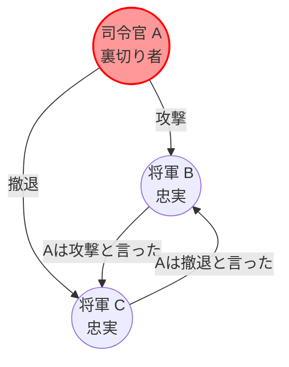
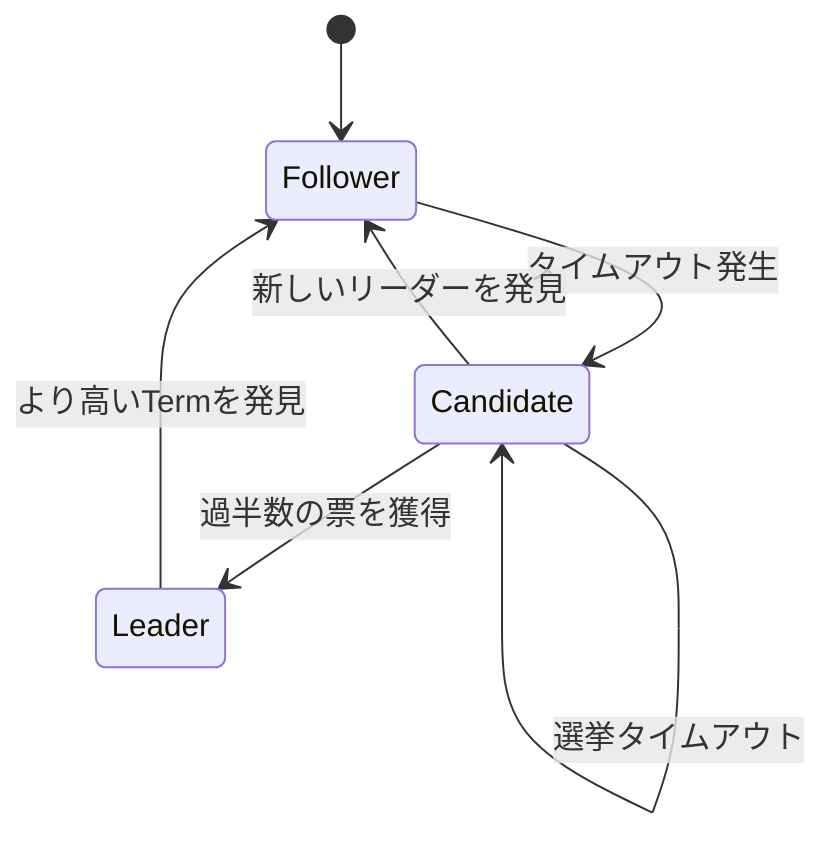
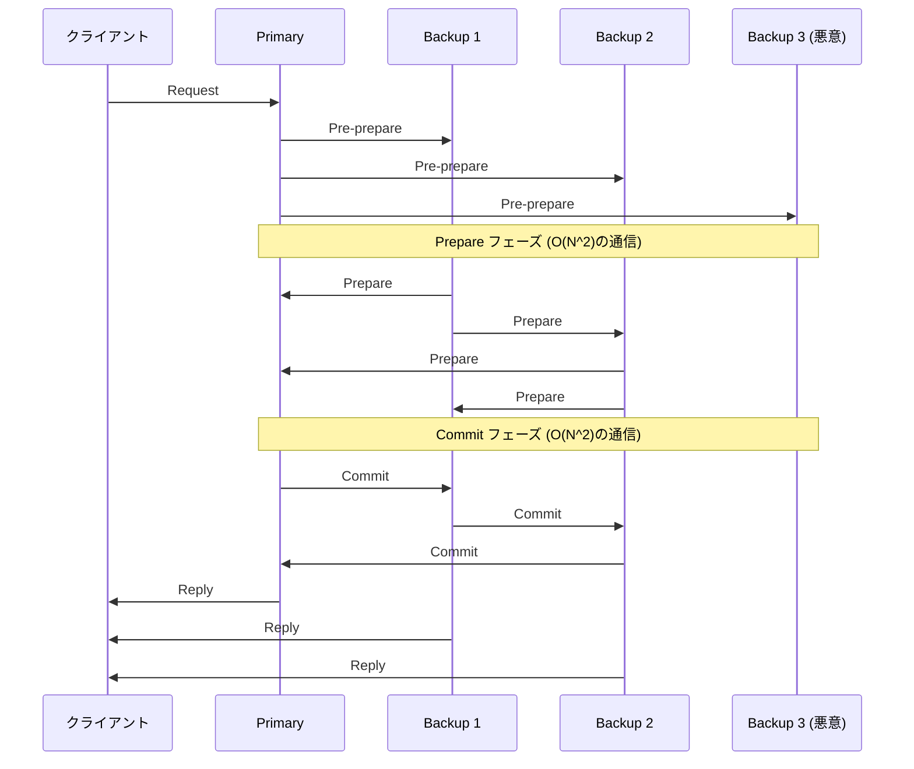

現代のクラウドコンピューティングや[ブロックチェーン](https://kenji.blog/p/blockchain-technology-smart-contract-distributed-ledger/)技術を支える根幹には、複数のコンピュータ（ノード）間で状態を共有し、一致させる **コンセンサスアルゴリズム** が存在します。本記事では、その理論的基礎である「ビザンチン将軍問題」から始まり、実用的なシステムで広く採用されている **Paxos** や **Raft** 、さらには悪意のある参加者が存在する環境下での **BFT（Byzantine Fault Tolerance）** について、数学的証明やコード実装を交えて深く掘り下げていきます。

## 1. [分散システム](https://kenji.blog/p/cap-theorem-distributed-systems/)における合意形成と課題

[分散システム](https://kenji.blog/p/cap-theorem-distributed-systems-tradeoff/)では、ネットワークの遅延、パケットの欠損、ノードのクラッシュ、あるいは悪意のある改ざんなど、単一のコンピュータでは起こり得ない様々な障害が発生します。これらの障害に耐えつつ、システム全体として一貫した状態（ステート）を保つための仕組みがコンセンサスアルゴリズムです。

システムの耐障害性は、主に以下の2つに分類されます。

1.  **CFT (Crash Fault Tolerance)** : ノードの停止（クラッシュ）やネットワーク分断には耐えられるが、ノードが嘘のデータを送る（悪意のある）行動は想定しない。
2.  **BFT (Byzantine Fault Tolerance)** : ノードの停止だけでなく、悪意のあるノードが任意の不正なメッセージを送信する状況にも耐えられる。

このBFTの概念を生み出したのが、有名な **ビザンチン将軍問題** です。

---

## 2. ビザンチン将軍問題 (Byzantine Generals Problem)

1982年、Leslie Lamport、Robert Shostak、Marshall Peaseらによって提唱された「ビザンチン将軍問題」は、悪意のある参加者が混在するネットワークにおいて、どのようにして正しい参加者全員で合意を形成するかをモデル化したものです。

### 2.1 問題の定義

ビザンチン帝国の将軍たちが、敵の都市を包囲しています。彼らは地理的に離れており、伝令を通してのみ通信できます。将軍たちは「攻撃」か「撤退」のいずれかのアクションで合意しなければなりません。しかし、将軍の中には裏切り者（悪意のあるノード）が混ざっており、他の将軍を混乱させるために嘘のメッセージを送る可能性があります。

忠実な将軍たちが取るべき条件は以下の通りです。

1.  すべての忠実な将軍は、同じ行動計画（攻撃または撤退）で合意しなければならない。
2.  少数の裏切り者が、忠実な将軍たちに誤った（あるいは一貫性のない）合意をさせてはならない。

### 2.2 数学的定式化と不可能性

将軍の総数を $ n $ 、裏切り者の数を $ f $ とします。Lamportらは、メッセージが改ざんされる可能性がある（署名なしメッセージの）場合、以下の条件を満たさない限り合意は不可能であることを数学的に証明しました。

$$ n > 3f $$

つまり、全体のノード数が裏切り者の数の3倍よりも多くなければなりません。逆に言えば、全ノードの $ 1/3 $ 以上が悪意のあるノードであった場合、システムは安全な合意に達することができません。

例として、 $ n = 3 $ 、 $ f = 1 $ の場合を考えます。将軍A（司令官）、B、Cがおり、Aが裏切り者であるとします。
Aは、Bには「攻撃」、Cには「撤退」と伝えます。BとCはお互いにAから受け取ったメッセージを交換しますが、Bは「Aから攻撃と言われた」、Cは「Aから撤退と言われた」と主張します。この時、BとCは、相手が嘘をついているのか、Aが嘘をついているのかを判定することが不可能になります。

以下は、この $ n = 3 $ の不可能なケースを示すMermaid図です。



---

## 3. Paxos: 理論的コンセンサスの金字塔

ビザンチン障害を考慮しない、CFT（Crash Fault Tolerance）の領域において、最初の強力なアルゴリズムが **Paxos** です。同じくLeslie Lamportによって1989年に提案され（発表は1998年）、GoogleのChubbyやSpannerなどで利用されています。

### 3.1 Paxosの役割とフェーズ

Paxosは、複数のProposer（提案者）、Acceptor（受諾者）、Learner（学習者）から構成されます。基本的なPaxos（Single-Decree Paxos）は、単一の値を合意するためのプロセスであり、以下の2つのフェーズに分かれます。

*   **フェーズ1: Prepare（準備）**
    1.  Proposerは、一意な提案番号 $ n $ を選び、過半数のAcceptorに `Prepare(n)` リクエストを送る。
    2.  Acceptorは $ n $ が、これまで受けたどの `Prepare` の番号よりも大きければ、以降 $ n $ 未満の提案を受け入れないことを約束し、過去に受諾した値があればそれを返答する。
*   **フェーズ2: Accept（受諾）**
    1.  Proposerが過半数のAcceptorから応答を得たら、`Accept(n, v)` リクエストを送る。ここで $ v $ は、応答に含まれていた値の中で最大の提案番号を持つ値か、それがない場合は自身が提案したい値。
    2.  Acceptorは、より大きな番号に対する約束をしていなければ、提案を受諾する。

### 3.2 PythonによるPaxosのシミュレーション

以下は、Paxosのフェーズ1とフェーズ2の挙動を簡略化してシミュレートするPythonコードです。

```python
import random

class Acceptor:
    def __init__(self, id):
        self.id = id
        self.min_proposal_num = -1
        self.accepted_num = -1
        self.accepted_value = None

    def receive_prepare(self, n):
        if n > self.min_proposal_num:
            self.min_proposal_num = n
            return True, self.accepted_num, self.accepted_value
        return False, None, None

    def receive_accept(self, n, v):
        if n >= self.min_proposal_num:
            self.min_proposal_num = n
            self.accepted_num = n
            self.accepted_value = v
            return True
        return False

class Proposer:
    def __init__(self, id, value, acceptors):
        self.id = id
        self.value = value
        self.acceptors = acceptors
        self.proposal_num = id  # 簡易的な一意の番号生成

    def run(self):
        # フェーズ 1: Prepare
        promises = []
        highest_accepted_num = -1
        value_to_propose = self.value

        for acceptor in self.acceptors:
            promised, acc_num, acc_val = acceptor.receive_prepare(self.proposal_num)
            if promised:
                promises.append(acceptor)
                if acc_num > highest_accepted_num:
                    highest_accepted_num = acc_num
                    value_to_propose = acc_val

        # 過半数のチェック
        if len(promises) > len(self.acceptors) / 2:
            # フェーズ 2: Accept
            accepts = 0
            for acceptor in promises:
                if acceptor.receive_accept(self.proposal_num, value_to_propose):
                    accepts += 1
            
            if accepts > len(self.acceptors) / 2:
                print(f"Proposer {self.id}: Consensus reached on value '{value_to_propose}'")
                return True
        
        print(f"Proposer {self.id}: Failed to reach consensus.")
        return False

# シミュレーション実行
acceptors = [Acceptor(i) for i in range(5)]
proposer1 = Proposer(10, "Value_A", acceptors)
proposer2 = Proposer(20, "Value_B", acceptors)

# 競合状態のシミュレート
proposer1.run()
proposer2.run()
```

---

## 4. Raft: 理解しやすさを追求したアルゴリズム

Paxosは非常に強力ですが、そのアルゴリズムは複雑で、実システムへの実装が困難でした。そこで2014年、Diego OngaroとJohn Ousterhoutによって、 **「理解しやすさ (Understandability)」** を主眼に置いて設計されたのが **Raft** です。現在、etcdやConsulなどで広く使われています。

### 4.1 Raftの主要な概念

Raftは、システム全体の状態を **リーダー選出 (Leader Election)** と **ログ複製 (Log Replication)** の2つのサブプロブレムに分割します。

ノードは常に以下の3つの状態のいずれかを取ります。
*   **Leader (リーダー)** : クライアントからのリクエストを受け取り、他のノードへログを複製する。
*   **Follower (フォロワー)** : リーダーからのリクエストに従う。
*   **Candidate (候補者)** : リーダーがダウンした際に、新たなリーダーになるために立候補する状態。



### 4.2 リーダー選出のメカニズム

Raftでは **Term（任期）** という論理時計を使用します。各フォロワーは、ランダムな **選挙タイムアウト (Election Timeout)** を持っており、リーダーからのハートビートが途絶えてタイムアウトすると、Candidateとなり、自分への投票を要請（RequestVote）します。過半数の票を得たノードが新たなLeaderとなります。タイムアウトをランダムにすることで、票の分割（Split Vote）を防いでいます。

### 4.3 HaskellによるRaftノード状態の型定義

関数型言語を用いてRaftの状態遷移をモデリングすると、その堅牢性がより明確になります。以下はHaskellによる簡略化された型定義の例です。

```haskell
module Raft where

data NodeState = Follower | Candidate | Leader
    deriving (Show, Eq)

type Term = Int
type NodeId = String

data RaftNode = RaftNode {
    nodeId      :: NodeId,
    currentTerm :: Term,
    votedFor    :: Maybe NodeId,
    state       :: NodeState,
    logEntries  :: [LogEntry]
} deriving (Show)

data LogEntry = LogEntry {
    term    :: Term,
    command :: String
} deriving (Show)

-- 状態遷移関数のシグネチャ例
handleTimeout :: RaftNode -> RaftNode
handleTimeout node =
    if state node == Leader 
    then node
    else node { 
        state = Candidate, 
        currentTerm = currentTerm node + 1, 
        votedFor = Just (nodeId node) 
    }
```

このように、状態遷移を純粋関数として記述することで、Raftのロジックの正当性を検証しやすくなります。

---

## 5. 実用的なビザンチン障害耐性: PBFT

PaxosやRaftはCFT（クラッシュ耐性）ですが、ネットワークに悪意のあるノードが存在する場合には無力です。この問題（ビザンチン将軍問題）に対して、実用的なパフォーマンスで解決策を提示したのが、1999年にMiguel CastroとBarbara Liskovによって発表された **PBFT (Practical Byzantine Fault Tolerance)** です。

### 5.1 PBFTの通信フェーズ

PBFTでは、リーダー（Primary）とフォロワー（Backup）が存在し、クライアントからのリクエストに対して以下の3フェーズのマルチキャスト通信を行います。

1.  **Pre-prepare** : Primaryがリクエストにシーケンス番号を割り当て、全ノードにブロードキャストする。
2.  **Prepare** : 各ノードはリクエストを受け取ると、検証した上で他の全ノードに `Prepare` メッセージをブロードキャストする。 $ 2f $ 個の `Prepare` メッセージを受け取ると、ノードはPrepared状態になる。
3.  **Commit** : Prepared状態になったノードは、`Commit` メッセージを全ノードにブロードキャストする。 $ 2f + 1 $ 個の `Commit` メッセージを受け取ると、合意が完了しリクエストを実行する。



PBFTは、前述の $ n > 3f $ の条件を満たす $ n = 3f + 1 $ のノード構成で動作し、ノード間の $ O(N^2) $ の通信オーバーヘッドを伴いますが、確定的な合意（Finality）を提供します。これは、現代のコンソーシアム型[ブロックチェーン](https://kenji.blog/p/blockchain-technology-smart-contract-distributed-ledger/)（Hyperledger Fabricなど）で広く採用されています。

### 5.2 数学的制約の再確認

PBFTが安全性を保つためには、システム内で交わされるメッセージが暗号学的に安全である（偽造不可能である）ことが前提となります。定足数（Quorum）のサイズを $ Q $ とすると、以下の条件を満たす必要があります。

$$ Q = 2f + 1 \\\\ n = 3f + 1 $$

任意の2つの定足数 $ Q_1 $ と $ Q_2 $ の積集合には、必ず少なくとも1つの正しいノードが含まれていなければなりません。
$$ |Q_1 \cap Q_2| = 2Q - n = 2(2f + 1) - (3f + 1) = f + 1 $$
このようにして、 $ f $ 個の悪意あるノードが両方の定足数に属していたとしても、必ず1つは誠実なノードが含まれるため、システム全体の一貫性が証明されます。

---

## 6. まとめ：コンセンサスアルゴリズムの進化

本記事では、[分散システム](https://kenji.blog/p/cap-theorem-distributed-systems/)における最大の課題であるコンセンサス形成について、理論的な「ビザンチン将軍問題」から始まり、クラッシュ耐性を持つ **Paxos** や **Raft** 、そして悪意あるノードに耐性を持つ **PBFT** について解説しました。

*   **Paxos** : 数学的に証明された堅牢な基盤ですが、複雑さが課題。
*   **Raft** : 理解しやすさと実装のしやすさを追求し、現代の分散[KVS](https://kenji.blog/p/nosql-database-selection-kvs-document-graph-wide-column/)のデファクトスタンダードに。
*   **PBFT** : 悪意あるノードが混在する環境下での確定的合意を実現し、[ブロックチェーン](https://kenji.blog/p/blockchain-technology-smart-contract-distributed-ledger/)技術の基盤へ。

今日では、ビットコインが採用した **Nakamoto [Consensus](https://kenji.blog/p/blockchain-technology-smart-contract-distributed-ledger/) ([PoW](https://kenji.blog/p/blockchain-technology-smart-contract-distributed-ledger/))** や、Tendermint, HotStuffなど、PBFTの通信オーバーヘッドを削減しつつスケーラビリティを向上させた新しいBFTアルゴリズムが次々と誕生しています。システムの要件（ノードの信頼性、必要なスループット、レイテンシ）に応じて、適切なコンセンサスアルゴリズムを選択することが、堅牢な[分散システム](https://kenji.blog/p/cap-theorem-distributed-systems-tradeoff/)を構築する上での鍵となります。
