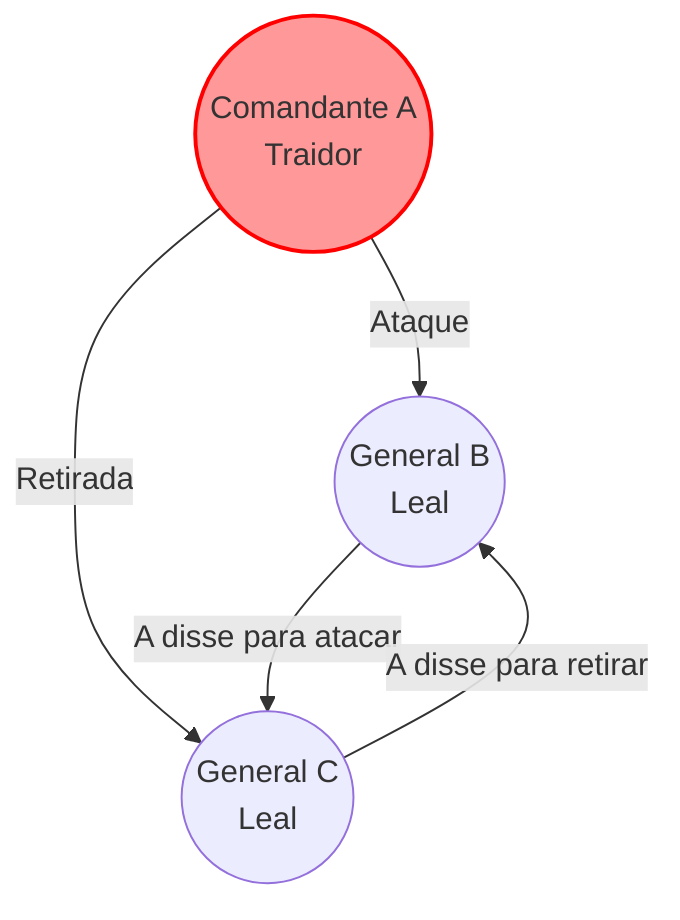
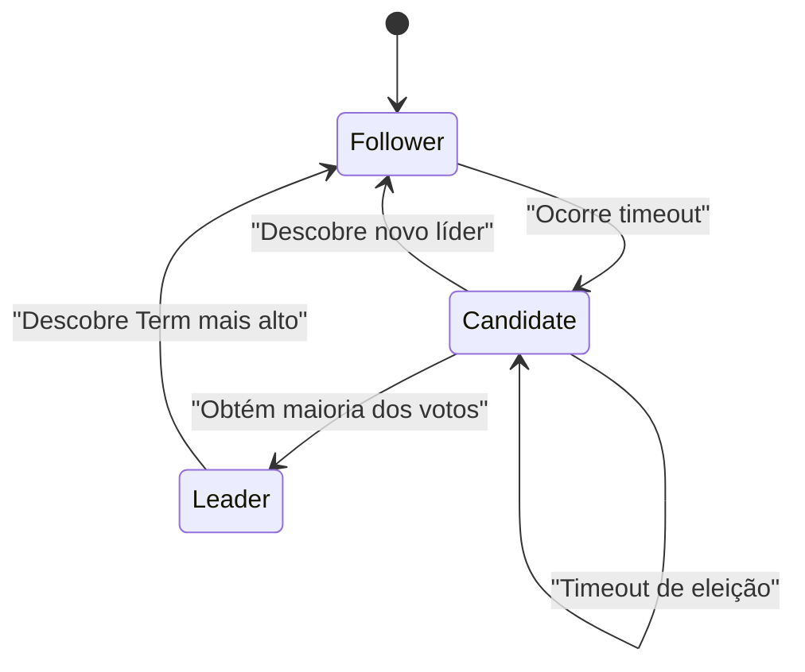
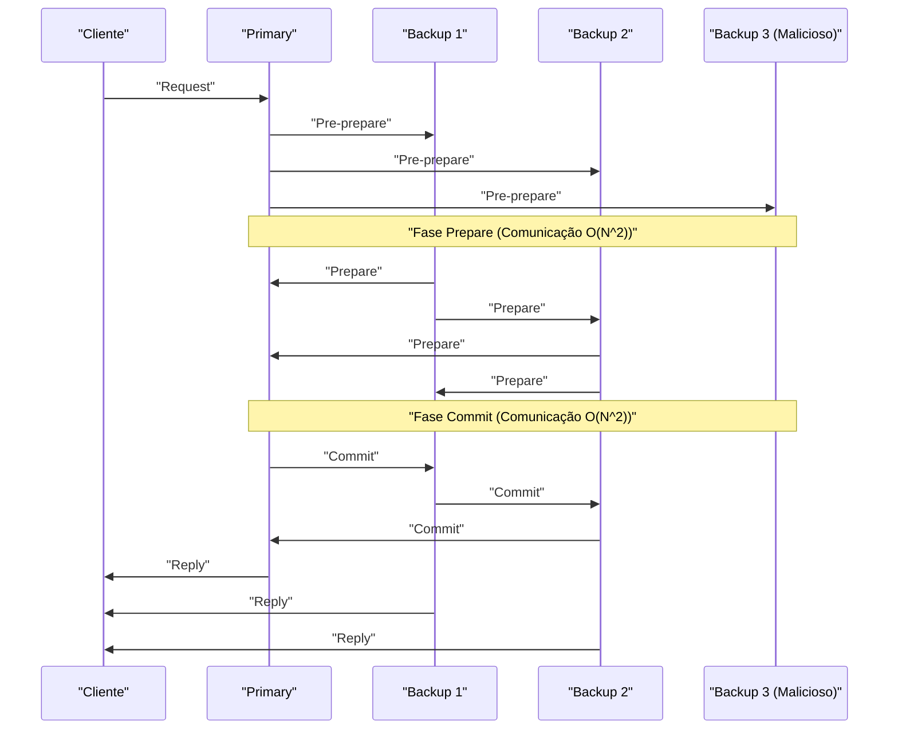

No núcleo das tecnologias modernas de computação em nuvem e blockchain, existem os **algoritmos de consenso**, responsáveis por compartilhar e sincronizar estados entre múltiplos computadores (nós). Neste artigo, vamos explorar profundamente desde o fundamento teórico do "Problema dos Generais Bizantinos", passando pelo **Paxos** e **Raft**, amplamente adotados em sistemas práticos, até a **BFT (Tolerância a Falhas Bizantinas)** para ambientes com participantes maliciosos, integrando provas matemáticas e implementações em código.

## 1. Consenso e Desafios em Sistemas Distribuídos

Em sistemas distribuídos, ocorrem diversas falhas que não aconteceriam em um único computador, como atrasos na rede, perda de pacotes, travamentos (crashes) de nós ou até mesmo adulterações maliciosas. O algoritmo de consenso é o mecanismo que mantém um estado (state) consistente em todo o sistema, resistindo a essas falhas.

A tolerância a falhas de um sistema é dividida principalmente em duas categorias:

1.  **CFT (Crash Fault Tolerance)**: Suporta o travamento (crash) de nós ou partições de rede, mas não assume ações maliciosas, como o envio de dados falsos por parte dos nós.
2.  **BFT (Byzantine Fault Tolerance)**: Além da parada dos nós, resiste a situações onde nós maliciosos enviam mensagens arbitrariamente incorretas.

O conceito de BFT originou o famoso **Problema dos Generais Bizantinos**.

---

## 2. O Problema dos Generais Bizantinos (Byzantine Generals Problem)

Proposto em 1982 por Leslie Lamport, Robert Shostak e Marshall Pease, o "Problema dos Generais Bizantinos" modela como alcançar um consenso entre todos os participantes honestos em uma rede que contém participantes maliciosos.

### 2.1 Definição do Problema

Generais do Império Bizantino estão cercando uma cidade inimiga. Eles estão geograficamente separados e só podem se comunicar por meio de mensageiros. Os generais devem chegar a um consenso sobre um plano de ação: "atacar" ou "retirar". No entanto, pode haver traidores (nós maliciosos) entre os generais, que podem enviar mensagens falsas para confundir os demais.

As condições que os generais leais devem cumprir são as seguintes:

1.  Todos os generais leais devem concordar com o mesmo plano de ação (atacar ou retirar).
2.  Um pequeno número de traidores não deve fazer com que os generais leais cheguem a um acordo incorreto (ou inconsistente).

### 2.2 Formulação Matemática e Impossibilidade

Seja $ n $ o número total de generais e $ f $ o número de traidores. Lamport e seus colegas provaram matematicamente que, caso as mensagens possam ser adulteradas (mensagens sem assinatura digital), o consenso é impossível, a menos que a seguinte condição seja atendida:

$ n > 3f $

Ou seja, o número total de nós deve ser maior que três vezes o número de traidores. Inversamente, se $ 1/3 $ ou mais de todos os nós forem maliciosos, o sistema não pode alcançar um consenso seguro.

Por exemplo, considere o caso de $ n = 3 $ e $ f = 1 $. Existem três generais A (comandante), B e C, sendo A o traidor.
A diz a B para "atacar" e diz a C para "retirar". B e C trocam as mensagens recebidas de A entre si, mas B afirma que "A mandou atacar" e C afirma que "A mandou retirar". Nesse momento, é impossível para B e C determinarem quem está mentindo, se é o outro general ou se é A.

Abaixo está um diagrama Mermaid ilustrando este caso impossível de $ n = 3 $.



---

## 3. Paxos: O Marco do Consenso Teórico

No domínio de CFT (Crash Fault Tolerance), que não considera falhas bizantinas, o primeiro algoritmo poderoso foi o **Paxos**. Também proposto por Leslie Lamport em 1989 (publicado em 1998), é utilizado em sistemas como Chubby e Spanner do Google.

### 3.1 O Papel e as Fases do Paxos

O Paxos é composto por múltiplos Proposers (proponentes), Acceptors (aceitadores) e Learners (aprendizes). O Paxos básico (Single-Decree Paxos) é um processo para chegar a um consenso sobre um único valor e é dividido em duas fases a seguir.

*   **Fase 1: Prepare (Preparação)**
    1.  O Proposer escolhe um número de proposta $ n $ único e envia uma requisição `Prepare(n)` para a maioria dos Acceptors.
    2.  Se o Acceptor receber um $ n $ maior do que qualquer número de `Prepare` recebido anteriormente, ele promete não aceitar propostas menores que $ n $ e retorna qualquer valor previamente aceito, se houver.
*   **Fase 2: Accept (Aceitação)**
    1.  Quando o Proposer obtém respostas da maioria dos Acceptors, envia uma requisição `Accept(n, v)`. Aqui, $ v $ é o valor com o maior número de proposta incluído nas respostas, ou o valor que o próprio Proposer deseja propor, caso não haja nenhum.
    2.  O Acceptor aceita a proposta a menos que já tenha prometido algo para um número maior.

### 3.2 Simulação de Paxos em Python

Abaixo, apresentamos um código em Python que simula de forma simplificada o comportamento das Fases 1 e 2 do Paxos.

```python
import random

class Acceptor:
    def __init__(self, id):
        self.id = id
        self.min_proposal_num = -1
        self.accepted_num = -1
        self.accepted_value = None

    def receive_prepare(self, n):
        if n > self.min_proposal_num:
            self.min_proposal_num = n
            return True, self.accepted_num, self.accepted_value
        return False, None, None

    def receive_accept(self, n, v):
        if n >= self.min_proposal_num:
            self.min_proposal_num = n
            self.accepted_num = n
            self.accepted_value = v
            return True
        return False

class Proposer:
    def __init__(self, id, value, acceptors):
        self.id = id
        self.value = value
        self.acceptors = acceptors
        self.proposal_num = id  # Geração simples de número único

    def run(self):
        # Fase 1: Prepare
        promises = []
        highest_accepted_num = -1
        value_to_propose = self.value

        for acceptor in self.acceptors:
            promised, acc_num, acc_val = acceptor.receive_prepare(self.proposal_num)
            if promised:
                promises.append(acceptor)
                if acc_num > highest_accepted_num:
                    highest_accepted_num = acc_num
                    value_to_propose = acc_val

        # Verificação da maioria
        if len(promises) > len(self.acceptors) / 2:
            # Fase 2: Accept
            accepts = 0
            for acceptor in promises:
                if acceptor.receive_accept(self.proposal_num, value_to_propose):
                    accepts += 1
            
            if accepts > len(self.acceptors) / 2:
                print(f"Proposer {self.id}: Consensus reached on value '{value_to_propose}'")
                return True
        
        print(f"Proposer {self.id}: Failed to reach consensus.")
        return False

# Execução da simulação
acceptors = [Acceptor(i) for i in range(5)]
proposer1 = Proposer(10, "Value_A", acceptors)
proposer2 = Proposer(20, "Value_B", acceptors)

# Simulação de condição de corrida
proposer1.run()
proposer2.run()
```

---

## 4. Raft: O Algoritmo que Busca a Compreensão

O Paxos é extremamente poderoso, mas seu algoritmo é complexo, dificultando a implementação em sistemas reais. Por isso, em 2014, Diego Ongaro e John Ousterhout projetaram o **Raft**, focado principalmente na **"compreensibilidade" (Understandability)**. Hoje em dia, é amplamente utilizado em sistemas como etcd e Consul.

### 4.1 Conceitos Principais do Raft

O Raft divide o estado de todo o sistema em dois subproblemas: **Eleição de Líder (Leader Election)** e **Replicação de Log (Log Replication)**.

Os nós assumem sempre um dos três estados seguintes:
*   **Leader (Líder)**: Recebe solicitações dos clientes e replica os logs para os outros nós.
*   **Follower (Seguidor)**: Segue as solicitações do líder.
*   **Candidate (Candidato)**: O estado de um nó que se candidata a se tornar o novo líder quando o líder atual falha.



### 4.2 Mecanismo de Eleição de Líder

O Raft utiliza um relógio lógico chamado **Term (Mandato)**. Cada seguidor possui um **Timeout de Eleição (Election Timeout)** aleatório. Quando os "heartbeats" (batimentos cardíacos) do líder param e o timeout é alcançado, o nó se torna um Candidate e solicita votos para si mesmo (RequestVote). O nó que recebe a maioria dos votos se torna o novo Leader. Usar timeouts aleatórios previne a divisão de votos (Split Vote).

### 4.3 Definição de Tipos do Estado do Nó Raft em Haskell

Ao modelar a transição de estados do Raft usando uma linguagem funcional, sua robustez fica mais clara. Abaixo está um exemplo simplificado de definição de tipos em Haskell.

```haskell
module Raft where

data NodeState = Follower | Candidate | Leader
    deriving (Show, Eq)

type Term = Int
type NodeId = String

data RaftNode = RaftNode {
    nodeId      :: NodeId,
    currentTerm :: Term,
    votedFor    :: Maybe NodeId,
    state       :: NodeState,
    logEntries  :: [LogEntry]
} deriving (Show)

data LogEntry = LogEntry {
    term    :: Term,
    command :: String
} deriving (Show)

-- Exemplo de assinatura da função de transição de estado
handleTimeout :: RaftNode -> RaftNode
handleTimeout node =
    if state node == Leader 
    then node
    else node { 
        state = Candidate, 
        currentTerm = currentTerm node + 1, 
        votedFor = Just (nodeId node) 
    }
```

Dessa forma, ao descrever as transições de estado como funções puras, fica mais fácil verificar a corretude lógica do Raft.

---

## 5. Tolerância a Falhas Bizantinas Prática: PBFT

Embora Paxos e Raft sejam CFT (tolerantes a crashes), eles são impotentes se houver nós maliciosos na rede. O **PBFT (Practical Byzantine Fault Tolerance)**, apresentado por Miguel Castro e Barbara Liskov em 1999, propôs uma solução para esse problema (o Problema dos Generais Bizantinos) com desempenho prático.

### 5.1 Fases de Comunicação do PBFT

No PBFT, existe um líder (Primary) e os seguidores (Backup). O sistema realiza uma comunicação multicast em três fases em resposta à solicitação de um cliente:

1.  **Pre-prepare**: O Primary atribui um número de sequência à solicitação e a transmite para todos os nós.
2.  **Prepare**: Ao receber a solicitação, cada nó a verifica e envia uma mensagem `Prepare` para todos os outros nós. Ao receber $ 2f $ mensagens `Prepare`, o nó entra no estado Prepared.
3.  **Commit**: Os nós no estado Prepared transmitem uma mensagem `Commit` para todos os nós. Ao receber $ 2f + 1 $ mensagens `Commit`, o consenso é alcançado e a solicitação é executada.



O PBFT opera com a configuração de $ n = 3f + 1 $ nós, satisfazendo a condição $ n > 3f $ mencionada acima, e, embora tenha um overhead de comunicação de $ O(N^2) $ entre os nós, fornece um consenso final determinístico (Finality). Isso é amplamente adotado em blockchains de consórcio modernas (como Hyperledger Fabric).

### 5.2 Reafirmação das Restrições Matemáticas

Para que o PBFT mantenha a segurança, as mensagens trocadas no sistema devem ser criptograficamente seguras (não falsificáveis). Dado que o tamanho do Quórum é $ Q $, as seguintes condições devem ser atendidas:

$ Q = 2f + 1 \\\\ n = 3f + 1 $

A interseção de quaisquer dois quóruns $ Q_1 $ e $ Q_2 $ deve conter sempre pelo menos um nó honesto.
$ |Q_1 \cap Q_2| = 2Q - n = 2(2f + 1) - (3f + 1) = f + 1 $
Dessa maneira, mesmo que $ f $ nós maliciosos pertençam a ambos os quóruns, haverá obrigatoriamente um nó honesto incluído, comprovando a consistência em todo o sistema.

---

## 6. Conclusão: A Evolução dos Algoritmos de Consenso

Neste artigo, explicamos o maior desafio dos sistemas distribuídos: a formação de consenso. Começamos pelo clássico e teórico "Problema dos Generais Bizantinos", passamos pelo **Paxos** e **Raft**, que têm tolerância a falhas do tipo crash, e pelo **PBFT**, que possui resiliência contra nós maliciosos.

*   **Paxos**: Uma base matematicamente robusta e comprovada, mas com a complexidade como desafio.
*   **Raft**: Buscou clareza e facilidade de implementação, tornando-se o padrão de fato para [KVS](https://kenji.blog/pt/p/nosql-database-selection-kvs-document-graph-wide-column/) distribuídos modernos.
*   **PBFT**: Conseguiu acordo determinístico em um ambiente com nós maliciosos, pavimentando o caminho para a tecnologia blockchain.

Atualmente, novos algoritmos BFT que reduzem o custo de comunicação do PBFT e aumentam a escalabilidade estão surgindo continuamente, como o **Nakamoto [Consensus](https://kenji.blog/pt/p/blockchain-technology-smart-contract-distributed-ledger/) ([PoW](https://kenji.blog/pt/p/blockchain-technology-smart-contract-distributed-ledger/))** adotado pelo Bitcoin, Tendermint e HotStuff. Escolher o algoritmo de consenso apropriado, com base nos requisitos do sistema (confiabilidade dos nós, taxa de transferência (throughput) exigida e latência), é essencial para a construção de sistemas distribuídos robustos.
