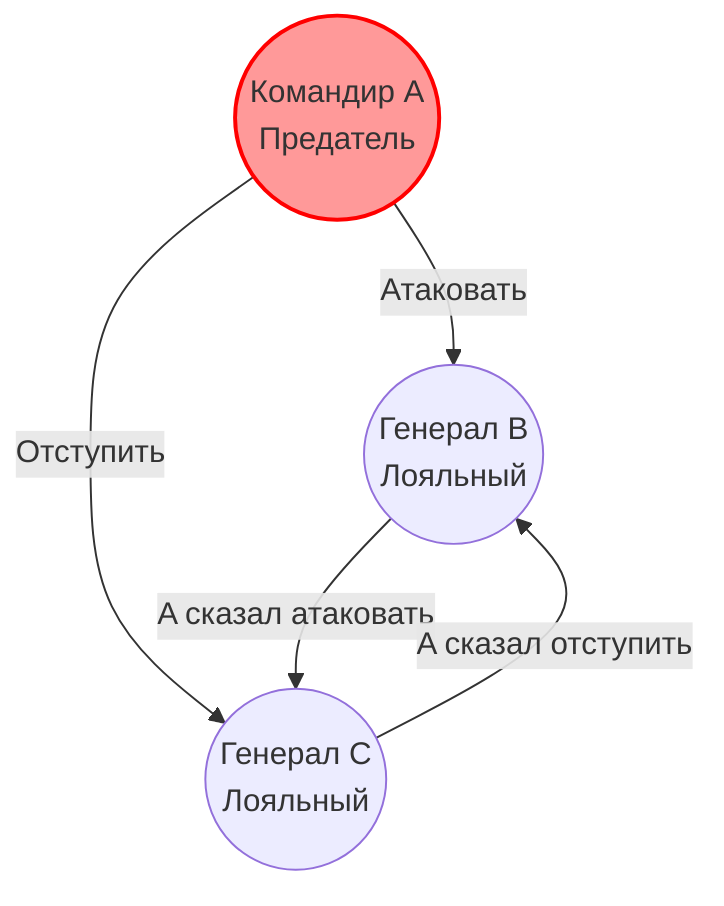
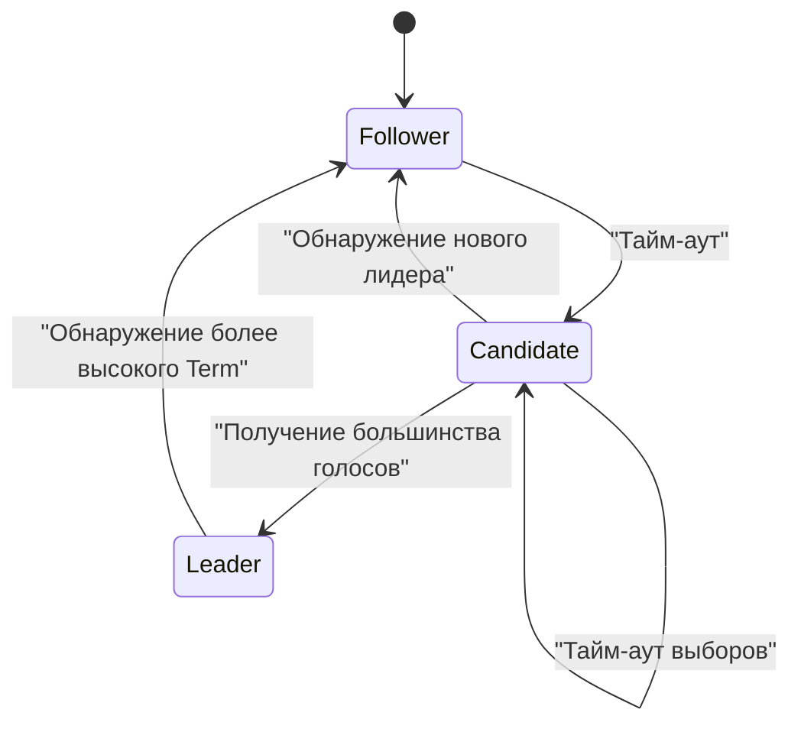
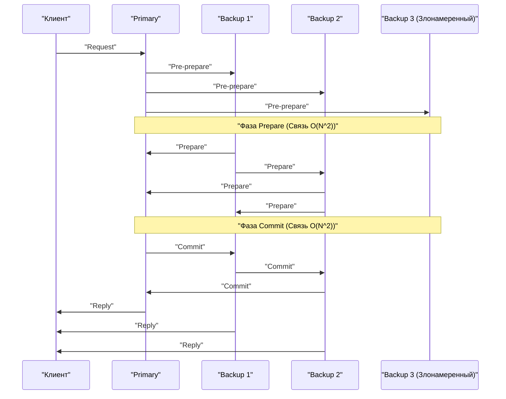

В основе современных облачных вычислений и технологий блокчейна лежит **алгоритм консенсуса** , который позволяет нескольким компьютерам (узлам) совместно использовать и согласовывать состояния. В этой статье мы глубоко погрузимся в теоретические основы, начиная с «проблемы византийских генералов», рассмотрим **Paxos** и **Raft** , широко используемые в практических системах, а также **BFT (Byzantine Fault Tolerance)** для сред со злонамеренными участниками, используя математические доказательства и реализацию кода.

## 1. Формирование консенсуса и проблемы в распределенных системах

В распределенных системах возникают различные сбои, невозможные на одном компьютере, такие как задержки в сети, потеря пакетов, сбои узлов или даже злонамеренные изменения. Алгоритм консенсуса — это механизм поддержания согласованного состояния (state) системы в целом, противостоящий этим сбоям.

Отказоустойчивость систем в основном делится на две категории:

1.  **CFT (Crash Fault Tolerance)** : Устойчивость к остановке (сбою) узлов или разделению сети, но не предполагается, что узлы будут отправлять ложные данные (злонамеренное поведение).
2.  **BFT (Byzantine Fault Tolerance)** : Устойчивость не только к остановке узлов, но и к ситуациям, когда злонамеренные узлы отправляют любые некорректные сообщения.

Концепция BFT возникла из известной **проблемы византийских генералов** .

---

## 2. Проблема византийских генералов (Byzantine Generals Problem)

Предложенная в 1982 году Лесли Лэмпортом (Leslie Lamport), Робертом Шостаком (Robert Shostak) и Маршаллом Пизом (Marshall Pease) «проблема византийских генералов» моделирует то, как честные участники могут прийти к консенсусу в сети, где присутствуют злонамеренные участники.

### 2.1 Определение проблемы

Генералы Византийской империи осаждают вражеский город. Они находятся на расстоянии друг от друга и могут общаться только через гонцов. Генералы должны договориться об одном из действий: «атаковать» или «отступить». Однако среди генералов есть предатели (злонамеренные узлы), которые могут отправлять ложные сообщения, чтобы запутать остальных.

Условия, которые должны выполнять лояльные генералы:

1.  Все лояльные генералы должны согласовать один и тот же план действий (атака или отступление).
2.  Небольшое число предателей не должно заставить лояльных генералов прийти к неправильному (или несогласованному) решению.

### 2.2 Математическая формулировка и невозможность

Пусть $ n $ — общее количество генералов, а $ f $ — количество предателей. Лэмпорт и его коллеги математически доказали, что в случае, если сообщения могут быть изменены (сообщения без подписи), консенсус невозможен, если не выполняется следующее условие:

$ n > 3f $

Другими словами, общее количество узлов должно быть более чем в три раза больше количества предателей. И наоборот, если $ 1/3 $ или более от всех узлов являются злонамеренными, система не сможет достичь безопасного консенсуса.

В качестве примера рассмотрим случай $ n = 3 $ , $ f = 1 $ . Предположим, есть генералы A (командир), B и C, и A является предателем.
A говорит B «атаковать», а C — «отступить». B и C обмениваются сообщениями, полученными от A, но B утверждает: «A сказал мне атаковать», а C утверждает: «A сказал мне отступить». В этот момент B и C не могут определить, лжет ли собеседник или лжет A.

Ниже приведена диаграмма Mermaid, иллюстрирующая этот невозможный случай для $ n = 3 $ .



---

## 3. Paxos: Вершина теоретического консенсуса

В области CFT (Crash Fault Tolerance), не учитывающей византийские сбои, первым мощным алгоритмом является **Paxos** . Он также был предложен Лесли Лэмпортом в 1989 году (опубликован в 1998 году) и используется в таких системах, как Google Chubby и Spanner.

### 3.1 Роли и фазы в Paxos

Paxos состоит из нескольких Proposer (предлагающих), Acceptor (принимающих) и Learner (обучающихся). Базовый Paxos (Single-Decree Paxos) — это процесс согласования единственного значения, который делится на следующие две фазы:

*   **Фаза 1: Prepare (Подготовка)**
    1.  Proposer выбирает уникальный номер предложения $ n $ и отправляет запрос `Prepare(n)` большинству Acceptor.
    2.  Если $ n $ больше любого номера `Prepare`, полученного ранее Acceptor, он обещает не принимать предложения с номером меньше $ n $ в дальнейшем и возвращает ранее принятое значение, если таковое имеется.
*   **Фаза 2: Accept (Принятие)**
    1.  Если Proposer получает ответы от большинства Acceptor, он отправляет запрос `Accept(n, v)`. Здесь $ v $ — это значение с наибольшим номером предложения из включенных в ответы, или, если такового нет, значение, которое он сам хочет предложить.
    2.  Acceptor принимает предложение, если он не давал обещания для большего номера.

### 3.2 Симуляция Paxos на Python

Ниже приведен код на Python, упрощенно симулирующий поведение Фазы 1 и Фазы 2 в Paxos.

```python
import random

class Acceptor:
    def __init__(self, id):
        self.id = id
        self.min_proposal_num = -1
        self.accepted_num = -1
        self.accepted_value = None

    def receive_prepare(self, n):
        if n > self.min_proposal_num:
            self.min_proposal_num = n
            return True, self.accepted_num, self.accepted_value
        return False, None, None

    def receive_accept(self, n, v):
        if n >= self.min_proposal_num:
            self.min_proposal_num = n
            self.accepted_num = n
            self.accepted_value = v
            return True
        return False

class Proposer:
    def __init__(self, id, value, acceptors):
        self.id = id
        self.value = value
        self.acceptors = acceptors
        self.proposal_num = id  # Простая генерация уникального номера

    def run(self):
        # Фаза 1: Prepare
        promises = []
        highest_accepted_num = -1
        value_to_propose = self.value

        for acceptor in self.acceptors:
            promised, acc_num, acc_val = acceptor.receive_prepare(self.proposal_num)
            if promised:
                promises.append(acceptor)
                if acc_num > highest_accepted_num:
                    highest_accepted_num = acc_num
                    value_to_propose = acc_val

        # Проверка большинства
        if len(promises) > len(self.acceptors) / 2:
            # Фаза 2: Accept
            accepts = 0
            for acceptor in promises:
                if acceptor.receive_accept(self.proposal_num, value_to_propose):
                    accepts += 1
            
            if accepts > len(self.acceptors) / 2:
                print(f"Proposer {self.id}: Достигнут консенсус по значению '{value_to_propose}'")
                return True
        
        print(f"Proposer {self.id}: Не удалось достичь консенсуса.")
        return False

# Запуск симуляции
acceptors = [Acceptor(i) for i in range(5)]
proposer1 = Proposer(10, "Value_A", acceptors)
proposer2 = Proposer(20, "Value_B", acceptors)

# Симуляция состояния гонки
proposer1.run()
proposer2.run()
```

---

## 4. Raft: Алгоритм, стремящийся к понятности

Paxos очень мощный, но его алгоритм сложен, и его реализация в реальных системах была трудной. Поэтому в 2014 году Диего Онгаро (Diego Ongaro) и Джон Оустерхаут (John Ousterhout) разработали **Raft** с акцентом на **«понятность» (Understandability)** . Сегодня он широко используется в таких системах, как etcd и Consul.

### 4.1 Основные концепции Raft

Raft разделяет управление состоянием всей системы на две подзадачи: **выбор лидера (Leader Election)** и **репликация журналов (Log Replication)** .

Узлы всегда находятся в одном из следующих трех состояний:
*   **Leader (Лидер)** : Принимает запросы от клиентов и реплицирует журналы на другие узлы.
*   **Follower (Ведомый)** : Подчиняется запросам от лидера.
*   **Candidate (Кандидат)** : Состояние, в котором узел выдвигает свою кандидатуру на роль нового лидера при сбое текущего.



### 4.2 Механизм выбора лидера

Raft использует логические часы, называемые **Term (срок полномочий)** . У каждого ведомого есть случайный **тайм-аут выборов (Election Timeout)** , и когда он истекает из-за отсутствия heartbeat (сообщений о жизнеспособности) от лидера, узел становится кандидатом и запрашивает голоса за себя (RequestVote). Узел, получивший большинство голосов, становится новым лидером. Использование случайного тайм-аута предотвращает разделение голосов (Split Vote).

### 4.3 Определение типов состояний узла Raft на Haskell

Моделирование переходов состояний Raft с использованием функционального языка делает его надежность более очевидной. Ниже приведен пример упрощенного определения типов на Haskell.

```haskell
module Raft where

data NodeState = Follower | Candidate | Leader
    deriving (Show, Eq)

type Term = Int
type NodeId = String

data RaftNode = RaftNode {
    nodeId      :: NodeId,
    currentTerm :: Term,
    votedFor    :: Maybe NodeId,
    state       :: NodeState,
    logEntries  :: [LogEntry]
} deriving (Show)

data LogEntry = LogEntry {
    term    :: Term,
    command :: String
} deriving (Show)

-- Пример сигнатуры функции перехода состояний
handleTimeout :: RaftNode -> RaftNode
handleTimeout node =
    if state node == Leader 
    then node
    else node { 
        state = Candidate, 
        currentTerm = currentTerm node + 1, 
        votedFor = Just (nodeId node) 
    }
```

Таким образом, описание переходов состояний как чистых функций упрощает проверку правильности логики Raft.

---

## 5. Практическая устойчивость к византийским сбоям: PBFT

Paxos и Raft относятся к категории CFT (устойчивость к сбоям) и бессильны при наличии злонамеренных узлов в сети. Решение этой проблемы (проблемы византийских генералов) с практической производительностью было представлено в 1999 году Мигелем Кастро (Miguel Castro) и Барбарой Лисков (Barbara Liskov) под названием **PBFT (Practical Byzantine Fault Tolerance)** .

### 5.1 Фазы связи в PBFT

В PBFT есть лидер (Primary) и ведомые (Backup), и выполняются 3 фазы многоадресной связи (multicast) в ответ на запросы клиентов.

1.  **Pre-prepare** : Primary назначает запросу порядковый номер и транслирует его всем узлам.
2.  **Prepare** : Каждый узел при получении запроса проверяет его и транслирует сообщение `Prepare` всем остальным узлам. После получения $ 2f $ сообщений `Prepare` узел переходит в состояние Prepared.
3.  **Commit** : Узел в состоянии Prepared транслирует сообщение `Commit` всем узлам. После получения $ 2f + 1 $ сообщений `Commit` консенсус завершается, и запрос выполняется.



PBFT работает с конфигурацией из $ n = 3f + 1 $ узлов, что удовлетворяет упомянутому ранее условию $ n > 3f $ , и влечет за собой накладные расходы на связь $ O(N^2) $ между узлами, но обеспечивает детерминированный консенсус (Finality). Он широко используется в современных консорциумных блокчейнах (таких как Hyperledger Fabric).

### 5.2 Повторное подтверждение математических ограничений

Для того чтобы PBFT сохранял безопасность, сообщения, которыми обмениваются в системе, должны быть криптографически безопасными (неподделываемыми). Пусть размер кворума (Quorum) равен $ Q $ , тогда должны выполняться следующие условия.

$ Q = 2f + 1 \\\\ n = 3f + 1 $

Пересечение любых двух кворумов $ Q_1 $ и $ Q_2 $ должно обязательно содержать хотя бы один правильный узел.
$ |Q_1 \cap Q_2| = 2Q - n = 2(2f + 1) - (3f + 1) = f + 1 $
Таким образом, даже если $ f $ злонамеренных узлов принадлежат обоим кворумам, всегда будет включен как минимум один честный узел, что доказывает согласованность системы в целом.

---

## 6. Заключение: Эволюция алгоритмов консенсуса

В этой статье мы рассмотрели формирование консенсуса, величайшую проблему в распределенных системах, начиная с теоретической «проблемы византийских генералов» и заканчивая устойчивыми к сбоям **Paxos** и **Raft** , а также **PBFT** , который устойчив к злонамеренным узлам.

*   **Paxos** : Математически доказанная надежная основа, но сложность является проблемой.
*   **Raft** : Стремление к понятности и простоте реализации сделало его фактическим стандартом для современных распределенных [KVS](https://kenji.blog/ru/p/nosql-database-selection-kvs-document-graph-wide-column/).
*   **PBFT** : Реализует детерминированный консенсус в среде со злонамеренными узлами и стал основой для технологий блокчейна.

Сегодня один за другим появляются новые алгоритмы BFT, такие как **Nakamoto [Consensus](https://kenji.blog/ru/p/blockchain-technology-smart-contract-distributed-ledger/) ([PoW](https://kenji.blog/ru/p/blockchain-technology-smart-contract-distributed-ledger/))** , используемый в Bitcoin, а также Tendermint и HotStuff, которые повышают масштабируемость за счет снижения накладных расходов на связь в PBFT. Выбор правильного алгоритма консенсуса в зависимости от требований системы (надежность узлов, необходимая пропускная способность, задержка) является ключом к созданию надежной распределенной системы.
