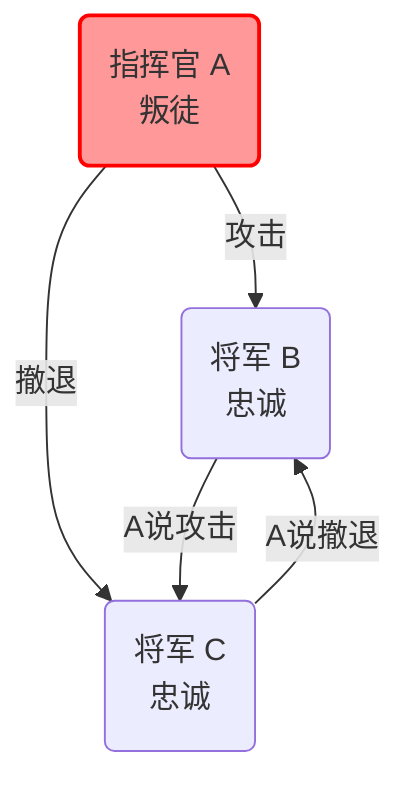
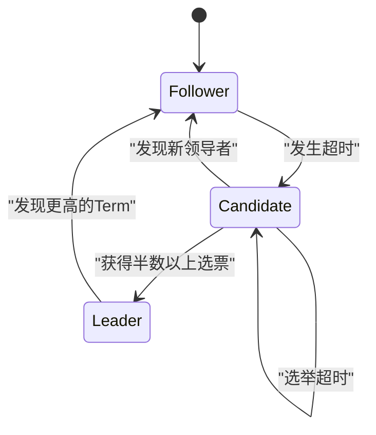
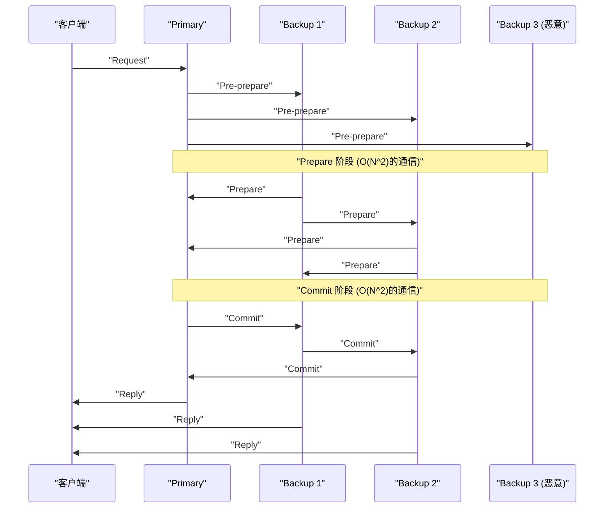

支撑现代云计算和区块链技术基础的，是多个计算机（节点）之间共享并保持状态一致的 **共识算法** 。在本文中，我们将从其理论基础“拜占庭将军问题”开始，深入探讨在实际系统中被广泛采用的 **Paxos** 和 **Raft** ，以及在存在恶意参与者的环境下的 **BFT（Byzantine Fault Tolerance）** ，并结合数学证明和代码实现进行深度剖析。

## 1. 分布式系统中的共识形成与挑战

在分布式系统中，会发生网络延迟、数据包丢失、节点崩溃或恶意篡改等单一计算机上不可能发生的各种故障。在承受这些故障的同时，保持整个系统状态（[State](https://kenji.blog/zh-cn/p/iac-infrastructure-as-code-terraform/)）一致的机制就是共识算法。

系统的容错性主要分为以下两类：

1.  **CFT (Crash Fault Tolerance)** ：能够承受节点停止（崩溃）或网络分区，但不考虑节点发送虚假数据（恶意）的行为。
2.  **BFT (Byzantine Fault Tolerance)** ：不仅能承受节点停止，还能在恶意节点发送任意无效消息的情况下保持稳定。

催生这种BFT概念的，便是著名的 **拜占庭将军问题** 。

---

## 2. 拜占庭将军问题 (Byzantine Generals Problem)

1982年，由Leslie Lamport、Robert Shostak和Marshall Pease等人提出的“拜占庭将军问题”，模型化了在混杂着恶意参与者的网络中，如何让所有诚实的参与者达成共识。

### 2.1 问题的定义

拜占庭帝国的将军们包围了敌人的城市。他们在地理上是分散的，只能通过传令兵进行通信。将军们必须在“攻击”或“撤退”这两种行动中达成一致。然而，将军中混有叛徒（恶意节点），可能会发送虚假消息以迷惑其他将军。

诚实的将军们必须满足以下条件：

1.  所有诚实的将军必须就相同的行动计划（攻击或撤退）达成共识。
2.  少数叛徒不能让诚实的将军们达成错误（或不一致）的共识。

### 2.2 数学形式化与不可能性

假设将军总数为 $ n $ ，叛徒数量为 $ f $ 。Lamport等人数学上证明了，在消息可能被篡改（无签名消息）的情况下，除非满足以下条件，否则无法达成共识。

$ n > 3f $

也就是说，总节点数必须大于叛徒数量的3倍。反过来说，如果全网有 $ 1/3 $ 以上的节点是恶意的，系统就无法达成安全的共识。

例如，考虑 $ n = 3 $ 、 $ f = 1 $ 的情况。假设有将军A（指挥官）、B、C，且A是叛徒。
A告诉B“攻击”，告诉C“撤退”。B和C互相交换从A那里收到的消息，但B主张“A说是攻击”，C主张“A说是撤退”。此时，B和C无法判断是对方在撒谎，还是A在撒谎。

以下是展示这个 $ n = 3 $ 不可能情况的Mermaid图。



---

## 3. Paxos: 理论共识的金字塔

在不考虑拜占庭故障的CFT（Crash Fault Tolerance）领域中，最初的强大算法是 **Paxos** 。它同样由Leslie Lamport在1989年提出（1998年发表），并被Google的Chubby和Spanner等系统使用。

### 3.1 Paxos的角色与阶段

Paxos由多个Proposer（提议者）、Acceptor（接受者）和Learner（学习者）组成。基本的Paxos（Single-Decree Paxos）是用于就单个值达成共识的过程，分为以下两个阶段。

*   **阶段1: Prepare（准备）**
    1.  Proposer选择一个唯一的提案编号 $ n $ ，并向半数以上的Acceptor发送 `Prepare(n)` 请求。
    2.  如果 $ n $ 大于Acceptor迄今为止收到的任何 `Prepare` 编号，则Acceptor承诺以后不再接受小于 $ n $ 的提案，并返回过去已接受的值（如果有的话）。
*   **阶段2: Accept（接受）**
    1.  当Proposer从半数以上的Acceptor获得响应后，发送 `Accept(n, v)` 请求。这里的 $ v $ 是响应中具有最大提案编号的值，如果没有，则是其自身想要提议的值。
    2.  如果Acceptor没有对更大的编号做出承诺，则接受该提案。

### 3.2 使用Python模拟Paxos

以下是简化并模拟Paxos阶段1和阶段2行为的Python代码。

```python
import random

class Acceptor:
    def __init__(self, id):
        self.id = id
        self.min_proposal_num = -1
        self.accepted_num = -1
        self.accepted_value = None

    def receive_prepare(self, n):
        if n > self.min_proposal_num:
            self.min_proposal_num = n
            return True, self.accepted_num, self.accepted_value
        return False, None, None

    def receive_accept(self, n, v):
        if n >= self.min_proposal_num:
            self.min_proposal_num = n
            self.accepted_num = n
            self.accepted_value = v
            return True
        return False

class Proposer:
    def __init__(self, id, value, acceptors):
        self.id = id
        self.value = value
        self.acceptors = acceptors
        self.proposal_num = id  # 简单的唯一编号生成

    def run(self):
        # 阶段 1: Prepare
        promises = []
        highest_accepted_num = -1
        value_to_propose = self.value

        for acceptor in self.acceptors:
            promised, acc_num, acc_val = acceptor.receive_prepare(self.proposal_num)
            if promised:
                promises.append(acceptor)
                if acc_num > highest_accepted_num:
                    highest_accepted_num = acc_num
                    value_to_propose = acc_val

        # 检查是否获得半数以上
        if len(promises) > len(self.acceptors) / 2:
            # 阶段 2: Accept
            accepts = 0
            for acceptor in promises:
                if acceptor.receive_accept(self.proposal_num, value_to_propose):
                    accepts += 1
            
            if accepts > len(self.acceptors) / 2:
                print(f"Proposer {self.id}: 对值 '{value_to_propose}' 达成共识")
                return True
        
        print(f"Proposer {self.id}: 未能达成共识。")
        return False

# 执行模拟
acceptors = [Acceptor(i) for i in range(5)]
proposer1 = Proposer(10, "Value_A", acceptors)
proposer2 = Proposer(20, "Value_B", acceptors)

# 模拟竞争状态
proposer1.run()
proposer2.run()
```

---

## 4. Raft: 追求易于理解的算法

Paxos虽然非常强大，但其算法复杂，在实际系统中的实现非常困难。因此在2014年，Diego Ongaro和John Ousterhout设计了以 **“易于理解 (Understandability)”** 为主要目标的 **Raft** 。目前它被广泛应用于etcd和Consul等系统中。

### 4.1 Raft的主要概念

Raft将整个系统的状态划分为 **领导者选举 (Leader Election)** 和 **日志复制 (Log Replication)** 两个子问题。

节点始终处于以下三种状态之一。
*   **Leader (领导者)** ：接收来自客户端的请求，并将日志复制到其他节点。
*   **Follower (跟随者)** ：服从领导者的请求。
*   **Candidate (候选人)** ：在领导者宕机时，为了成为新的领导者而参与竞选的状态。



### 4.2 领导者选举机制

Raft使用被称为 **Term（任期）** 的逻辑时钟。每个跟随者都有一个随机的 **选举超时 (Election Timeout)** 时间，当来自领导者的心跳中断并发生超时时，它会变为Candidate，并请求其他节点为自己投票（RequestVote）。获得半数以上选票的节点将成为新的Leader。通过将超时时间随机化，防止了选票瓜分（Split Vote）的情况。

### 4.3 使用Haskell定义Raft节点状态类型

使用函数式语言对Raft的状态转换进行建模，可以使其健壮性更加清晰。以下是使用Haskell简化的类型定义示例。

```haskell
module Raft where

data NodeState = Follower | Candidate | Leader
    deriving (Show, Eq)

type Term = Int
type NodeId = String

data RaftNode = RaftNode {
    nodeId      :: NodeId,
    currentTerm :: Term,
    votedFor    :: Maybe NodeId,
    state       :: NodeState,
    logEntries  :: [LogEntry]
} deriving (Show)

data LogEntry = LogEntry {
    term    :: Term,
    command :: String
} deriving (Show)

-- 状态转移函数的签名示例
handleTimeout :: RaftNode -> RaftNode
handleTimeout node =
    if state node == Leader 
    then node
    else node { 
        state = Candidate, 
        currentTerm = currentTerm node + 1, 
        votedFor = Just (nodeId node) 
    }
```

通过这样将状态转移编写为纯函数，可以更容易地验证Raft逻辑的正确性。

---

## 5. 实用的拜占庭容错：PBFT

Paxos和Raft属于CFT（崩溃容错），但当网络中存在恶意节点时则无能为力。针对这一问题（拜占庭将军问题），Miguel Castro和Barbara Liskov在1999年发表了 **PBFT (Practical Byzantine Fault Tolerance)** ，提出了具有实用性能的解决方案。

### 5.1 PBFT的通信阶段

在PBFT中，存在领导者（Primary）和跟随者（Backup），针对客户端的请求，进行以下3个阶段的多播通信。

1.  **Pre-prepare** ：Primary为请求分配一个序列号，并向所有节点广播。
2.  **Prepare** ：各节点收到请求后，在验证的基础上向所有其他节点广播 `Prepare` 消息。当收到 $ 2f $ 个 `Prepare` 消息时，节点进入Prepared状态。
3.  **Commit** ：进入Prepared状态的节点，向所有节点广播 `Commit` 消息。当收到 $ 2f + 1 $ 个 `Commit` 消息时，达成共识并执行请求。



PBFT在满足前述 $ n > 3f $ 条件的 $ n = 3f + 1 $ 的节点架构下运行，虽然伴随着节点间 $ O(N^2) $ 的通信开销，但提供了确定性的共识（Finality）。这在现代联盟型区块链（如Hyperledger Fabric等）中被广泛采用。

### 5.2 数学约束的再确认

为了使PBFT保持安全性，必须保证系统内交换的消息在密码学上是安全的（不可伪造）。假设法定人数（Quorum）的大小为 $ Q $ ，则必须满足以下条件。

$ Q = 2f + 1 \\\\ n = 3f + 1 $

任意两个法定人数 $ Q_1 $ 和 $ Q_2 $ 的交集，必须始终包含至少一个诚实节点。
$ |Q_1 \cap Q_2| = 2Q - n = 2(2f + 1) - (3f + 1) = f + 1 $
这样一来，即使 $ f $ 个恶意节点同时属于两个法定人数，也必定包含至少一个诚实节点，从而证明了整个系统的一致性。

---

## 6. 总结：共识算法的演进

在本文中，关于分布式系统中最大的挑战——共识形成，我们从理论上的“拜占庭将军问题”开始，解说了具有崩溃容错能力的 **Paxos** 和 **Raft** ，以及对恶意节点具有容错能力的 **PBFT** 。

*   **Paxos** ：数学上证明的坚固基础，但复杂性是一大挑战。
*   **Raft** ：追求易于理解和易于实现，成为了现代分布式KVS的事实标准。
*   **PBFT** ：在混杂恶意节点的环境下实现了确定性共识，成为了区块链技术的基础。

如今，比特币采用的 **Nakamoto [Consensus](https://kenji.blog/zh-cn/p/blockchain-technology-smart-contract-distributed-ledger/) ([PoW](https://kenji.blog/zh-cn/p/blockchain-technology-smart-contract-distributed-ledger/))** ，以及Tendermint、HotStuff等在减少PBFT通信开销的同时提高了可扩展性的新型BFT算法不断涌现。根据系统的需求（节点的可靠性、所需的吞吐量、延迟），选择合适的共识算法是构建稳健的分布式系统的关键。
