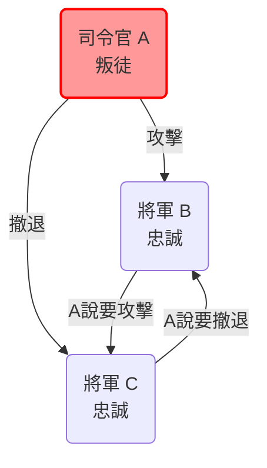
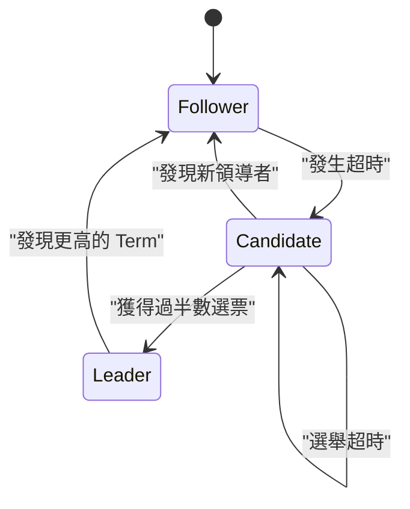
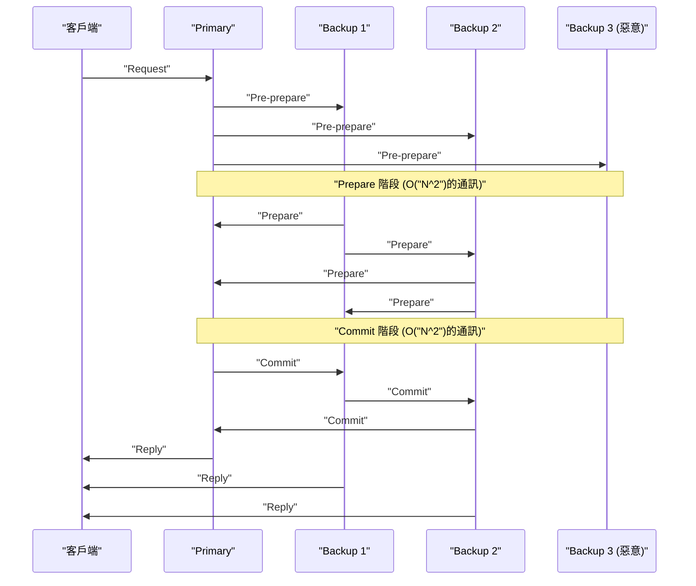

現代的雲端運算與區塊鏈技術背後的核心，存在著讓多台電腦（節點）之間共享並保持狀態一致的 **共識演算法** （[Consensus](https://kenji.blog/zh-tw/p/blockchain-technology-smart-contract-distributed-ledger/) Algorithm）。本文將從其理論基礎「拜占庭將軍問題」開始，深入探討在實際系統中廣泛採用的 **Paxos** 與 **Raft** ，甚至是在有惡意參與者的環境下依然能運作的 **BFT（Byzantine Fault Tolerance）** ，並結合數學證明與程式碼實作進行深入剖析。

## 1. 分散式系統中的共識建立與挑戰

在分散式系統中，會發生單一電腦不可能出現的各種故障，例如網路延遲、封包遺失、節點崩潰，或是惡意篡改等。在承受這些故障的同時，為了讓整個系統保持一致的狀態（[State](https://kenji.blog/zh-tw/p/iac-infrastructure-as-code-terraform/)），所需要的機制就是共識演算法。

系統的容錯能力主要分為以下兩種：

1.  **CFT (Crash Fault Tolerance)** ：能夠承受節點停止（崩潰）或網路斷線，但不假設節點會傳送虛假資料（惡意行為）。
2.  **BFT (Byzantine Fault Tolerance)** ：不僅能承受節點停止，還能承受惡意節點發送任意錯誤訊息的情況。

催生出 BFT 概念的，正是著名的 **拜占庭將軍問題** 。

---

## 2. 拜占庭將軍問題 (Byzantine Generals Problem)

1982 年，由 Leslie Lamport、Robert Shostak 與 Marshall Pease 等人提出的「拜占庭將軍問題」，是一個針對在混雜著惡意參與者的網路中，如何讓所有誠實的參與者達成共識所建立的模型。

### 2.1 問題定義

拜占庭帝國的將軍們正包圍著敵人的城市。他們地理位置分散，只能透過傳令兵進行通訊。將軍們必須就「攻擊」或「撤退」的行動達成共識。然而，將軍中混入了叛徒（惡意節點），可能會傳送虛假訊息來混淆其他將軍。

忠誠的將軍們必須滿足以下條件：

1.  所有忠誠的將軍必須對相同的行動計畫（攻擊或撤退）達成共識。
2.  少數的叛徒不能讓忠誠的將軍們達成錯誤（或不一致）的共識。

### 2.2 數學公式化與不可能性

假設將軍總數為 $ n $ ，叛徒數量為 $ f $ 。Lamport 等人以數學方式證明，在訊息可能被篡改（無數位簽章訊息）的情況下，除非滿足以下條件，否則無法達成共識：

$ n > 3f $

也就是說，整體節點數量必須大於叛徒數量的三倍。反過來說，如果全部節點中有 $ 1/3 $ 以上是惡意節點，系統就無法達成安全的共識。

舉例來說，考慮 $ n = 3 $ 、 $ f = 1 $ 的情況。假設有將軍 A（司令官）、B、C，且 A 是叛徒。
A 告訴 B「攻擊」，並告訴 C「撤退」。B 與 C 互相交換從 A 收到的訊息，但 B 主張「A 說要攻擊」，而 C 主張「A 說要撤退」。此時，B 與 C 將無法判斷到底是對方在說謊，還是 A 在說謊。

以下是顯示此 $ n = 3 $ 不可能情況的 Mermaid 圖表：



---

## 3. Paxos: 理論共識的里程碑

在不考慮拜占庭故障的 CFT（Crash Fault Tolerance）領域中，第一個強大的演算法就是 **Paxos** 。同樣由 Leslie Lamport 於 1989 年提出（1998 年發表），被 Google 的 Chubby 和 Spanner 等系統所採用。

### 3.1 Paxos 的角色與階段

Paxos 由多個 Proposer（提案者）、Acceptor（接受者）和 Learner（學習者）組成。基本的 Paxos（Single-Decree Paxos）是用於對單一值達成共識的過程，分為以下兩個階段：

*   **階段 1: Prepare（準備）**
    1.  Proposer 選擇一個唯一的提案編號 $ n $ ，並向過半數的 Acceptor 發送 `Prepare(n)` 請求。
    2.  Acceptor 若發現 $ n $ 大於其先前收到的任何 `Prepare` 編號，則承諾不再接受任何小於 $ n $ 的提案，若過去曾接受過值，則將該值回覆。
*   **階段 2: Accept（接受）**
    1.  Proposer 若獲得過半數 Acceptor 的回應，則發送 `Accept(n, v)` 請求。這裡的 $ v $ 是回應中具有最大提案編號的值，若無則為自己想提案的值。
    2.  Acceptor 若未對更大的編號做出承諾，則接受該提案。

### 3.2 透過 Python 模擬 Paxos

以下是簡化模擬 Paxos 階段 1 與階段 2 行為的 Python 程式碼：

```python
import random

class Acceptor:
    def __init__(self, id):
        self.id = id
        self.min_proposal_num = -1
        self.accepted_num = -1
        self.accepted_value = None

    def receive_prepare(self, n):
        if n > self.min_proposal_num:
            self.min_proposal_num = n
            return True, self.accepted_num, self.accepted_value
        return False, None, None

    def receive_accept(self, n, v):
        if n >= self.min_proposal_num:
            self.min_proposal_num = n
            self.accepted_num = n
            self.accepted_value = v
            return True
        return False

class Proposer:
    def __init__(self, id, value, acceptors):
        self.id = id
        self.value = value
        self.acceptors = acceptors
        self.proposal_num = id  # 產生簡易的唯一編號

    def run(self):
        # 階段 1: Prepare
        promises = []
        highest_accepted_num = -1
        value_to_propose = self.value

        for acceptor in self.acceptors:
            promised, acc_num, acc_val = acceptor.receive_prepare(self.proposal_num)
            if promised:
                promises.append(acceptor)
                if acc_num > highest_accepted_num:
                    highest_accepted_num = acc_num
                    value_to_propose = acc_val

        # 檢查是否過半數
        if len(promises) > len(self.acceptors) / 2:
            # 階段 2: Accept
            accepts = 0
            for acceptor in promises:
                if acceptor.receive_accept(self.proposal_num, value_to_propose):
                    accepts += 1
            
            if accepts > len(self.acceptors) / 2:
                print(f"Proposer {self.id}: Consensus reached on value '{value_to_propose}'")
                return True
        
        print(f"Proposer {self.id}: Failed to reach consensus.")
        return False

# 執行模擬
acceptors = [Acceptor(i) for i in range(5)]
proposer1 = Proposer(10, "Value_A", acceptors)
proposer2 = Proposer(20, "Value_B", acceptors)

# 模擬競爭狀態
proposer1.run()
proposer2.run()
```

---

## 4. Raft: 追求易懂性的演算法

Paxos 雖然非常強大，但其演算法複雜，難以在實際系統中實作。因此在 2014 年，Diego Ongaro 與 John Ousterhout 以 **「易懂性 (Understandability)」** 為主要考量，設計出了 **Raft** 。目前廣泛應用於 etcd 與 Consul 等系統。

### 4.1 Raft 的核心概念

Raft 將整個系統的狀態分為 **領導者選舉 (Leader Election)** 與 **日誌複製 (Log Replication)** 兩個子問題。

節點始終處於以下三種狀態之一：
*   **Leader (領導者)** ：接收來自客戶端的請求，並將日誌複製給其他節點。
*   **Follower (跟隨者)** ：服從來自領導者的請求。
*   **Candidate (候選者)** ：當領導者當機時，為了成為新領導者而參選的狀態。



### 4.2 領導者選舉機制

Raft 使用稱為 **Term（任期）** 的邏輯時鐘。每個跟隨者都擁有一個隨機的 **選舉超時 (Election Timeout)** ，當來自領導者的心跳（Heartbeat）中斷並發生超時時，便會成為 Candidate，並請求投票給自己（RequestVote）。獲得過半數選票的節點將成為新的 Leader。透過隨機化超時時間，可以防止選票瓜分（Split Vote）。

### 4.3 透過 Haskell 定義 Raft 節點狀態的型別

使用函數式語言來對 Raft 的狀態轉換進行建模，可以更清楚地展現其穩健性。以下是使用 Haskell 簡化的型別定義範例。

```haskell
module Raft where

data NodeState = Follower | Candidate | Leader
    deriving (Show, Eq)

type Term = Int
type NodeId = String

data RaftNode = RaftNode {
    nodeId      :: NodeId,
    currentTerm :: Term,
    votedFor    :: Maybe NodeId,
    state       :: NodeState,
    logEntries  :: [LogEntry]
} deriving (Show)

data LogEntry = LogEntry {
    term    :: Term,
    command :: String
} deriving (Show)

-- 狀態轉換函式的特徵範例
handleTimeout :: RaftNode -> RaftNode
handleTimeout node =
    if state node == Leader 
    then node
    else node { 
        state = Candidate, 
        currentTerm = currentTerm node + 1, 
        votedFor = Just (nodeId node) 
    }
```

如此一來，藉由將狀態轉換撰寫為純函式，更容易驗證 Raft 邏輯的正確性。

---

## 5. 實用的拜占庭容錯: PBFT

Paxos 和 Raft 皆為 CFT（崩潰容錯），但當網路中存在惡意節點時便無能為力。針對這個問題（拜占庭將軍問題），Miguel Castro 與 Barbara Liskov 在 1999 年發表了以實用效能提供解決方案的 **PBFT (Practical Byzantine Fault Tolerance)** 。

### 5.1 PBFT 的通訊階段

在 PBFT 中，存在領導者（Primary）與跟隨者（Backup），對於來自客戶端的請求會進行以下三個階段的多播通訊：

1.  **Pre-prepare** ：Primary 為請求分配一個序號，並向所有節點進行廣播。
2.  **Prepare** ：各節點收到請求後，在驗證後向其他所有節點廣播 `Prepare` 訊息。當收到 $ 2f $ 個 `Prepare` 訊息時，節點即進入 Prepared 狀態。
3.  **Commit** ：進入 Prepared 狀態的節點，會向所有節點廣播 `Commit` 訊息。當收到 $ 2f + 1 $ 個 `Commit` 訊息時，共識即告完成並執行請求。



PBFT 是在滿足上述 $ n > 3f $ 條件的 $ n = 3f + 1 $ 節點配置下運作，雖然伴隨著節點間 $ O(N^2) $ 的通訊開銷，但提供了確定性的共識（Finality）。這在現代的聯盟型區塊鏈（如 Hyperledger Fabric）中被廣泛採用。

### 5.2 數學限制的再確認

為了讓 PBFT 保持安全性，前提是系統內交換的訊息在密碼學上是安全的（無法偽造）。假設法定人數（Quorum）的大小為 $ Q $ ，則必須滿足以下條件：

$ Q = 2f + 1 \\\\ n = 3f + 1 $

任意兩個法定人數 $ Q_1 $ 與 $ Q_2 $ 的交集，必定包含至少一個誠實的節點。
$ |Q_1 \cap Q_2| = 2Q - n = 2(2f + 1) - (3f + 1) = f + 1 $
透過這種方式，即使 $ f $ 個惡意節點同時屬於兩個法定人數，其中也必定包含一個誠實節點，從而證明了整個系統的一致性。

---

## 6. 總結：共識演算法的演進

本文中，針對分散式系統中最大的挑戰——共識建立，我們從理論層面的「拜占庭將軍問題」開始，解說了具有崩潰容錯能力的 **Paxos** 與 **Raft** ，以及能抵抗惡意節點的 **PBFT** 。

*   **Paxos** ：在數學上被證明的穩固基礎，但複雜度為其挑戰。
*   **Raft** ：追求易懂性與實作的便利性，成為現代分散式 [KVS](https://kenji.blog/zh-tw/p/nosql-database-selection-kvs-document-graph-wide-column/) 的業界標準。
*   **PBFT** ：在混雜惡意節點的環境中實現確定性共識，成為區塊鏈技術的基礎。

時至今日，比特幣採用的 **Nakamoto [Consensus](https://kenji.blog/zh-tw/p/blockchain-technology-smart-contract-distributed-ledger/) ([PoW](https://kenji.blog/zh-tw/p/blockchain-technology-smart-contract-distributed-ledger/))** ，以及 Tendermint、HotStuff 等新型 BFT 演算法不斷誕生，它們在減少 PBFT 通訊開銷的同時提升了擴展性。根據系統的需求（節點的可靠性、所需的吞吐量、延遲），選擇合適的共識演算法，正是建構穩健分散式系統的關鍵。
