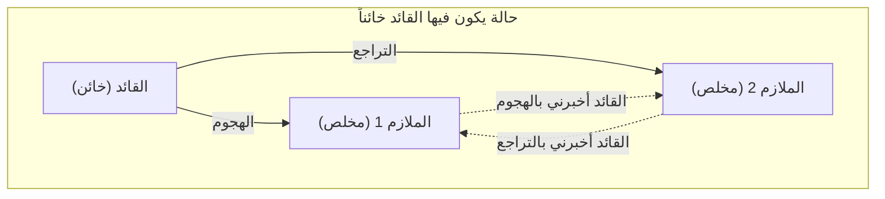
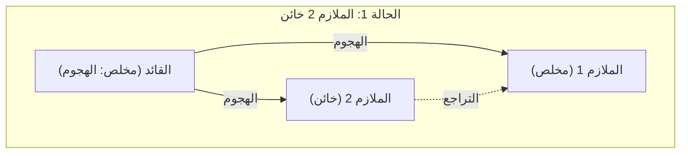
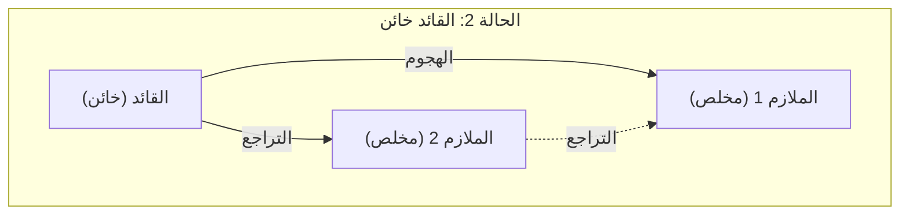
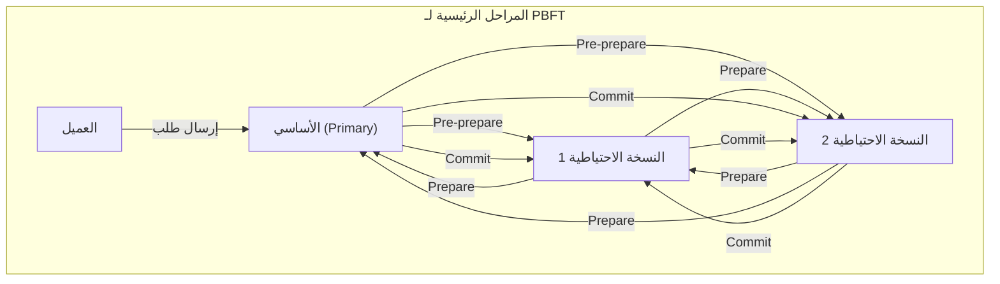

عند دراسة الأنظمة الموزعة ([Distributed System](https://kenji.blog/ar/p/cap-theorem-distributed-systems/)s) أو تقنية البلوكشين (Blockchain)، فمن المؤكد أنك ستواجه ما يُعرف بـ **مشكلة الجنرالات البيزنطيين** (Byzantine Generals Problem). تتناول هذه المشكلة موضوعاً في غاية الأهمية: كيف يمكن للنظام بأكمله أن يتوصل إلى إجماع ([Consensus](https://kenji.blog/ar/p/blockchain-technology-smart-contract-distributed-ledger/)) صحيح في بيئة يوجد بها "خونة" أو "عقد (Nodes) معطلة" داخل الشبكة.

في هذه المقالة، سنشرح **[مشكلة الجنرالات البيزنطيين](https://kenji.blog/ar/p/byzantine-generals-problem/)** بالتفصيل من الأساسيات إلى التطبيقات، وذلك باستخدام قصة ملموسة، وشروط رياضية، ورسوم توضيحية.

## 1. ما هي [مشكلة الجنرالات البيزنطيين](https://kenji.blog/ar/p/byzantine-generals-problem/)؟

[مشكلة الجنرالات البيزنطيين](https://kenji.blog/ar/p/byzantine-generals-problem/) هي تجربة فكرية حول الإجماع في الحوسبة الموزعة، اقترحها ليزلي لامبورت (Leslie Lamport) وآخرون في عام 1982.

### مثال ملموس: جنرالات الإمبراطورية البيزنطية

تُطرح هذه المشكلة من خلال سيناريو يحاصر فيه جيش الإمبراطورية البيزنطية مدينة معادية. ينقسم الجيش إلى عدة فرق، وتقاد كل فرقة بواسطة جنرال. يمكن للجنرالات التواصل مع بعضهم البعض فقط عن طريق إرسال الرسل.

هدفهم هو التوصل إلى **إجماع متفق عليه من قبل الجميع** حول أحد الإجراءين التاليين:

* **الهجوم** (Attack)
* **التراجع** (Retreat)

إذا قام الجميع بالهجوم في نفس الوقت، فسيتمكنون من الاستيلاء على المدينة، ولكن إذا قام جزء فقط من الفرق بالهجوم، فسوف ينهزمون. لذلك، يجب على الجميع اتخاذ نفس الإجراء.

لكن هنا تكمن مشكلة كبيرة. من الممكن أن يكون هناك **خونة** مندسون بين الجنرالات. سيقوم الجنرال الخائن بإرسال رسائل كاذبة عمداً، في محاولة لإرباك الجنرالات المخلصين ودفعهم لاتخاذ إجراءات خاطئة.

يوضح الشكل التالي نموذجاً بسيطاً حيث يكون القائد هو الخائن.

في هذه الحالة، سيتلقى الملازم 1 معلومات متناقضة: "القائد يقول الهجوم، لكن الملازم 2 يقول التراجع"، ولن يتمكن من اتخاذ قرار صحيح.

وبهذا الشكل، تتساءل **[مشكلة الجنرالات البيزنطيين](https://kenji.blog/ar/p/byzantine-generals-problem/)**: "كيف يمكن للعقد الطبيعية أن تصل إلى نفس الاستنتاج في شبكة يمكن لأي عقدة خبيثة فيها نشر معلومات كاذبة عشوائية؟"

## 2. الشروط الصارمة لتكوين الإجماع

في هذه المشكلة، من أجل التوصل إلى إجماع في النظام بأكمله، يجب استيفاء الشرطين التاليين (شروط التناسق التفاعلي - Interactive [Consistency](https://kenji.blog/ar/p/cap-theorem-distributed-systems-tradeoff/)):

1. يجب أن يطيع جميع الملازمين المخلصين نفس الأمر.
2. إذا كان القائد مخلصاً، فيجب على جميع الملازمين المخلصين إطاعة الأمر الصادر عن القائد.

### خوارزمية الرسائل الشفوية (Oral Messages Algorithm)

أثبت لامبورت وزملاؤه رياضياً شروط التوصل إلى إجماع في نموذج "الرسالة الشفوية"، بافتراض أن الرسائل المرسلة يمكن العبث بها (لا يمكن إثبات من أرسلها).

والخلاصة هي أنه إذا كان عدد الخونة هو $m$، فلا يمكن التوصل إلى إجماع ما لم يكن هناك ما لا يقل عن **$3m + 1$** من الجنرالات (العقد) بشكل عام. أي أنه إذا كان إجمالي عدد العقد في الشبكة هو $n$، فيجب أن تتحقق المتباينة التالية:

$$
n \ge 3m + 1
$$

بعبارة أخرى، يجب أن تكون نسبة الخونة في الشبكة أقل من **الثلث (1/3)** من الإجمالي.

### لماذا 3m + 1 ضروري؟

لنفترض أن إجمالي عدد الأشخاص هو $n = 3$، وأن هناك خائناً واحداً $m = 1$. في هذه الحالة، لا يتحقق شرط $n \ge 3(1) + 1 = 4$، وبالتالي فإن الإجماع مستحيل. سنتحقق من السبب من خلال الرسوم التوضيحية.

**الحالة 1: القائد مخلص، والملازم 2 خائن**

في هذه الحالة، يتلقى الملازم 1 المخلص رسالة "الهجوم" من القائد، ورسالة "التراجع" من الملازم 2.

**الحالة 2: القائد خائن، والملازمون مخلصون**

في هذه الحالة أيضاً، يتلقى الملازم 1 المخلص رسالة "الهجوم" من القائد، ورسالة "التراجع" من الملازم 2.

من وجهة نظر الملازم 1، فإن **مجموعة المعلومات المتلقاة هي نفسها تماماً** في الحالة 1 والحالة 2. لا يملك الملازم 1 أي وسيلة لمعرفة ما إذا كان القائد يكذب أم الملازم 2. لذلك، من المستحيل تشكيل إجماع مؤكد.

## 3. الخوارزمية كحل

ما هو نوع الخوارزمية اللازمة لحل [مشكلة الجنرالات البيزنطيين](https://kenji.blog/ar/p/byzantine-generals-problem/) وتشكيل إجماع؟

### خوارزمية الرسائل الشفوية المتكررة

كما ذكرنا سابقاً، إذا تحقق الشرط $n \ge 3m + 1$، يمكن التوصل إلى إجماع باستخدام خوارزمية متكررة (Recursive Algorithm). على سبيل المثال، إذا كان $n=4, m=1$، يتم اتباع الخطوات التالية:

1. يرسل القائد أمراً إلى كل ملازم.
2. يقوم كل ملازم بإعادة توجيه الأمر الذي تلقاه إلى جميع الملازمين الآخرين.
3. يقرر كل ملازم الإجراء النهائي بناءً على تصويت الأغلبية لجميع الرسائل التي وصلته (بما في ذلك الأمر المباشر من القائد).

حتى لو كان واحد من الأربعة خائناً، فإن المعلومات الصحيحة من الملازمين المخلصين المتبقيين ستشكل الأغلبية (صوتين من أصل ثلاثة أصوات)، وبالتالي يمكن التوصل إلى الإجماع الصحيح من خلال الأغلبية.

### خوارزمية الرسائل الموقعة (Signed Messages Algorithm)

ماذا لو كانت الرسائل المرسلة مرفقة بـ "توقيع رقمي غير قابل للتزوير" ([Digital Signature](https://kenji.blog/ar/p/modern-cryptography-public-key-hash-signature/))، بحيث **يمكن إثبات من أرسل الرسالة بشكل مؤكد**؟

في هذا النموذج، يصبح من المستحيل العبث بالأوامر الصادرة عن القائد أثناء انتقالها. ونتيجة لذلك، بغض النظر عن عدد الخونة، فقد ثبت أنه يمكن التوصل إلى إجماع طالما كان هناك $n \ge m + 2$ من الجنرالات (أي ثلاثة أشخاص على الأقل) مقابل $m$ من الخونة. في الأنظمة الحديثة، تلعب التواقيع الرقمية باستخدام التشفير بالمفتاح العام هذا الدور.

## 4. البلوكشين ([Blockchain](https://kenji.blog/ar/p/blockchain-technology-smart-contract-distributed-ledger/)) وتحمل الأخطاء البيزنطية (BFT)

تسمى القدرة على مقاومة [مشكلة الجنرالات البيزنطيين](https://kenji.blog/ar/p/byzantine-generals-problem/) **تحمل الأخطاء البيزنطية** (Byzantine Fault Tolerance, BFT). وهو مؤشر مهم لضمان استمرار النظام الموزع في العمل بشكل طبيعي حتى مع وجود أعطال أو هجمات خبيثة.

في السنوات الأخيرة، عادت هذه المشكلة لتسلط عليها الأضواء بشكل كبير بفضل ظهور **تقنية البلوكشين** ([Blockchain](https://kenji.blog/ar/p/blockchain-technology-smart-contract-distributed-ledger/)). نظراً لأن البلوكشين عبارة عن شبكة نظير إلى نظير (P2P) بدون مدير مركزي، فهناك احتمال أن يقوم المشاركون (العقد) الخبيثون بنشر سجلات معاملات مزيفة. إنها [مشكلة الجنرالات البيزنطيين](https://kenji.blog/ar/p/byzantine-generals-problem/) بحد ذاتها.

### كيف يعمل PBFT (Practical Byzantine Fault Tolerance)

تعد خوارزمية PBFT، التي اقترحها ميغيل كاسترو (Miguel Castro) وآخرون في عام 1999، خوارزمية تحقق BFT بكفاءة في شبكات غير متزامنة حقيقية.

في PBFT، يتم تقسيم عملية الإجماع بشكل أساسي إلى المراحل الثلاث التالية:

من خلال هذه العملية، حتى لو كان هناك $m$ من العقد المعطلة أو الخبيثة في الشبكة، يمكن معالجة الطلبات بالترتيب الصحيح طالما أن إجمالي عدد العقد يلبي $n \ge 3m + 1$. نظراً لأن حجم الاتصال بين المكونات في PBFT يزداد بشكل يتناسب مع مربع عدد العقد، فهو غير مناسب للشبكات الكبيرة مثل البلوكشين العام (Public Chain). لكنه يُستخدم على نطاق واسع في شبكات البلوكشين الخاصة (Consortium [Blockchain](https://kenji.blog/ar/p/blockchain-technology-smart-contract-distributed-ledger/)) (مثل Hyperledger Fabric) حيث يكون عدد العقد محدوداً، لأنه يوفر إجماعاً سريعاً جداً وحتمياً.

### إجماع ناكاموتو (Proof of Work)

اتخذ ساتوشي ناكاموتو (Satoshi Nakamoto)، مبتكر البيتكوين، نهجاً جديداً تماماً للتعامل مع هذه المشكلة. هذا هو **إجماع ناكاموتو** (Nakamoto [Consensus](https://kenji.blog/ar/p/blockchain-technology-smart-contract-distributed-ledger/)) الذي يجمع بين **إثبات العمل** (Proof of Work - [PoW](https://kenji.blog/ar/p/blockchain-technology-smart-contract-distributed-ledger/)) وقاعدة أن أطول سلسلة هي السلسلة الصحيحة.

في إجماع ناكاموتو، فقط أولئك الذين يفوزون في مسابقة رياضية (التعدين) يكتسبون الحق في اقتراح كتلة (Block). لكي يتعرف النظام على معلومات خاطئة، يجب السيطرة على أكثر من نصف (51% أو أكثر) من قوة الحوسبة للشبكة بأكملها، وهو تصميم يجعل الأمر بالغ الصعوبة من الناحية العملية. بهذا، يُعتبر أنه حل [مشكلة الجنرالات البيزنطيين](https://kenji.blog/ar/p/byzantine-generals-problem/) باحتمالية عالية في شبكة مفتوحة يشارك فيها عدد غير محدد من الأشخاص.

### تطبيق BFT في إثبات الحصة (Proof of Stake - [PoS](https://kenji.blog/ar/p/blockchain-technology-smart-contract-distributed-ledger/))

كان إجماع ناكاموتو ثورياً، لكنه واجه مشكلة استهلاك كميات هائلة من الطاقة في التعدين. ولحل هذه المشكلة، ظهر نظام **إثبات الحصة** (Proof of Stake - PoS)، الذي يمنح حق اقتراح الكتلة وفقاً لكمية الأصول المشفرة (الحصة أو Stake) التي تحتفظ بها العقدة.

تم تصميم العديد من خوارزميات PoS الحديثة، مثل Casper في إيثريوم (Ethereum) و Tendermint في كوزموس (Cosmos)، بناءً على BFT. على سبيل المثال، يعمل Tendermint على صقل فكرة PBFT المذكورة أعلاه ويشكل إجماعاً في شبكة من "المدققين" (Validators) يتم أخذ كمية الحصة فيها كوزن. النظام مصمم بحيث لا يتم إنشاء الكتلة التالية ما لم يتم جمع توقيعات من ثلثي (2/3) المدققين على الأقل، وهو مثال ممتاز على تحقيق شرط $n \ge 3m + 1$ (الخونة أقل من الثلث) في السلاسل العامة الحديثة.

## 5. النمذجة الرياضية وتطبيقات BFT

في تصميم الأنظمة الموزعة الأكثر تقدماً، يتم تحديد انتقال حالة النظام بشكل صارم لإثبات صحة خوارزمية BFT.

على سبيل المثال، لنفترض أن مجموعة العقد هي $\mathcal{N} = \{1, 2, \dots, n\}$، والحد الأقصى لعدد العقد الخائنة هو $f$. في جولة (Round) معينة $r$، تحتفظ كل عقدة $i$ بحالة $s_i^{(r)}$، وتتبادل الرسائل مع العقد الأخرى.

إذا كانت دالة تحديث الحالة هي $\delta$، فيمكن التعبير عن الحالة في الجولة التالية على النحو التالي:

$$
s_i^{(r+1)} = \delta(s_i^{(r)}, M_i^{(r)})
$$

هنا، $M_i^{(r)}$ هي مجموعة الرسائل التي تلقتها العقدة $i$ في الجولة $r$. خوارزمية BFT عبارة عن تصميم لبروتوكول اتصال والدالة $\delta$ لضمان أنه حتى لو أرسلت عقدة معطلة رسائل غير صالحة عشوائية، فإن الفرق في الحالة يختفي (يتقاربون إلى نفس الحالة) بتقدم الجولات بالنسبة لجميع العقد العادية $j, k$. رياضياً يمكن التعبير عن ذلك كما يلي:

$$
\lim_{r \to \infty} (s_j^{(r)} - s_k^{(r)}) = 0
$$

## 6. خاتمة

**[مشكلة الجنرالات البيزنطيين](https://kenji.blog/ar/p/byzantine-generals-problem/)** هي النظرية الأساسية لضمان موثوقية الأنظمة الموزعة. السؤال عن "كيفية اتخاذ قرارات صحيحة ككل في بيئة لا تعرف فيها بمن تثق" يتم تطبيقه الآن في جميع البنى التحتية لتقنية المعلومات الحديثة، من التكنولوجيا الأساسية للأصول المشفرة، إلى أنظمة التحكم في الطائرات، والحوسبة السحابية.

بافتراض وجود خونة، فإن تطور الخوارزميات للحفاظ على استمرار عمل النظام لن يتوقف في المستقبل. بالنسبة للمهندسين المشاركين في تصميم الأنظمة الموزعة، فإن فهم البراهين الرياضية والخوارزميات التي تكمن وراء هذه المشكلة سيكون سلاحاً قوياً جداً.
