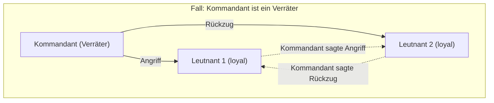
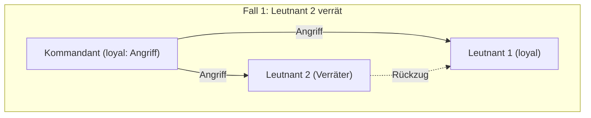
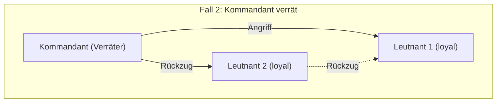
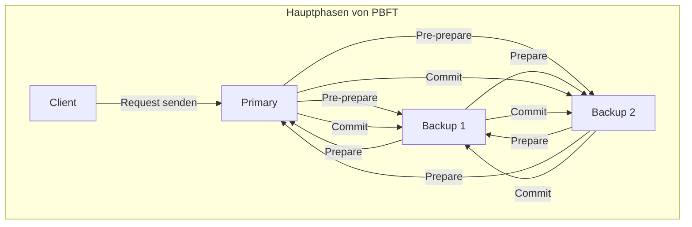

Beim Erlernen von verteilten Systemen und Blockchain-Technologie stößt man fast zwangsläufig auf das **Problem der byzantinischen Generäle** ([Byzantine Generals](https://kenji.blog/de/p/byzantine-generals-problem-consensus/) Problem). Es behandelt das äußerst wichtige Thema, wie ein System als Ganzes einen korrekten Konsens bilden kann, wenn sich im Netzwerk „Verräter“ oder „fehlerhafte Knoten“ befinden.

In diesem Artikel werden wir dieses **Problem der byzantinischen Generäle** von den Grundlagen bis zur Anwendung detailliert erläutern, unterstützt durch anschauliche Geschichten, mathematische Bedingungen und Diagramme.

## 1. Was ist das Problem der byzantinischen Generäle?

[Das Problem der byzantinischen Generäle](https://kenji.blog/de/p/byzantine-generals-problem/) ist ein Gedankenexperiment zur Konsensfindung in verteilten Computersystemen, das 1982 von Leslie Lamport und anderen vorgeschlagen wurde.

### Ein konkretes Beispiel: Die Generäle des Byzantinischen Reiches

Dieses Problem wird oft in dem Szenario beschrieben, dass die Armeen des Byzantinischen Reiches eine feindliche Stadt belagern. Die Armee ist in mehrere Divisionen unterteilt, und jede Division wird von einem General kommandiert. Die Generäle können nur durch Boten miteinander kommunizieren.

Ihr Ziel ist es, bezüglich einer der folgenden Aktionen einen **einstimmigen Konsens aller Beteiligten** zu erzielen:

* **Angriff** (Attack)
* **Rückzug** (Retreat)

Wenn alle gleichzeitig angreifen, können sie die Stadt einnehmen. Wenn jedoch nur ein Teil der Divisionen angreift, werden sie besiegt. Daher müssen alle die gleiche Aktion ausführen.

Hierbei gibt es jedoch ein großes Problem. Unter den Generälen könnten sich **Verräter** befinden. Verräterische Generäle werden absichtlich falsche Nachrichten senden, um die loyalen Generäle zu verwirren und sie zu falschen Entscheidungen zu verleiten.

Das folgende Diagramm zeigt ein einfaches Modell für den Fall, dass der Kommandant ein Verräter ist.

In dieser Situation erhält Leutnant 1 widersprüchliche Informationen: „Der Kommandant sagt Angriff, aber Leutnant 2 sagt, er habe Rückzug befohlen.“ Er kann keine richtige Entscheidung treffen.

Die Frage, „Wie können normale Knoten in einem Netzwerk, in dem bösartige Knoten beliebige falsche Informationen verbreiten können, zum selben Ergebnis gelangen?“, bildet den Kern des **Problems der byzantinischen Generäle**.

## 2. Strikte Bedingungen für die Konsensfindung

Um in diesem Problem systemweit einen Konsens zu erzielen, müssen die folgenden zwei Bedingungen (Bedingungen der interaktiven Konsistenz) erfüllt sein:

1. Alle loyalen Leutnants müssen demselben Befehl gehorchen.
2. Wenn der Kommandant loyal ist, müssen alle loyalen Leutnants dem Befehl gehorchen, den der Kommandant erteilt hat.

### Oral Messages Algorithm (Algorithmus für mündliche Nachrichten)

Lamport und seine Kollegen haben die Bedingungen für die Konsensfindung im Modell der „mündlichen Nachrichten“ mathematisch bewiesen, bei dem vorausgesetzt wird, dass übermittelte Nachrichten gefälscht werden können (es kann nicht bewiesen werden, wer sie gesendet hat).

Um es vorwegzunehmen: Wenn die Anzahl der Verräter $m$ ist, kann ein Konsens nicht erzielt werden, es sei denn, es gibt insgesamt **$3m + 1$** oder mehr Generäle (Knoten). Das heißt, wenn die Gesamtanzahl der Knoten im Netzwerk $n$ ist, muss folgende Ungleichung gelten:

$$
n \ge 3m + 1
$$

Mit anderen Worten: Der Anteil der Verräter im Netzwerk muss **weniger als ein Drittel (1/3)** betragen.

### Warum ist 3m + 1 erforderlich?

Betrachten wir den Fall, dass die Gesamtzahl der Personen $n = 3$ ist und sich darunter $m = 1$ Verräter befindet. In diesem Fall ist $n \ge 3(1) + 1 = 4$ nicht erfüllt, daher ist ein Konsens unmöglich. Wir veranschaulichen den Grund dafür anhand eines Diagramms.

**Fall 1: Der Kommandant ist loyal, und Leutnant 2 ist ein Verräter**

In diesem Fall erhält der loyale Leutnant 1 die Nachricht „Angriff“ vom Kommandanten und „Rückzug“ von Leutnant 2.

**Fall 2: Der Kommandant ist ein Verräter, und die Leutnants sind loyal**

Auch in diesem Fall erhält der loyale Leutnant 1 die Nachricht „Angriff“ vom Kommandanten und „Rückzug“ von Leutnant 2.

Aus der Perspektive von Leutnant 1 ist die **Kombination der erhaltenen Informationen** in Fall 1 und Fall 2 **völlig identisch**. Leutnant 1 hat keine Möglichkeit zu unterscheiden, ob der Kommandant lügt oder ob Leutnant 2 lügt. Folglich ist es unmöglich, einen sicheren Konsens zu erzielen.

## 3. Lösungsalgorithmen

Welcher Algorithmus ist erforderlich, um das Problem der byzantinischen Generäle zu lösen und einen Konsens zu bilden?

### Rekursiver Algorithmus für mündliche Nachrichten

Wie bereits erwähnt, ist ein Konsens durch einen rekursiven Algorithmus möglich, wenn $n \ge 3m + 1$ erfüllt ist. Zum Beispiel bei $n=4, m=1$ werden folgende Schritte unternommen:

1. Der Kommandant sendet einen Befehl an jeden Leutnant.
2. Jeder Leutnant leitet den erhaltenen Befehl an alle anderen Leutnants weiter.
3. Jeder Leutnant entscheidet basierend auf allen an ihn gerichteten Nachrichten (einschließlich des direkten Befehls des Kommandanten) durch Mehrheitsbeschluss über seine endgültige Aktion.

Selbst wenn einer von vier ein Verräter ist, bilden die korrekten Informationen der verbleibenden zwei loyalen Leutnants die Mehrheit (2 von 3 Stimmen), so dass durch einen Mehrheitsbeschluss ein korrekter Konsens erzielt werden kann.

### Algorithmus für signierte Nachrichten

Was wäre, wenn die gesendeten Nachrichten mit einer „unfälschbaren digitalen Signatur“ versehen wären, mit der **sicher bewiesen werden kann, wer die Nachricht gesendet hat**?

In diesem Modell können die vom Kommandanten ausgegebenen Befehle auf dem Weg nicht mehr manipuliert werden. Als Ergebnis ist mathematisch erwiesen, dass ein Konsens gebildet werden kann, solange $n \ge m + 2$ (also insgesamt mindestens 3 Generäle) für $m$ Verräter gilt, unabhängig davon, wie viele Verräter es gibt. In modernen Systemen übernehmen digitale Signaturen auf Basis der Public-Key-Kryptografie diese Rolle.

## 4. Blockchain und byzantinische Fehlertoleranz

Die Widerstandsfähigkeit gegenüber dem Problem der byzantinischen Generäle wird als **byzantinische Fehlertoleranz** (Byzantine Fault Tolerance, BFT) bezeichnet. Sie ist ein wichtiger Indikator dafür, dass ein verteiltes System Ausfälle oder böswillige Angriffe überstehen und normal weiterarbeiten kann.

In den letzten Jahren rückte dieses Problem durch das Aufkommen der **Blockchain-Technologie** wieder stark in den Fokus. Da eine Blockchain ein P2P-Netzwerk ohne zentrale Kontrollinstanz ist, besteht die Möglichkeit, dass böswillige Teilnehmer (Knoten) gefälschte Transaktionsverläufe verbreiten. Dies entspricht exakt dem Problem der byzantinischen Generäle.

### Die Funktionsweise von PBFT (Practical Byzantine Fault Tolerance)

Das 1999 von Miguel Castro und Barbara Liskov vorgeschlagene PBFT ist ein Algorithmus, der BFT in realen, asynchronen Netzwerken effizient umsetzt.

In PBFT ist der Prozess der Konsensfindung im Wesentlichen in die folgenden drei Phasen unterteilt:

Durch diesen Prozess können Anfragen in der richtigen Reihenfolge verarbeitet werden, selbst wenn es $m$ fehlerhafte oder bösartige Knoten im Netzwerk gibt, solange die Gesamtzahl der Knoten $n \ge 3m + 1$ erfüllt. Da bei PBFT das Kommunikationsvolumen zwischen den Komponenten quadratisch mit der Anzahl der Knoten ansteigt, eignet es sich nicht für groß angelegte Netzwerke wie Public Blockchains, wird jedoch häufig in Konsortium-Blockchains mit einer begrenzten Anzahl von Knoten (z. B. Hyperledger Fabric) verwendet, da es einen sehr schnellen und deterministischen Konsens ermöglicht.

### Nakamoto-Konsens (Proof of Work)

Satoshi Nakamoto, der Erfinder von [Bitcoin](https://kenji.blog/de/p/cryptocurrency-and-bitcoin/), ging dieses Problem mit einem völlig neuen Ansatz an. Dies ist der **Nakamoto-Konsens**, eine Kombination aus **Proof of Work** (PoW) und der Regel, dass die längste Kette als gültig betrachtet wird.

Beim Nakamoto-Konsens erhält nur derjenige, der einen mathematischen Rechenwettbewerb (Mining) gewinnt, das Recht, einen Block vorzuschlagen. Um dem Netzwerk falsche Informationen aufzuzwingen, müsste man die Mehrheit (mehr als 51 %) der Rechenleistung des gesamten Netzwerks kontrollieren, was in der Realität extrem schwierig ist. Dadurch wird davon ausgegangen, dass das Problem der byzantinischen Generäle in einem offenen Netzwerk mit einer unbestimmten Anzahl von Teilnehmern probabilistisch gelöst wurde.

### Anwendung von BFT im PoS (Proof of Stake)

Obwohl der Nakamoto-Konsens revolutionär war, hatte er das Problem, dass das Mining enorme Mengen an Strom verbraucht. Zur Lösung dieses Problems wurde der **Proof of Stake** (PoS) eingeführt, bei dem das Recht, Blöcke vorzuschlagen, entsprechend der Menge der von den Knoten gehaltenen Krypto-Assets (Stake) vergeben wird.

Viele der neuesten PoS-Algorithmen, wie Casper von Ethereum oder Tendermint von Cosmos, sind auf Basis dieser BFT konzipiert. Beispielsweise verfeinert Tendermint das oben erwähnte PBFT-Konzept und bildet einen Konsens in einem Netzwerk von „Validatoren (Prüfern)“, das eine Gewichtung nach der Höhe des Stakes einführt. Es ist so aufgebaut, dass der nächste Block nur generiert wird, wenn die Signaturen von mehr als 2/3 der Validatoren gesammelt werden, was ein hervorragendes Beispiel dafür ist, wie die Bedingung $n \ge 3m + 1$ (Verräter machen weniger als 1/3 aus) in modernen Public Blockchains realisiert wird.

## 5. Mathematische Modellierung von BFT und ihre Anwendung

In einem fortgeschritteneren Design verteilter Systeme werden die Zustandsübergänge des Systems streng definiert, um die Korrektheit des BFT-Algorithmus zu beweisen.

Sei beispielsweise die Menge der Knoten $\mathcal{N} = \{1, 2, \dots, n\}$ und die maximale Anzahl der Verräterknoten $f$. In einer bestimmten Runde $r$ hält jeder Knoten $i$ den Zustand $s_i^{(r)}$ und tauscht Nachrichten mit anderen Knoten aus.

Wenn die Zustandsaktualisierungsfunktion $\delta$ ist, wird der Zustand in der nächsten Runde wie folgt dargestellt:

$$
s_i^{(r+1)} = \delta(s_i^{(r)}, M_i^{(r)})
$$

Hierbei ist $M_i^{(r)}$ die Menge der Nachrichten, die der Knoten $i$ in der Runde $r$ empfangen hat. Ein BFT-Algorithmus bedeutet letztlich, die Funktion $\delta$ und das Kommunikationsprotokoll so zu entwerfen, dass selbst bei Übertragung beliebiger fehlerhafter Nachrichten durch fehlerhafte Knoten garantiert ist, dass die Zustandsdifferenz zwischen allen normalen Knoten $j$ und $k$ mit fortschreitenden Runden verschwindet (sie gegen denselben Zustand konvergieren). Mathematisch lässt sich dies wie folgt ausdrücken:

$$
\lim_{r \to \infty} (s_j^{(r)} - s_k^{(r)}) = 0
$$

## 6. Schlusswort

Das **Problem der byzantinischen Generäle** bildet das theoretische Fundament, um die Zuverlässigkeit verteilter Systeme zu gewährleisten. Die Frage, „Wie kann man als Ganzes eine korrekte Entscheidung treffen, in einer Umgebung, in der man nicht weiß, wem man vertrauen kann?“, findet Anwendung in allen modernen IT-Infrastrukturen – von der Basistechnologie für Krypto-Assets über Steuerungssysteme in Flugzeugen bis hin zum Cloud Computing.

Die Weiterentwicklung von Algorithmen, die die Existenz von Verrätern voraussetzen und dennoch ein Anhalten des Systems verhindern, wird auch in Zukunft nicht aufhören. Für Ingenieure, die an der Entwicklung verteilter Systeme beteiligt sind, wird das Verständnis der mathematischen Beweise und Algorithmen, die diesem Problem zugrunde liegen, eine sehr mächtige Waffe sein.
