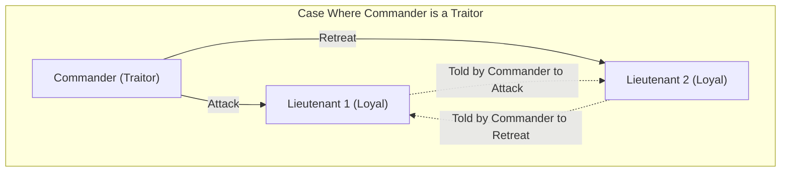
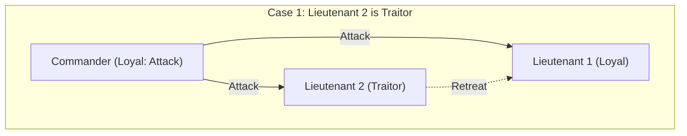
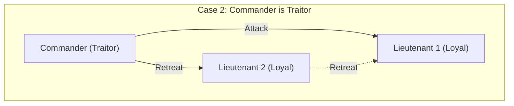
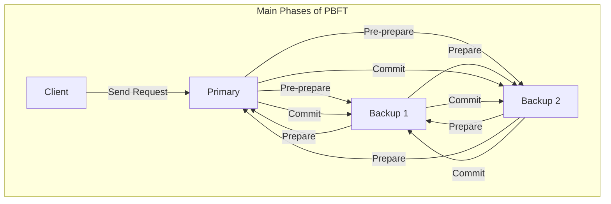

When studying distributed systems and blockchain technology, you will almost certainly encounter the **Byzantine Generals Problem**. It deals with the highly important theme of how a system as a whole can form a correct consensus in a situation where "traitors" or "faulty nodes" exist within the network.

In this article, we will explain this **Byzantine Generals Problem** in detail, from basics to applications, mixing in concrete stories, mathematical formulas, and diagrams.

## 1. What is the Byzantine Generals Problem?

The Byzantine Generals Problem is a thought experiment about consensus in distributed computing proposed by Leslie Lamport and others in 1982.

### Concrete Example: Generals of the Byzantine Empire

The problem is framed in a scenario where divisions of the Byzantine army are besieging an enemy city. The army is divided into several divisions, each commanded by a general. The generals can only communicate with one another by messengers.

Their objective is to reach a **unanimous consensus** on one of the following actions:

* **Attack**
* **Retreat**

If they all attack simultaneously, they can capture the city; but if only some divisions attack, they will be defeated. Therefore, everyone must take the same action.

However, there is a major problem. There may be **traitors** among the generals. Traitorous generals will intentionally send false messages to confuse the loyal generals and cause them to take incorrect actions.

The following diagram is a simple model of a case where the commander is a traitor.

In this situation, Lieutenant 1 receives contradictory information: "The commander says attack, but Lieutenant 2 says retreat," making them unable to make a correct decision.

In this way, asking "how can normal nodes reach the same conclusion in a network where malicious nodes can broadcast arbitrary false information" is the essence of the **Byzantine Generals Problem**.

## 2. Strict Conditions for Consensus

To reach consensus as a system in this problem, the following two conditions (interactive consistency conditions) must be met:

1. All loyal lieutenants obey the same order.
2. If the commanding general is loyal, then every loyal lieutenant obeys the order he sends.

### Oral Messages Algorithm

Lamport and his colleagues mathematically proved the conditions for forming consensus in an "oral messages" model, assuming that transmitted messages can be tampered with (it cannot be proven who sent them).

To conclude, if the number of traitors is $m$, consensus cannot be reached unless there are at least **$3m + 1$** generals (nodes) in total. That is, if the total number of nodes in the network is $n$, the following inequality must hold:

$$
n \ge 3m + 1
$$

In other words, the proportion of traitors in the network must be **less than 1/3**.

### Why is 3m + 1 needed?

Consider a case where the total number of people is $n = 3$, and there is $m = 1$ traitor among them. In this case, since $n \ge 3(1) + 1 = 4$ is not satisfied, consensus is impossible. Let's look at the reason with a diagram.

**Case 1: The Commander is loyal, and Lieutenant 2 is a traitor**

At this time, the loyal Lieutenant 1 receives the message "Attack" from the commander and "Retreat" from Lieutenant 2.

**Case 2: The Commander is a traitor, and the lieutenants are loyal**

At this time as well, the loyal Lieutenant 1 receives the message "Attack" from the commander and "Retreat" from Lieutenant 2.

From Lieutenant 1's perspective, **the combination of information received is exactly the same** in Case 1 and Case 2. Lieutenant 1 has no way to distinguish whether the commander is lying or Lieutenant 2 is lying. Therefore, it is impossible to form a definite consensus.

## 3. Algorithms as Solutions

What kind of algorithm is necessary to solve the Byzantine Generals Problem and form consensus?

### Recursive Oral Messages Algorithm

As mentioned above, if $n \ge 3m + 1$ is met, consensus is possible using a recursive algorithm. For example, for $n=4, m=1$, the following steps are taken:

1. The commander sends an order to each lieutenant.
2. Each lieutenant forwards the received order to all other lieutenants.
3. Each lieutenant determines their final action by a majority vote based on all messages directed to them (including the direct order from the commander).

Even if 1 out of 4 people is a traitor, correct information from the remaining 2 loyal lieutenants constitutes a majority (2 out of 3 votes), making it possible to reach the correct consensus by majority vote.

### Signed Messages Algorithm

What if the sent messages are appended with "unforgeable digital signatures," making it possible to **definitively prove who sent the message**?

In this model, an order issued by a commander cannot be altered in transit. As a result, it has been proved that regardless of the number of traitors $m$, consensus can be formed as long as there are $n \ge m + 2$ generals (i.e., a minimum of 3 in total). In modern systems, digital signatures based on public-key cryptography serve this role.

## 4. Blockchain and Byzantine Fault Tolerance

Tolerance against the Byzantine Generals Problem is called **Byzantine Fault Tolerance** (BFT). It is an important metric for a distributed system to withstand failures or malicious attacks and continue operating normally.

In recent years, this problem has returned to the spotlight largely due to the emergence of **blockchain technology**. Since the blockchain is a P2P network without a central administrator, malicious participants (nodes) might broadcast fake transaction histories. This is exactly the Byzantine Generals Problem itself.

### The Mechanism of PBFT (Practical Byzantine Fault Tolerance)

PBFT, proposed by Miguel Castro and colleagues in 1999, is an algorithm that efficiently achieves BFT in real-world asynchronous networks.

In PBFT, the consensus process is mainly divided into the following three phases.

Through this process, even if there are $m$ faulty or malicious nodes in the network, as long as the total number of nodes satisfies $n \ge 3m + 1$, requests can be processed in the correct order. In PBFT, the amount of communication between components increases proportionally to the square of the number of nodes, making it unsuitable for large-scale networks like public chains. However, it is widely used in consortium blockchains with a limited number of nodes (such as Hyperledger Fabric) because it provides extremely fast and deterministic consensus.

### Nakamoto Consensus (Proof of Work)

Satoshi Nakamoto, the creator of Bitcoin, addressed this problem with a completely new approach. This is the **Nakamoto Consensus**, combining **Proof of Work** (PoW) with a rule that considers the longest chain as the correct one.

In Nakamoto Consensus, only the one who wins a mathematical computational race (mining) gains the right to propose a block. To make the network recognize fake information, it is necessary to control the majority (51% or more) of the computing power of the entire network, which is designed to be extremely difficult in reality. As a result, it is evaluated as having probabilistically solved the Byzantine Generals Problem in an open network with an unspecified number of participants.

### Application of BFT in PoS (Proof of Stake)

Nakamoto Consensus was revolutionary, but it had a problem of consuming enormous amounts of electricity for mining. To solve this, **Proof of Stake** (PoS) emerged, which grants block proposal rights according to the amount of crypto assets (stake) held by a node.

Many modern PoS algorithms, such as Ethereum's Casper and Cosmos's Tendermint, are designed based on this BFT. For example, Tendermint further refines the concept of PBFT mentioned above and forms consensus in a network of "validators" incorporating weighting by stake amount. It is designed so that the next block cannot be generated without collecting signatures from 2/3 or more of the validators, making it a great example of realizing the condition $n \ge 3m + 1$ (traitors being less than 1/3) in a modern public chain.

## 5. Mathematical Modeling and Application of BFT

In more advanced distributed system design, state transitions of the system are rigorously defined to prove the correctness of BFT algorithms.

For instance, let the set of nodes be $\mathcal{N} = \{1, 2, \dots, n\}$ and the maximum number of traitor nodes be $f$. In a certain round $r$, each node $i$ holds state $s_i^{(r)}$ and exchanges messages with other nodes.

Let the state update function be $\delta$, the state of the next round is expressed as follows:

$$
s_i^{(r+1)} = \delta(s_i^{(r)}, M_i^{(r)})
$$

Here, $M_i^{(r)}$ is the set of messages received by node $i$ in round $r$. A BFT algorithm is nothing more than designing the function $\delta$ and the communication protocol to ensure that even if faulty nodes send arbitrary invalid messages, for all normal nodes $j, k$, the state differences vanish (converge to the same state) as the rounds progress. When expressed as a formula, it is as follows:

$$
\lim_{r \to \infty} (s_j^{(r)} - s_k^{(r)}) = 0
$$

## 6. Conclusion

This **Byzantine Generals Problem** is a foundational theory for ensuring the reliability of distributed systems. The question of "how to make a correct decision as a whole in an environment where you don't know who to trust" is applied to every modern IT infrastructure, from the underlying technology of crypto assets to aircraft control systems and cloud computing.

The evolution of algorithms to not stop the system even assuming the existence of traitors will not stop in the future. For engineers involved in designing distributed systems, understanding the mathematical proofs and algorithms behind this problem will be an extremely powerful weapon.
