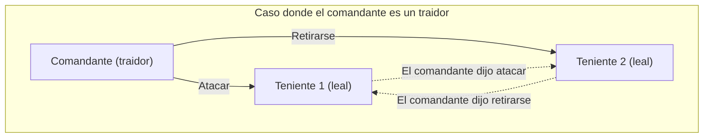
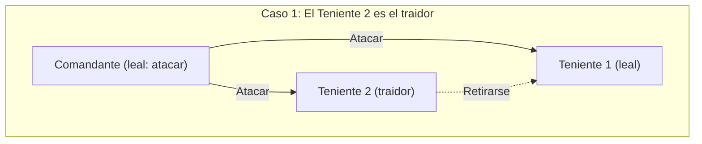
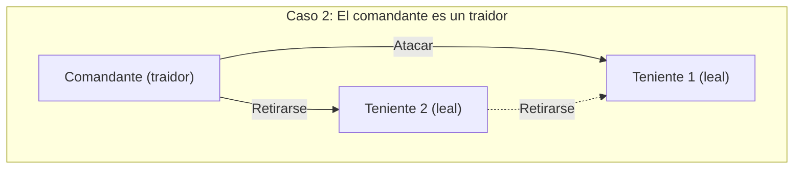
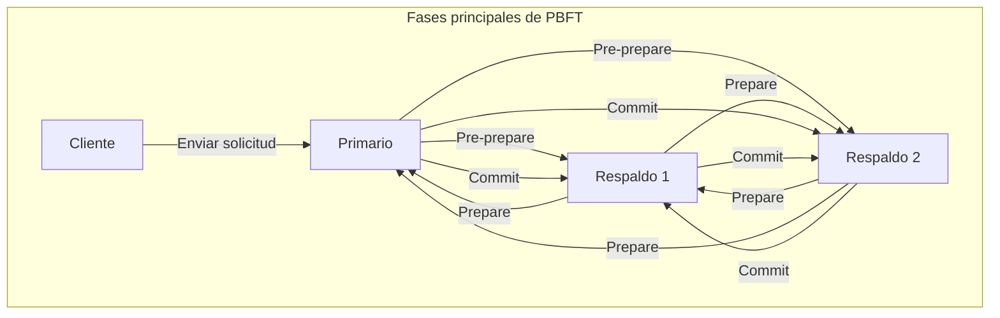

Al estudiar sistemas distribuidos o tecnología blockchain, invariablemente nos encontramos con el **[Problema de los generales bizantinos](https://kenji.blog/p/byzantine-generals-problem/)** (Byzantine Generals Problem). Este aborda un tema crucial: ¿cómo logra el sistema en su conjunto alcanzar un consenso correcto en una situación donde existen "traidores" o "nodos defectuosos" en la red?

En este artículo, explicaremos detalladamente este **[Problema de los generales bizantinos](https://kenji.blog/p/byzantine-generals-problem/)**, desde sus fundamentos hasta sus aplicaciones, utilizando una historia concreta, fórmulas matemáticas y diagramas.

## 1. ¿Qué es el problema de los generales bizantinos?

El problema de los generales bizantinos es un experimento mental sobre el consenso en la computación distribuida, propuesto en 1982 por Leslie Lamport y otros.

### Ejemplo concreto: Los generales del Imperio Bizantino

Este problema se plantea bajo el escenario de que el ejército del Imperio Bizantino asedia una ciudad enemiga. El ejército está dividido en varios batallones, y cada batallón es comandado por un general. Los generales solo pueden comunicarse entre sí a través de mensajeros.

Su objetivo es llegar a un **consenso unánime** sobre alguna de las siguientes acciones:

* **Atacar** (Attack)
* **Retirarse** (Retreat)

Si todos atacan al mismo tiempo, podrán hacer caer la ciudad, pero si solo una parte de los batallones ataca, serán derrotados. Por lo tanto, todos deben tomar la misma acción.

Sin embargo, aquí hay un gran problema. Es posible que haya **traidores** infiltrados entre los generales. Un general traidor enviará mensajes falsos intencionadamente para confundir a los generales leales y hacerles tomar la acción equivocada.

El siguiente diagrama es un modelo simple donde el comandante es un traidor.

En esta situación, el Teniente 1 (副官1) recibirá información contradictoria: "El comandante dice atacar, pero el Teniente 2 dice retirarse", lo que le impedirá tomar una decisión correcta.

De esta manera, el **[Problema de los generales bizantinos](https://kenji.blog/p/byzantine-generals-problem/)** plantea la pregunta: "¿Cómo pueden los nodos normales llegar a una conclusión idéntica en una red donde los nodos maliciosos pueden enviar información falsa arbitrariamente?".

## 2. Condiciones estrictas para el consenso

En este problema, para que el sistema en su conjunto llegue a un acuerdo, se deben cumplir las siguientes dos condiciones (Condiciones de consistencia interactiva):

1. Todos los tenientes leales deben obedecer la misma orden.
2. Si el comandante es leal, todos los tenientes leales deben obedecer la orden emitida por el comandante.

### Algoritmo de mensajes orales (Oral Messages Algorithm)

Lamport y su equipo demostraron matemáticamente las condiciones para formar consenso bajo el modelo de "mensajes orales", con la premisa de que los mensajes comunicados pueden ser alterados (no se puede probar quién los envió).

La conclusión es que, si el número de traidores es $m$, debe haber al menos **$3m + 1$** generales (nodos) en total para poder llegar a un acuerdo. Es decir, si el número total de nodos en la red es $n$, se debe cumplir la siguiente desigualdad:

$$
n \ge 3m + 1
$$

En otras palabras, la proporción de traidores en la red debe ser de **menos de 1/3** del total.

### ¿Por qué se necesitan 3m + 1?

Consideremos el caso donde el total de personas es $n = 3$, y entre ellos hay $m = 1$ traidor. En este caso, como no se cumple $n \ge 3(1) + 1 = 4$, el consenso es imposible. Verificaremos el porqué con diagramas.

**Caso 1: El comandante es leal y el Teniente 2 es el traidor**

En este momento, el Teniente 1 leal recibe el mensaje "Atacar" del comandante y "Retirarse" del Teniente 2.

**Caso 2: El comandante es un traidor y los tenientes son leales**

En este momento también, el Teniente 1 leal recibe el mensaje "Atacar" del comandante y "Retirarse" del Teniente 2.

Desde el punto de vista del Teniente 1, **la combinación de información recibida es exactamente la misma** en el Caso 1 y en el Caso 2. El Teniente 1 no tiene forma de distinguir si el comandante está mintiendo o si es el Teniente 2 quien miente. Por lo tanto, es imposible formar un consenso seguro.

## 3. Algoritmos que ofrecen soluciones

¿Qué clase de algoritmo es necesario para resolver el problema de los generales bizantinos y formar consenso?

### Algoritmo recursivo de mensajes orales

Como se mencionó anteriormente, si se cumple que $n \ge 3m + 1$, es posible llegar a un acuerdo utilizando un algoritmo recursivo. Por ejemplo, en el caso de $n=4, m=1$, se siguen los siguientes pasos:

1. El comandante envía una orden a cada teniente.
2. Cada teniente reenvía la orden recibida a todos los demás tenientes.
3. Cada teniente toma su decisión final por mayoría basándose en todos los mensajes dirigidos a él (incluyendo la orden directa del comandante).

Incluso si 1 de las 4 personas es un traidor, la información correcta proveniente de los 2 tenientes leales restantes constituye una mayoría (2 de 3 votos), lo que permite llegar a un consenso correcto.

### Algoritmo de mensajes firmados

¿Qué pasaría si los mensajes enviados llevaran una "firma digital infalsificable", de modo que **se pudiera probar de manera concluyente quién emitió el mensaje**?

En este modelo, es imposible alterar las órdenes emitidas por el comandante durante su trayecto. Como resultado, sin importar cuántos traidores haya, se ha demostrado que es posible llegar a un acuerdo si hay $n \ge m + 2$ generales (es decir, al menos 3 personas en total) para $m$ traidores. En los sistemas modernos, las firmas digitales mediante criptografía de clave pública cumplen esta función.

## 4. Blockchain y la Tolerancia a Fallas Bizantinas

La resistencia al problema de los generales bizantinos se llama **Tolerancia a Fallas Bizantinas** (Byzantine Fault Tolerance, BFT). Es un indicador crucial para que un sistema distribuido pueda soportar fallas y ataques maliciosos y seguir operando con normalidad.

Recientemente, este problema ha vuelto a acaparar gran atención debido a la aparición de la **tecnología Blockchain**. Dado que Blockchain es una red P2P sin administrador central, los participantes malintencionados (nodos) podrían difundir historiales de transacciones falsos. Es exactamente el problema de los generales bizantinos.

### El mecanismo de PBFT (Practical Byzantine Fault Tolerance)

El algoritmo PBFT, propuesto en 1999 por Miguel Castro y otros, logra la tolerancia a fallas bizantinas de manera eficiente en redes asincrónicas reales.

En PBFT, el proceso de consenso se divide principalmente en las siguientes tres fases.

Al pasar por este proceso, incluso si hay $m$ nodos defectuosos o maliciosos en la red, siempre que el número total de nodos cumpla $n \ge 3m + 1$, las solicitudes se pueden procesar en el orden correcto. PBFT no es adecuado para redes a gran escala como las cadenas públicas porque el volumen de comunicación entre componentes aumenta proporcionalmente al cuadrado del número de nodos, pero se utiliza ampliamente en blockchains tipo consorcio con un número limitado de nodos (como Hyperledger Fabric, por ejemplo), ya que proporciona un consenso extremadamente rápido y determinista.

### Consenso de Nakamoto (Proof of Work)

Satoshi Nakamoto, el creador de Bitcoin, abordó este problema con un enfoque completamente nuevo. Este es el **Consenso de Nakamoto**, que combina el **Proof of Work** (Prueba de Trabajo, PoW) y la regla de considerar válida la cadena más larga.

En el Consenso de Nakamoto, solo el ganador de una competencia de cálculo matemático (minería) obtiene el derecho de proponer bloques. Para hacer que la red reconozca información falsa, sería necesario dominar la mayoría (más del 51%) de la capacidad de cálculo de toda la red, un diseño extremadamente difícil en la práctica. Por ello, se evalúa que resolvió de manera probabilística el problema de los generales bizantinos en una red abierta en la que participa un gran número de personas no identificadas.

### Aplicación de BFT en PoS (Proof of Stake)

El Consenso de Nakamoto fue revolucionario, pero tenía el problema de que la minería consumía una enorme cantidad de energía. Para solucionar esto surgió el **Proof of Stake** (Prueba de Participación, PoS), que otorga el derecho a proponer bloques en proporción a la cantidad de criptomonedas (participación o stake) en poder de los nodos.

Muchos de los algoritmos PoS más recientes, como Casper de Ethereum o Tendermint de Cosmos, están diseñados sobre la base de esta BFT. Por ejemplo, Tendermint refina aún más la idea del mencionado PBFT, formando consenso en una red de "validadores" que incorporan ponderación por cantidad de participación (stake). Está diseñado de tal manera que el siguiente bloque no se genera si no se reúnen las firmas de al menos 2/3 de los validadores, lo que constituye un excelente ejemplo de la aplicación de la condición $n \ge 3m + 1$ (menos de un 1/3 de traidores) en las blockchains públicas modernas.

## 5. Modelado matemático y aplicaciones de BFT

En el diseño de sistemas distribuidos más avanzados, las transiciones de estado del sistema se definen rigurosamente y se demuestra la corrección de los algoritmos BFT.

Por ejemplo, sea $\mathcal{N} = \{1, 2, \dots, n\}$ el conjunto de nodos y $f$ el número máximo de nodos traidores. En una ronda $r$, cada nodo $i$ mantiene el estado $s_i^{(r)}$ e intercambia mensajes con los demás nodos.

Si la función de actualización de estado es $\delta$, el estado de la siguiente ronda se expresa de la siguiente manera:

$$
s_i^{(r+1)} = \delta(s_i^{(r)}, M_i^{(r)})
$$

Aquí, $M_i^{(r)}$ es el conjunto de mensajes recibidos por el nodo $i$ en la ronda $r$. Un algoritmo BFT no es otra cosa que diseñar la función $\delta$ y el protocolo de comunicación de tal manera que garantice que, incluso si un nodo defectuoso envía mensajes fraudulentos arbitrarios, para todos los nodos normales $j, k$, la diferencia de estado desaparecerá a medida que avancen las rondas (convergerán al mismo estado). Expresado matemáticamente sería así:

$$
\lim_{r \to \infty} (s_j^{(r)} - s_k^{(r)}) = 0
$$

## 6. Conclusión

Este **[Problema de los generales bizantinos](https://kenji.blog/p/byzantine-generals-problem/)** es la teoría fundamental para garantizar la fiabilidad de los sistemas distribuidos. La cuestión de "cómo tomar la decisión correcta como un todo en un entorno donde no sabes en quién confiar" se aplica a toda la infraestructura de TI moderna, desde las tecnologías subyacentes de criptoactivos hasta los sistemas de control de aeronaves y el cloud computing.

La evolución de los algoritmos diseñados para que el sistema no se detenga, asumiendo la existencia de traidores, no se detendrá en el futuro. Para los ingenieros implicados en el diseño de sistemas distribuidos, la comprensión de las demostraciones matemáticas y los algoritmos que subyacen a este problema será, sin duda, un arma muy poderosa.
