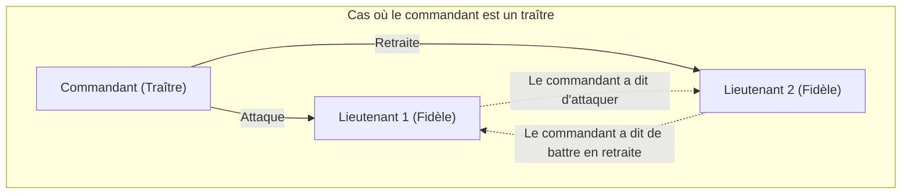
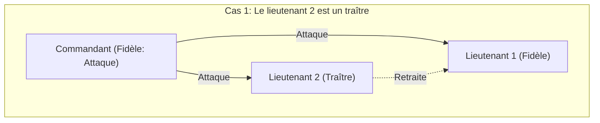
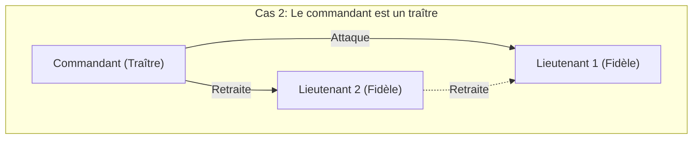
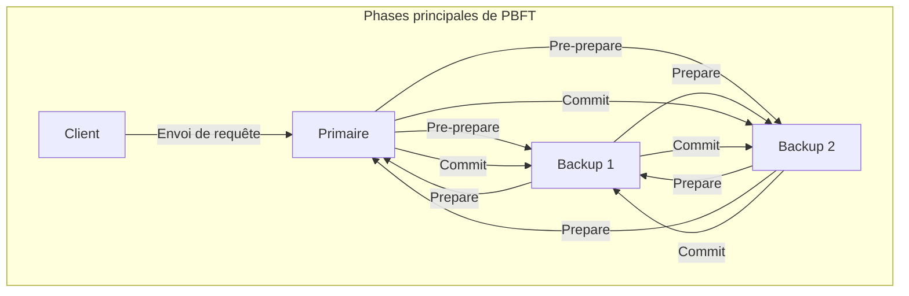

Lorsque l'on étudie les systèmes distribués et la technologie blockchain, on est presque inévitablement confronté au **problème des généraux byzantins** (Byzantine Generals Problem). Ce problème traite d'un thème crucial : comment un système global parvient-il à former un consensus correct lorsqu'il y a des « traîtres » ou des « nœuds défaillants » au sein du réseau ?

Dans cet article, nous allons expliquer en détail ce **problème des généraux byzantins**, de ses concepts de base à ses applications, en utilisant des histoires concrètes, des formules mathématiques et des schémas.

## 1. Qu'est-ce que le problème des généraux byzantins ?

Le problème des généraux byzantins est une expérience de pensée sur la formation du consensus dans l'informatique distribuée, introduite en 1982 par Leslie Lamport et ses collègues.

### Un exemple concret : Les généraux de l'Empire byzantin

Ce problème prend pour cadre une armée de l'Empire byzantin assiégeant une ville ennemie. L'armée est divisée en plusieurs troupes, chacune dirigée par un général. Les généraux ne peuvent communiquer entre eux que par l'intermédiaire de messagers.

Leur objectif est de parvenir à un **consensus unanime** sur l'une des actions suivantes :

* **Attaque** (Attack)
* **Retraite** (Retreat)

Si tous attaquent en même temps, ils peuvent faire tomber la ville ; mais si seulement une partie des troupes attaque, ils perdront. Par conséquent, ils doivent tous adopter la même stratégie.

Cependant, un problème majeur se pose. Il est possible que des **traîtres** se soient infiltrés parmi les généraux. Un général traître essaiera délibérément d'envoyer de faux messages pour semer la confusion parmi les généraux fidèles et les amener à prendre la mauvaise décision.

Le diagramme suivant montre un modèle simple où le commandant est un traître.

Dans cette situation, le lieutenant 1 reçoit des informations contradictoires : « Le commandant dit d'attaquer, mais le lieutenant 2 dit de battre en retraite ». Il ne peut plus prendre de décision correcte.

Ainsi, le **problème des généraux byzantins** pose la question suivante : « Comment des nœuds sains peuvent-ils parvenir à la même conclusion dans un réseau où des nœuds malveillants peuvent diffuser n'importe quelles fausses informations ? »

## 2. Conditions strictes pour la formation du consensus

Pour parvenir à un consensus global dans ce problème, les deux conditions suivantes (conditions de cohérence interactive) doivent être remplies :

1. Tous les lieutenants fidèles doivent obéir au même ordre.
2. Si le commandant est fidèle, tous les lieutenants fidèles doivent obéir à l'ordre donné par le commandant.

### Algorithme de messages oraux (Oral Messages Algorithm)

Lamport et son équipe ont prouvé mathématiquement les conditions permettant de former un consensus dans un modèle de « messages oraux », où les messages communiqués peuvent être falsifiés (il est impossible de prouver l'identité de l'expéditeur).

En conclusion, si le nombre de traîtres est $m$, il faut au moins **$3m + 1$** généraux (nœuds) au total pour pouvoir former un consensus. En d'autres termes, si le nombre total de nœuds du réseau est $n$, l'inégalité suivante doit être vérifiée :

$$
n \ge 3m + 1
$$

Autrement dit, la proportion de traîtres dans le réseau doit être **inférieure à 1/3** du total.

### Pourquoi 3m + 1 sont-ils nécessaires ?

Imaginons le cas où le nombre total est $n = 3$, et qu'il y a $m = 1$ traître parmi eux. Dans ce cas, $n \ge 3(1) + 1 = 4$ n'est pas satisfait, le consensus est donc impossible. Vérifions pourquoi avec des schémas.

**Cas 1 : Le commandant est fidèle, le lieutenant 2 est un traître**

À ce moment-là, le lieutenant fidèle 1 reçoit un message « Attaque » du commandant et un message « Retraite » du lieutenant 2.

**Cas 2 : Le commandant est un traître, les lieutenants sont fidèles**

Dans ce cas également, le lieutenant fidèle 1 reçoit le message « Attaque » du commandant et le message « Retraite » du lieutenant 2.

Du point de vue du lieutenant 1, **la combinaison des informations reçues est exactement la même** dans le Cas 1 et dans le Cas 2. Le lieutenant 1 n'a aucun moyen de savoir si c'est le commandant ou le lieutenant 2 qui ment. Par conséquent, il est impossible d'établir un consensus fiable.

## 3. Algorithmes comme solutions

Quels algorithmes sont nécessaires pour résoudre le problème des généraux byzantins et former un consensus ?

### Algorithme de messages oraux récursif

Comme mentionné précédemment, si $n \ge 3m + 1$ est satisfait, le consensus est possible grâce à un algorithme récursif. Par exemple, si $n=4$ et $m=1$, on suit ces étapes :

1. Le commandant envoie son ordre à chaque lieutenant.
2. Chaque lieutenant transmet l'ordre reçu à tous les autres lieutenants.
3. Chaque lieutenant décide de son action finale par un vote majoritaire basé sur tous les messages qui lui sont parvenus (y compris l'ordre direct du commandant).

Même si 1 personne sur 4 est un traître, les informations correctes provenant des 2 lieutenants restants fidèles constituent la majorité (2 voix sur 3), ce qui permet d'atteindre le bon consensus par le vote majoritaire.

### Algorithme de messages signés

Et si le message envoyé contenait une « signature numérique infalsifiable » garantissant **une preuve absolue de l'identité de l'expéditeur** ?

Dans ce modèle, l'ordre émis par le commandant ne peut pas être altéré en cours de route. Par conséquent, quel que soit le nombre de traîtres, il est prouvé qu'un consensus peut être formé tant que le nombre total de généraux est $n \ge m + 2$ pour $m$ traîtres (soit au moins 3 personnes au total). Dans les systèmes modernes, les signatures numériques utilisant la cryptographie à clé publique jouent ce rôle.

## 4. Blockchain et Tolérance aux pannes byzantines

La résistance au problème des généraux byzantins est appelée la **Tolérance aux pannes byzantines** (Byzantine Fault Tolerance, BFT). Il s'agit d'un indicateur clé permettant à un système distribué de continuer à fonctionner normalement même face à des pannes ou des attaques malveillantes.

Ces dernières années, ce problème est revenu sur le devant de la scène grâce à l'apparition de la **technologie blockchain**. La blockchain étant un réseau P2P sans autorité centrale, des participants malveillants (nœuds) peuvent diffuser de faux historiques de transactions. Il s'agit précisément du problème des généraux byzantins.

### Le mécanisme de PBFT (Practical Byzantine Fault Tolerance)

Le PBFT, proposé en 1999 par Miguel Castro et ses collègues, est un algorithme qui réalise efficacement la BFT dans les réseaux asynchrones réels.

Le PBFT divise le processus de formation du consensus principalement en trois phases.

Grâce à ce processus, même s'il y a $m$ nœuds défaillants ou malveillants dans le réseau, les requêtes peuvent être traitées dans le bon ordre à condition que le nombre total de nœuds remplisse la condition $n \ge 3m + 1$. Le volume de communication entre les composants du PBFT augmente proportionnellement au carré du nombre de nœuds, ce qui le rend inadapté aux réseaux à grande échelle comme les blockchains publiques. Cependant, il est largement utilisé dans les blockchains de consortium où le nombre de nœuds est limité (par exemple Hyperledger Fabric) en raison de sa rapidité et du consensus déterministe qu'il offre.

### Consensus de Nakamoto (Proof of Work)

Satoshi Nakamoto, le créateur de Bitcoin, a abordé ce problème avec une approche complètement différente. Il s'agit du **Proof of Work** (PoW) associé à la règle selon laquelle la chaîne la plus longue est considérée comme la bonne, formant ainsi le **Consensus de Nakamoto**.

Dans le Consensus de Nakamoto, seul celui qui remporte la compétition de calcul mathématique (minage) gagne le droit de proposer un bloc. Pour forcer le réseau à accepter de fausses informations, il faudrait contrôler la majorité de la puissance de calcul (plus de 51%) du réseau, ce qui est extrêmement difficile dans la réalité. C'est pourquoi on considère que cette approche résout le problème des généraux byzantins d'un point de vue probabiliste dans un réseau ouvert comptant de très nombreux participants.

### Application de BFT au PoS (Proof of Stake)

Si le Consensus de Nakamoto était révolutionnaire, il présentait néanmoins le problème de consommer d'énormes quantités d'électricité pour le minage. Pour y remédier, on a développé le **Proof of Stake** (PoS), qui accorde le droit de proposer des blocs en fonction du montant d'actifs cryptographiques (mise ou "stake") détenu par les nœuds.

De nombreux algorithmes PoS récents, tels que Casper pour Ethereum ou Tendermint pour Cosmos, sont conçus sur la base de cette BFT. Par exemple, Tendermint perfectionne le concept du PBFT vu précédemment et forme un consensus au sein d'un réseau de « validateurs » qui utilise un système de pondération basé sur la mise (stake). Ce mécanisme empêche la génération du bloc suivant si plus des 2/3 des signatures des validateurs ne sont pas collectées, ce qui est un excellent exemple de l'application de la condition $n \ge 3m + 1$ (les traîtres représentant moins d'1/3) dans les chaînes publiques modernes.

## 5. Modélisation mathématique et applications de la BFT

Dans la conception de systèmes distribués plus avancés, les transitions d'état du système sont définies de manière stricte afin de prouver la validité de l'algorithme BFT.

Par exemple, supposons que l'ensemble des nœuds soit $\mathcal{N} = \{1, 2, \dots, n\}$ et que le nombre maximum de nœuds traîtres soit $f$. Lors d'un round $r$, chaque nœud $i$ maintient un état $s_i^{(r)}$ et échange des messages avec les autres nœuds.

Si la fonction de mise à jour de l'état est $\delta$, l'état du round suivant s'exprime comme suit :

$$
s_i^{(r+1)} = \delta(s_i^{(r)}, M_i^{(r)})
$$

Ici, $M_i^{(r)}$ est l'ensemble des messages reçus par le nœud $i$ lors du round $r$. Un algorithme BFT consiste tout simplement à concevoir la fonction $\delta$ et le protocole de communication de telle manière que, même si un nœud défaillant envoie des messages malveillants arbitraires, la différence d'état entre tous les nœuds normaux $j, k$ disparaisse au fur et à mesure que les rounds avancent (ils convergent vers le même état). Mathématiquement, cela donne :

$$
\lim_{r \to \infty} (s_j^{(r)} - s_k^{(r)}) = 0
$$

## 6. Conclusion

Le **problème des généraux byzantins** est la théorie fondamentale qui garantit la fiabilité des systèmes distribués. La question « Comment prendre des décisions collectives correctes dans un environnement où l'on ne sait pas à qui faire confiance ? » est aujourd'hui appliquée dans toutes les infrastructures informatiques modernes, des fondations technologiques des crypto-monnaies aux systèmes de contrôle des avions et au cloud computing.

En supposant l'existence de traîtres, l'évolution des algorithmes conçus pour empêcher l'arrêt des systèmes ne s'arrêtera jamais. Pour les ingénieurs impliqués dans la conception de systèmes distribués, comprendre les preuves mathématiques et les algorithmes sous-jacents à ce problème sera une arme redoutable.
