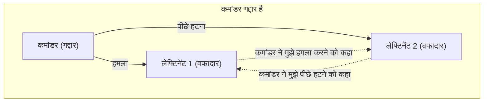
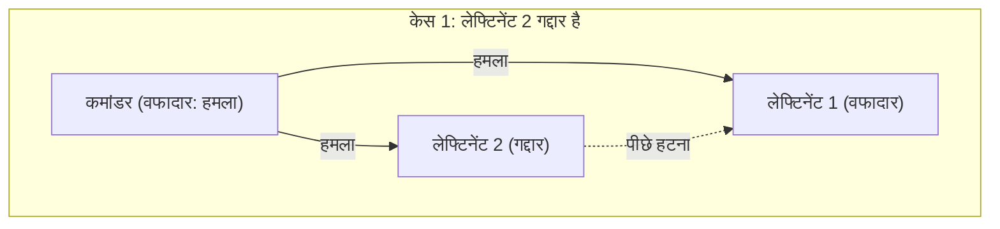
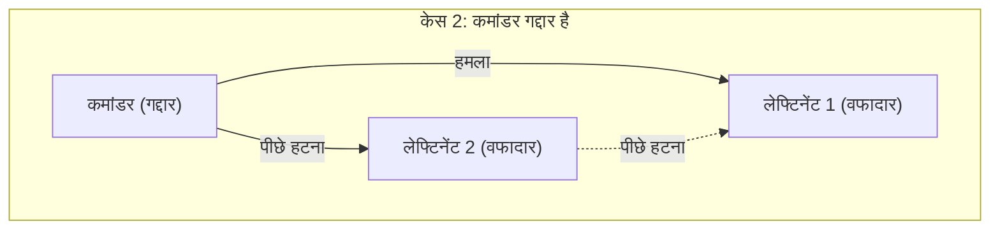
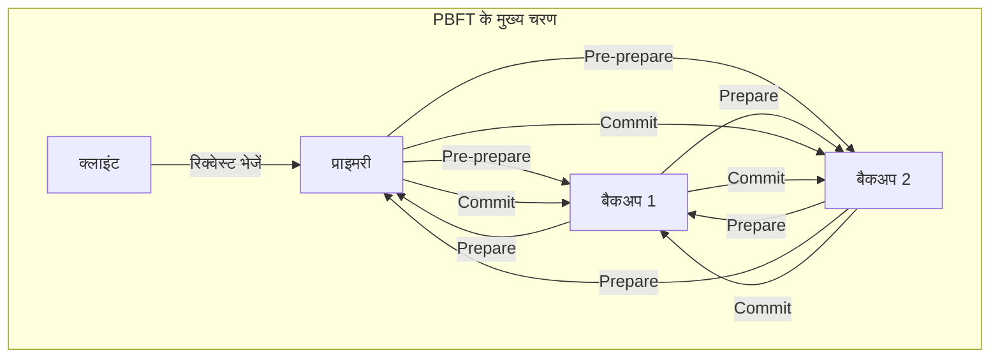

वितरित प्रणालियों (distributed systems) और ब्लॉकचेन प्रौद्योगिकी के बारे में सीखते समय, आपका लगभग हमेशा **[बीजान्टिन जनरल्स प्रॉब्लम](https://kenji.blog/p/byzantine-generals-problem/)** (Byzantine Generals Problem) से सामना होगा। यह एक अत्यंत महत्वपूर्ण विषय से संबंधित है: जब नेटवर्क में "गद्दार" या "दोषपूर्ण नोड्स" मौजूद हों तो एक प्रणाली समग्र रूप से सही सहमति कैसे बना सकती है।

इस लेख में, हम **[बीजान्टिन जनरल्स प्रॉब्लम](https://kenji.blog/p/byzantine-generals-problem/)** को विशिष्ट कहानियों, गणितीय शर्तों और आरेखों के साथ बुनियादी बातों से लेकर उन्नत अनुप्रयोगों तक विस्तार से समझाएंगे।

## 1. [बीजान्टिन जनरल्स प्रॉब्लम](https://kenji.blog/p/byzantine-generals-problem/) क्या है?

[बीजान्टिन जनरल्स प्रॉब्लम](https://kenji.blog/p/byzantine-generals-problem/) 1982 में लेस्ली लैम्पोर्ट (Leslie Lamport) और अन्य लोगों द्वारा प्रस्तावित वितरित कंप्यूटिंग में सहमति निर्माण में एक विचार प्रयोग है।

### विशिष्ट उदाहरण: बीजान्टिन साम्राज्य के सेनापति

यह समस्या इस सेटिंग के साथ बताई गई है कि बीजान्टिन साम्राज्य की सेना एक दुश्मन शहर को घेर रही है। सेना को कई इकाइयों में विभाजित किया गया है, जिनमें से प्रत्येक की कमान एक जनरल (सेनापति) के हाथ में है। सेनापति एक-दूसरे से केवल संदेशवाहकों के माध्यम से ही संवाद कर सकते हैं।

उनका लक्ष्य निम्नलिखित में से किसी एक कार्रवाई पर **सर्वसम्मत सहमति** प्राप्त करना है।

* **हमला** (Attack)
* **पीछे हटना** (Retreat)

यदि हर कोई एक ही समय पर हमला करता है, तो वे शहर पर कब्जा कर सकते हैं, लेकिन अगर केवल कुछ इकाइयां ही हमला करती हैं, तो वे हार जाएंगे। इसलिए सभी को एक जैसी ही कार्रवाई करनी होगी।

हालाँकि, यहाँ एक बड़ी समस्या है। इस बात की संभावना है कि जनरलों में **गद्दार** छिपे हुए हों। गद्दार सेनापति जानबूझकर वफादार जनरलों को भ्रमित करने और उन्हें गलत कार्रवाई करने के लिए प्रेरित करने के लिए झूठे संदेश भेजते हैं।

नीचे दिया गया आरेख एक सरल मॉडल है जहां कमांडर गद्दार है।

इस स्थिति में, लेफ्टिनेंट 1 को विरोधाभासी जानकारी मिलती है कि "कमांडर ने हमला करने के लिए कहा है, लेकिन लेफ्टिनेंट 2 कहता है कि वह पीछे हटने के लिए कह रहा है", जिससे सही निर्णय लेना असंभव हो जाता है।

इस प्रकार, **[बीजान्टिन जनरल्स प्रॉब्लम](https://kenji.blog/p/byzantine-generals-problem/)** यह सवाल पूछती है कि "एक ऐसे नेटवर्क में जहां दुर्भावनापूर्ण नोड्स मनमानी झूठी जानकारी फैला सकते हैं, सामान्य नोड्स एक ही निष्कर्ष पर कैसे पहुंच सकते हैं?"

## 2. सहमति निर्माण के लिए सख्त शर्तें

इस समस्या में पूरी प्रणाली को एक समझौते तक पहुँचने के लिए, निम्नलिखित दो शर्तों (इंटरैक्टिव कंसिस्टेंसी शर्तें) को पूरा किया जाना चाहिए।

1. सभी वफादार लेफ्टिनेंटों को एक ही आदेश का पालन करना चाहिए।
2. यदि कमांडर वफादार है, तो सभी वफादार लेफ्टिनेंटों को कमांडर के आदेश का पालन करना चाहिए।

### मौखिक संदेश एल्गोरिदम (Oral Messages Algorithm)

लैम्पोर्ट और उनके सहयोगियों ने इस धारणा पर "मौखिक संदेश" मॉडल में सर्वसम्मति बनाने के लिए गणितीय रूप से शर्तों को साबित किया कि प्रेषित संदेशों में बदलाव किया जा सकता है (यह साबित नहीं किया जा सकता है कि उन्हें किसने भेजा)।

निष्कर्ष निकालने के लिए, यदि गद्दारों की संख्या $m$ है, तो जब तक कुल मिलाकर कम से कम **$3m + 1$** जनरल (नोड्स) न हों, तब तक कोई समझौता नहीं किया जा सकता है। दूसरे शब्दों में, यदि पूरे नेटवर्क में नोड्स की कुल संख्या $n$ है, तो निम्नलिखित असमानता सही होनी चाहिए।

$$
n \ge 3m + 1
$$

दूसरे शब्दों में कहें तो, नेटवर्क में गद्दारों का अनुपात कुल का **1/3 से कम** होना चाहिए।

### 3m + 1 की आवश्यकता क्यों है?

एक ऐसे मामले पर विचार करें जहां कुल $n = 3$ लोग हैं, और उनके बीच $m = 1$ गद्दार है। इस मामले में, $n \ge 3(1) + 1 = 4$ संतुष्ट नहीं है, इसलिए सहमति असंभव है। आइए एक आरेख के साथ कारण की पुष्टि करें।

**केस 1: कमांडर वफादार है और लेफ्टिनेंट 2 गद्दार है**

इस समय, वफादार लेफ्टिनेंट 1 को कमांडर से "हमला" संदेश और लेफ्टिनेंट 2 से "पीछे हटना" संदेश मिलता है।

**केस 2: कमांडर गद्दार है और लेफ्टिनेंट वफादार हैं**

इस समय भी, वफादार लेफ्टिनेंट 1 को कमांडर से "हमला" संदेश और लेफ्टिनेंट 2 से "पीछे हटना" संदेश मिलता है।

लेफ्टिनेंट 1 के दृष्टिकोण से, केस 1 और केस 2 में **प्राप्त जानकारी का संयोजन बिल्कुल समान है**। लेफ्टिनेंट 1 के पास यह बताने का कोई तरीका नहीं है कि कमांडर झूठ बोल रहा है या लेफ्टिनेंट 2 झूठ बोल रहा है। इसलिए एक निश्चित सर्वसम्मति बनाना असंभव है।

## 3. एल्गोरिदम जो समाधान हैं

[बीजान्टिन जनरल्स प्रॉब्लम](https://kenji.blog/p/byzantine-generals-problem/) को हल करने और सहमति बनाने के लिए किस तरह के एल्गोरिदम की आवश्यकता है?

### रिकर्सिव मौखिक संदेश एल्गोरिदम

जैसा कि ऊपर उल्लेख किया गया है, यदि $n \ge 3m + 1$ संतुष्ट है, तो रिकर्सिव एल्गोरिदम (recursive algorithm) का उपयोग करके सर्वसम्मति प्राप्त की जा सकती है। उदाहरण के लिए, यदि $n=4, m=1$ है, तो निम्नलिखित कदम उठाए जाते हैं।

1. कमांडर प्रत्येक लेफ्टिनेंट को आदेश भेजता है।
2. प्रत्येक लेफ्टिनेंट प्राप्त आदेशों को अन्य सभी लेफ्टिनेंटों को भेजता है।
3. प्रत्येक लेफ्टिनेंट खुद को भेजे गए सभी संदेशों (कमांडर से सीधे आदेशों सहित) के आधार पर बहुमत वोट (majority vote) द्वारा अंतिम कार्रवाई तय करता है।

भले ही 4 में से 1 व्यक्ति गद्दार हो, बहुमत (3 में से 2 वोट) शेष 2 वफादार लेफ्टिनेंटों से सही जानकारी से बना होगा, इसलिए बहुमत वोट से एक सही समझौता किया जा सकता है।

### हस्ताक्षरित संदेश एल्गोरिदम

क्या होगा यदि भेजे गए संदेश में एक "अपरिवर्तनीय डिजिटल हस्ताक्षर (unforgeable digital signature)" जुड़ा हो, ताकि यह **निश्चित रूप से साबित हो सके कि संदेश किसने भेजा है**?

इस मॉडल में, कमांडर के आदेशों को रास्ते में बदलना असंभव हो जाता है। परिणामस्वरूप, यह सिद्ध हो गया है कि चाहे कितने भी गद्दार हों, यदि $m$ गद्दारों के लिए $n \ge m + 2$ (अर्थात कम से कम 3) जनरल हैं, तो एक समझौता किया जा सकता है। आधुनिक प्रणालियों में, सार्वजनिक कुंजी क्रिप्टोग्राफी का उपयोग करने वाले डिजिटल हस्ताक्षर (digital signatures) यह भूमिका निभाते हैं।

## 4. ब्लॉकचेन और बीजान्टिन फॉल्ट टॉलरेंस

[बीजान्टिन जनरल्स प्रॉब्लम](https://kenji.blog/p/byzantine-generals-problem/) के प्रतिरोध को **बीजान्टिन फॉल्ट टॉलरेंस** (Byzantine Fault Tolerance, BFT) कहा जाता है। वितरित प्रणालियों के लिए विफलताओं या दुर्भावनापूर्ण हमलों का सामना करने और सामान्य रूप से काम करना जारी रखने के लिए यह एक महत्वपूर्ण मीट्रिक है।

हाल के वर्षों में, **ब्लॉकचेन प्रौद्योगिकी** के उद्भव के कारण इस समस्या पर एक बार फिर बहुत ध्यान आकर्षित हुआ है। चूंकि ब्लॉकचेन एक P2P नेटवर्क है जिसका कोई केंद्रीय व्यवस्थापक नहीं है, इसलिए दुर्भावनापूर्ण प्रतिभागी (नोड्स) झूठे लेनदेन का इतिहास फैला सकते हैं। यह बिल्कुल [बीजान्टिन जनरल्स प्रॉब्लम](https://kenji.blog/p/byzantine-generals-problem/) है।

### PBFT (Practical Byzantine Fault Tolerance) कैसे काम करता है

1999 में मिगुएल कास्त्रो (Miguel Castro) और अन्य लोगों द्वारा प्रस्तावित PBFT एक ऐसा एल्गोरिदम है जो वास्तविक दुनिया के अतुल्यकालिक (asynchronous) नेटवर्क में BFT को कुशलतापूर्वक महसूस करता है।

PBFT में, सर्वसम्मति निर्माण प्रक्रिया मुख्य रूप से निम्नलिखित तीन चरणों में विभाजित है।

इस प्रक्रिया से गुजरने से, भले ही नेटवर्क में $m$ दोषपूर्ण/दुर्भावनापूर्ण नोड्स हों, जब तक कुल नोड्स की संख्या $n \ge 3m + 1$ संतुष्ट करती है, अनुरोधों को सही क्रम में संसाधित किया जा सकता है। PBFT सार्वजनिक श्रृंखलाओं जैसे बड़े पैमाने के नेटवर्क के लिए उपयुक्त नहीं है क्योंकि घटकों के बीच संचार की मात्रा नोड्स की संख्या के वर्ग के अनुपात में बढ़ जाती है, लेकिन यह हाइपरलेजर फैब्रिक (Hyperledger Fabric) जैसे कंसोर्टियम-प्रकार के ब्लॉकचेन के लिए बहुत उपयोगी है जहां नोड्स की संख्या सीमित है। यह बहुत तेज़ और निश्चित सर्वसम्मति प्रदान करता है इसलिए इसका व्यापक रूप से उपयोग किया जाता है।

### नाकामोतो सर्वसम्मति (Proof of Work)

बिटकॉइन के निर्माता सातोशी नाकामोतो (Satoshi Nakamoto) ने पूरी तरह से नए दृष्टिकोण से इस समस्या का समाधान किया। यह **Proof of Work** (PoW) और **नाकामोतो सर्वसम्मति** है जो सबसे लंबी श्रृंखला (chain) को सही मानने के नियम को जोड़ती है।

नाकामोतो सर्वसम्मति में, केवल वे लोग जो गणितीय गणना प्रतियोगिता (खनन / mining) जीतते हैं, उन्हें ब्लॉक प्रस्तावित करने का अधिकार मिलता है। नेटवर्क को झूठी जानकारी पहचानने के लिए, आपको संपूर्ण नेटवर्क की कंप्यूटिंग शक्ति (51% या अधिक) के बहुमत को नियंत्रित करने की आवश्यकता है, जो वास्तव में एक अत्यंत कठिन डिज़ाइन है। इसके परिणामस्वरूप, ऐसा माना जाता है कि इसने अनिर्दिष्ट संख्या में प्रतिभागियों के साथ खुले नेटवर्क में [बीजान्टिन जनरल्स प्रॉब्लम](https://kenji.blog/p/byzantine-generals-problem/) को संभाव्य (probabilistically) रूप से हल किया है।

### PoS (Proof of Stake) में BFT के अनुप्रयोग

नाकामोतो सर्वसम्मति एक सफलता थी, लेकिन इसमें खनन के लिए भारी मात्रा में बिजली की खपत करने की समस्या थी। इसे हल करने के लिए **Proof of Stake** (PoS) पेश किया गया था, जो नोड द्वारा धारित क्रिप्टो परिसंपत्तियों (स्टेक) की मात्रा के अनुसार ब्लॉक का प्रस्ताव करने का अधिकार देता है।

एथेरियम का कैस्पर (Casper) और कॉसमॉस (Cosmos) का टेंडरमिंट (Tendermint) सहित नवीनतम PoS एल्गोरिदम में से अधिकांश, इस BFT के आधार पर डिज़ाइन किए गए हैं। उदाहरण के लिए, टेंडरमिंट उपर्युक्त PBFT के विचार को परिष्कृत करता है और "सत्यापनकर्ताओं (Validators)" के एक नेटवर्क में सर्वसम्मति बनाता है जिसमें दांव (stake) की मात्रा के आधार पर भार शामिल होता है। यह सुनिश्चित करने के लिए डिज़ाइन किया गया है कि यदि सत्यापनकर्ताओं के 2/3 या अधिक हस्ताक्षर एकत्र नहीं किए जाते हैं तो अगला ब्लॉक उत्पन्न नहीं होता है, जो कि आधुनिक सार्वजनिक श्रृंखलाओं में $n \ge 3m + 1$ (1/3 से कम गद्दार) शर्त को साकार करने का एक आदर्श उदाहरण है।

## 5. BFT का गणितीय मॉडलिंग और अनुप्रयोग

अधिक उन्नत वितरित प्रणाली डिज़ाइन में, हम सिस्टम के राज्य संक्रमण (state transition) को सख्ती से परिभाषित करते हैं और BFT एल्गोरिदम की शुद्धता साबित करते हैं।

उदाहरण के लिए, मान लें कि नोड्स का सेट $\mathcal{N} = \{1, 2, \dots, n\}$ है, और गद्दार नोड्स की अधिकतम संख्या $f$ है। किसी निश्चित दौर $r$ में, प्रत्येक नोड $i$ एक स्थिति $s_i^{(r)}$ रखता है और अन्य नोड्स के साथ संदेशों का आदान-प्रदान करता है।

यदि राज्य अद्यतन फ़ंक्शन $\delta$ है, तो अगले दौर की स्थिति इस प्रकार व्यक्त की जाती है।

$$
s_i^{(r+1)} = \delta(s_i^{(r)}, M_i^{(r)})
$$

जहाँ, $M_i^{(r)}$ दौर $r$ में नोड $i$ द्वारा प्राप्त संदेशों का सेट है। BFT एल्गोरिथ्म फ़ंक्शन $\delta$ और संचार प्रोटोकॉल को डिज़ाइन करने के अलावा और कुछ नहीं है ताकि यह गारंटी दी जा सके कि भले ही एक दोषपूर्ण नोड कोई अमान्य संदेश भेजता है, सभी सामान्य नोड्स $j, k$ के लिए स्थिति में अंतर गायब हो जाएगा (समान स्थिति में परिवर्तित हो जाएगा) क्योंकि दौर आगे बढ़ता है। गणितीय रूप से, इसे इस प्रकार व्यक्त किया जा सकता है।

$$
\lim_{r \to \infty} (s_j^{(r)} - s_k^{(r)}) = 0
$$

## 6. निष्कर्ष

यह **[बीजान्टिन जनरल्स प्रॉब्लम](https://kenji.blog/p/byzantine-generals-problem/)** वितरित प्रणालियों की विश्वसनीयता सुनिश्चित करने के लिए मूलभूत सिद्धांत है। "हम समग्र रूप से सही निर्णय कैसे ले सकते हैं जब हम नहीं जानते कि किस पर भरोसा किया जाए?" यह प्रश्न आज के सभी आईटी बुनियादी ढांचे पर लागू होता है, क्रिप्टोक्यूरेंसी अंतर्निहित तकनीक से लेकर विमान नियंत्रण प्रणालियों और क्लाउड कंप्यूटिंग तक।

गद्दारों के अस्तित्व को मानते हुए भी सिस्टम को रुकने से रोकने के लिए एल्गोरिदम का विकास कभी नहीं रुकेगा। वितरित प्रणाली डिजाइन में शामिल इंजीनियरों के लिए, इस समस्या के पीछे गणितीय प्रमाण और एल्गोरिदम को समझना एक बहुत शक्तिशाली हथियार होगा।
