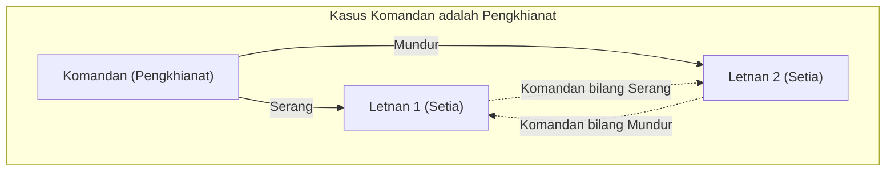
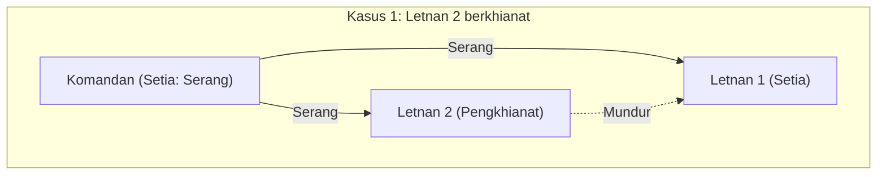
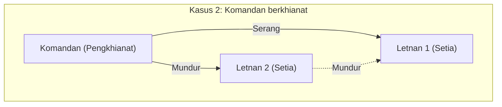
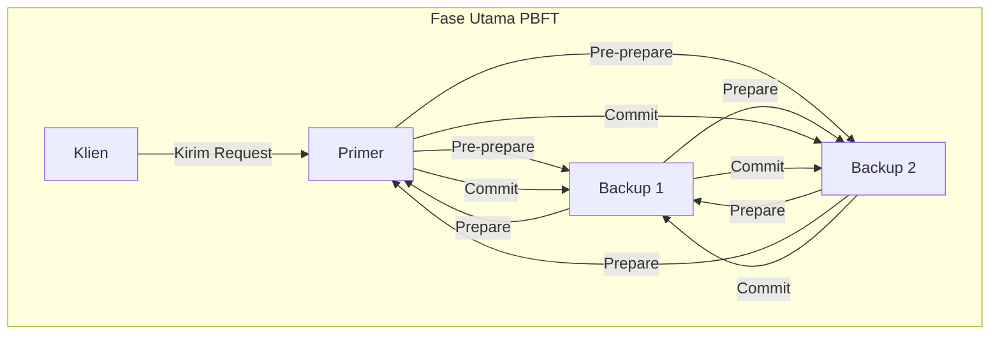

Dalam mempelajari sistem terdistribusi atau teknologi blockchain, kita hampir selalu dihadapkan pada **[Masalah Jenderal Bizantium](https://kenji.blog/id/p/byzantine-generals-problem/)** ([Byzantine Generals](https://kenji.blog/id/p/byzantine-generals-problem-consensus/) Problem). Masalah ini membahas tema yang sangat penting mengenai bagaimana sistem secara keseluruhan dapat membentuk kesepakatan yang benar dalam situasi di mana terdapat "pengkhianat" atau "node yang rusak" di dalam jaringan.

Dalam artikel ini, kami akan menjelaskan **[Masalah Jenderal Bizantium](https://kenji.blog/id/p/byzantine-generals-problem/)** secara rinci, mulai dari dasar hingga aplikasinya, disertai dengan cerita konkret, persamaan matematis, dan ilustrasi.

## 1. Apa itu [Masalah Jenderal Bizantium](https://kenji.blog/id/p/byzantine-generals-problem/)?

[Masalah Jenderal Bizantium](https://kenji.blog/id/p/byzantine-generals-problem/) adalah sebuah eksperimen pemikiran tentang pembentukan kesepakatan (konsensus) dalam komputasi terdistribusi, yang diajukan oleh Leslie Lamport dkk. pada tahun 1982.

### Contoh Konkret: Para Jenderal Kekaisaran Bizantium

Masalah ini diceritakan dengan latar belakang pasukan Kekaisaran Bizantium yang sedang mengepung kota musuh. Pasukan tersebut dibagi menjadi beberapa batalion, di mana setiap batalion dipimpin oleh seorang jenderal. Para jenderal hanya dapat bertukar pesan satu sama lain melalui utusan.

Tujuan mereka adalah mencapai **kesepakatan bulat bersama** mengenai salah satu dari tindakan berikut:

* **Serang** (Attack)
* **Mundur** (Retreat)

Jika semua menyerang pada saat yang bersamaan, mereka bisa menaklukkan kota tersebut, tetapi jika hanya sebagian batalion yang menyerang, mereka akan kalah. Oleh karena itu, semua harus mengambil tindakan yang sama.

Namun, ada masalah besar di sini. Ada kemungkinan terdapat **pengkhianat** di antara para jenderal. Jenderal yang berkhianat akan dengan sengaja mengirim pesan bohong untuk mengacaukan jenderal-jenderal yang setia agar mereka mengambil tindakan yang salah.

Gambar berikut adalah model sederhana ketika komandan adalah pengkhianat.

Dalam situasi ini, Letnan 1 menerima informasi yang kontradiktif, yaitu "Komandan mengatakan Serang, tetapi Letnan 2 mengatakan Mundur", sehingga ia tidak dapat membuat keputusan yang benar.

Dengan demikian, pertanyaan mengenai "bagaimana node-node yang normal dapat mencapai kesimpulan yang sama dalam sebuah jaringan di mana node yang jahat dapat menyebarkan informasi bohong apa pun secara bebas" adalah esensi dari **[Masalah Jenderal Bizantium](https://kenji.blog/id/p/byzantine-generals-problem/)**.

## 2. Kondisi Ketat untuk Mencapai Konsensus

Dalam masalah ini, agar sistem secara keseluruhan dapat mencapai kesepakatan, perlu memenuhi 2 kondisi berikut (Kondisi Konsistensi Interaktif):

1. Semua letnan yang setia harus mematuhi perintah yang sama.
2. Jika komandan setia, semua letnan yang setia harus mematuhi perintah yang dikeluarkan oleh komandan.

### Algoritma Pesan Lisan (Oral Messages Algorithm)

Lamport dkk. membuktikan secara matematis kondisi pembentukan konsensus dalam model "pesan lisan" dengan asumsi bahwa pesan yang dikomunikasikan dapat diubah (tidak dapat membuktikan siapa pengirimnya).

Sebagai kesimpulan, jika jumlah pengkhianat adalah $m$, maka konsensus tidak dapat dibentuk kecuali jika secara keseluruhan terdapat setidaknya **$3m + 1$** jenderal (node). Artinya, jika jumlah seluruh node di jaringan adalah $n$, pertidaksamaan berikut harus berlaku.

$$
n \ge 3m + 1
$$

Dengan kata lain, rasio pengkhianat dalam jaringan harus **kurang dari 1/3** dari keseluruhan.

### Mengapa 3m + 1 Diperlukan?

Mari kita pertimbangkan kasus di mana jumlah keseluruhan adalah $n = 3$ orang, dan di antara mereka terdapat $m = 1$ orang pengkhianat. Dalam hal ini, karena tidak memenuhi $n \ge 3(1) + 1 = 4$, kesepakatan tidak mungkin tercapai. Kita akan memverifikasi alasannya dengan ilustrasi.

**Kasus 1: Komandan setia, dan Letnan 2 adalah pengkhianat**

Pada saat ini, Letnan 1 yang setia akan menerima pesan "Serang" dari komandan, dan "Mundur" dari Letnan 2.

**Kasus 2: Komandan adalah pengkhianat, dan para Letnan setia**

Pada saat ini juga, Letnan 1 yang setia menerima pesan "Serang" dari komandan, dan "Mundur" dari Letnan 2.

Dari sudut pandang Letnan 1, **kombinasi informasi yang diterima persis sama** antara Kasus 1 dan Kasus 2. Letnan 1 tidak memiliki cara untuk membedakan apakah komandan yang berbohong, atau Letnan 2 yang berbohong. Oleh karena itu, tidak mungkin untuk membentuk kesepakatan yang pasti.

## 3. Algoritma sebagai Solusi

Algoritma seperti apa yang diperlukan untuk menyelesaikan [Masalah Jenderal Bizantium](https://kenji.blog/id/p/byzantine-generals-problem/) dan mencapai konsensus?

### Algoritma Pesan Lisan Rekursif

Seperti yang disebutkan sebelumnya, jika $n \ge 3m + 1$ terpenuhi, konsensus dimungkinkan dengan menggunakan algoritma rekursif. Misalnya, dalam kasus $n=4, m=1$, langkah-langkah berikut diambil:

1. Komandan mengirimkan perintah kepada masing-masing letnan.
2. Setiap letnan meneruskan perintah yang diterima kepada semua letnan lainnya.
3. Setiap letnan menentukan tindakan akhirnya berdasarkan pemungutan suara mayoritas dari semua pesan yang dikirimkan kepadanya (termasuk perintah langsung dari komandan).

Bahkan jika 1 dari 4 orang tersebut adalah pengkhianat, informasi yang benar dari 2 letnan setia yang tersisa akan menjadi mayoritas (2 dari 3 suara), sehingga kesepakatan yang benar dapat dicapai melalui suara mayoritas.

### Algoritma Pesan Bertanda Tangan

Bagaimana jika pesan yang dikirim dilengkapi dengan "tanda tangan digital yang tidak dapat dipalsukan", sehingga **bisa dipastikan siapa yang mengirimkan pesan tersebut**?

Dalam model ini, perintah yang dikeluarkan oleh komandan tidak dapat diubah di tengah jalan. Hasilnya, tidak peduli berapa banyak pengkhianat yang ada, telah dibuktikan bahwa kesepakatan dapat dicapai jika terdapat minimal $n \ge m + 2$ jenderal (artinya minimal 3 orang secara keseluruhan) untuk $m$ pengkhianat. Pada sistem modern, tanda tangan digital menggunakan kriptografi kunci publik memainkan peran ini.

## 4. [Blockchain](https://kenji.blog/id/p/blockchain-technology-smart-contract-distributed-ledger/) dan Byzantine Fault Tolerance (BFT)

Ketahanan terhadap [Masalah Jenderal Bizantium](https://kenji.blog/id/p/byzantine-generals-problem/) disebut **Byzantine Fault Tolerance** (BFT). Ini adalah metrik penting bagi sistem terdistribusi untuk dapat bertahan dari kegagalan dan serangan berbahaya, serta terus beroperasi secara normal.

Dalam beberapa tahun terakhir, masalah ini kembali menjadi sorotan utama karena kemunculan **teknologi blockchain**. Karena blockchain adalah jaringan [P2P](https://kenji.blog/id/p/webrtc-realtime-communication-p2p/) tanpa administrator pusat, ada kemungkinan peserta (node) jahat menyebarkan riwayat transaksi bohong. Ini persis seperti [Masalah Jenderal Bizantium](https://kenji.blog/id/p/byzantine-generals-problem/) itu sendiri.

### Mekanisme PBFT (Practical Byzantine Fault Tolerance)

Diusulkan pada tahun 1999 oleh Miguel Castro dkk., PBFT adalah algoritma yang mewujudkan BFT secara efisien dalam jaringan asinkron di dunia nyata.

Dalam PBFT, proses pembentukan konsensus umumnya dibagi menjadi 3 fase berikut.

Dengan melalui proses ini, meskipun terdapat $m$ node yang gagal atau jahat di dalam jaringan, selama total jumlah node memenuhi $n \ge 3m + 1$, permintaan dapat diproses dalam urutan yang benar. Karena lalu lintas komunikasi antar komponen pada PBFT meningkat sebanding dengan kuadrat jumlah node, algoritma ini tidak cocok untuk jaringan skala besar seperti public blockchain. Namun, dalam blockchain tipe konsorsium dengan jumlah node yang terbatas (seperti Hyperledger Fabric), ia banyak digunakan karena memberikan konsensus yang sangat cepat dan deterministik.

### Konsensus Nakamoto (Proof of Work)

Pencipta [Bitcoin](https://kenji.blog/id/p/cryptocurrency-and-bitcoin/), Satoshi Nakamoto, menangani masalah ini dengan pendekatan yang sama sekali baru. Itulah **Konsensus Nakamoto**, yang menggabungkan **Proof of Work** ([PoW](https://kenji.blog/id/p/blockchain-technology-smart-contract-distributed-ledger/)) dengan aturan yang menganggap chain terpanjang sebagai yang valid.

Dalam Konsensus Nakamoto, hanya mereka yang memenangkan kompetisi perhitungan matematis (penambangan/mining) yang mendapatkan hak untuk mengusulkan blok. Untuk membuat jaringan mengakui informasi palsu, seseorang harus menguasai lebih dari mayoritas (51% atau lebih) dari kekuatan komputasi seluruh jaringan, yang mana ini adalah desain yang sangat sulit diwujudkan di dunia nyata. Dengan ini, dinilai bahwa ia telah menyelesaikan [Masalah Jenderal Bizantium](https://kenji.blog/id/p/byzantine-generals-problem/) secara probabilistik di dalam jaringan terbuka di mana jumlah peserta tidak ditentukan.

### Aplikasi BFT dalam [PoS](https://kenji.blog/id/p/blockchain-technology-smart-contract-distributed-ledger/) (Proof of Stake)

Konsensus Nakamoto memang revolusioner, namun memiliki tantangan karena mengonsumsi daya listrik yang sangat besar untuk penambangan. Untuk menyelesaikan ini, munculah **Proof of Stake** (PoS), yang memberikan hak usulan blok berdasarkan jumlah aset kripto yang dipertaruhkan (stake) oleh node.

Banyak algoritma PoS terbaru seperti Casper dari Ethereum dan Tendermint dari Cosmos dirancang berdasarkan BFT. Tendermint, misalnya, menyempurnakan konsep PBFT sebelumnya dan membentuk konsensus di jaringan "validator (pemberi persetujuan)" yang mempertimbangkan pembobotan jumlah stake. Karena blok berikutnya tidak akan dihasilkan kecuali lebih dari 2/3 tanda tangan validator terkumpul, ini bisa dikatakan sebagai contoh bagus untuk mewujudkan kondisi $n \ge 3m + 1$ (pengkhianat kurang dari 1/3) dalam public chain modern.

## 5. Pemodelan Matematis BFT dan Aplikasasinya

Dalam desain sistem terdistribusi yang lebih canggih, transisi keadaan sistem didefinisikan secara ketat untuk membuktikan kebenaran algoritma BFT.

Misalnya, himpunan node adalah $\mathcal{N} = \{1, 2, \dots, n\}$, dan jumlah maksimum node pengkhianat adalah $f$. Pada suatu ronde $r$, setiap node $i$ menyimpan status $s_i^{(r)}$ dan melakukan pertukaran pesan dengan node lainnya.

Jika fungsi pembaruan status adalah $\delta$, status untuk ronde berikutnya direpresentasikan sebagai berikut:

$$
s_i^{(r+1)} = \delta(s_i^{(r)}, M_i^{(r)})
$$

Di sini, $M_i^{(r)}$ adalah himpunan pesan yang diterima oleh node $i$ pada ronde $r$. Algoritma BFT tidak lain adalah mendesain fungsi $\delta$ dan protokol komunikasi sedemikian rupa untuk menjamin bahwa meskipun node yang gagal mengirim pesan palsu yang sembarangan, bagi semua node normal $j, k$, perbedaan status akan menghilang (mengerucut pada status yang sama) seiring berjalannya ronde. Jika direpresentasikan dalam rumus matematis, akan menjadi seperti berikut:

$$
\lim_{r \to \infty} (s_j^{(r)} - s_k^{(r)}) = 0
$$

## 6. Penutup

**[Masalah Jenderal Bizantium](https://kenji.blog/id/p/byzantine-generals-problem/)** ini adalah teori mendasar untuk menjamin keandalan sistem terdistribusi. Pertanyaan tentang "bagaimana membuat keputusan yang benar secara keseluruhan dalam lingkungan di mana kita tidak tahu siapa yang bisa dipercaya" telah diaplikasikan ke berbagai infrastruktur IT modern, mulai dari teknologi dasar aset kripto, sistem kontrol pesawat terbang, hingga komputasi awan (cloud computing).

Evolusi algoritma yang mempertimbangkan keberadaan pengkhianat dan masih mencegah sistem agar tidak berhenti, tidak akan pernah berhenti di masa depan. Bagi para insinyur yang terlibat dalam desain sistem terdistribusi, memahami pembuktian matematis dan algoritma di balik masalah ini akan menjadi senjata yang sangat ampuh.
