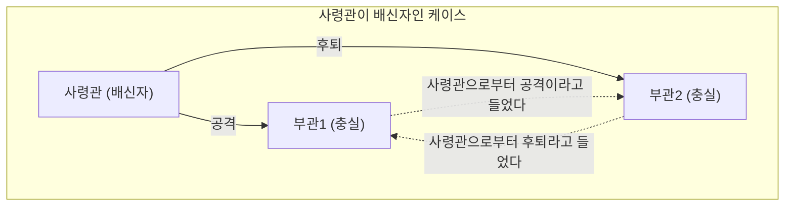
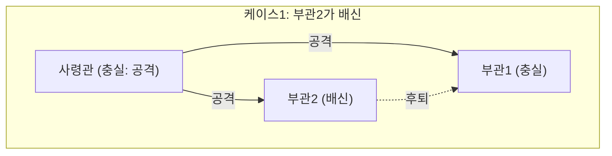
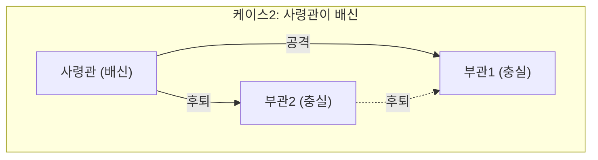
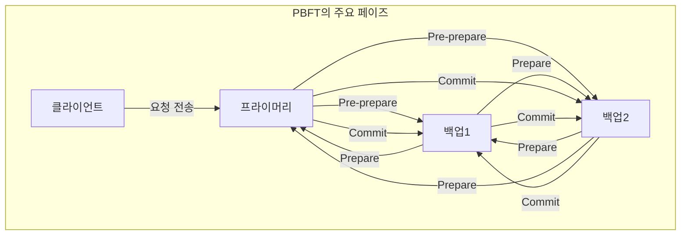

분산 시스템이나 블록체인 기술을 배울 때 반드시 직면하게 되는 것이 ** 비잔틴 장군 문제 ** (Byzantine Generals Problem)입니다. 이는 네트워크 내에 '배신자'나 '고장 난 노드'가 존재하는 상황에서 시스템 전체적으로 어떻게 올바른 합의를 형성할 것인가 하는 매우 중요한 주제를 다루고 있습니다.

본 기사에서는 이 ** 비잔틴 장군 문제 ** 에 대해 구체적인 스토리, 수학적인 조건식, 도해를 섞어가며 기초부터 응용까지 자세히 해설하겠습니다.

## 1. 비잔틴 장군 문제란 무엇인가?

비잔틴 장군 문제는 1982년 레슬리 램포트(Leslie Lamport) 등에 의해 제창된 분산 컴퓨팅에서의 합의 형성에 대한 사고 실험입니다.

### 구체적 예시: 비잔틴 제국의 장군들

이 문제는 비잔틴 제국의 군대가 적의 도시를 포위하고 있다는 설정으로 이야기됩니다. 군대는 여러 부대로 나뉘어 있으며, 각각의 부대는 장군에 의해 지휘되고 있습니다. 장군들은 통신사를 통해서만 서로 메시지를 주고받을 수 있습니다.

그들의 목적은 다음 중 하나의 행동에 대해 ** 전원이 일치된 합의 ** 를 얻는 것입니다.

* ** 공격 ** (Attack)
* ** 후퇴 ** (Retreat)

전원이 동시에 공격하면 도시를 함락시킬 수 있지만, 일부 부대만 공격한 경우에는 패배하고 맙니다. 따라서 전원이 같은 행동을 취해야만 합니다.

하지만 여기에는 큰 문제가 있습니다. 장군들 중에는 ** 배신자 ** 가 섞여 있을 가능성이 있는 것입니다. 배신자 장군은 의도적으로 거짓 메시지를 보내 충실한 장군들을 혼란에 빠뜨려 잘못된 행동을 취하게 하려고 합니다.

아래 그림은 사령관이 배신자인 경우의 단순한 모델입니다.

이 상황에서는 부관1은 '사령관은 공격이라고 말하지만, 부관2는 후퇴라고 말한다'는 모순된 정보를 받게 되어 올바른 판단을 할 수 없게 됩니다.

이처럼 '악의적인 노드가 임의의 거짓 정보를 흘릴 수 있는 네트워크에서 정상적인 노드끼리 어떻게 동일한 결론에 도달할 수 있는가'를 묻는 것이 ** 비잔틴 장군 문제 ** 입니다.

## 2. 합의 형성을 위한 엄밀한 조건

이 문제에서 시스템 전체로서 합의에 도달하기 위해서는 다음 두 가지 조건(인터랙티브 일관성 조건)을 만족해야 합니다.

1. 모든 충실한 부관은 같은 명령에 따를 것.
2. 만약 사령관이 충실하다면, 모든 충실한 부관은 사령관이 내린 명령에 따를 것.

### 구두 메시지 알고리즘 (Oral Messages Algorithm)

램포트 등은 통신되는 메시지가 위조 가능하다(누가 보냈는지 증명할 수 없다)는 전제의 '구두 메시지' 모델에서 합의를 형성하기 위한 조건을 수학적으로 증명했습니다.

결론부터 말하자면, 배신자의 수를 $m$ 이라고 했을 때 전체적으로 ** $3m + 1$ ** 명 이상의 장군(노드)이 없으면 합의를 형성할 수 없습니다. 즉, 네트워크 전체의 노드 수를 $n$ 이라고 하면 다음 부등식이 성립해야 합니다.

$$
n \ge 3m + 1
$$

바꿔 말하면, 네트워크 내의 배신자 비율이 전체의 ** 1/3 미만 ** 이어야 한다는 것입니다.

### 왜 3m + 1이 필요한가?

전체 인원이 $n = 3$ 명이고, 그중에 $m = 1$ 명의 배신자가 있는 케이스를 생각해 봅시다. 이 경우 $n \ge 3(1) + 1 = 4$ 를 만족하지 않기 때문에 합의는 불가능합니다. 그 이유를 도해로 확인해 보겠습니다.

** 케이스1: 사령관이 충실하고, 부관2가 배신자인 경우 **

이때 충실한 부관1은 사령관으로부터 '공격', 부관2로부터 '후퇴'라는 메시지를 받습니다.

** 케이스2: 사령관이 배신자이고, 부관이 충실한 경우 **

이때도 충실한 부관1은 사령관으로부터 '공격', 부관2로부터 '후퇴'라는 메시지를 받습니다.

부관1의 시점에서 보면 케이스1과 케이스2에서 ** 받는 정보의 조합이 완전히 동일 ** 하게 됩니다. 부관1에게는 사령관이 거짓말을 하고 있는지, 부관2가 거짓말을 하고 있는지 구별할 방법이 없습니다. 따라서 확실한 합의를 형성하는 것은 불가능한 것입니다.

## 3. 해결책이 되는 알고리즘

비잔틴 장군 문제를 해결하고 합의를 형성하기 위해서는 어떤 알고리즘이 필요할까요.

### 재귀적인 구두 메시지 알고리즘

앞서 언급했듯이 $n \ge 3m + 1$ 이 만족되는 경우, 재귀적인 알고리즘을 사용하여 합의가 가능합니다. 예를 들어 $n=4, m=1$ 인 경우 다음 단계를 거칩니다.

1. 사령관이 각 부관에게 명령을 보낸다.
2. 각 부관은 받은 명령을 다른 모든 부관에게 전달한다.
3. 각 부관은 자신에게 도착한 모든 메시지(사령관으로부터의 직접적인 명령 포함)를 바탕으로 다수결에 의해 최종적인 행동을 결정한다.

4명 중 1명이 배신자라 하더라도 나머지 2명의 충실한 부관으로부터 온 올바른 정보가 과반수(3표 중 2표)를 차지하기 때문에 다수결에 의해 올바른 합의에 이를 수 있습니다.

### 서명된 메시지 알고리즘

만약 전송되는 메시지에 '위조 불가능한 디지털 서명'이 부여되어 있어 ** 누가 메시지를 발신했는지가 확실하게 증명 ** 가능한 경우는 어떨까요.

이 모델에서는 사령관이 내린 명령을 중간에 변조할 수 없게 됩니다. 그 결과 배신자가 몇 명이든 상관없이 $m$ 명의 배신자에 대해 $n \ge m + 2$ (즉 전체 최소 3명 이상)의 장군이 있으면 합의를 형성할 수 있음이 증명되어 있습니다. 현대의 시스템에서는 공개키 암호 방식에 의한 디지털 서명이 이 역할을 담당하고 있습니다.

## 4. 블록체인과 비잔틴 장애 허용

비잔틴 장군 문제에 대한 내성을 ** 비잔틴 장애 허용 ** (Byzantine Fault Tolerance, BFT)이라고 부릅니다. 분산 시스템이 고장이나 악의적인 공격을 견뎌내고 정상적으로 가동을 계속하기 위한 중요한 지표입니다.

최근 이 문제가 다시 크게 주목받게 된 것은 ** 블록체인 기술 ** 의 등장 때문입니다. 블록체인은 중앙 관리자가 없는 P2P 네트워크이기 때문에 악의적인 참가자(노드)가 거짓 거래 내역을 흘릴 가능성이 있습니다. 바로 비잔틴 장군 문제 그 자체입니다.

### PBFT (Practical Byzantine Fault Tolerance)의 구조

1999년 미겔 카스트로(Miguel Castro) 씨 등에 의해 제안된 PBFT는 현실의 비동기 네트워크에서 효율적으로 BFT를 실현하는 알고리즘입니다.

PBFT에서는 합의 형성 프로세스를 주로 다음 3가지 페이즈로 나누어 진행합니다.

이 프로세스를 거침으로써 네트워크 내에 $m$ 개의 고장·악의적인 노드가 존재하더라도 총 노드 수가 $n \ge 3m + 1$ 을 만족하면 올바른 순서로 요청을 처리할 수 있습니다. PBFT는 컴포넌트 간의 통신량이 노드 수의 제곱에 비례하여 증가하기 때문에 퍼블릭 체인과 같은 대규모 네트워크에는 부적합하지만, 노드 수가 한정된 컨소시엄형 블록체인(예를 들어 하이퍼레저 패브릭 등)에서는 매우 고속으로 확정적인 합의를 가져오기 때문에 널리 이용되고 있습니다.

### 나카모토 컨센서스 (Proof of Work)

비트코인의 창시자인 사토시 나카모토는 전혀 새로운 접근법으로 이 문제에 대처했습니다. 그것이 ** Proof of Work ** (PoW)와 가장 긴 체인을 정답으로 하는 규칙을 조합한 ** 나카모토 컨센서스 ** 입니다.

나카모토 컨센서스에서는 수학적인 계산 경쟁(마이닝)에서 이긴 자만이 블록을 제안할 수 있는 권리를 얻습니다. 거짓 정보를 네트워크가 인식하게 하려면 네트워크 전체의 계산력 과반수(51% 이상)를 지배해야 하며, 현실적으로는 극히 어려운 설계로 되어 있습니다. 이를 통해 불특정 다수가 참가하는 오픈된 네트워크에서 확률적으로 비잔틴 장군 문제를 해결했다고 평가받고 있습니다.

### PoS (Proof of Stake)에서의 BFT 응용

나카모토 컨센서스는 획기적이었지만 마이닝에 막대한 전력을 소비한다는 과제가 있었습니다. 이를 해결하기 위해 등장한 것이 노드가 보유한 암호화폐의 양(스테이크)에 따라 블록 제안권을 주는 ** Proof of Stake ** (PoS)입니다.

이더리움(Ethereum)의 캐스퍼나 코스모스(Cosmos)의 텐더민트 등 최신 PoS 알고리즘의 대부분은 이 BFT를 기반으로 설계되어 있습니다. 예를 들어 텐더민트는 앞서 언급한 PBFT의 사고방식을 더욱 세련되게 다듬어 스테이크 양에 의한 가중치를 도입한 '검증자(Validator)' 네트워크에서 합의를 형성합니다. 검증자의 2/3 이상의 서명이 모이지 않으면 다음 블록이 생성되지 않는 구조로 되어 있어, 바로 $n \ge 3m + 1$ 조건(배신자가 1/3 미만)을 현대의 퍼블릭 체인에서 실현한 좋은 예라고 할 수 있습니다.

## 5. BFT의 수학적 모델링과 응용

보다 고도화된 분산 시스템 설계에서는 시스템의 상태 전이를 엄밀하게 정의하고 BFT 알고리즘의 정당성을 증명합니다.

예를 들어 노드 집합을 $\mathcal{N} = \{1, 2, \dots, n\}$, 배신자 노드의 최대 수를 $f$ 라고 합시다. 어떤 라운드 $r$ 에서 각 노드 $i$ 는 상태 $s_i^{(r)}$ 을 유지하며 다른 노드와 메시지를 교환합니다.

상태 업데이트 함수를 $\delta$ 라고 하면 다음 라운드의 상태는 다음과 같이 표현됩니다.

$$
s_i^{(r+1)} = \delta(s_i^{(r)}, M_i^{(r)})
$$

여기서 $M_i^{(r)}$ 는 노드 $i$ 가 라운드 $r$ 에서 수신한 메시지의 집합입니다. BFT 알고리즘은 고장 노드가 임의의 부정확한 메시지를 송신하더라도 모든 정상적인 노드 $j, k$ 에 대해 라운드가 진행됨에 따라 상태 차이가 없어지는(같은 상태로 수렴하는) 것을 보장하도록 함수 $\delta$ 와 통신 프로토콜을 설계하는 것과 다름없습니다. 수식으로 나타내면 다음과 같습니다.

$$
\lim_{r \to \infty} (s_j^{(r)} - s_k^{(r)}) = 0
$$

## 6. 맺음말

이 ** 비잔틴 장군 문제 ** 는 분산 시스템의 신뢰성을 담보하기 위한 근간이 되는 이론입니다. '누구를 믿어야 할지 알 수 없는 환경에서 어떻게 전체적으로 올바른 결정을 내릴 것인가'라는 이 질문은 암호화폐의 기반 기술부터 항공기의 제어 시스템, 클라우드 컴퓨팅에 이르기까지 현대의 모든 IT 인프라에 응용되고 있습니다.

배신자의 존재를 전제로 하고, 그럼에도 시스템을 멈추지 않기 위한 알고리즘의 진화는 앞으로도 멈추지 않을 것입니다. 분산 시스템 설계에 관여하는 엔지니어에게 이 문제의 배경에 있는 수학적 증명과 알고리즘의 이해는 매우 강력한 무기가 될 것입니다.
