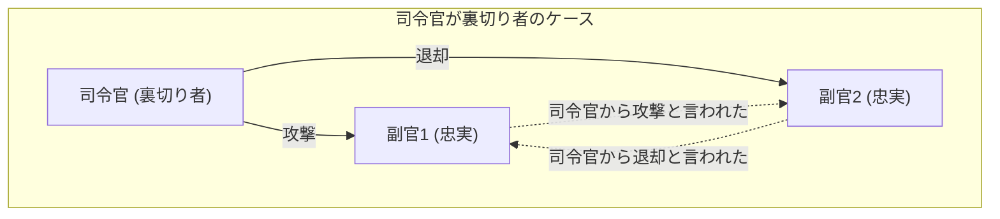
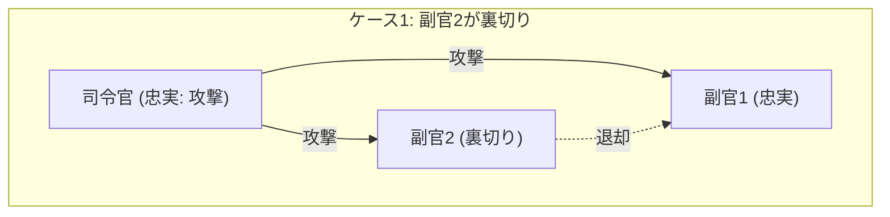
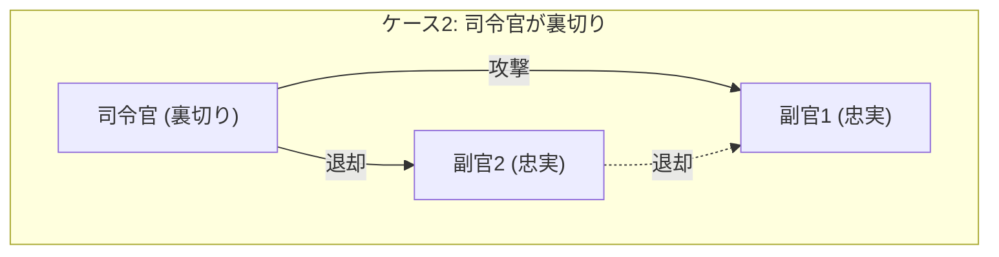
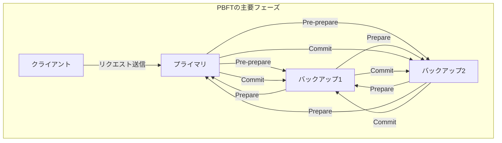

[分散システム](https://kenji.blog/p/cap-theorem-distributed-systems/)やブロックチェーン技術を学ぶ上で、必ずと言っていいほど直面するのが **ビザンチン将軍問題** ([Byzantine Generals](https://kenji.blog/p/byzantine-generals-problem-consensus/) Problem) です。これは、ネットワーク内に「裏切り者」や「故障したノード」が存在する状況下で、システム全体としてどのように正しい合意を形成するのか、という非常に重要なテーマを扱っています。

本記事では、この **[ビザンチン将軍問題](https://kenji.blog/p/byzantine-generals-problem/)** について、具体的なストーリー、数学的な条件式、図解を交えながら、基礎から応用までを詳しく解説していきます。

## 1. [ビザンチン将軍問題](https://kenji.blog/p/byzantine-generals-problem/)とは何か？

[ビザンチン将軍問題](https://kenji.blog/p/byzantine-generals-problem/)は、1982年にレスリー・ランポート (Leslie Lamport) らによって提唱された、分散コンピューティングにおける合意形成の思考実験です。

### 具体例：ビザンチン帝国の将軍たち

この問題は、ビザンチン帝国の軍隊が敵の都市を包囲しているという設定で語られます。軍隊はいくつかの部隊に分かれており、それぞれの部隊は将軍によって指揮されています。将軍たちは通信使を通じてのみ、互いにメッセージをやり取りすることができます。

彼らの目的は、以下のいずれかの行動について **全員で一致した合意** を得ることです。

* **攻撃** (Attack)
* **退却** (Retreat)

全員が同時に攻撃すれば都市を陥落させることができますが、一部の部隊だけが攻撃した場合は敗北してしまいます。したがって、全員が同じ行動をとらなければなりません。

しかし、ここには大きな問題があります。将軍たちの中には **裏切り者** が紛れ込んでいる可能性があるのです。裏切り者の将軍は、意図的に嘘のメッセージを送り、忠実な将軍たちを混乱させて間違った行動をとらせようとします。

以下の図は、司令官が裏切り者である場合の単純なモデルです。

この状況では、副官1は「司令官は攻撃と言っているが、副官2は退却と言っている」という矛盾した情報を受け取ることになり、正しい判断ができなくなります。

このように、「悪意のあるノードが任意の嘘の情報を流すことができるネットワークにおいて、正常なノード同士がどのようにして同一の結論に達することができるか」を問うのが **[ビザンチン将軍問題](https://kenji.blog/p/byzantine-generals-problem/)** です。

## 2. 合意形成のための厳密な条件

この問題において、システム全体として合意に達するためには、以下の2つの条件（インタラクティブ・コンシステンシー条件）を満たす必要があります。

1. すべての忠実な副官は同じ命令に従うこと。
2. もし司令官が忠実であるならば、すべての忠実な副官は司令官が発した命令に従うこと。

### 口頭メッセージアルゴリズム (Oral Messages Algorithm)

ランポートらは、通信されるメッセージが改ざん可能である（誰が送ったか証明できない）という前提の「口頭メッセージ」モデルにおいて、合意を形成するための条件を数学的に証明しました。

結論から言うと、裏切り者の数を $m$ とした場合、全体で **$3m + 1$** 人以上の将軍（ノード）がいなければ、合意を形成することはできません。つまり、ネットワーク全体のノード数を $n$ とすると、以下の不等式が成り立つ必要があります。

$$
n \ge 3m + 1
$$

言い換えると、ネットワーク内の裏切り者の割合が全体の **1/3未満** でなければならない、ということです。

### なぜ 3m + 1 が必要なのか？

全体の人数が $n = 3$ 人で、その中に $m = 1$ 人の裏切り者がいるケースを考えてみましょう。この場合、$n \ge 3(1) + 1 = 4$ を満たしていないため、合意は不可能です。その理由を図解で確認します。

**ケース1：司令官が忠実で、副官2が裏切り者の場合**

この時、忠実な副官1は、司令官から「攻撃」、副官2から「退却」というメッセージを受け取ります。

**ケース2：司令官が裏切り者で、副官が忠実な場合**

この時も、忠実な副官1は、司令官から「攻撃」、副官2から「退却」というメッセージを受け取ります。

副官1の視点から見ると、ケース1とケース2で **受け取る情報の組み合わせが全く同じ** になります。副官1には、司令官が嘘をついているのか、副官2が嘘をついているのかを見分ける術がありません。したがって、確実な合意を形成することは不可能なのです。

## 3. 解決策となるアルゴリズム

[ビザンチン将軍問題](https://kenji.blog/p/byzantine-generals-problem/)を解決し、合意を形成するためにはどのようなアルゴリズムが必要でしょうか。

### 再帰的な口頭メッセージアルゴリズム

前述の通り、$n \ge 3m + 1$ が満たされている場合、再帰的なアルゴリズムを用いることで合意が可能です。たとえば $n=4, m=1$ の場合、以下のステップを踏みます。

1. 司令官が各副官に命令を送る。
2. 各副官は、受け取った命令を他のすべての副官に転送する。
3. 各副官は、自分宛てに届いたすべてのメッセージ（司令官からの直接の命令を含む）を元に、多数決によって最終的な行動を決定する。

4人のうち1人が裏切り者であっても、残りの2人の忠実な副官からの正しい情報が過半数（3票中2票）を占めるため、多数決により正しい合意に至ることができます。

### 署名付きメッセージアルゴリズム

もし、送られるメッセージに「偽造不可能なデジタル署名」が付与されており、 **誰がメッセージを発信したかが確実に証明できる** 場合はどうでしょうか。

このモデルでは、司令官が発した命令を途中で改ざんすることができなくなります。その結果、裏切り者が何人いようとも、$m$ 人の裏切り者に対して $n \ge m + 2$ （つまり全体で最低3人以上）の将軍がいれば、合意を形成できることが証明されています。現代のシステムにおいては、[公開鍵](https://kenji.blog/p/modern-cryptography-public-key-hash-signature/)暗号方式によるデジタル署名がこの役割を担っています。

## 4. [ブロックチェーン](https://kenji.blog/p/blockchain-technology-smart-contract-distributed-ledger/)とビザンチン・フォールト・トレランス

[ビザンチン将軍問題](https://kenji.blog/p/byzantine-generals-problem/)に対する耐性のことを **ビザンチン・フォールト・トレランス** (Byzantine Fault Tolerance, BFT) と呼びます。[分散システム](https://kenji.blog/p/cap-theorem-distributed-systems/)が故障や悪意のある攻撃に耐えて正常に稼働し続けるための重要な指標です。

近年、この問題が再び大きく脚光を浴びたのは **[ブロックチェーン](https://kenji.blog/p/blockchain-technology-smart-contract-distributed-ledger/)技術** の登場によるものです。ブロックチェーンは中央管理者のいない P2P ネットワークであるため、悪意のある参加者（ノード）が嘘の取引履歴を流す可能性があります。まさに[ビザンチン将軍問題](https://kenji.blog/p/byzantine-generals-problem/)そのものです。

### PBFT (Practical Byzantine Fault Tolerance) の仕組み

1999年にミゲル・カストロ (Miguel Castro) 氏らによって提案された PBFT は、現実の非同期ネットワークにおいて効率的に BFT を実現するアルゴリズムです。

PBFT では、合意形成プロセスを主に以下の3つのフェーズに分けて行います。

このプロセスを経ることで、ネットワーク内に $m$ 個の故障・悪意あるノードが存在しても、総ノード数が $n \ge 3m + 1$ を満たしていれば、正しい順序でリクエストを処理することができます。PBFTは、コンポーネント間の通信量がノード数の2乗に比例して増加するため、パブリックチェーンのような大規模ネットワークには不向きですが、ノード数が限定されたコンソーシアム型[ブロックチェーン](https://kenji.blog/p/blockchain-technology-smart-contract-distributed-ledger/)（例えば Hyperledger Fabric など）においては、非常に高速で確定的な合意をもたらすため広く利用されています。

### ナカモト・コンセンサス (Proof of Work)

[ビットコイン](https://kenji.blog/p/cryptocurrency-and-bitcoin/)の生みの親であるサトシ・ナカモトは、全く新しいアプローチでこの問題に対処しました。それが **Proof of Work** ([PoW](https://kenji.blog/p/blockchain-technology-smart-contract-distributed-ledger/)) と、最も長いチェーンを正とするルールを組み合わせた **ナカモト・コンセンサス** です。

ナカモト・コンセンサスでは、数学的な計算競争（マイニング）に勝った者だけがブ[ロック](https://kenji.blog/p/rdbms-transaction-acid-isolation-level-lock/)を提案できる権利を得ます。嘘の情報をネットワークに認識させるためには、ネットワーク全体の計算力の過半数（51%以上）を支配する必要があり、現実的には極めて困難な設計となっています。これにより、不特定多数が参加するオープンなネットワークにおいて、確率的に[ビザンチン将軍問題](https://kenji.blog/p/byzantine-generals-problem/)を解決したと評価されています。

### [PoS](https://kenji.blog/p/blockchain-technology-smart-contract-distributed-ledger/) (Proof of Stake) における BFT の応用

ナカモト・コンセンサスは画期的でしたが、マイニングに莫大な電力を消費するという課題がありました。これを解決するために登場したのが、ノードが保有する[暗号資産](https://kenji.blog/p/cryptocurrency-and-bitcoin/)の量（ステーク）に応じてブロック提案権を与える **Proof of Stake** ([PoS](https://kenji.blog/p/blockchain-technology-smart-contract-distributed-ledger/)) です。

イーサリアム (Ethereum) の Casper や、コスモス (Cosmos) の Tendermint など、最新の PoS アルゴリズムの多くは、この BFT をベースに設計されています。例えば Tendermint は、前述の PBFT の考え方をさらに洗練させ、ステーク量による重み付けを取り入れた「バリデーター（承認者）」のネットワークで合意を形成します。バリデーターの 2/3 以上の署名が集まらなければ次のブ[ロック](https://kenji.blog/p/rdbms-transaction-acid-isolation-level-lock/)が生成されない仕組みになっており、まさに $n \ge 3m + 1$ の条件（裏切り者が 1/3 未満）を現代のパブリックチェーンで実現した好例と言えます。

## 5. BFTの数学的モデリングと応用

より高度な[分散システム](https://kenji.blog/p/cap-theorem-distributed-systems/)設計においては、システムの状態遷移を厳密に定義し、BFTアルゴリズムの正当性を証明します。

例えば、ノード集合を $\mathcal{N} = \{1, 2, \dots, n\}$、裏切り者ノードの最大数を $f$ とします。あるラウンド $r$ において、各ノード $i$ は状態 $s_i^{(r)}$ を保持し、他のノードとメッセージの交換を行います。

状態更新関数を $\delta$ とすると、次ラウンドの状態は以下のように表されます。

$$
s_i^{(r+1)} = \delta(s_i^{(r)}, M_i^{(r)})
$$

ここで、$M_i^{(r)}$ はノード $i$ がラウンド $r$ で受信したメッセージの集合です。BFTアルゴリズムは、故障ノードが任意の不正なメッセージを送信したとしても、すべての正常なノード $j, k$ に対して、ラウンドが進むにつれて状態の差がなくなる（同じ状態に収束する）ことを保証するように関数 $\delta$ と通信プロトコルを設計することに他なりません。数式で表すと以下のようになります。

$$
\lim_{r \to \infty} (s_j^{(r)} - s_k^{(r)}) = 0
$$

## 6. おわりに

この **[ビザンチン将軍問題](https://kenji.blog/p/byzantine-generals-problem/)** は、分散システムの信頼性を担保するための根幹となる理論です。「誰を信じてよいかわからない環境で、いかにして全体として正しい決定を下すか」というこの問いは、[暗号資産](https://kenji.blog/p/cryptocurrency-and-bitcoin/)の基盤技術から、航空機の制御システム、クラウドコンピューティングに至るまで、現代のあらゆるITインフラに応用されています。

裏切り者の存在を前提とし、それでもシステムを止めないためのアルゴリズムの進化は、今後も止まることはありません。[分散システム](https://kenji.blog/p/cap-theorem-distributed-systems/)の設計に関わるエンジニアにとって、この問題の背景にある数学的証明とアルゴリズムの理解は、非常に強力な武器となるでしょう。

