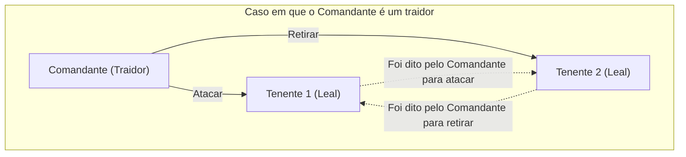
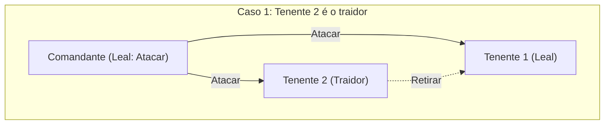
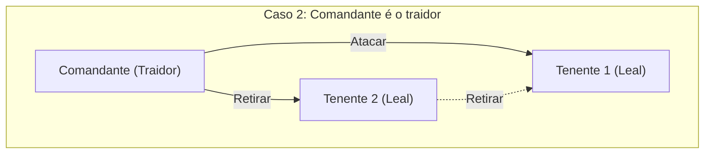
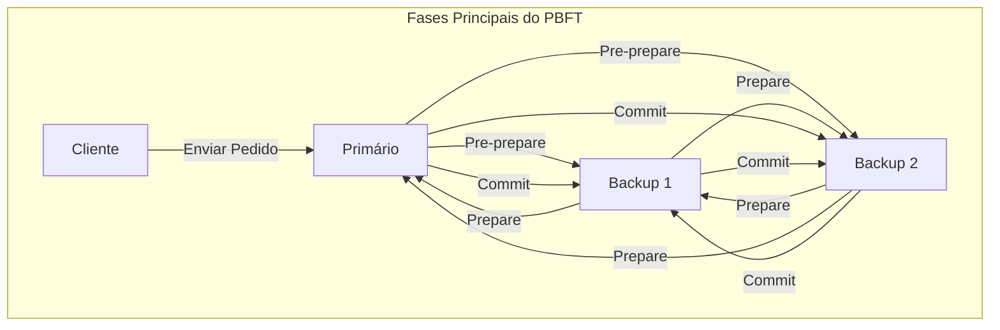

Ao estudar sistemas distribuídos e tecnologia blockchain, um conceito que inevitavelmente se depara é o **Problema dos Generais Bizantinos** (Byzantine Generals Problem). Este aborda um tema extremamente importante: como um sistema como um todo pode formar um consenso correto numa situação em que existem "traidores" ou "nós defeituosos" na rede.

Neste artigo, explicaremos detalhadamente este **Problema dos Generais Bizantinos**, desde os fundamentos até as aplicações, incluindo histórias concretas, fórmulas matemáticas e diagramas.

## 1. O que é o Problema dos Generais Bizantinos?

[O Problema dos Generais Bizantinos](https://kenji.blog/pt/p/byzantine-generals-problem/) é uma experiência mental sobre a formação de consenso em computação distribuída, proposta por Leslie Lamport e outros em 1982.

### Exemplo concreto: Os generais do Império Bizantino

Este problema baseia-se num cenário em que o exército do Império Bizantino está a cercar uma cidade inimiga. O exército está dividido em várias divisões, cada uma comandada por um general. Os generais só podem comunicar uns com os outros através de mensageiros.

O seu objetivo é alcançar um **consenso unânime** sobre uma das seguintes ações:

* **Atacar** (Attack)
* **Retirar** (Retreat)

Se todos atacarem ao mesmo tempo, poderão capturar a cidade; mas se apenas algumas divisões atacarem, serão derrotados. Portanto, todos devem tomar a mesma ação.

No entanto, há um grande problema. É possível que existam **traidores** entre os generais. Um general traidor pode enviar intencionalmente mensagens falsas para confundir os generais leais e levá-los a tomar ações erradas.

O diagrama abaixo mostra um modelo simples de um caso em que o comandante é um traidor.

Nesta situação, o Tenente 1 recebe informações contraditórias: "O comandante diz para atacar, mas o Tenente 2 diz para retirar", impossibilitando-o de tomar uma decisão correta.

Desta forma, o **Problema dos Generais Bizantinos** questiona: "Numa rede onde nós maliciosos podem espalhar informações falsas arbitrárias, como podem os nós normais chegar à mesma conclusão?"

## 2. Condições rigorosas para o consenso

Neste problema, para o sistema chegar a um consenso como um todo, as duas seguintes condições (condições de Consistência Interativa) devem ser cumpridas.

1. Todos os tenentes leais devem seguir a mesma ordem.
2. Se o comandante for leal, todos os tenentes leais devem seguir a ordem emitida pelo comandante.

### Algoritmo de Mensagens Orais (Oral Messages Algorithm)

Lamport e outros provaram matematicamente as condições para formar consenso num modelo de "mensagens orais", sob a premissa de que as mensagens comunicadas podem ser alteradas (não se pode provar quem as enviou).

Concluindo, se o número de traidores for $m$, o consenso não pode ser formado a menos que existam pelo menos **$3m + 1$** generais (nós) no total. Ou seja, se o número total de nós na rede for $n$, a seguinte inequação deve ser verdadeira:

$$
n \ge 3m + 1
$$

Noutras palavras, a proporção de traidores na rede deve ser **inferior a 1/3** do total.

### Porquê 3m + 1?

Vamos considerar um caso onde o número total de pessoas é $n = 3$, e entre eles há $m = 1$ traidor. Neste caso, como a condição $n \ge 3(1) + 1 = 4$ não é cumprida, o consenso é impossível. Vamos confirmar a razão usando diagramas.

**Caso 1: O comandante é leal, e o Tenente 2 é o traidor**

Neste caso, o Tenente 1, que é leal, recebe a mensagem "Atacar" do comandante e "Retirar" do Tenente 2.

**Caso 2: O comandante é o traidor, e os tenentes são leais**

Aqui também, o Tenente 1 leal recebe a mensagem "Atacar" do comandante e "Retirar" do Tenente 2.

Da perspetiva do Tenente 1, **a combinação de informações recebidas é exatamente a mesma** no Caso 1 e no Caso 2. O Tenente 1 não tem como saber se é o comandante que está a mentir ou o Tenente 2. Portanto, é impossível chegar a um consenso fiável.

## 3. Algoritmos como solução

Que tipo de algoritmo é necessário para resolver o Problema dos Generais Bizantinos e formar consenso?

### Algoritmo Recursivo de Mensagens Orais

Como mencionado, se a condição $n \ge 3m + 1$ for satisfeita, o consenso é possível através de um algoritmo recursivo. Por exemplo, no caso de $n=4, m=1$, os seguintes passos são dados:

1. O comandante envia uma ordem a cada tenente.
2. Cada tenente reencaminha a ordem recebida para todos os outros tenentes.
3. Cada tenente toma uma decisão final por maioria de votos, com base em todas as mensagens recebidas (incluindo a ordem direta do comandante).

Mesmo que um dos quatro seja traidor, as informações corretas dos outros dois tenentes leais constituirão a maioria (2 de 3 votos), o que permite chegar a um consenso correto.

### Algoritmo de Mensagem Assinada

E se a mensagem enviada for acompanhada por uma "assinatura digital não falsificável", e puder ser **comprovado com certeza quem enviou a mensagem**?

Neste modelo, torna-se impossível adulterar as ordens emitidas pelo comandante no meio do caminho. Como resultado, não importa quantos traidores existam, provou-se que o consenso pode ser alcançado, desde que existam $n \ge m + 2$ generais (ou seja, um total de pelo menos 3 pessoas) contra $m$ traidores. Nos sistemas modernos, as assinaturas digitais por criptografia de chave pública desempenham este papel.

## 4. Blockchain e Tolerância a Falhas Bizantinas

A resistência a este Problema dos Generais Bizantinos é designada por **Tolerância a Falhas Bizantinas** (Byzantine Fault Tolerance, BFT). É um indicador crucial de que um sistema distribuído pode resistir a falhas e ataques maliciosos e continuar a funcionar normalmente.

O facto de este problema ter voltado a ganhar destaque deve-se ao surgimento da **tecnologia blockchain**. Uma vez que a blockchain é uma rede P2P sem administrador central, existe a possibilidade de os participantes maliciosos (nós) transmitirem históricos de transações falsos. Este é exatamente o Problema dos Generais Bizantinos.

### Como funciona o PBFT (Practical Byzantine Fault Tolerance)

O PBFT, proposto por Miguel Castro e outros em 1999, é um algoritmo que alcança eficientemente a BFT em redes assíncronas do mundo real.

No PBFT, o processo de formação de consenso é dividido essencialmente em três fases:

Através deste processo, mesmo se houver $m$ nós defeituosos ou maliciosos na rede, os pedidos podem ser processados na ordem correta, desde que o número total de nós cumpra $n \ge 3m + 1$. O PBFT não é adequado para redes em grande escala, como blockchains públicas, porque a quantidade de comunicação entre os componentes aumenta em proporção ao quadrado do número de nós; no entanto, é amplamente utilizado em blockchains de consórcio onde o número de nós é limitado (como Hyperledger Fabric, por exemplo), porque proporciona um consenso muito rápido e determinístico.

### Consenso Nakamoto (Proof of Work)

Satoshi Nakamoto, o criador do Bitcoin, lidou com este problema com uma abordagem completamente nova. Essa é a combinação do **Proof of Work** (PoW) e da regra de que a cadeia mais longa é a correta, conhecido como **Consenso Nakamoto**.

No Consenso Nakamoto, apenas aquele que vence a competição de cálculo matemático (mineração) ganha o direito de propor um bloco. Para forçar a rede a aceitar informações falsas, seria necessário controlar mais de metade (mais de 51%) do poder computacional de toda a rede, o que na realidade foi concebido para ser extremamente difícil. Isso resolve probabilisticamente o Problema dos Generais Bizantinos numa rede aberta, da qual pode participar um número indeterminado de pessoas.

### Aplicação da BFT no PoS (Proof of Stake)

Embora o Consenso Nakamoto tenha sido revolucionário, apresentou o problema de consumir imensa energia para a mineração. Para resolver isso, surgiu o **Proof of Stake** (PoS), que atribui o direito de propor blocos consoante a quantidade de ativos criptográficos (stake) detida por um nó.

A maioria dos algoritmos PoS modernos, como o Casper da Ethereum e o Tendermint da Cosmos, são projetados com base nesta BFT. O Tendermint, por exemplo, refina o conceito de PBFT mencionado acima, e forma consenso através de uma rede de "validadores (aprovadores)" que usam ponderação pelo valor do stake. A menos que mais de 2/3 dos validadores tenham assinado, o bloco seguinte não é gerado, o que é um excelente exemplo da condição $n \ge 3m + 1$ (menos de 1/3 de traidores) concretizada numa blockchain pública moderna.

## 5. Modelação Matemática e Aplicação da BFT

No design de sistemas distribuídos mais avançados, as transições de estado do sistema são estritamente definidas para provar a validade do algoritmo BFT.

Por exemplo, seja $\mathcal{N} = \{1, 2, \dots, n\}$ o conjunto de nós e $f$ o número máximo de nós traidores. Num dado momento (round) $r$, cada nó $i$ detém um estado $s_i^{(r)}$ e efetua a troca de mensagens com os outros nós.

Assumindo que a função de atualização de estado é $\delta$, o estado do próximo momento pode ser expresso como:

$$
s_i^{(r+1)} = \delta(s_i^{(r)}, M_i^{(r)})
$$

Aqui, $M_i^{(r)}$ é o conjunto de mensagens recebidas pelo nó $i$ no momento $r$. A essência do algoritmo BFT não é nada mais do que projetar uma função $\delta$ e um protocolo de comunicação para garantir que as diferenças de estado desaparecerão (convergirão para o mesmo estado) em relação a todos os nós normais $j, k$ à medida que as rondas avançam, independentemente de os nós defeituosos enviarem quaisquer mensagens falsas. Numa expressão matemática:

$$
\lim_{r \to \infty} (s_j^{(r)} - s_k^{(r)}) = 0
$$

## 6. Conclusão

Este **Problema dos Generais Bizantinos** é uma teoria fundamental para garantir a fiabilidade dos sistemas distribuídos. A questão: "Num ambiente onde não se sabe em quem confiar, como se toma a decisão correta como um todo?", aplica-se a toda a infraestrutura de TI moderna, desde tecnologias basilares de ativos criptográficos a sistemas de controlo de aeronaves e computação na cloud.

A evolução dos algoritmos para impedir a interrupção do sistema sob a premissa de que existem traidores não parará. Para engenheiros envolvidos na conceção de sistemas distribuídos, entender as provas matemáticas e os algoritmos por trás deste problema será uma arma muito forte.
