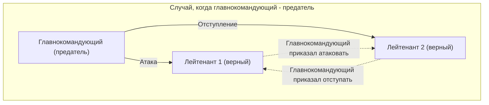
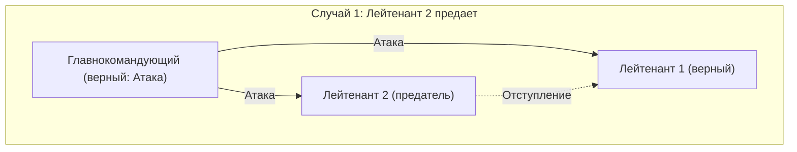
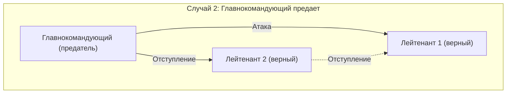
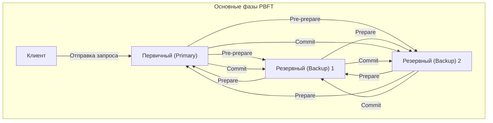

При изучении распределенных систем и технологий [блокчейн](/ru/p/blockchain-technology-smart-contract-distributed-ledger/) вы обязательно столкнетесь с **задачей византийских генералов** ([Byzantine Generals](https://kenji.blog/ru/p/byzantine-generals-problem-consensus/) Problem). В ней рассматривается чрезвычайно важная тема: как система в целом формирует правильный консенсус в ситуации, когда в сети присутствуют «предатели» или «вышедшие из строя узлы».

В этой статье мы подробно объясним эту **задачу византийских генералов**, от основ до применения, используя конкретный сюжет, математические формулы и диаграммы.

## 1. Что такое задача византийских генералов?

[Задача византийских генералов](https://kenji.blog/ru/p/byzantine-generals-problem/) — это мысленный эксперимент о достижении консенсуса в распределенных вычислениях, предложенный Лесли Лэмпортом (Leslie Lamport) и его коллегами в 1982 году.

### Конкретный пример: Генералы Византийской империи

Проблема описывается в условиях, когда армия Византийской империи осаждает вражеский город. Армия разделена на несколько отрядов, каждым из которых командует генерал. Генералы могут обмениваться сообщениями друг с другом только через посыльных.

Их цель — достичь **единогласного решения** всех относительно одного из следующих действий:

* **Атака** (Attack)
* **Отступление** (Retreat)

Если все атакуют одновременно, они смогут захватить город, но если атакует только часть отрядов, они потерпят поражение. Следовательно, все должны действовать одинаково.

Однако здесь кроется большая проблема. Среди генералов могут быть **предатели**. Генерал-предатель попытается намеренно отправить ложные сообщения, чтобы запутать верных генералов и заставить их принять неправильное решение.

На диаграмме ниже показана простая модель, в которой главнокомандующий является предателем.

В этой ситуации Лейтенант 1 получает противоречивую информацию: «Главнокомандующий говорит атаковать, но Лейтенант 2 говорит отступать», и не может принять правильное решение.

Таким образом, **задача византийских генералов** ставит вопрос: «Как нормальные узлы могут прийти к одинаковому выводу в сети, где злонамеренные узлы могут распространять любую ложную информацию?».

## 2. Строгие условия для достижения консенсуса

Для достижения консенсуса всей системой в этой задаче должны выполняться два следующих условия (условия интерактивной согласованности):

1. Все верные лейтенанты должны подчиниться одному и тому же приказу.
2. Если главнокомандующий верен, все верные лейтенанты должны подчиниться приказу, отданному главнокомандующим.

### Алгоритм устных сообщений (Oral Messages Algorithm)

Лэмпорт и соавторы математически доказали условия для достижения консенсуса в модели «устных сообщений», предполагающей, что передаваемые сообщения могут быть подделаны (невозможно доказать, кто их отправил).

Вкратце, если количество предателей равно $m$, невозможно достичь консенсуса, если в целом нет как минимум **$3m + 1$** генералов (узлов). То есть, если общее количество узлов в сети равно $n$, должно выполняться следующее неравенство:

$$
n \ge 3m + 1
$$

Другими словами, доля предателей в сети должна составлять **менее 1/3** от общего числа.

### Почему необходимо 3m + 1?

Давайте рассмотрим случай, когда общее количество человек составляет $n = 3$, среди которых есть $m = 1$ предатель. В этом случае условие $n \ge 3(1) + 1 = 4$ не выполняется, поэтому консенсус невозможен. Причину этого мы покажем на диаграммах.

**Случай 1: Главнокомандующий верен, а Лейтенант 2 — предатель**

В это время верный Лейтенант 1 получает сообщение «Атака» от главнокомандующего и «Отступление» от Лейтенанта 2.

**Случай 2: Главнокомандующий — предатель, а лейтенанты верны**

И в этот раз верный Лейтенант 1 получает сообщение «Атака» от главнокомандующего и «Отступление» от Лейтенанта 2.

С точки зрения Лейтенанта 1, комбинация получаемой информации **абсолютно одинакова** в Случае 1 и Случае 2. У Лейтенанта 1 нет возможности различить, лжет ли главнокомандующий или Лейтенант 2. Следовательно, достижение достоверного консенсуса невозможно.

## 3. Алгоритм решения

Какой алгоритм необходим для решения задачи византийских генералов и достижения консенсуса?

### Рекурсивный алгоритм устных сообщений

Как упоминалось ранее, если выполняется условие $n \ge 3m + 1$, консенсус возможен с использованием рекурсивного алгоритма. Например, если $n=4, m=1$, выполняются следующие шаги:

1. Главнокомандующий посылает приказ каждому лейтенанту.
2. Каждый лейтенант пересылает полученный приказ всем остальным лейтенантам.
3. Каждый лейтенант принимает окончательное решение голосованием большинства на основе всех полученных сообщений (включая прямой приказ от главнокомандующего).

Даже если 1 из 4 человек является предателем, достоверная информация от оставшихся 2 верных лейтенантов составит большинство (2 из 3 голосов), поэтому путем голосования большинства можно прийти к правильному консенсусу.

### Алгоритм подписанных сообщений

А что если к отправляемым сообщениям прикреплена «неподделываемая цифровая подпись», и можно достоверно доказать, **кто отправил сообщение**?

В этой модели становится невозможным изменить приказ, отданный главнокомандующим, в процессе передачи. Как следствие, доказано, что консенсус может быть достигнут независимо от того, сколько предателей, если на $m$ предателей приходится $n \ge m + 2$ генералов (т.е. минимум 3 человека всего). В современных системах эту роль играют цифровые подписи на основе криптографии с открытым ключом.

## 4. Блокчейн и византийская отказоустойчивость

Устойчивость к задаче византийских генералов называется **византийской отказоустойчивостью** (Byzantine Fault Tolerance, BFT). Это важный показатель того, способна ли распределенная система продолжать нормально работать, противостоя сбоям и злонамеренным атакам.

В последние годы эта проблема снова привлекла большое внимание благодаря появлению **технологий [блокчейн](/ru/p/blockchain-technology-smart-contract-distributed-ledger/)**. Поскольку [блокчейн](/ru/p/blockchain-technology-smart-contract-distributed-ledger/) — это [P2P](https://kenji.blog/ru/p/webrtc-realtime-communication-p2p/)-сеть без центрального администратора, существует вероятность того, что злоумышленные участники (узлы) будут транслировать ложную историю транзакций. Это в точности задача византийских генералов.

### Механизм PBFT (Practical Byzantine Fault Tolerance)

Предложенный в 1999 году Мигелем Кастро (Miguel Castro) и коллегами, PBFT — это алгоритм, который эффективно реализует BFT в реальных асинхронных сетях.

В PBFT процесс достижения консенсуса в основном делится на три следующие фазы.

Пройдя этот процесс, даже если в сети есть $m$ неисправных/злонамеренных узлов, запросы могут быть обработаны в правильном порядке, если общее количество узлов удовлетворяет условию $n \ge 3m + 1$. PBFT не подходит для крупномасштабных сетей, таких как публичные блокчейны, поскольку объем связи между компонентами возрастает пропорционально квадрату количества узлов, но он широко используется в блокчейнах консорциумного типа (например, Hyperledger Fabric) с ограниченным числом узлов, так как обеспечивает очень быстрый и детерминированный консенсус.

### Консенсус Накамото (Proof of Work)

Сатоши Накамото, создатель [Биткойн](https://kenji.blog/ru/p/cryptocurrency-and-bitcoin/)а, решил эту проблему с помощью совершенно нового подхода. Это **консенсус Накамото**, сочетающий **Proof of Work** ([PoW](https://kenji.blog/ru/p/blockchain-technology-smart-contract-distributed-ledger/)) и правило признания самой длинной цепи истинной.

В консенсусе Накамото право предлагать блоки получает только тот, кто выигрывает в математическом соревновании вычислений (майнинге). Чтобы сеть признала ложную информацию, необходимо контролировать большинство вычислительной мощности всей сети (51% или более), что на практике является крайне сложной задачей. Считается, что благодаря этому задача византийских генералов была вероятностно решена в открытой сети с неограниченным числом участников.

### Применение BFT в [PoS](https://kenji.blog/ru/p/blockchain-technology-smart-contract-distributed-ledger/) (Proof of Stake)

Консенсус Накамото был новаторским, но у него была проблема потребления огромного количества электроэнергии для майнинга. Для решения этой проблемы был создан **Proof of Stake** (PoS), в котором право предлагать блоки предоставляется в соответствии с объемом криптовалюты (долей, stake), которой владеет узел.

Многие новейшие алгоритмы PoS, такие как Casper в Ethereum и Tendermint в Cosmos, спроектированы на основе этого BFT. Например, Tendermint дополнительно совершенствует описанную выше концепцию PBFT и формирует консенсус в сети «валидаторов (подтверждающих)» с учетом веса доли. Механизм устроен так, что следующий блок не генерируется, пока не будет собрано 2/3 или более подписей валидаторов, что является прекрасным примером реализации условия $n \ge 3m + 1$ (доля предателей менее 1/3) в современных публичных блокчейнах.

## 5. Математическое моделирование BFT и его применение

При проектировании более сложных распределенных систем переход состояний системы строго определяется, и доказывается правильность алгоритма BFT.

Например, пусть множество узлов $\mathcal{N} = \{1, 2, \dots, n\}$, а максимальное число узлов-предателей равно $f$. В определенном раунде $r$ каждый узел $i$ сохраняет состояние $s_i^{(r)}$ и обменивается сообщениями с другими узлами.

Если функция обновления состояния $\delta$, состояние следующего раунда выражается следующим образом:

$$
s_i^{(r+1)} = \delta(s_i^{(r)}, M_i^{(r)})
$$

Где $M_i^{(r)}$ — это множество сообщений, полученных узлом $i$ в раунде $r$. Алгоритм BFT означает проектирование функции $\delta$ и протокола связи таким образом, чтобы гарантировать, что даже если неисправный узел посылает любые ложные сообщения, разница в состояниях между всеми нормальными узлами $j, k$ исчезает (сходится к одному и тому же состоянию) по мере прохождения раундов. Математически это выражается так:

$$
\lim_{r \to \infty} (s_j^{(r)} - s_k^{(r)}) = 0
$$

## 6. В заключение

Эта **задача византийских генералов** является фундаментальной теорией для обеспечения надежности распределенных систем. Вопрос «как принять правильное решение в целом в среде, где неизвестно, кому можно доверять?» применяется в каждой современной ИТ-инфраструктуре, от базовой технологии криптовалют до систем управления самолетами и облачных вычислений.

Эволюция алгоритмов, не позволяющих системе остановиться даже при допущении наличия предателей, продолжится и в будущем. Понимание математических доказательств и алгоритмов, лежащих в основе этой проблемы, станет очень мощным оружием [для инженеров](/ru/p/prompt-engineering-for-engineers/), занимающихся проектированием распределенных систем.
