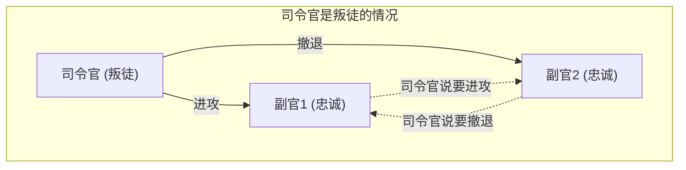
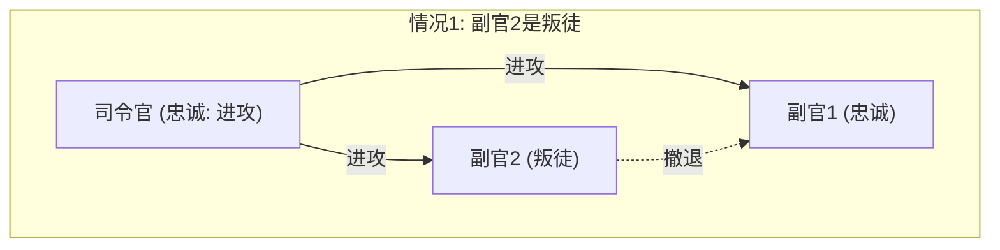
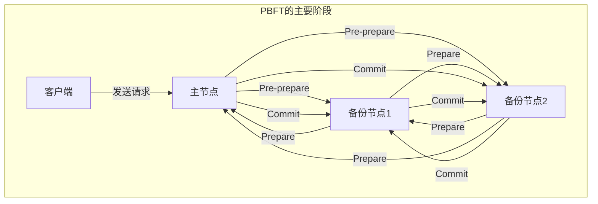

在学习分布式系统或区块链技术时，必然会面临的一个问题就是 **拜占庭将军问题** (Byzantine Generals Problem)。它探讨的是在网络中存在“叛徒”或“故障节点”的情况下，整个系统该如何达成正确的共识这一极其重要的课题。

本文将结合具体的故事场景、数学条件公式以及图解，对这个 **拜占庭将军问题** 进行从基础到应用的详细解说。

## 1. 什么是拜占庭将军问题？

拜占庭将军问题是1982年由莱斯利·兰伯特 (Leslie Lamport) 等人提出的分布式计算中关于共识形成的思维实验。

### 具体例子：拜占庭帝国的将军们

这个问题的设定是拜占庭帝国的军队正在围攻一座敌城。军队被分成了几支部队，每支部队由一名将军指挥。将军们只能通过通讯兵相互传递消息。

他们的目标是针对以下任何一种行动，达成 **全员一致的共识** ：

* **进攻** (Attack)
* **撤退** (Retreat)

如果所有人同时进攻，就能攻陷城市；但如果只有部分部队进攻，就会遭遇失败。因此，所有人必须采取相同的行动。

然而，这里有一个巨大的问题：将军们中间可能混有 **叛徒** 。叛徒将军会故意发送虚假消息，企图扰乱忠诚的将军们，使他们采取错误的行动。

下图展示了司令官是叛徒情况下的简单模型。

在这种情况下，副官1会收到“司令官说要进攻，但副官2说要撤退”这样矛盾的信息，从而无法做出正确的判断。

像这样，探讨“在一个恶意节点可以发送任意虚假信息的网络中，正常的节点之间如何才能达成一致结论”的问题，就是 **拜占庭将军问题** 。

## 2. 达成共识的严格条件

在这个问题中，为了使整个系统能够达成共识，必须满足以下两个条件（交互一致性条件）：

1. 所有忠诚的副官必须服弱相同的命令。
2. 如果司令官是忠诚的，那么所有忠诚的副官必须服从司令官发出的命令。

### 口头消息算法 (Oral Messages Algorithm)

兰伯特等人证明了在“口头消息”模型（假设传递的消息可以被篡改，即无法证明是谁发送的）下达成共识的数学条件。

结论是，假设叛徒的数量为 $m$ ，那么系统中至少需要有 **$3m + 1$** 名以上的将军（节点），否则无法达成共识。也就是说，如果整个网络的节点数为 $n$ ，则必须满足以下不等式：

$$
n \ge 3m + 1
$$

换言之，网络中叛徒的比例必须小于整体的 **1/3** 。

### 为什么需要 3m + 1 ？

我们来思考总人数 $n = 3$ 人，其中包含 $m = 1$ 名叛徒的情况。在这种情况下，不满足 $n \ge 3(1) + 1 = 4$ ，因此无法达成共识。我们通过图解来确认其原因。

**情况1：司令官忠诚，副官2是叛徒的情况**

此时，忠诚的副官1会从司令官那里收到“进攻”的消息，从副官2那里收到“撤退”的消息。

**情况2：司令官是叛徒，副官忠诚的情况**

此时，忠诚的副官1同样会从司令官那里收到“进攻”的消息，从副官2那里收到“撤退”的消息。

从副官1的视角来看，情况1和情况2中 **接收到的信息组合完全相同** 。副官1根本无法分辨到底是司令官在撒谎，还是副官2在撒谎。因此，不可能达成确切的共识。

## 3. 作为解决方案的算法

为了解决拜占庭将军问题并达成共识，需要什么样的算法呢？

### 递归的口头消息算法

如前所述，当满足 $n \ge 3m + 1$ 时，可以通过递归算法达成共识。例如当 $n=4, m=1$ 时，需要执行以下步骤：

1. 司令官向各位副官发送命令。
2. 每位副官将接收到的命令转发给其他所有副官。
3. 每位副官根据发给自己的所有消息（包括来自司令官的直接命令），通过多数决来决定最终的行动。

即使4人中有1名叛徒，由于来自其余2名忠诚副官的正确信息占了多数（3票中的2票），系统仍然可以通过多数决达成正确的共识。

### 带签名的消息算法

如果发送的消息附带了“不可伪造的数字签名”， **能够确凿地证明是谁发出了消息** ，情况会怎样呢？

在这个模型下，司令官发出的命令在传递过程中将无法被篡改。结果证明，无论有多少叛徒，只要相对于 $m$ 名叛徒有 $n \ge m + 2$ （也就是总共至少3名以上）的将军，就可以达成共识。在现代系统中，基于公钥密码体制的数字签名就扮演着这个角色。

## 4. 区块链与拜占庭容错

对拜占庭将军问题的抵御能力被称为 **拜占庭容错** (Byzantine Fault Tolerance, BFT)。它是衡量分布式系统在遭受故障或恶意攻击时，能否继续正常运行的重要指标。

近年来，这个问题再次受到极大关注，这归功于 **区块链技术** 的出现。因为区块链是一个没有中央管理者的 P2P 网络，恶意参与者（节点）有可能会散布虚假的交易历史。这正是典型的拜占庭将军问题。

### PBFT (实用拜占庭容错) 的原理

1999年由米格尔·卡斯特罗 (Miguel Castro) 等人提出的 PBFT，是一种在现实的异步网络中高效实现 BFT 的算法。

在 PBFT 中，共识形成过程主要分为以下三个阶段：

通过这个过程，即使网络中存在 $m$ 个故障或恶意节点，只要总节点数满足 $n \ge 3m + 1$ ，系统就能够以正确的顺序处理请求。虽然 PBFT 因为组件之间的通信量随节点数的平方增加而不适合像公有链那样的大规模网络，但它在节点数有限的联盟链（例如 Hyperledger Fabric 等）中被广泛应用，因为它能带来非常快速和确定性的共识。

### 中本聪共识 (Proof of Work)

比特币的创始人中本聪采用了一种全新的方法来应对这个问题，那就是将 **工作量证明** (Proof of Work, PoW) 与“最长链有效”原则相结合的 **中本聪共识** 。

在中本聪共识中，只有在数学计算竞争（挖矿）中获胜的人，才能获得提议区块的权利。为了让网络接受虚假信息，恶意者必须控制全网算力的过半数（51%以上），这在现实中是极其困难的设计。通过这种方式，它被评价为在不特定多数人参与的开放网络中，概率性地解决了拜占庭将军问题。

### PoS (权益证明) 中 BFT 的应用

中本聪共识虽然具有划时代意义，但存在挖矿消耗大量电力的缺陷。为了解决这个问题，出现了根据节点持有的加密资产数量（权益，Stake）来分配区块提议权的 **权益证明** (Proof of Stake, PoS) 机制。

以太坊 (Ethereum) 的 Casper、Cosmos 的 Tendermint 等许多最新的 PoS 算法，都是在 BFT 的基础上设计的。例如，Tendermint 进一步完善了前述 PBFT 的理念，在引入了通过权益量赋予权重的“验证者”网络中形成共识。如果在验证者中收集不到 2/3 以上的签名，就不会生成下一个区块。这堪称是在现代公有链中实现 $n \ge 3m + 1$ 条件（叛徒少于 1/3）的绝佳案例。

## 5. BFT的数学建模与应用

在更高级的分布式系统设计中，会严格定义系统的状态转换，以证明 BFT 算法的正确性。

例如，设节点集合为 $\mathcal{N} = \{1, 2, \dots, n\}$ ，最大的叛徒节点数为 $f$ 。在某一轮 $r$ 中，每个节点 $i$ 保持状态 $s_i^{(r)}$ ，并与其他节点交换消息。

设状态更新函数为 $\delta$ ，则下一轮的状态可以表示为：

$$
s_i^{(r+1)} = \delta(s_i^{(r)}, M_i^{(r)})
$$

这里，$M_i^{(r)}$ 是节点 $i$ 在轮次 $r$ 接收到的消息集合。BFT 算法的核心就在于设计状态函数 $\delta$ 和通信协议，以保证即使故障节点发送了任意的不正当消息，对于所有正常节点 $j, k$ ，随着轮次的增加，状态差异也会消失（收敛到相同的状态）。用数学公式表示如下：

$$
\lim_{r \to \infty} (s_j^{(r)} - s_k^{(r)}) = 0
$$

## 6. 结语

这个 **拜占庭将军问题** 是确保分布式系统可靠性的核心理论。“在不知该信任谁的环境中，如何做出总体上正确的决定”——这个课题如今已被应用到从加密资产底层技术、到航空器控制系统、再到云计算的各种现代IT基础设施中。

在必须假设存在叛徒的情况下、依然保证系统不中断的算法演进，今后也不会停止。对于参与分布式系统设计的工程师来说，理解这个问题背后的数学证明和算法原理，将成为非常有力的武器。
