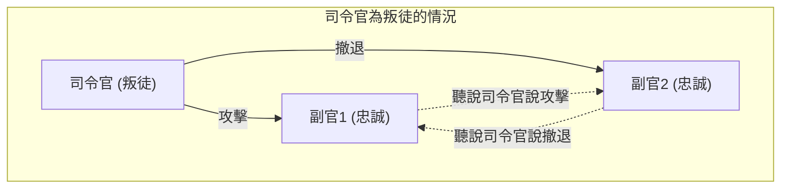
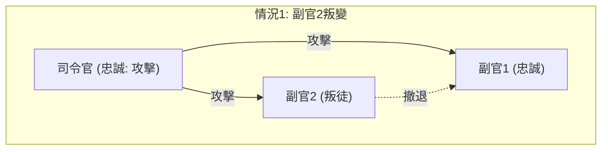
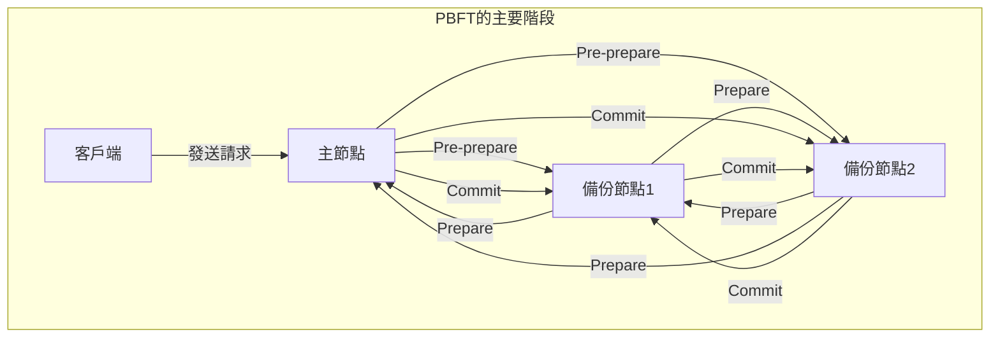

分散式系統與區塊鏈技術的學習過程中，幾乎無可避免會面臨 **拜占庭將軍問題** (Byzantine Generals Problem)。這探討了在網路內部存在「叛徒」或「故障節點」的狀況下，整個系統該如何形成正確共識這個非常重要的主題。

本文將針對這個 **拜占庭將軍問題** ，結合具體的故事、數學條件式以及圖解，從基礎到應用進行詳細解說。

## 1. 什麼是拜占庭將軍問題？

拜占庭將軍問題是1982年由萊斯利·蘭伯特 (Leslie Lamport) 等人提出，關於分散式運算中形成共識的思維實驗。

### 具體範例：拜占庭帝國的將軍們

這個問題是以拜占庭帝國軍隊包圍敵方城市的情境來敘述的。軍隊被分成幾個部隊，每個部隊由一位將軍指揮。將軍們只能透過通訊使者彼此交換訊息。

他們的目的，是針對以下任一行動取得 **全體一致的共識** 。

* **攻擊** (Attack)
* **撤退** (Retreat)

如果所有人同時攻擊，就能攻陷城市；但若只有部分部隊攻擊，就會戰敗。因此，所有人必須採取相同的行動。

然而，這裡存在一個大問題。將軍之中可能混入了 **叛徒** 。叛徒將軍會故意發送虛假的訊息，試圖擾亂忠誠的將軍，讓他們採取錯誤的行動。

下圖是司令官為叛徒時的簡單模型。

在這種狀況下，副官1會接收到「司令官說攻擊，但副官2說撤退」這種矛盾的資訊，因而無法做出正確的判斷。

像這樣，「在惡意節點能散布任意虛假資訊的網路中，正常的節點之間如何達成相同結論」，就是 **拜占庭將軍問題** 所探討的內容。

## 2. 達成共識的嚴格條件

在這個問題中，為了讓系統整體達成共識，必須滿足以下兩個條件（互動一致性條件）：

1. 所有忠誠的副官必須服從相同的命令。
2. 如果司令官是忠誠的，所有忠誠的副官必須服從司令官發出的命令。

### 口頭訊息演算法 (Oral Messages Algorithm)

蘭伯特等人在通訊訊息可被竄改（無法證明是誰發送的）為前提的「口頭訊息」模型中，針對達成共識的條件進行了數學證明。

結論來說，若將叛徒數量設為 $m$，整體若沒有 **$3m + 1$** 人以上的將軍（節點），就無法達成共識。也就是說，若將網路整體的節點數設為 $n$，必須成立以下不等式：

$$
n \ge 3m + 1
$$

換句話說，網路內叛徒的比例必須 **小於 1/3** 。

### 為什麼需要 3m + 1？

想像一下總人數 $n = 3$ 人，其中有 $m = 1$ 名叛徒的情況。在此情況下，因為不滿足 $n \ge 3(1) + 1 = 4$，所以不可能達成共識。我們用圖解來確認其原因。

**情況1：司令官忠誠，副官2為叛徒時**

此時，忠誠的副官1會收到來自司令官的「攻擊」以及來自副官2的「撤退」訊息。

**情況2：司令官為叛徒，副官忠誠時**

此時，忠誠的副官1同樣會收到來自司令官的「攻擊」以及來自副官2的「撤退」訊息。

從副官1的視角來看，情況1和情況2 **接收到的資訊組合完全相同** 。副官1無法分辨到底是司令官說謊，還是副官2說謊。因此，不可能形成確實的共識。

## 3. 作為解決方案的演算法

為了解決拜占庭將軍問題並形成共識，需要什麼樣的演算法呢？

### 遞迴的口頭訊息演算法

如前所述，當滿足 $n \ge 3m + 1$ 時，就能使用遞迴演算法達成共識。例如 $n=4, m=1$ 時，會採取以下步驟：

1. 司令官對各位副官下達命令。
2. 各位副官將收到的命令轉發給其他所有副官。
3. 各位副官根據寄達給自己的所有訊息（包含司令官直接下達的命令），透過多數決來決定最終行動。

即使4人中有1人是叛徒，因為其餘2位忠誠副官傳來的正確資訊佔了多數（3票中的2票），所以能透過多數決達成正確的共識。

### 附帶簽章的訊息演算法

如果發送的訊息附帶了「無法偽造的數位簽章」，並且 **能確實證明是誰發送了訊息** 的話，情況會如何呢？

在這個模型中，將無法中途竄改司令官發出的命令。結果證明，無論有多少位叛徒，對於 $m$ 名叛徒，只要有 $n \ge m + 2$ （亦即整體至少3人以上）的將軍，就能達成共識。在現代系統中，基於公開金鑰密碼系統的數位簽章扮演著這個角色。

## 4. 區塊鏈與拜占庭容錯

對拜占庭將軍問題的耐受性被稱為 **拜占庭容錯** (Byzantine Fault Tolerance, BFT)。這是一項重要指標，衡量分散式系統在經歷故障或惡意攻擊時能否繼續正常運作。

近年來，這個問題再次受到高度關注，是因為 **區塊鏈技術** 的出現。由於區塊鏈是沒有中央管理者的 P2P 網路，惡意參與者（節點）可能會散播虛假的交易紀錄。這正是拜占庭將軍問題的體現。

### PBFT (Practical Byzantine Fault Tolerance) 的機制

由米格爾·卡斯楚 (Miguel Castro) 等人於1999年提出的 PBFT，是在現實的非同步網路中有效實現 BFT 的演算法。

在 PBFT 中，共識形成過程主要分為以下三個階段：

經歷這個過程，即使網路內存在 $m$ 個故障或惡意節點，只要總節點數滿足 $n \ge 3m + 1$，就能依正確順序處理請求。PBFT 中各元件間的通訊量與節點數的平方成正比增加，因此不適合像公有鏈那樣的大規模網路，但在節點數有限的聯盟鏈（例如 Hyperledger Fabric 等）中，因為能帶來非常高速且確定性的共識，而被廣泛使用。

### 中本聰共識 (Proof of Work)

比特幣的創始人中本聰以一種全新的方法應對了這個問題。那就是 **Proof of Work** (PoW) 結合以最長鏈為準的規則，也就是 **中本聰共識** 。

在中本聰共識中，只有贏得數學計算競爭（挖礦）的人才能獲得提案區塊的權利。為了讓網路認可虛假資訊，必須控制網路整體一半以上（51%以上）的算力，這在現實中被設計得極其困難。因此，它被評價為在有不特定多數參與的開放網路中，以機率的方式解決了拜占庭將軍問題。

### BFT 在 PoS (Proof of Stake) 中的應用

中本聰共識雖然具突破性，但存在挖礦會消耗龐大電力的課題。為了解決這個問題，出現了根據節點持有的加密資產數量（權益）來給予區塊提案權的 **Proof of Stake** (PoS)。

以太坊 (Ethereum) 的 Casper、Cosmos 的 Tendermint 等最新 PoS 演算法，許多都是以這種 BFT 為基礎設計的。例如 Tendermint，進一步改良了前述 PBFT 的概念，在匯入依權益量加權的「驗證者（Validator）」網路中形成共識。若未收集到2/3以上驗證者的簽章，就不會生成下一個區塊，這可以說是在現代公有鏈中實現 $n \ge 3m + 1$ 條件（叛徒小於1/3）的絕佳範例。

## 5. BFT 的數學建模與應用

在更進階的分散式系統設計中，會嚴格定義系統的狀態轉換，並證明 BFT 演算法的正確性。

例如，設節點集合為 $\mathcal{N} = \{1, 2, \dots, n\}$，最大叛徒節點數為 $f$。在某個回合 $r$ 中，各節點 $i$ 保持狀態 $s_i^{(r)}$，並與其他節點交換訊息。

若狀態更新函數為 $\delta$，下一回合的狀態可表示如下：

$$
s_i^{(r+1)} = \delta(s_i^{(r)}, M_i^{(r)})
$$

這裡，$M_i^{(r)}$ 是節點 $i$ 在回合 $r$ 中收到的訊息集合。BFT 演算法的設計，無非是設計函數 $\delta$ 與通訊協定，使得即使故障節點發送了任意的不當訊息，對於所有正常節點 $j, k$，隨著回合推進，狀態差異都會消失（收斂至相同狀態）。用數學式表示如下：

$$
\lim_{r \to \infty} (s_j^{(r)} - s_k^{(r)}) = 0
$$

## 6. 結語

這個 **拜占庭將軍問題** 是確保分散式系統可靠性的核心理論。「在不知道該相信誰的環境中，如何達成整體正確的決定」這個問題，被應用於現代的所有 IT 基礎設施，從加密資產的底層技術，到飛機控制系統、雲端運算等。

在假定存在叛徒的情況下，確保系統不中斷的演算法演進未來也不會停止。對於參與分散式系統設計的工程師來說，理解這個問題背後的數學證明與演算法，將會成為非常強大的武器。
