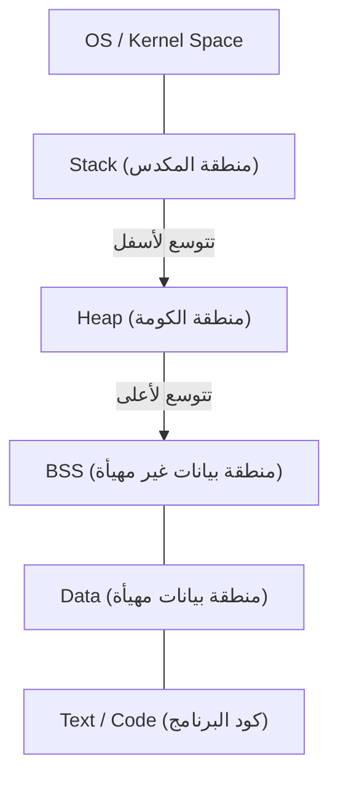

# الفهم الكامل لمؤشرات لغة C (إدارة الذاكرة، العناوين، وأساسيات المكدس والكومة)

بالنسبة للعديد من متعلمي البرمجة، تعتبر **المؤشرات** في لغة C أول عقبة رئيسية. ولكن فهم المؤشرات يعد خطوة مهمة للغاية تلامس أعماق علوم الحاسوب، حيث توضح كيف يدير الحاسوب الذاكرة وكيف تعمل البرامج.

في هذا المقال، لن نقتصر على شرح القواعد السطحية للمؤشرات فحسب، بل سنقوم بشرح البنية الفيزيائية والمنطقية للذاكرة، ومفهوم العناوين، وصولاً إلى الفروق بين المكدس (Stack) والكومة (Heap) بالتفصيل.

## 1. المفاهيم الأساسية لذاكرة الحاسوب والعناوين

عندما يتم تنفيذ برنامج، توضع جميع بياناته وتعليماته في الذاكرة (RAM). الذاكرة أشبه بمصفوفة ضخمة من البيانات، حيث يخصص لكل بيان **عنوان** يوضح موقعه.

لفهم حجم مساحة العناوين، دعونا نستخدم بعض الرياضيات البسيطة.
في حاسوب ببيئة معمارية 32 بت، تكون مساحة العناوين الممكنة كما يلي:

$$
2^{32} = 4,294,967,296 \text{ بايت} = 4 \text{ جيجابايت}
$$

من ناحية أخرى، في المعمارية 64 بت، تكون مساحة العناوين من الناحية النظرية أوسع بكثير.

$$
2^{64} = 18,446,744,073,709,551,616 \text{ بايت} = 16 \text{ إكسابايت (Exabytes)}
$$

على الرغم من أن القيود المفروضة على الأجهزة الفعلية وأنظمة التشغيل لا تسمح باستخدام هذه المساحة بأكملها، إلا أنه في هذه المساحة الشاسعة، تشغل المتغيرات مواقع فريدة.

## 2. بنية مساحة الذاكرة

تنقسم مساحة الذاكرة التي يخصصها نظام التشغيل للبرنامج بشكل أساسي إلى الأجزاء التالية:



1. **منطقة Text**: منطقة للقراءة فقط تخزن تعليمات لغة الآلة للبرنامج المترجم.
2. **منطقة Data**: تخزن المتغيرات العامة والثابتة التي تم تهيئتها.
3. **منطقة BSS**: تخزن المتغيرات العامة غير المهيأة، ويتم تهيئتها بالقيمة 0 عند بدء تشغيل البرنامج.
4. **الكومة (Heap)**: منطقة ذاكرة يتم تخصيصها ديناميكيًا أثناء تنفيذ البرنامج.
5. **المكدس (Stack)**: منطقة تخزن المتغيرات المحلية، والوسائط عند استدعاء الدوال، وعناوين الإرجاع، إلخ.

### الفرق بين المكدس والكومة

| الميزة | المكدس (Stack) | الكومة (Heap) |
| --- | --- | --- |
| طريقة الإدارة | إدارة تلقائية بواسطة المترجم | إدارة يدوية بواسطة المبرمج |
| السرعة | سريع جدًا | بطيء نسبيًا |
| الحجم | صغير نسبيًا (بضعة ميغابايت) | كبير جدًا (يعتمد على الذاكرة الفارغة) |
| التخصيص والتحرير | تحرير تلقائي عند الخروج من النطاق | يتم تخصيصها بواسطة `malloc` وما شابه، وتحرر بواسطة `free` |
| التجزئة (fragmentation) | لا تحدث | من الممكن أن تحدث |

## 3. حقيقة المتغيرات في لغة C وعناوين الذاكرة

تعريف المتغير في لغة C يعني إعطاء اسم لمنطقة معينة في الذاكرة وتخصيص تلك المنطقة.

```c
#include <stdio.h>

int main() {
    int a = 10;
    printf("قيمة المتغير a: %d\n", a);
    printf("عنوان المتغير a: %p\n", (void*)&a);
    return 0;
}
```

هنا، يسمى العامل `&` المستخدم **عامل العنوان** ، ويقوم بجلب مكان وجود المتغير في الذاكرة (العنوان).

## 4. أساسيات المؤشرات: الإعلان، التهيئة، والمراجع غير المباشرة

**المؤشر** هو "متغير لتخزين عنوان الذاكرة".

```c
int a = 10;
int *p = &a; // تعيين عنوان a للمؤشر p
```

يتم استخدام النجمة `*` للإعلان عن متغير المؤشر. وللوصول إلى القيمة الفعلية الموجودة في العنوان الذي يشير إليه المؤشر، نستخدم نفس النجمة والتي تسمى **عامل المرجع غير المباشر** (Dereference Operator).

```c
printf("القيمة التي يشير إليها المؤشر p: %d\n", *p); // ستتم طباعة 10
*p = 20; // تغيير القيمة في العنوان الذي يشير إليه p إلى 20
printf("قيمة المتغير a: %d\n", a); // ستتم طباعة 20
```

إذا قمنا بتمثيل ذلك برسوميات سيكون على النحو التالي:


## 5. العلاقة العميقة بين المؤشرات والمصفوفات

في لغة C، توجد علاقة وثيقة جدًا بين المؤشرات والمصفوفات. يعمل اسم المصفوفة كمؤشر ثابت يشير إلى عنوان العنصر الأول من تلك المصفوفة.

```c
int arr[5] = {10, 20, 30, 40, 50};
int *p = arr; // p يشير إلى عنوان arr[0]

printf("%d\n", *p);       // 10
printf("%d\n", *(p + 1)); // 20 (عملية حسابية على المؤشرات)
```

في **حساب المؤشرات** ، لا يمثل `p + 1` إضافة رقمية بسيطة، بل يعني تقديم العنوان بمقدار حجم نوع البيانات المشار إليه (في هذه الحالة من نوع `int`، عادة 4 بايت).

$$
\text{العنوان الجديد} = \text{العنوان الأساسي} + (\text{الإزاحة} \times \text{sizeof}(\text{النوع}))
$$

## 6. منطقة الكومة وتخصيص الذاكرة الديناميكي

بالنسبة للمصفوفات التي لا يمكن تحديد حجمها وقت الترجمة، أو البيانات التي نريد إبقاءها لفترة طويلة عبر دوال مختلفة، يتم تخصيصها ديناميكيًا باستخدام **الكومة** بدلاً من المكدس.
يستخدم لذلك دوال مثل `malloc` و `calloc` و `realloc` المعرفة في مكتبة `<stdlib.h>`.

```c
#include <stdio.h>
#include <stdlib.h>

int main() {
    int n = 5;
    // تخصيص ذاكرة ديناميكيا لخمسة عناصر من نوع int
    int *arr = (int *)malloc(n * sizeof(int));

    if (arr == NULL) {
        fprintf(stderr, "فشل في تخصيص الذاكرة\n");
        return 1;
    }

    for (int i = 0; i < n; i++) {
        arr[i] = i * 2;
        printf("%d ", arr[i]);
    }
    printf("\n");

    // يجب دائما تحرير الذاكرة المخصصة
    free(arr);

    return 0;
}
```

### تسرب الذاكرة والمؤشرات المتدلية

عند استخدام تخصيص الذاكرة الديناميكي، يجب على المبرمج إدارة الذاكرة بمسؤوليته الخاصة.

- **تسرب الذاكرة (Memory Leak)**: خطأ يحدث عند نسيان استخدام `free` للذاكرة المخصصة، مما يؤدي إلى تراكم الذاكرة غير المستخدمة واستنزاف موارد النظام في النهاية.
- **المؤشر المتدلي (Dangling Pointer)**: هو مؤشر يستمر في الإشارة إلى عنوان ذاكرة حتى بعد تحريرها باستخدام `free`. الوصول إلى هذا المؤشر سيؤدي إلى سلوك غير محدد.

```c
int *p = malloc(sizeof(int));
*p = 100;
free(p);
// هنا يصبح p مؤشرا متدليا
// *p = 200; // سلوك غير محدد! خطير جدا!
p = NULL; // كإجراء وقائي، نعين NULL بعد التحرير
```

## 7. تقنيات المؤشرات المتقدمة

### مؤشرات الدوال

شيفرة البرنامج نفسها موجودة أيضا في الذاكرة (منطقة Text). لذلك، يمكن الحصول على عنوان الدالة، وتخزينه في مؤشر واستدعاؤه.

```c
#include <stdio.h>

int add(int a, int b) { return a + b; }
int sub(int a, int b) { return a - b; }

int main() {
    // الإعلان عن مؤشر الدالة
    int (*calc)(int, int);

    calc = add;
    printf("10 + 5 = %d\n", calc(10, 5));

    calc = sub;
    printf("10 - 5 = %d\n", calc(10, 5));

    return 0;
}
```

تعتبر مؤشرات الدوال مفيدة جدًا عند تنفيذ دوال الاستدعاء (Callback functions)، أو عند محاولة تطبيق تعدد الأشكال على نهج البرمجة كائنية التوجه في لغة C.

### مؤشر إلى مؤشر (المؤشر المزدوج)

بما أن المؤشر نفسه هو متغير موجود في الذاكرة، يمكننا إنشاء مؤشر يشير إلى عنوانه. يُستخدم هذا عند تخصيص مصفوفة ثنائية الأبعاد ديناميكيا، أو عندما نريد تغيير ما يشير إليه المؤشر داخل الدالة.

```c
int val = 10;
int *p = &val;
int **pp = &p;

printf("val: %d, *p: %d, **pp: %d\n", val, *p, **pp);
```

## 8. الخاتمة

المؤشرات ليست مجرد قاعدة نحوية في لغة C، بل هي أداة قوية للتعامل مع آليات الذاكرة نفسها والتي تشكل أساس الحاسوب.

- المتغيرات توضع في عناوين محددة في الذاكرة.
- المؤشر يخزن هذا العنوان ويتعامل مع الذاكرة مباشرة.
- يتم تخصيص المتغيرات المحلية في **المكدس** وتُدار تلقائيا.
- للهياكل البيانية الديناميكية، نستخدم **الكومة** وتدار يدويا من قبل المبرمج (تخصيص وتحرير).

إن الفهم العميق للمؤشرات لا يبني أساسا قويا لكتابة برامج متينة خالية من الأخطاء فحسب، بل هو ضروري لتعلم أنظمة التشغيل، والأنظمة المدمجة (Embedded systems)، وحتى اللغات الجديدة (مثل نموذج الملكية في لغة [Rust](https://kenji.blog/ar/p/programming-languages-history-paradigm-evolution/)). خذ وقتك لإتقانها بتمعن.
