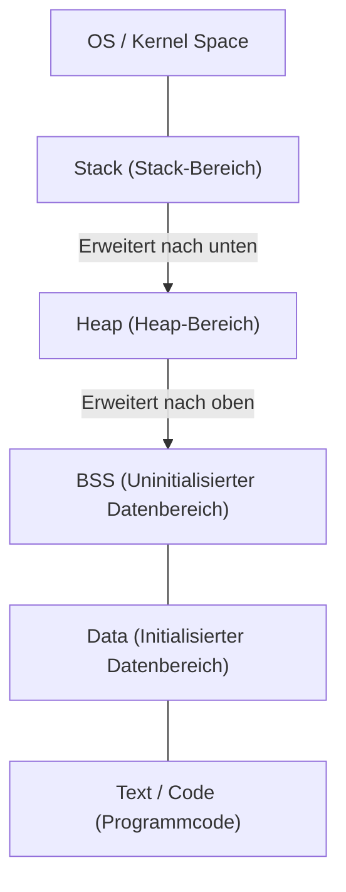
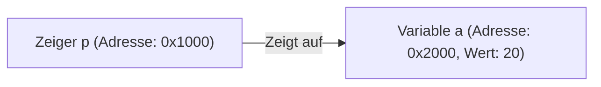

# Vollständiges Verständnis von C und Zeigern (Grundlagen der Speicherverwaltung, Adressen, Heap und Stack)

Für viele Programmier-Anfänger stellen **Zeiger** (Pointers) in der Sprache C die erste große Hürde dar. Das Verständnis von Zeigern ist jedoch ein äußerst wichtiger Schritt, um die Tiefen der Informatik zu berühren und zu verstehen, wie Computer den Speicher verwalten und wie Programme ausgeführt werden.

In diesem Artikel werden wir nicht nur die oberflächliche Syntax von Zeigern ausführlich erklären, sondern auch die physische und logische Struktur des Speichers, das Konzept der Adressen sowie den Unterschied zwischen Stack und Heap.

## 1. Grundkonzepte des Computerspeichers und der Adressen

Wenn ein Programm ausgeführt wird, werden all seine Daten und Befehle im Speicher (RAM) abgelegt. Der Speicher ist wie ein riesiges Array von Daten, und jedem Datum ist eine **Adresse** zugewiesen, die seine Position angibt.

Um sich die Größe des Adressraums vorzustellen, verwenden wir einfache Mathematik.
In einem Computer mit einer 32-Bit-Architektur sieht der darstellbare Adressraum wie folgt aus:

$$
2^{32} = 4,294,967,296 \text{ Bytes} = 4 \text{ GB}
$$

Auf der anderen Seite hat eine 64-Bit-Architektur theoretisch einen viel größeren Adressraum.

$$
2^{64} = 18,446,744,073,709,551,616 \text{ Bytes} = 16 \text{ EB (Exabyte)}
$$

Aufgrund von Einschränkungen der tatsächlichen Hardware und des Betriebssystems ist nicht alles nutzbar, aber in diesem riesigen Raum belegen Variablen einzigartige Positionen.

## 2. Struktur des Speicherraums

Der Speicherraum, der einem Programm vom Betriebssystem zugewiesen wird, ist hauptsächlich in die folgenden Segmente unterteilt.



1. **Text-Bereich** : Ein schreibgeschützter Bereich, in dem die kompilierten Maschinenbefehle des Programms gespeichert werden.
2. **Data-Bereich** : Hier werden initialisierte globale und statische Variablen gespeichert.
3. **BSS-Bereich** : Uninitialisierte globale Variablen werden hier gespeichert und beim Programmstart auf 0 initialisiert.
4. **Heap** : Ein Speicherbereich, der während der Ausführung des Programms dynamisch zugewiesen wird.
5. **Stack** : Ein Bereich, in dem lokale Variablen, Argumente bei Funktionsaufrufen, Rücksprungadressen usw. gespeichert werden.

### Unterschiede zwischen Stack und Heap

| Merkmal | Stack | Heap |
| --- | --- | --- |
| Verwaltungsart | Automatische Verwaltung durch den Compiler | Manuelle Verwaltung durch den Programmierer |
| Geschwindigkeit | Sehr schnell | Relativ langsam |
| Größe | Relativ klein (einige MB) | Sehr groß (abhängig vom freien Speicher) |
| Zuweisung und Freigabe | Automatische Freigabe beim Verlassen des Gültigkeitsbereichs | Mit `malloc` o.ä. zugewiesen, mit `free` freigegeben |
| Fragmentierung | Tritt nicht auf | Kann auftreten |

## 3. Die wahre Natur von Variablen in C und Speicheradressen

Die Deklaration einer Variablen in C bedeutet, einem bestimmten Bereich im Speicher einen Namen zu geben und diesen Bereich zu reservieren.

```c
#include <stdio.h>

int main() {
    int a = 10;
    printf("Wert der Variable a: %d\n", a);
    printf("Adresse der Variable a: %p\n", (void*)&a);
    return 0;
}
```

Der hier verwendete `&`-Operator wird **Adressoperator** genannt und ermittelt, wo sich die Variable im Speicher befindet (die Adresse).

## 4. Grundlagen von Zeigern: Deklaration, Initialisierung und Dereferenzierung

Ein **Zeiger** ist "eine Variable zum Speichern einer Speicheradresse".

```c
int a = 10;
int *p = &a; // Die Adresse von a dem Zeiger p zuweisen
```

Für die Deklaration einer Zeigervariablen wird ein Sternchen `*` verwendet. Um auf den tatsächlichen Wert an der vom Zeiger angegebenen Adresse zuzugreifen, wird ebenfalls der **Dereferenzierungsoperator (Dereference Operator)** verwendet, der dasselbe Sternchen nutzt.

```c
printf("Wert, auf den der Zeiger p zeigt: %d\n", *p); // 10 wird ausgegeben
*p = 20; // Den Wert an der Adresse, auf die p zeigt, auf 20 überschreiben
printf("Wert der Variable a: %d\n", a); // 20 wird ausgegeben
```

Schematisch dargestellt sieht das so aus:



## 5. Die enge Beziehung zwischen Zeigern und Arrays

In C haben Zeiger und Arrays eine sehr enge Beziehung. Ein Arrayname verhält sich wie ein konstanter Zeiger, der auf die Adresse des ersten Elements dieses Arrays zeigt.

```c
int arr[5] = {10, 20, 30, 40, 50};
int *p = arr; // p zeigt auf die Adresse von arr[0]

printf("%d\n", *p);       // 10
printf("%d\n", *(p + 1)); // 20 (Zeigerarithmetik)
```

In der **Zeigerarithmetik** ist `p + 1` nicht einfach eine numerische Addition, sondern bedeutet, dass die Adresse um die Größe des Datentyps vorgerückt wird, auf den sie zeigt (in diesem Fall `int`, normalerweise 4 Bytes).

$$
\text{Neue Adresse} = \text{Basisadresse} + (\text{Offset} \times \text{sizeof}(\text{Typ}))
$$

## 6. Heap-Bereich und dynamische Speicherzuweisung

Arrays, deren Größe zur Kompilierzeit nicht bestimmt werden kann, oder Daten, die funktionsübergreifend über einen längeren Zeitraum bestehen sollen, werden nicht auf dem Stack, sondern dynamisch auf dem **Heap** zugewiesen.
Hierfür werden Funktionen wie `malloc`, `calloc`, `realloc` verwendet, die in `<stdlib.h>` definiert sind.

```c
#include <stdio.h>
#include <stdlib.h>

int main() {
    int n = 5;
    // Speicherplatz für 5 int-Typen dynamisch reservieren
    int *arr = (int *)malloc(n * sizeof(int));

    if (arr == NULL) {
        fprintf(stderr, "Speicherzuweisung fehlgeschlagen\n");
        return 1;
    }

    for (int i = 0; i < n; i++) {
        arr[i] = i * 2;
        printf("%d ", arr[i]);
    }
    printf("\n");

    // Reservierten Speicher immer freigeben
    free(arr);

    return 0;
}
```

### Speicherlecks und baumelnde Zeiger (Dangling Pointers)

Bei der Verwendung dynamischer Speicherzuweisung muss der Programmierer den Speicher in eigener Verantwortung verwalten.

- **Speicherleck (Memory Leak)** : Ein Fehler, bei dem vergessen wird, den reservierten Speicher mit `free` freizugeben. Dadurch sammelt sich ungenutzter Speicher an und erschöpft schließlich die Systemressourcen.
- **Baumelnder Zeiger (Dangling Pointer)** : Ein Zeiger, der weiterhin auf eine Speicheradresse zeigt, nachdem der Speicher mit `free` freigegeben wurde. Der Zugriff auf diesen Zeiger führt zu undefiniertem Verhalten.

```c
int *p = malloc(sizeof(int));
*p = 100;
free(p);
// Hier wird p zu einem baumelnden Zeiger
// *p = 200; // Undefiniertes Verhalten! Sehr gefährlich!
p = NULL; // Als Gegenmaßnahme nach der Freigabe NULL zuweisen
```

## 7. Fortgeschrittene Zeigertechniken

### Funktionszeiger

Auch der Code des Programms selbst befindet sich im Speicher (Text-Bereich). Daher ist es möglich, die Adresse einer Funktion zu ermitteln, sie in einem Zeiger zu speichern und sie aufzurufen.

```c
#include <stdio.h>

int add(int a, int b) { return a + b; }
int sub(int a, int b) { return a - b; }

int main() {
    // Deklaration eines Funktionszeigers
    int (*calc)(int, int);

    calc = add;
    printf("10 + 5 = %d\n", calc(10, 5));

    calc = sub;
    printf("10 - 5 = %d\n", calc(10, 5));

    return 0;
}
```

Funktionszeiger sind sehr nützlich, wenn Callback-Funktionen implementiert oder objektorientierte Polymorphie in C realisiert werden soll.

### Zeiger auf Zeiger (Doppelzeiger)

Da Zeiger selbst auch Variablen sind, die im Speicher existieren, kann man einen Zeiger erstellen, der auf ihre Adresse zeigt. Dies wird bei der dynamischen Zuweisung von zweidimensionalen Arrays verwendet oder wenn das Ziel, auf das ein Zeiger zeigt, innerhalb einer Funktion geändert werden soll.

```c
int val = 10;
int *p = &val;
int **pp = &p;

printf("val: %d, *p: %d, **pp: %d\n", val, *p, **pp);
```

## 8. Zusammenfassung

Zeiger sind keine reinen Syntaxregeln der Sprache C, sondern mächtige Werkzeuge, um direkt mit dem Speichermechanismus zu arbeiten, der das Fundament eines Computers bildet.

- Variablen werden an bestimmten Adressen im Speicher platziert.
- Zeiger speichern diese Adressen und manipulieren den Speicher direkt.
- Lokale Variablen werden auf dem **Stack** zugewiesen und automatisch verwaltet.
- Für dynamische Datenstrukturen wird der **Heap** verwendet, der vom Programmierer manuell verwaltet wird (Zuweisung und Freigabe).

Ein tiefes Verständnis von Zeigern ist nicht nur für das Schreiben robuster Programme mit wenigen Fehlern von entscheidender Bedeutung, sondern bildet auch eine starke Grundlage für das Erlernen von Betriebssystemen, eingebetteten Systemen und sogar neuen Sprachen (wie dem Ownership-Modell von [Rust](https://kenji.blog/de/p/programming-languages-history-paradigm-evolution/)). Nehmen Sie sich Zeit und meistern Sie dieses Thema gründlich.
